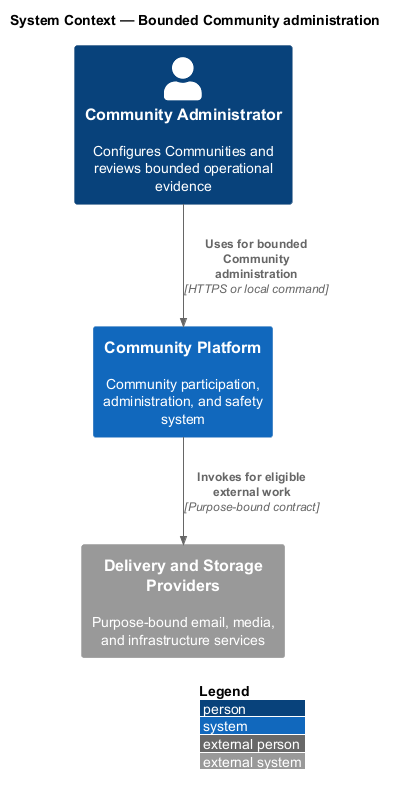
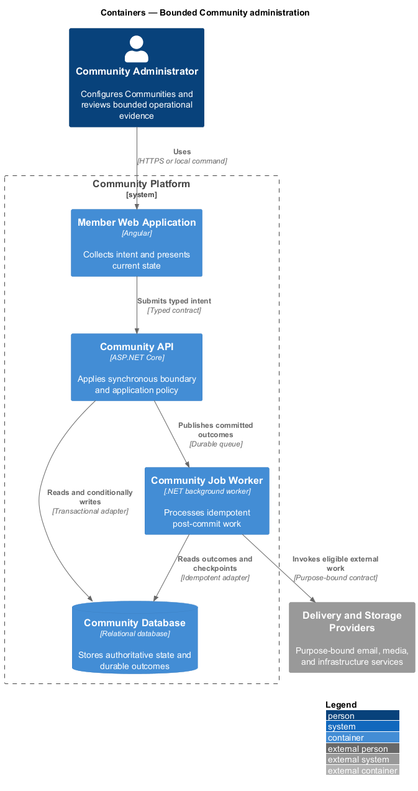
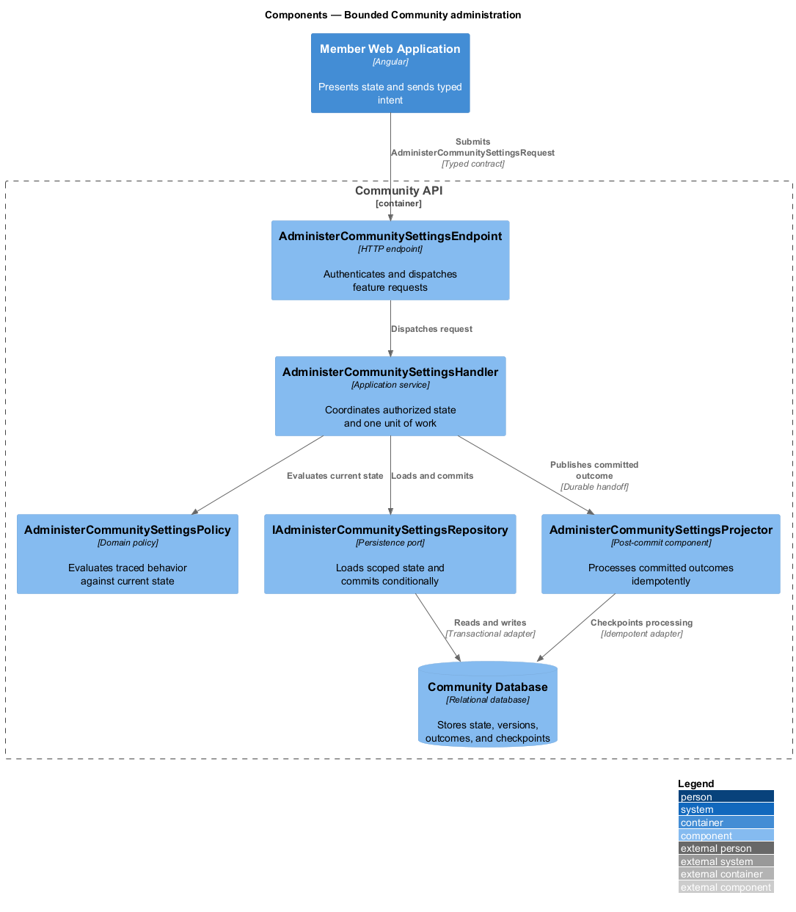
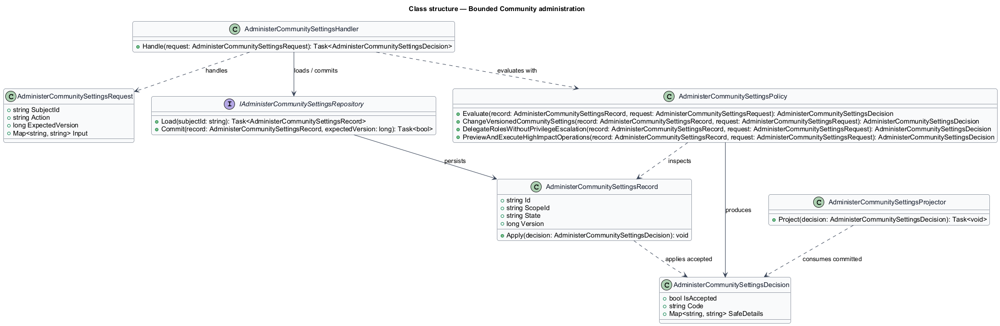
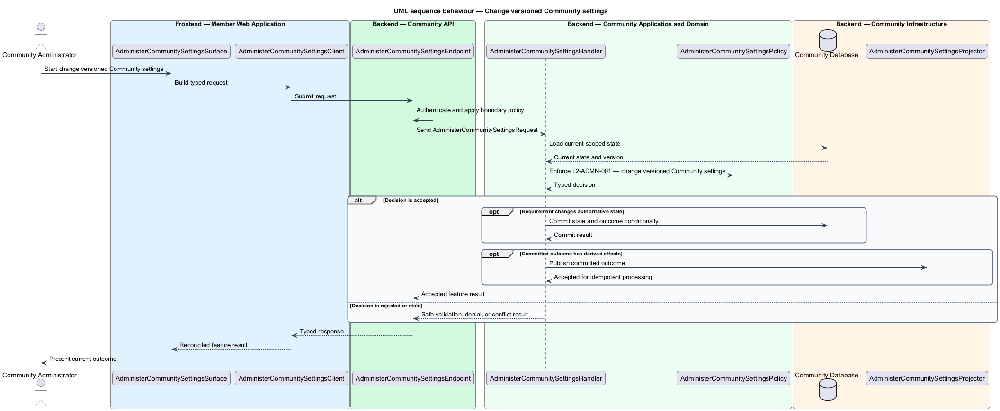

# Bounded Community administration

## Overview

Community Starter is a community platform divided into product and platform subsystems. The
Administration and insights subsystem owns this feature.

*bounded Community administration* — subsystem capability that covers change versioned Community settings, delegate Roles without privilege escalation, and preview and execute high-impact operations

Community teams need bounded tools to configure participation and understand outcomes, while platform and support operators need narrowly scoped operational access. Administration shall never become an unaudited bypass around Community isolation, safety, privacy, or Account security. The platform shall let authorized Community roles manage settings, delegated authority, and lifecycle operations with validation, continuity, impact preview, and server enforcement.

The feature groups 3 traced behaviors behind one policy and evidence
boundary: `L2-ADMN-001`, `L2-ADMN-002`, and `L2-ADMN-003`. Authoritative state commits before projections, delivery, or external work reports
success.

## Description

The repository contains specifications but no application implementation. This greenfield slice
defines the following building blocks across `Member Web Application`, `Community API`, the
application and domain layer, and infrastructure.

- **`AdministerCommunitySettingsSurface`** — page component in `Member Web Application`. It presents current
  state, submits user intent, and reconciles the typed result.
- **`AdministerCommunitySettingsClient`** — typed Angular client. It creates `AdministerCommunitySettingsRequest` values and maps stable
  transport failures into feature results.
- **`AdministerCommunitySettingsEndpoint`** — HTTP endpoint in `Community API`. It authenticates the
  caller, applies boundary policy, and dispatches the request.
- **`AdministerCommunitySettingsRequest`** — immutable request carrying `SubjectId`, `Action`, `ExpectedVersion`, and the
  scoped input needed by one traced behavior.
- **`AdministerCommunitySettingsHandler`** — application service that loads authorized state through
  `IAdministerCommunitySettingsRepository`, invokes `AdministerCommunitySettingsPolicy`, and commits an accepted transition.
- **`AdministerCommunitySettingsPolicy`** — domain policy that evaluates current state and returns a typed
  `AdministerCommunitySettingsDecision` without performing external work.
- **`AdministerCommunitySettingsRecord`** — authoritative record containing the feature state, scope, and concurrency
  version.
- **`IAdministerCommunitySettingsRepository`** — persistence port that loads scoped state and commits one conditional
  unit of work.
- **`AdministerCommunitySettingsProjector`** — idempotent post-commit component in `Community Job Worker`. It updates
  eligible projections and invokes configured external providers.

`AdministerCommunitySettingsPolicy` exposes one named operation for each traced behavior:

- **`AdministerCommunitySettingsPolicy.ChangeVersionedCommunitySettings(record, request)`** — evaluates `L2-ADMN-001` (change versioned Community settings) and returns a typed decision before any state change.
- **`AdministerCommunitySettingsPolicy.DelegateRolesWithoutPrivilegeEscalation(record, request)`** — evaluates `L2-ADMN-002` (delegate Roles without privilege escalation) and returns a typed decision before any state change.
- **`AdministerCommunitySettingsPolicy.PreviewAndExecuteHighImpactOperations(record, request)`** — evaluates `L2-ADMN-003` (preview and execute high-impact operations) and returns a typed decision before any state change.

## Requirements

The feature realizes the following level-2 (L2) requirements. Each row preserves the specification
identifier, its level-1 (L1) parent, and the requirement statement verbatim.

| L2 ID | Refines (L1) | Requirement |
|-------|--------------|-------------|
| `L2-ADMN-001` | `L1-ADMN-001` | Authorized administrators change bounded Community settings against a current version with schema, policy, dependency, and production-safety validation. |
| `L2-ADMN-002` | `L1-ADMN-001` | Role assignment, removal, and definition changes are server-scoped to the current Community and cannot grant authority the actor lacks or leave the Community without an eligible owner. |
| `L2-ADMN-003` | `L1-ADMN-001` | Archive, close, transfer, suspend, bulk membership, bulk content, and other high-impact operations require current authority, bounded scope, explicit impact, and durable per-target results. |

## Diagrams

### System context

The `Community Administrator` uses `Community Platform` for the feature. The system invokes
`Delivery and Storage Providers` only for configured external work after authoritative decisions.

### Containers

`Member Web Application` collects intent, `Community API` applies the synchronous boundary,
and `Community Database` holds authoritative state. `Community Job Worker` handles eligible
post-commit work against `Delivery and Storage Providers`.

### Components

Inside `Community API`, `AdministerCommunitySettingsEndpoint` dispatches `AdministerCommunitySettingsHandler`. The handler evaluates
`AdministerCommunitySettingsPolicy`, persists through `IAdministerCommunitySettingsRepository`, and hands committed outcomes to
`AdministerCommunitySettingsProjector`.

### Class structure

`AdministerCommunitySettingsHandler` depends on the immutable request, domain policy, and repository port.
`AdministerCommunitySettingsRecord` owns versioned state, while `AdministerCommunitySettingsProjector` consumes committed results.

### Behaviour — change versioned Community settings

The interaction loads current scoped state before `AdministerCommunitySettingsPolicy` enforces
`L2-ADMN-001`. Rejected decisions return without changing authoritative state; accepted
state changes commit before optional derived work starts.

### Behaviour — delegate Roles without privilege escalation

The interaction loads current scoped state before `AdministerCommunitySettingsPolicy` enforces
`L2-ADMN-002`. Rejected decisions return without changing authoritative state; accepted
state changes commit before optional derived work starts.

### Behaviour — preview and execute high-impact operations

The interaction loads current scoped state before `AdministerCommunitySettingsPolicy` enforces
`L2-ADMN-003`. Rejected decisions return without changing authoritative state; accepted
state changes commit before optional derived work starts.

