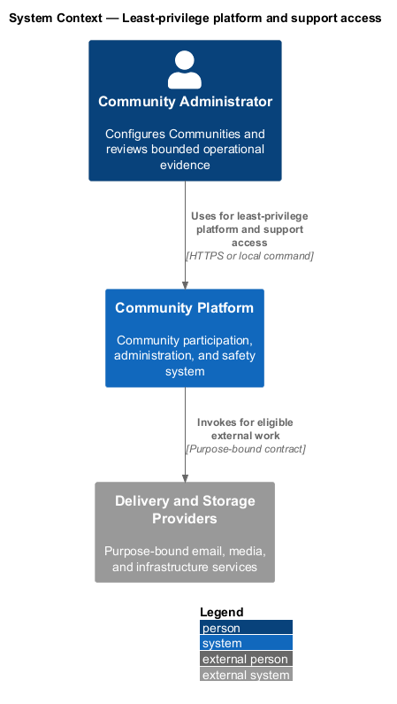
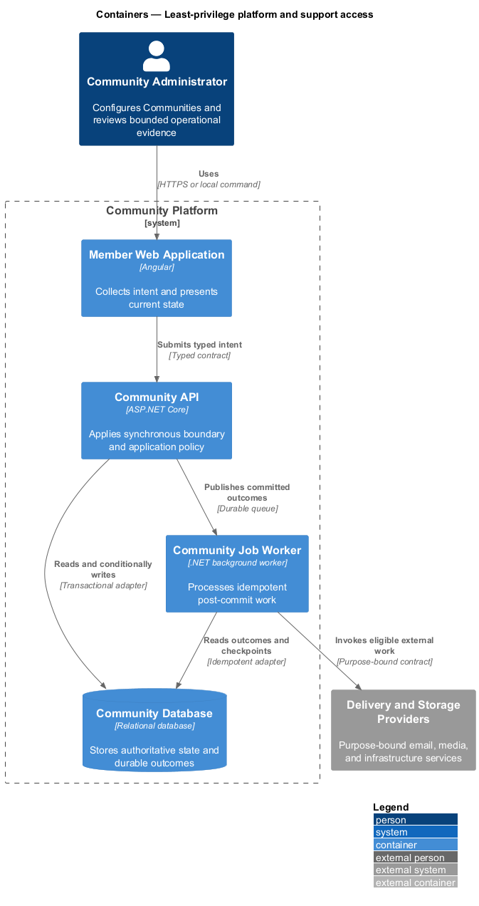
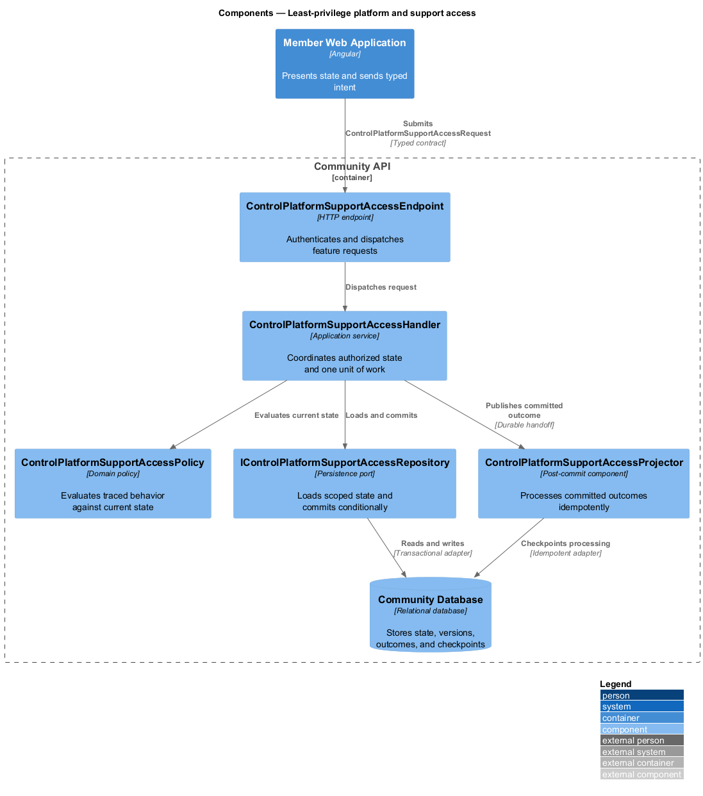
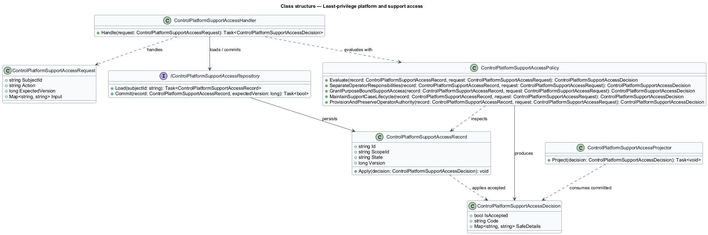
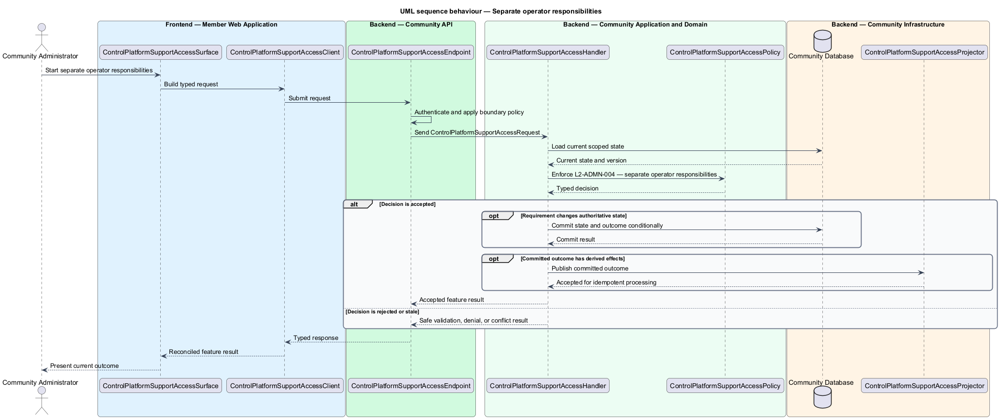
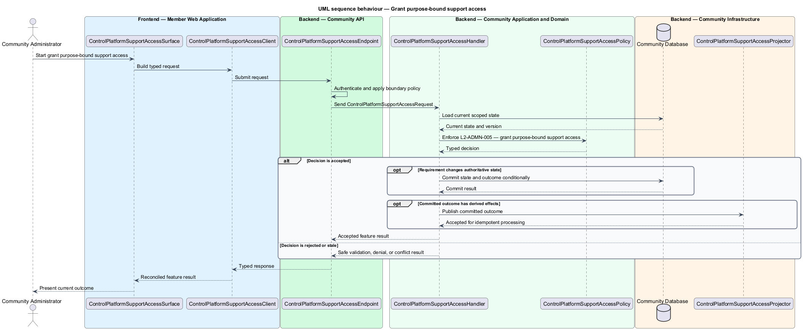
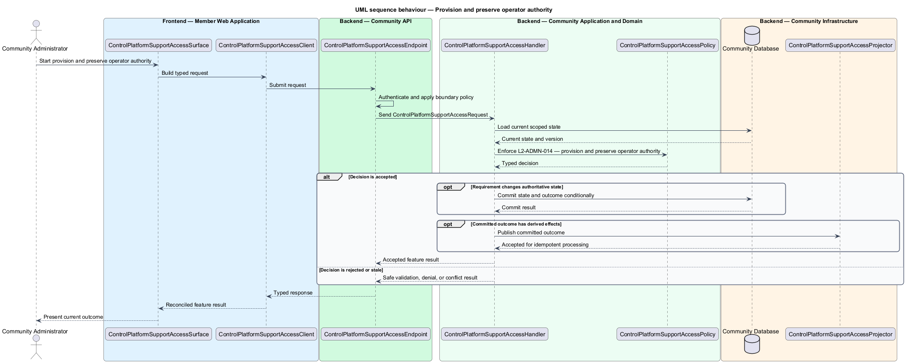

# Least-privilege platform and support access

## Overview

Community Starter is a community platform divided into product and platform subsystems. The
Administration and insights subsystem owns this feature.

*least-privilege platform and support access* — subsystem capability that covers separate operator responsibilities, grant purpose-bound support access, maintain Support Case lifecycle, and provision and preserve operator authority

Community teams need bounded tools to configure participation and understand outcomes, while platform and support operators need narrowly scoped operational access. Administration shall never become an unaudited bypass around Community isolation, safety, privacy, or Account security. The platform shall separate platform configuration, safety, support, security, and Community authority and make exceptional access time-bound, purpose-bound, visible, and reviewable.

The feature groups 4 traced behaviors behind one policy and evidence
boundary: `L2-ADMN-004`, `L2-ADMN-005`, `L2-ADMN-013`, and `L2-ADMN-014`. Authoritative state commits before projections, delivery, or external work reports
success.

## Description

The repository contains specifications but no application implementation. This greenfield slice
defines the following building blocks across `Member Web Application`, `Community API`, the
application and domain layer, and infrastructure.

- **`ControlPlatformSupportAccessSurface`** — page component in `Member Web Application`. It presents current
  state, submits user intent, and reconciles the typed result.
- **`ControlPlatformSupportAccessClient`** — typed Angular client. It creates `ControlPlatformSupportAccessRequest` values and maps stable
  transport failures into feature results.
- **`ControlPlatformSupportAccessEndpoint`** — HTTP endpoint in `Community API`. It authenticates the
  caller, applies boundary policy, and dispatches the request.
- **`ControlPlatformSupportAccessRequest`** — immutable request carrying `SubjectId`, `Action`, `ExpectedVersion`, and the
  scoped input needed by one traced behavior.
- **`ControlPlatformSupportAccessHandler`** — application service that loads authorized state through
  `IControlPlatformSupportAccessRepository`, invokes `ControlPlatformSupportAccessPolicy`, and commits an accepted transition.
- **`ControlPlatformSupportAccessPolicy`** — domain policy that evaluates current state and returns a typed
  `ControlPlatformSupportAccessDecision` without performing external work.
- **`ControlPlatformSupportAccessRecord`** — authoritative record containing the feature state, scope, and concurrency
  version.
- **`IControlPlatformSupportAccessRepository`** — persistence port that loads scoped state and commits one conditional
  unit of work.
- **`ControlPlatformSupportAccessProjector`** — idempotent post-commit component in `Community Job Worker`. It updates
  eligible projections and invokes configured external providers.

`ControlPlatformSupportAccessPolicy` exposes one named operation for each traced behavior:

- **`ControlPlatformSupportAccessPolicy.SeparateOperatorResponsibilities(record, request)`** — evaluates `L2-ADMN-004` (separate operator responsibilities) and returns a typed decision before any state change.
- **`ControlPlatformSupportAccessPolicy.GrantPurposeBoundSupportAccess(record, request)`** — evaluates `L2-ADMN-005` (grant purpose-bound support access) and returns a typed decision before any state change.
- **`ControlPlatformSupportAccessPolicy.MaintainSupportCaseLifecycle(record, request)`** — evaluates `L2-ADMN-013` (maintain Support Case lifecycle) and returns a typed decision before any state change.
- **`ControlPlatformSupportAccessPolicy.ProvisionAndPreserveOperatorAuthority(record, request)`** — evaluates `L2-ADMN-014` (provision and preserve operator authority) and returns a typed decision before any state change.

## Requirements

The feature realizes the following level-2 (L2) requirements. Each row preserves the specification
identifier, its level-1 (L1) parent, and the requirement statement verbatim.

| L2 ID | Refines (L1) | Requirement |
|-------|--------------|-------------|
| `L2-ADMN-004` | `L1-ADMN-002` | Platform configuration, security, safety, support, audit, and Community administration use separate least-privilege authorities rather than one unrestricted administrator role. |
| `L2-ADMN-005` | `L1-ADMN-002` | Support access is tied to a valid case, declared purpose, minimum resource scope, expiry, approval, and current operator identity; ordinary lookup does not expose private content or secrets. |
| `L2-ADMN-013` | `L1-ADMN-002` | A Support Case is the durable purpose boundary for platform support. It has requester or source, subject, Community/resource scope, categorized purpose, owner, priority, status, bounded notes, creation/update/closure times, retention class, linked access grants, and tamper-evident history. It is distinct from a Moderation Case and cannot authorize safety enforcement. |
| `L2-ADMN-014` | `L1-ADMN-002` | Initial and recovery provisioning of Platform Operator responsibilities uses a reviewed out-of-band identity and deployment process, never a seeded password. Security, safety, audit, privacy, and support grants require separation of duties; an operator cannot self-grant or self-approve a privilege, and configured minimum continuity is preserved without preventing emergency revocation. |

## Diagrams

### System context

The `Community Administrator` uses `Community Platform` for the feature. The system invokes
`Delivery and Storage Providers` only for configured external work after authoritative decisions.

### Containers

`Member Web Application` collects intent, `Community API` applies the synchronous boundary,
and `Community Database` holds authoritative state. `Community Job Worker` handles eligible
post-commit work against `Delivery and Storage Providers`.

### Components

Inside `Community API`, `ControlPlatformSupportAccessEndpoint` dispatches `ControlPlatformSupportAccessHandler`. The handler evaluates
`ControlPlatformSupportAccessPolicy`, persists through `IControlPlatformSupportAccessRepository`, and hands committed outcomes to
`ControlPlatformSupportAccessProjector`.

### Class structure

`ControlPlatformSupportAccessHandler` depends on the immutable request, domain policy, and repository port.
`ControlPlatformSupportAccessRecord` owns versioned state, while `ControlPlatformSupportAccessProjector` consumes committed results.

### Behaviour — separate operator responsibilities

The interaction loads current scoped state before `ControlPlatformSupportAccessPolicy` enforces
`L2-ADMN-004`. Rejected decisions return without changing authoritative state; accepted
state changes commit before optional derived work starts.

### Behaviour — grant purpose-bound support access

The interaction loads current scoped state before `ControlPlatformSupportAccessPolicy` enforces
`L2-ADMN-005`. Rejected decisions return without changing authoritative state; accepted
state changes commit before optional derived work starts.

### Behaviour — maintain Support Case lifecycle

The interaction loads current scoped state before `ControlPlatformSupportAccessPolicy` enforces
`L2-ADMN-013`. Rejected decisions return without changing authoritative state; accepted
state changes commit before optional derived work starts.

### Behaviour — provision and preserve operator authority

The interaction loads current scoped state before `ControlPlatformSupportAccessPolicy` enforces
`L2-ADMN-014`. Rejected decisions return without changing authoritative state; accepted
state changes commit before optional derived work starts.

