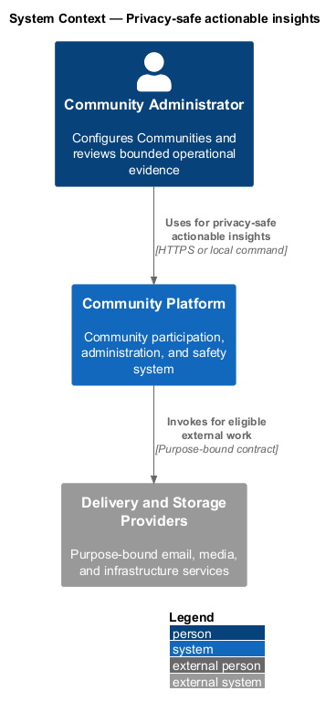
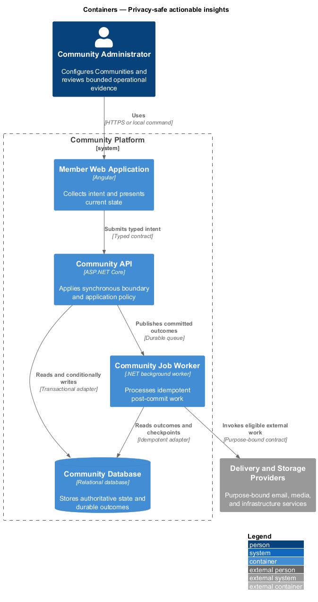
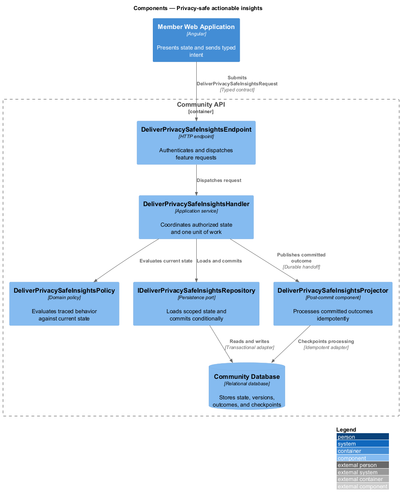
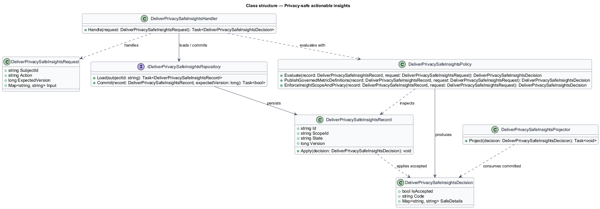
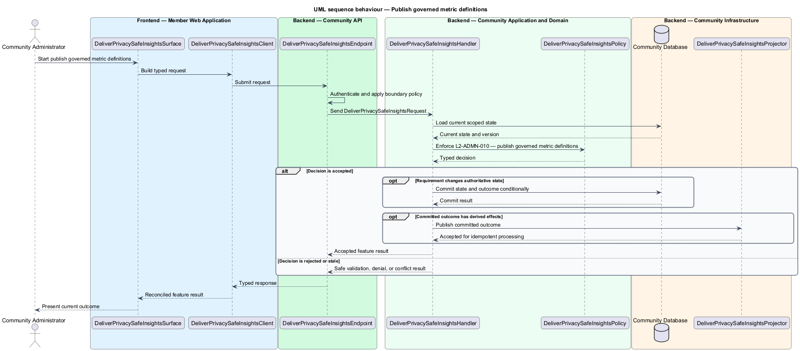
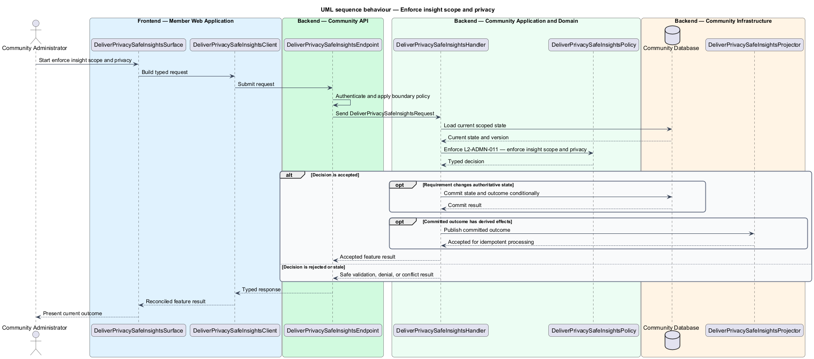

# Privacy-safe actionable insights

## Overview

Community Starter is a community platform divided into product and platform subsystems. The
Administration and insights subsystem owns this feature.

*privacy-safe actionable insights* — subsystem capability that covers publish governed metric definitions and enforce insight scope and privacy

Community teams need bounded tools to configure participation and understand outcomes, while platform and support operators need narrowly scoped operational access. Administration shall never become an unaudited bypass around Community isolation, safety, privacy, or Account security. The platform shall expose defined, fresh, scoped metrics that support Community and platform decisions without leaking small groups, private content, or another Community's activity.

The feature groups 2 traced behaviors behind one policy and evidence
boundary: `L2-ADMN-010` and `L2-ADMN-011`. Authoritative state commits before projections, delivery, or external work reports
success.

## Description

The repository contains specifications but no application implementation. This greenfield slice
defines the following building blocks across `Member Web Application`, `Community API`, the
application and domain layer, and infrastructure.

- **`DeliverPrivacySafeInsightsSurface`** — page component in `Member Web Application`. It presents current
  state, submits user intent, and reconciles the typed result.
- **`DeliverPrivacySafeInsightsClient`** — typed Angular client. It creates `DeliverPrivacySafeInsightsRequest` values and maps stable
  transport failures into feature results.
- **`DeliverPrivacySafeInsightsEndpoint`** — HTTP endpoint in `Community API`. It authenticates the
  caller, applies boundary policy, and dispatches the request.
- **`DeliverPrivacySafeInsightsRequest`** — immutable request carrying `SubjectId`, `Action`, `ExpectedVersion`, and the
  scoped input needed by one traced behavior.
- **`DeliverPrivacySafeInsightsHandler`** — application service that loads authorized state through
  `IDeliverPrivacySafeInsightsRepository`, invokes `DeliverPrivacySafeInsightsPolicy`, and commits an accepted transition.
- **`DeliverPrivacySafeInsightsPolicy`** — domain policy that evaluates current state and returns a typed
  `DeliverPrivacySafeInsightsDecision` without performing external work.
- **`DeliverPrivacySafeInsightsRecord`** — authoritative record containing the feature state, scope, and concurrency
  version.
- **`IDeliverPrivacySafeInsightsRepository`** — persistence port that loads scoped state and commits one conditional
  unit of work.
- **`DeliverPrivacySafeInsightsProjector`** — idempotent post-commit component in `Community Job Worker`. It updates
  eligible projections and invokes configured external providers.

`DeliverPrivacySafeInsightsPolicy` exposes one named operation for each traced behavior:

- **`DeliverPrivacySafeInsightsPolicy.PublishGovernedMetricDefinitions(record, request)`** — evaluates `L2-ADMN-010` (publish governed metric definitions) and returns a typed decision before any state change.
- **`DeliverPrivacySafeInsightsPolicy.EnforceInsightScopeAndPrivacy(record, request)`** — evaluates `L2-ADMN-011` (enforce insight scope and privacy) and returns a typed decision before any state change.

## Requirements

The feature realizes the following level-2 (L2) requirements. Each row preserves the specification
identifier, its level-1 (L1) parent, and the requirement statement verbatim.

| L2 ID | Refines (L1) | Requirement |
|-------|--------------|-------------|
| `L2-ADMN-010` | `L1-ADMN-004` | Each insight answers a declared product or operational question and exposes owner, formula, scope, time basis, exclusions, freshness, completeness, and revision. |
| `L2-ADMN-011` | `L1-ADMN-004` | Insight access is server-scoped by responsibility and Community, with minimum-group, suppression, retention, and dimension controls that prevent reidentification or private-content disclosure. |

## Diagrams

### System context

The `Community Administrator` uses `Community Platform` for the feature. The system invokes
`Delivery and Storage Providers` only for configured external work after authoritative decisions.

### Containers

`Member Web Application` collects intent, `Community API` applies the synchronous boundary,
and `Community Database` holds authoritative state. `Community Job Worker` handles eligible
post-commit work against `Delivery and Storage Providers`.

### Components

Inside `Community API`, `DeliverPrivacySafeInsightsEndpoint` dispatches `DeliverPrivacySafeInsightsHandler`. The handler evaluates
`DeliverPrivacySafeInsightsPolicy`, persists through `IDeliverPrivacySafeInsightsRepository`, and hands committed outcomes to
`DeliverPrivacySafeInsightsProjector`.

### Class structure

`DeliverPrivacySafeInsightsHandler` depends on the immutable request, domain policy, and repository port.
`DeliverPrivacySafeInsightsRecord` owns versioned state, while `DeliverPrivacySafeInsightsProjector` consumes committed results.

### Behaviour — publish governed metric definitions

The interaction loads current scoped state before `DeliverPrivacySafeInsightsPolicy` enforces
`L2-ADMN-010`. Rejected decisions return without changing authoritative state; accepted
state changes commit before optional derived work starts.

### Behaviour — enforce insight scope and privacy

The interaction loads current scoped state before `DeliverPrivacySafeInsightsPolicy` enforces
`L2-ADMN-011`. Rejected decisions return without changing authoritative state; accepted
state changes commit before optional derived work starts.

