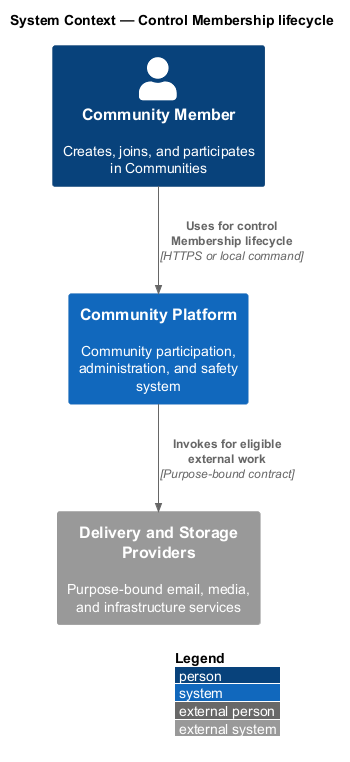
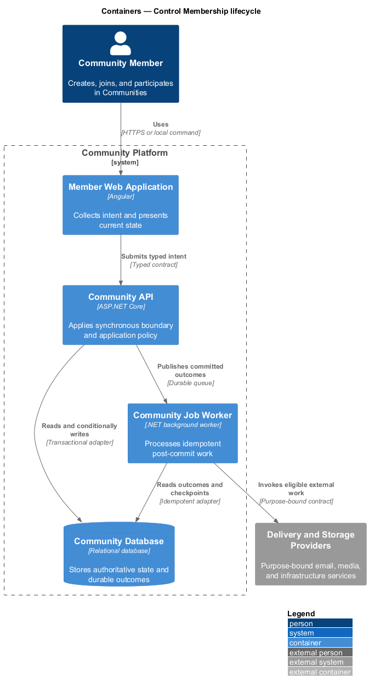
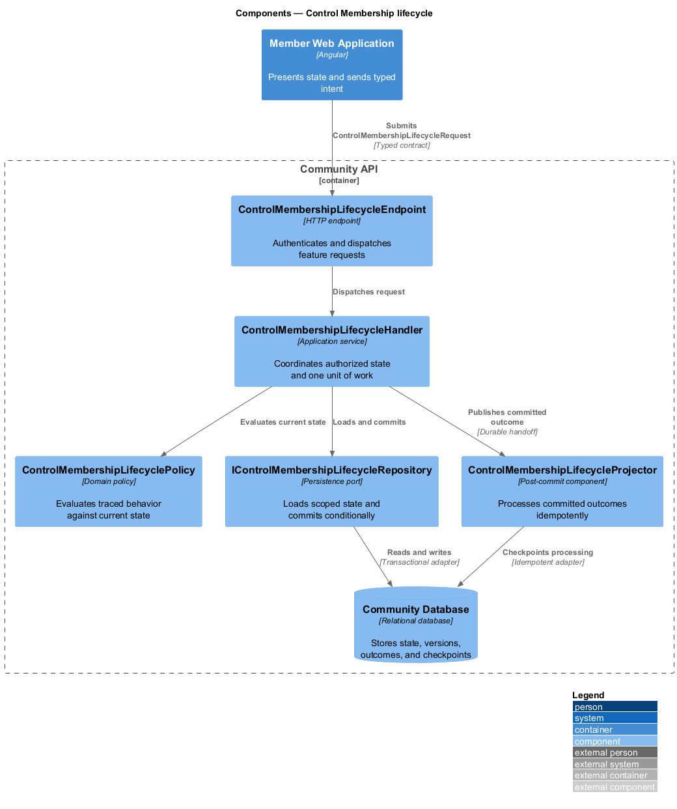
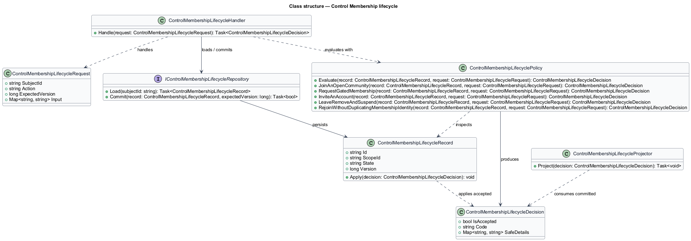
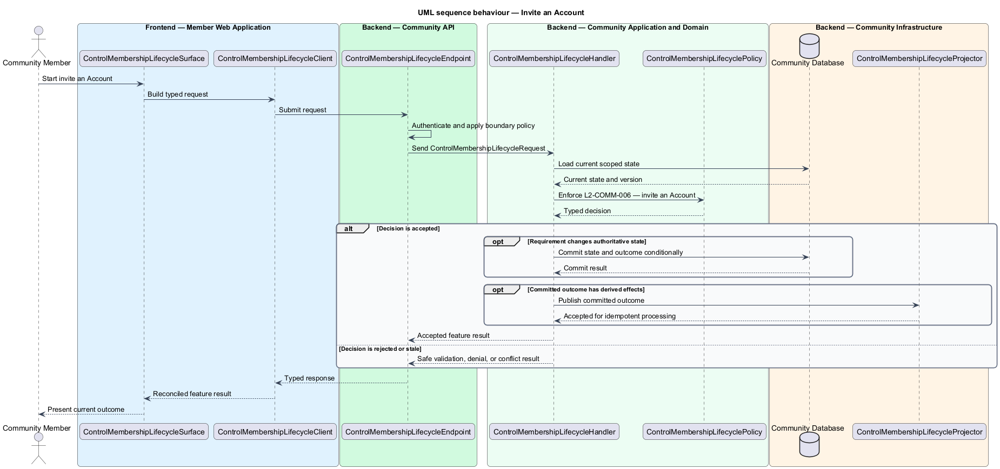
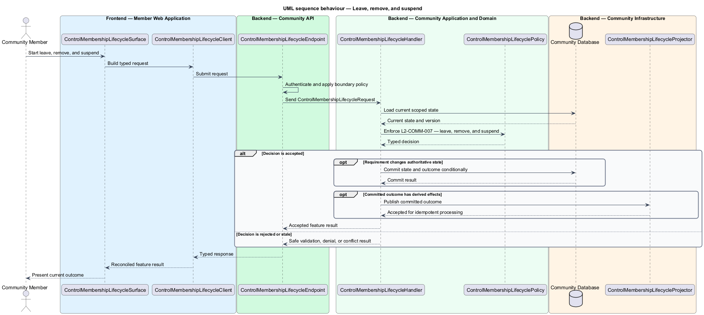
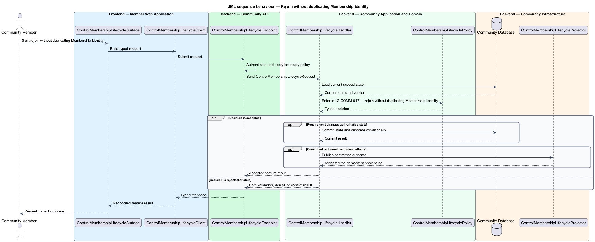

# Control Membership lifecycle

## Overview

Community Starter is a community platform divided into product and platform subsystems. The
Communities and membership subsystem owns this feature.

*control Membership lifecycle* — subsystem capability that covers join an open Community, request gated Membership, invite an Account, leave, remove, and suspend, and rejoin without duplicating Membership identity

Accounts organize around distinct Communities. Each Community owns its Memberships, Roles, Permissions, Spaces, settings, and lifecycle, and the server preserves administrative continuity and strict multi-community tenancy through every transition. The platform shall provide coherent public-join, approval, invitation, leave, removal, suspension, and re-entry behavior without creating duplicate Memberships.

The feature groups 5 traced behaviors behind one policy and evidence
boundary: `L2-COMM-004`, `L2-COMM-005`, `L2-COMM-006`, `L2-COMM-007`, and `L2-COMM-017`. Authoritative state commits before projections, delivery, or external work reports
success.

## Description

The repository contains specifications but no application implementation. This greenfield slice
defines the following building blocks across `Member Web Application`, `Community API`, the
application and domain layer, and infrastructure.

- **`ControlMembershipLifecycleSurface`** — page component in `Member Web Application`. It presents current
  state, submits user intent, and reconciles the typed result.
- **`ControlMembershipLifecycleClient`** — typed Angular client. It creates `ControlMembershipLifecycleRequest` values and maps stable
  transport failures into feature results.
- **`ControlMembershipLifecycleEndpoint`** — HTTP endpoint in `Community API`. It authenticates the
  caller, applies boundary policy, and dispatches the request.
- **`ControlMembershipLifecycleRequest`** — immutable request carrying `SubjectId`, `Action`, `ExpectedVersion`, and the
  scoped input needed by one traced behavior.
- **`ControlMembershipLifecycleHandler`** — application service that loads authorized state through
  `IControlMembershipLifecycleRepository`, invokes `ControlMembershipLifecyclePolicy`, and commits an accepted transition.
- **`ControlMembershipLifecyclePolicy`** — domain policy that evaluates current state and returns a typed
  `ControlMembershipLifecycleDecision` without performing external work.
- **`ControlMembershipLifecycleRecord`** — authoritative record containing the feature state, scope, and concurrency
  version.
- **`IControlMembershipLifecycleRepository`** — persistence port that loads scoped state and commits one conditional
  unit of work.
- **`ControlMembershipLifecycleProjector`** — idempotent post-commit component in `Community Job Worker`. It updates
  eligible projections and invokes configured external providers.

`ControlMembershipLifecyclePolicy` exposes one named operation for each traced behavior:

- **`ControlMembershipLifecyclePolicy.JoinAnOpenCommunity(record, request)`** — evaluates `L2-COMM-004` (join an open Community) and returns a typed decision before any state change.
- **`ControlMembershipLifecyclePolicy.RequestGatedMembership(record, request)`** — evaluates `L2-COMM-005` (request gated Membership) and returns a typed decision before any state change.
- **`ControlMembershipLifecyclePolicy.InviteAnAccount(record, request)`** — evaluates `L2-COMM-006` (invite an Account) and returns a typed decision before any state change.
- **`ControlMembershipLifecyclePolicy.LeaveRemoveAndSuspend(record, request)`** — evaluates `L2-COMM-007` (leave, remove, and suspend) and returns a typed decision before any state change.
- **`ControlMembershipLifecyclePolicy.RejoinWithoutDuplicatingMembershipIdentity(record, request)`** — evaluates `L2-COMM-017` (rejoin without duplicating Membership identity) and returns a typed decision before any state change.

## Requirements

The feature realizes the following level-2 (L2) requirements. Each row preserves the specification
identifier, its level-1 (L1) parent, and the requirement statement verbatim.

| L2 ID | Refines (L1) | Requirement |
|-------|--------------|-------------|
| `L2-COMM-004` | `L1-COMM-002` | An eligible Account can directly create an active Membership in an open Community, subject to the Community's current policy, safety state, and capacity. |
| `L2-COMM-005` | `L1-COMM-002` | A gated Community can receive one pending Membership request per Account and let an authorized Membership approve or decline it from current policy and capacity. Requests and invitations share one versioned Account-plus-Community entry-artifact set whose first valid activation is final. |
| `L2-COMM-006` | `L1-COMM-002` | Authorized Memberships can issue bounded, revocable Community invitations that create or activate at most one Membership after the intended Account accepts; all invitations coordinate with gated requests through the same versioned Account-plus-Community entry-artifact set. |
| `L2-COMM-007` | `L1-COMM-002` | Voluntary exit and neutral administrative Membership corrections are distinct from punitive enforcement, server-authorized, auditable, and cannot remove the last required administrator or silently retain member access. Punitive suspension or removal is applied only by a Moderation Action. |
| `L2-COMM-017` | `L1-COMM-002` | One Account has at most one stable Membership identity per Community across separate active participation intervals; rejoin never creates a parallel record or silently restores prior authority. |

## Diagrams

### System context

The `Community Member` uses `Community Platform` for the feature. The system invokes
`Delivery and Storage Providers` only for configured external work after authoritative decisions.

### Containers

`Member Web Application` collects intent, `Community API` applies the synchronous boundary,
and `Community Database` holds authoritative state. `Community Job Worker` handles eligible
post-commit work against `Delivery and Storage Providers`.

### Components

Inside `Community API`, `ControlMembershipLifecycleEndpoint` dispatches `ControlMembershipLifecycleHandler`. The handler evaluates
`ControlMembershipLifecyclePolicy`, persists through `IControlMembershipLifecycleRepository`, and hands committed outcomes to
`ControlMembershipLifecycleProjector`.

### Class structure

`ControlMembershipLifecycleHandler` depends on the immutable request, domain policy, and repository port.
`ControlMembershipLifecycleRecord` owns versioned state, while `ControlMembershipLifecycleProjector` consumes committed results.

### Behaviour — join an open Community

The interaction loads current scoped state before `ControlMembershipLifecyclePolicy` enforces
`L2-COMM-004`. Rejected decisions return without changing authoritative state; accepted
state changes commit before optional derived work starts.

### Behaviour — request gated Membership

The interaction loads current scoped state before `ControlMembershipLifecyclePolicy` enforces
`L2-COMM-005`. Rejected decisions return without changing authoritative state; accepted
state changes commit before optional derived work starts.

### Behaviour — invite an Account

The interaction loads current scoped state before `ControlMembershipLifecyclePolicy` enforces
`L2-COMM-006`. Rejected decisions return without changing authoritative state; accepted
state changes commit before optional derived work starts.

### Behaviour — leave, remove, and suspend

The interaction loads current scoped state before `ControlMembershipLifecyclePolicy` enforces
`L2-COMM-007`. Rejected decisions return without changing authoritative state; accepted
state changes commit before optional derived work starts.

### Behaviour — rejoin without duplicating Membership identity

The interaction loads current scoped state before `ControlMembershipLifecyclePolicy` enforces
`L2-COMM-017`. Rejected decisions return without changing authoritative state; accepted
state changes commit before optional derived work starts.

