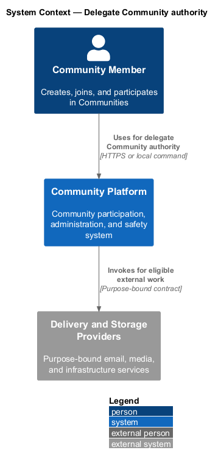
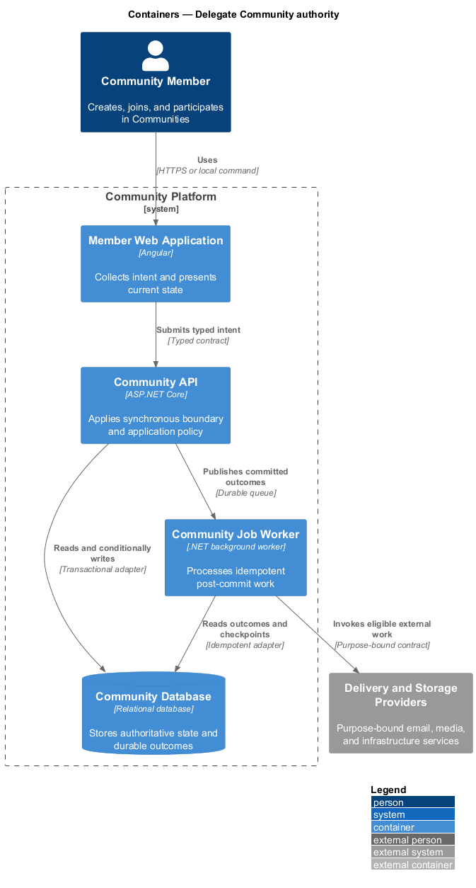
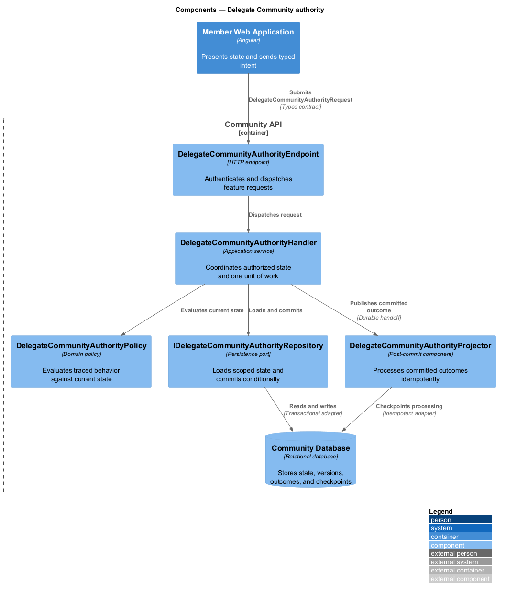
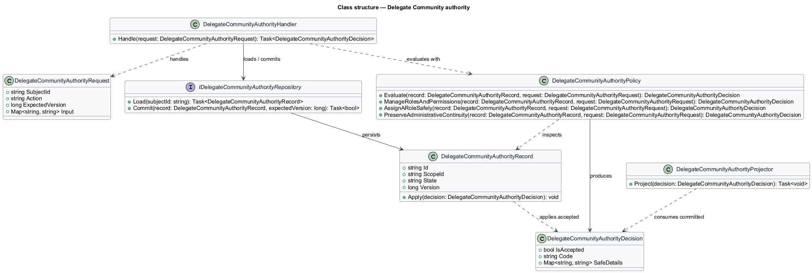
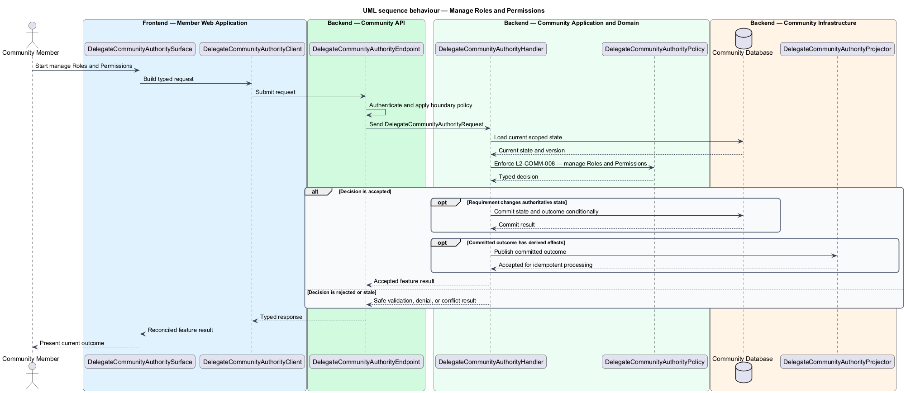
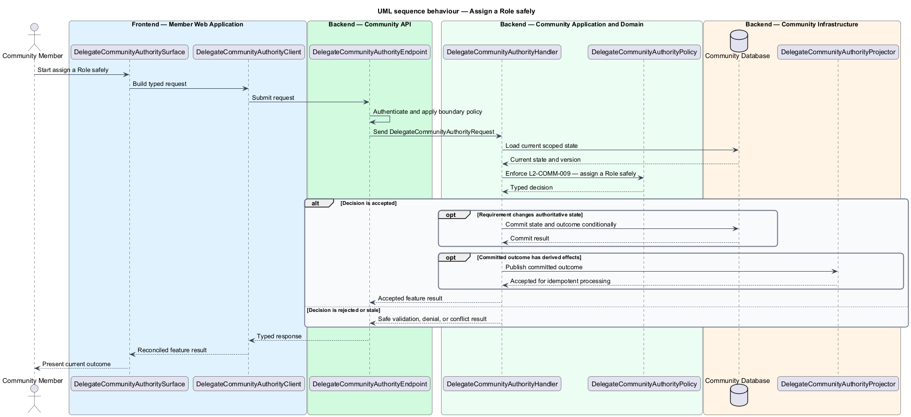
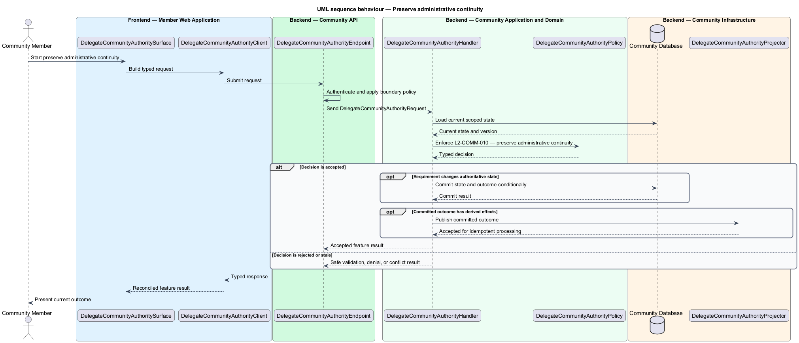

# Delegate Community authority

## Overview

Community Starter is a community platform divided into product and platform subsystems. The
Communities and membership subsystem owns this feature.

*delegate Community authority* — subsystem capability that covers manage Roles and Permissions, assign a Role safely, and preserve administrative continuity

Accounts organize around distinct Communities. Each Community owns its Memberships, Roles, Permissions, Spaces, settings, and lifecycle, and the server preserves administrative continuity and strict multi-community tenancy through every transition. The platform shall let authorized Accounts define and assign Roles while keeping Permissions bounded, explainable, and incapable of removing the Community's last required administrator.

The feature groups 3 traced behaviors behind one policy and evidence
boundary: `L2-COMM-008`, `L2-COMM-009`, and `L2-COMM-010`. Authoritative state commits before projections, delivery, or external work reports
success.

## Description

The repository contains specifications but no application implementation. This greenfield slice
defines the following building blocks across `Member Web Application`, `Community API`, the
application and domain layer, and infrastructure.

- **`DelegateCommunityAuthoritySurface`** — page component in `Member Web Application`. It presents current
  state, submits user intent, and reconciles the typed result.
- **`DelegateCommunityAuthorityClient`** — typed Angular client. It creates `DelegateCommunityAuthorityRequest` values and maps stable
  transport failures into feature results.
- **`DelegateCommunityAuthorityEndpoint`** — HTTP endpoint in `Community API`. It authenticates the
  caller, applies boundary policy, and dispatches the request.
- **`DelegateCommunityAuthorityRequest`** — immutable request carrying `SubjectId`, `Action`, `ExpectedVersion`, and the
  scoped input needed by one traced behavior.
- **`DelegateCommunityAuthorityHandler`** — application service that loads authorized state through
  `IDelegateCommunityAuthorityRepository`, invokes `DelegateCommunityAuthorityPolicy`, and commits an accepted transition.
- **`DelegateCommunityAuthorityPolicy`** — domain policy that evaluates current state and returns a typed
  `DelegateCommunityAuthorityDecision` without performing external work.
- **`DelegateCommunityAuthorityRecord`** — authoritative record containing the feature state, scope, and concurrency
  version.
- **`IDelegateCommunityAuthorityRepository`** — persistence port that loads scoped state and commits one conditional
  unit of work.
- **`DelegateCommunityAuthorityProjector`** — idempotent post-commit component in `Community Job Worker`. It updates
  eligible projections and invokes configured external providers.

`DelegateCommunityAuthorityPolicy` exposes one named operation for each traced behavior:

- **`DelegateCommunityAuthorityPolicy.ManageRolesAndPermissions(record, request)`** — evaluates `L2-COMM-008` (manage Roles and Permissions) and returns a typed decision before any state change.
- **`DelegateCommunityAuthorityPolicy.AssignARoleSafely(record, request)`** — evaluates `L2-COMM-009` (assign a Role safely) and returns a typed decision before any state change.
- **`DelegateCommunityAuthorityPolicy.PreserveAdministrativeContinuity(record, request)`** — evaluates `L2-COMM-010` (preserve administrative continuity) and returns a typed decision before any state change.

## Requirements

The feature realizes the following level-2 (L2) requirements. Each row preserves the specification
identifier, its level-1 (L1) parent, and the requirement statement verbatim.

| L2 ID | Refines (L1) | Requirement |
|-------|--------------|-------------|
| `L2-COMM-008` | `L1-COMM-003` | Authorized Memberships can manage Community-scoped Roles from a bounded Permission catalog while protected system Roles and escalation rules remain server-controlled. |
| `L2-COMM-009` | `L1-COMM-003` | Role assignment changes effective Permissions only for an active Membership in the same Community and only within the actor's current delegation authority. |
| `L2-COMM-010` | `L1-COMM-003` | Every active Community retains the configured minimum active Memberships with its required administrative Role through transfers, exits, Membership suspension, Account deactivation or deletion, and concurrent changes. |

## Diagrams

### System context

The `Community Member` uses `Community Platform` for the feature. The system invokes
`Delivery and Storage Providers` only for configured external work after authoritative decisions.

### Containers

`Member Web Application` collects intent, `Community API` applies the synchronous boundary,
and `Community Database` holds authoritative state. `Community Job Worker` handles eligible
post-commit work against `Delivery and Storage Providers`.

### Components

Inside `Community API`, `DelegateCommunityAuthorityEndpoint` dispatches `DelegateCommunityAuthorityHandler`. The handler evaluates
`DelegateCommunityAuthorityPolicy`, persists through `IDelegateCommunityAuthorityRepository`, and hands committed outcomes to
`DelegateCommunityAuthorityProjector`.

### Class structure

`DelegateCommunityAuthorityHandler` depends on the immutable request, domain policy, and repository port.
`DelegateCommunityAuthorityRecord` owns versioned state, while `DelegateCommunityAuthorityProjector` consumes committed results.

### Behaviour — manage Roles and Permissions

The interaction loads current scoped state before `DelegateCommunityAuthorityPolicy` enforces
`L2-COMM-008`. Rejected decisions return without changing authoritative state; accepted
state changes commit before optional derived work starts.

### Behaviour — assign a Role safely

The interaction loads current scoped state before `DelegateCommunityAuthorityPolicy` enforces
`L2-COMM-009`. Rejected decisions return without changing authoritative state; accepted
state changes commit before optional derived work starts.

### Behaviour — preserve administrative continuity

The interaction loads current scoped state before `DelegateCommunityAuthorityPolicy` enforces
`L2-COMM-010`. Rejected decisions return without changing authoritative state; accepted
state changes commit before optional derived work starts.

