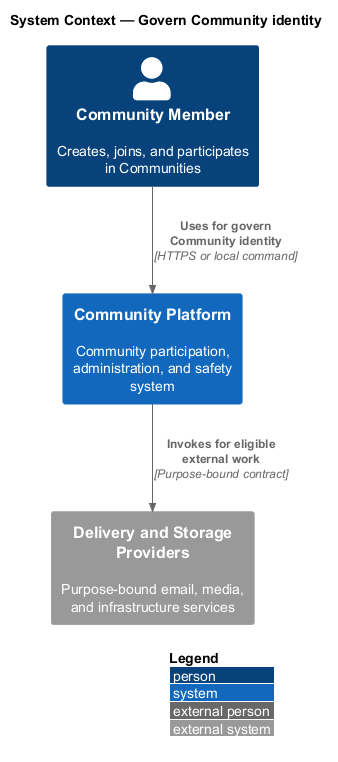
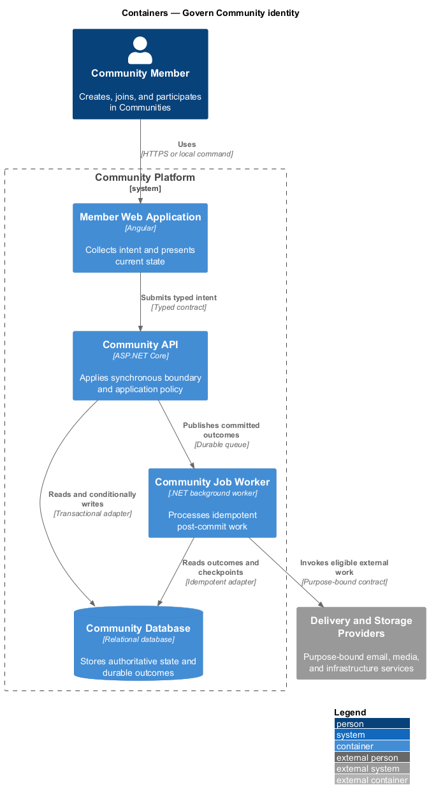
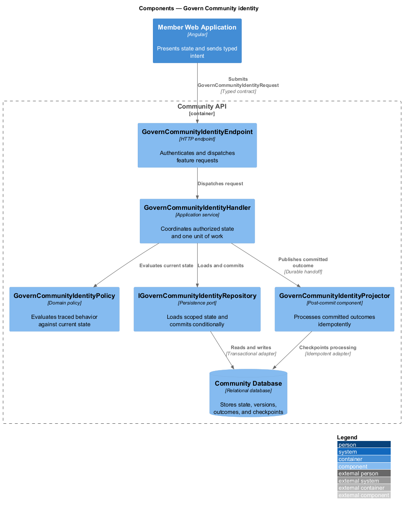
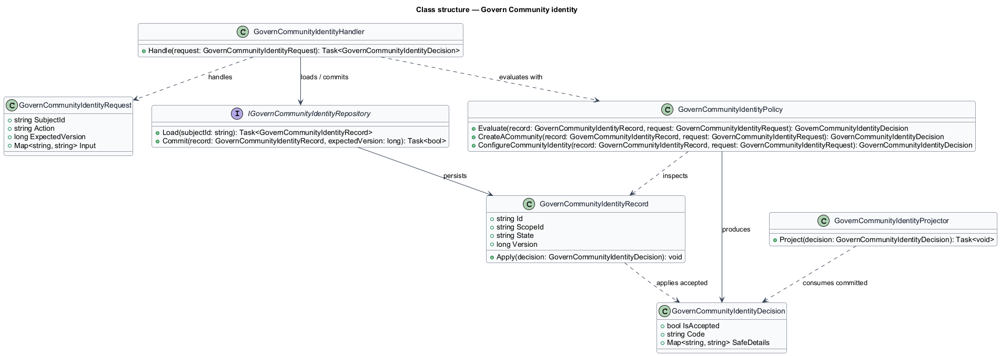
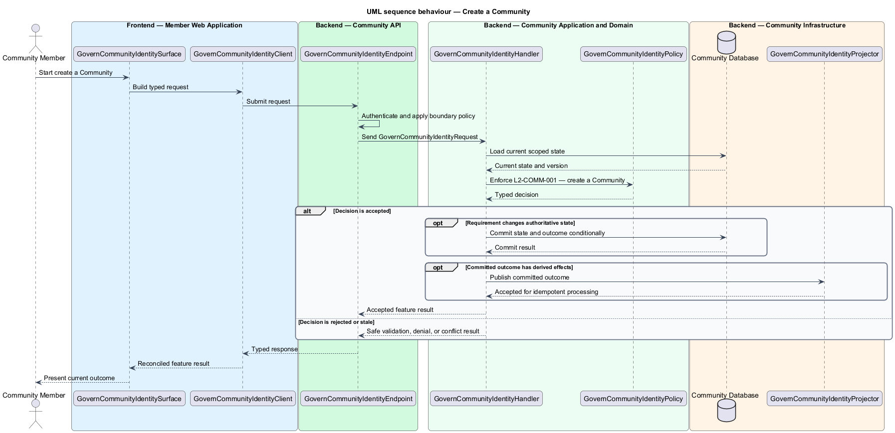
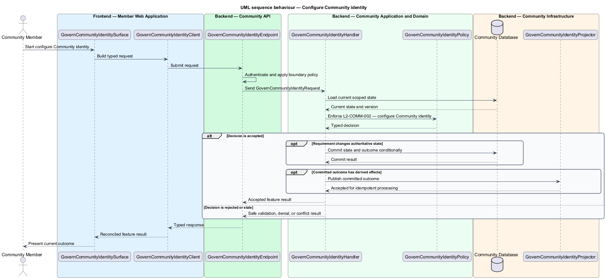

# Govern Community identity

## Overview

Community Starter is a community platform divided into product and platform subsystems. The
Communities and membership subsystem owns this feature.

*govern Community identity* — subsystem capability that covers create a Community and configure Community identity

Accounts organize around distinct Communities. Each Community owns its Memberships, Roles, Permissions, Spaces, settings, and lifecycle, and the server preserves administrative continuity and strict multi-community tenancy through every transition. The platform shall let authorized Accounts create, identify, and configure a Community without breaking stable links or exposing private state.

The feature groups 2 traced behaviors behind one policy and evidence
boundary: `L2-COMM-001` and `L2-COMM-002`. Authoritative state commits before projections, delivery, or external work reports
success.

## Description

The repository contains specifications but no application implementation. This greenfield slice
defines the following building blocks across `Member Web Application`, `Community API`, the
application and domain layer, and infrastructure.

- **`GovernCommunityIdentitySurface`** — page component in `Member Web Application`. It presents current
  state, submits user intent, and reconciles the typed result.
- **`GovernCommunityIdentityClient`** — typed Angular client. It creates `GovernCommunityIdentityRequest` values and maps stable
  transport failures into feature results.
- **`GovernCommunityIdentityEndpoint`** — HTTP endpoint in `Community API`. It authenticates the
  caller, applies boundary policy, and dispatches the request.
- **`GovernCommunityIdentityRequest`** — immutable request carrying `SubjectId`, `Action`, `ExpectedVersion`, and the
  scoped input needed by one traced behavior.
- **`GovernCommunityIdentityHandler`** — application service that loads authorized state through
  `IGovernCommunityIdentityRepository`, invokes `GovernCommunityIdentityPolicy`, and commits an accepted transition.
- **`GovernCommunityIdentityPolicy`** — domain policy that evaluates current state and returns a typed
  `GovernCommunityIdentityDecision` without performing external work.
- **`GovernCommunityIdentityRecord`** — authoritative record containing the feature state, scope, and concurrency
  version.
- **`IGovernCommunityIdentityRepository`** — persistence port that loads scoped state and commits one conditional
  unit of work.
- **`GovernCommunityIdentityProjector`** — idempotent post-commit component in `Community Job Worker`. It updates
  eligible projections and invokes configured external providers.

`GovernCommunityIdentityPolicy` exposes one named operation for each traced behavior:

- **`GovernCommunityIdentityPolicy.CreateACommunity(record, request)`** — evaluates `L2-COMM-001` (create a Community) and returns a typed decision before any state change.
- **`GovernCommunityIdentityPolicy.ConfigureCommunityIdentity(record, request)`** — evaluates `L2-COMM-002` (configure Community identity) and returns a typed decision before any state change.

## Requirements

The feature realizes the following level-2 (L2) requirements. Each row preserves the specification
identifier, its level-1 (L1) parent, and the requirement statement verbatim.

| L2 ID | Refines (L1) | Requirement |
|-------|--------------|-------------|
| `L2-COMM-001` | `L1-COMM-001` | An eligible Account can create a Community with a unique stable identifier and an initial active Membership whose administrative Role prevents an ownerless Community. |
| `L2-COMM-002` | `L1-COMM-001` | Authorized Accounts can update Community presentation, access mode, and stable routing identity under Permission, version, documented Unicode/case normalization, reserved/confusable-name, uniqueness, and redirect or alias constraints. |

## Diagrams

### System context

The `Community Member` uses `Community Platform` for the feature. The system invokes
`Delivery and Storage Providers` only for configured external work after authoritative decisions.

### Containers

`Member Web Application` collects intent, `Community API` applies the synchronous boundary,
and `Community Database` holds authoritative state. `Community Job Worker` handles eligible
post-commit work against `Delivery and Storage Providers`.

### Components

Inside `Community API`, `GovernCommunityIdentityEndpoint` dispatches `GovernCommunityIdentityHandler`. The handler evaluates
`GovernCommunityIdentityPolicy`, persists through `IGovernCommunityIdentityRepository`, and hands committed outcomes to
`GovernCommunityIdentityProjector`.

### Class structure

`GovernCommunityIdentityHandler` depends on the immutable request, domain policy, and repository port.
`GovernCommunityIdentityRecord` owns versioned state, while `GovernCommunityIdentityProjector` consumes committed results.

### Behaviour — create a Community

The interaction loads current scoped state before `GovernCommunityIdentityPolicy` enforces
`L2-COMM-001`. Rejected decisions return without changing authoritative state; accepted
state changes commit before optional derived work starts.

### Behaviour — configure Community identity

The interaction loads current scoped state before `GovernCommunityIdentityPolicy` enforces
`L2-COMM-002`. Rejected decisions return without changing authoritative state; accepted
state changes commit before optional derived work starts.

