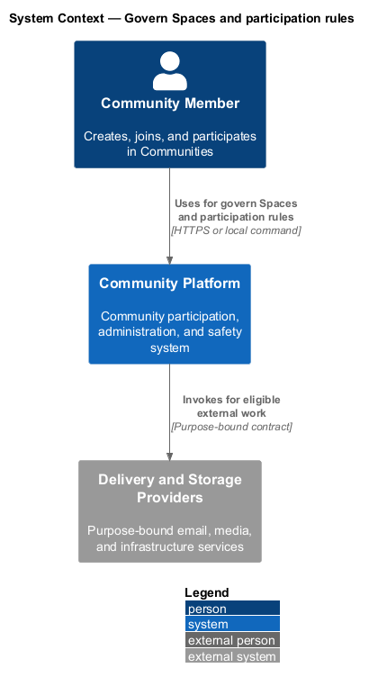
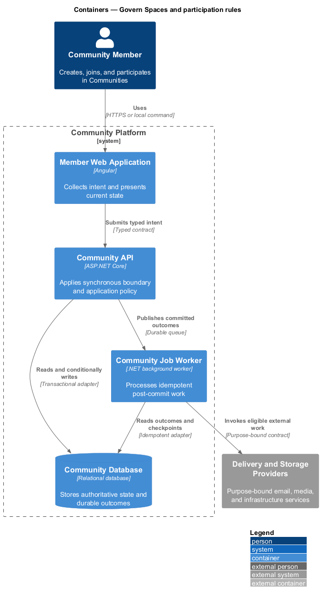
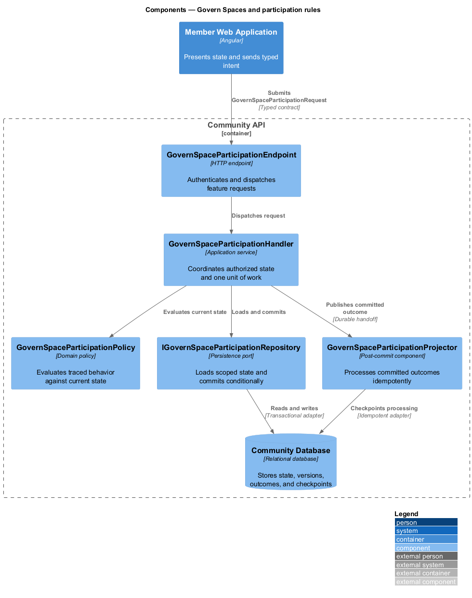
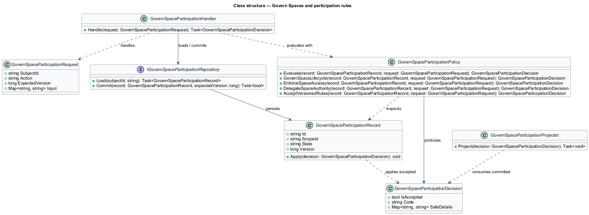
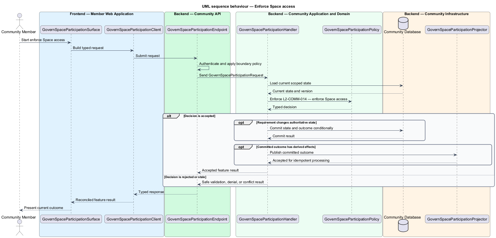

# Govern Spaces and participation rules

## Overview

Community Starter is a community platform divided into product and platform subsystems. The
Communities and membership subsystem owns this feature.

*govern Spaces and participation rules* — subsystem capability that covers govern Space lifecycle, enforce Space access, delegate Space authority, and accept versioned rules

Accounts organize around distinct Communities. Each Community owns its Memberships, Roles, Permissions, Spaces, settings, and lifecycle, and the server preserves administrative continuity and strict multi-community tenancy through every transition. The platform shall let a Community organize work into Spaces with explicit lifecycle, access, delegation, and versioned participation rules that cannot weaken Community safety or tenancy.

The feature groups 4 traced behaviors behind one policy and evidence
boundary: `L2-COMM-013`, `L2-COMM-014`, `L2-COMM-015`, and `L2-COMM-016`. Authoritative state commits before projections, delivery, or external work reports
success.

## Description

The repository contains specifications but no application implementation. This greenfield slice
defines the following building blocks across `Member Web Application`, `Community API`, the
application and domain layer, and infrastructure.

- **`GovernSpaceParticipationSurface`** — page component in `Member Web Application`. It presents current
  state, submits user intent, and reconciles the typed result.
- **`GovernSpaceParticipationClient`** — typed Angular client. It creates `GovernSpaceParticipationRequest` values and maps stable
  transport failures into feature results.
- **`GovernSpaceParticipationEndpoint`** — HTTP endpoint in `Community API`. It authenticates the
  caller, applies boundary policy, and dispatches the request.
- **`GovernSpaceParticipationRequest`** — immutable request carrying `SubjectId`, `Action`, `ExpectedVersion`, and the
  scoped input needed by one traced behavior.
- **`GovernSpaceParticipationHandler`** — application service that loads authorized state through
  `IGovernSpaceParticipationRepository`, invokes `GovernSpaceParticipationPolicy`, and commits an accepted transition.
- **`GovernSpaceParticipationPolicy`** — domain policy that evaluates current state and returns a typed
  `GovernSpaceParticipationDecision` without performing external work.
- **`GovernSpaceParticipationRecord`** — authoritative record containing the feature state, scope, and concurrency
  version.
- **`IGovernSpaceParticipationRepository`** — persistence port that loads scoped state and commits one conditional
  unit of work.
- **`GovernSpaceParticipationProjector`** — idempotent post-commit component in `Community Job Worker`. It updates
  eligible projections and invokes configured external providers.

`GovernSpaceParticipationPolicy` exposes one named operation for each traced behavior:

- **`GovernSpaceParticipationPolicy.GovernSpaceLifecycle(record, request)`** — evaluates `L2-COMM-013` (govern Space lifecycle) and returns a typed decision before any state change.
- **`GovernSpaceParticipationPolicy.EnforceSpaceAccess(record, request)`** — evaluates `L2-COMM-014` (enforce Space access) and returns a typed decision before any state change.
- **`GovernSpaceParticipationPolicy.DelegateSpaceAuthority(record, request)`** — evaluates `L2-COMM-015` (delegate Space authority) and returns a typed decision before any state change.
- **`GovernSpaceParticipationPolicy.AcceptVersionedRules(record, request)`** — evaluates `L2-COMM-016` (accept versioned rules) and returns a typed decision before any state change.

## Requirements

The feature realizes the following level-2 (L2) requirements. Each row preserves the specification
identifier, its level-1 (L1) parent, and the requirement statement verbatim.

| L2 ID | Refines (L1) | Requirement |
|-------|--------------|-------------|
| `L2-COMM-013` | `L1-COMM-005` | An authorized Membership can create, update, archive, and restore a Space within exactly one Community using a normalized, unique, stable identifier and a versioned server-owned lifecycle whose impact contract covers every Space-scoped capability. |
| `L2-COMM-014` | `L1-COMM-005` | A Space either inherits current Community access or explicitly narrows access to eligible Memberships and Roles; a Space can never broaden access beyond its owning Community. |
| `L2-COMM-015` | `L1-COMM-005` | Space-scoped authority derives from current Community Membership, bounded Role and Permission assignments, and an optional minimum-manager policy; it applies only inside the owning Space. |
| `L2-COMM-016` | `L1-COMM-005` | Each Community publishes a versioned code of conduct and participation rules; a Space may add versioned supplemental rules that strengthen but never weaken the Community rules. |

## Diagrams

### System context

The `Community Member` uses `Community Platform` for the feature. The system invokes
`Delivery and Storage Providers` only for configured external work after authoritative decisions.

### Containers

`Member Web Application` collects intent, `Community API` applies the synchronous boundary,
and `Community Database` holds authoritative state. `Community Job Worker` handles eligible
post-commit work against `Delivery and Storage Providers`.

### Components

Inside `Community API`, `GovernSpaceParticipationEndpoint` dispatches `GovernSpaceParticipationHandler`. The handler evaluates
`GovernSpaceParticipationPolicy`, persists through `IGovernSpaceParticipationRepository`, and hands committed outcomes to
`GovernSpaceParticipationProjector`.

### Class structure

`GovernSpaceParticipationHandler` depends on the immutable request, domain policy, and repository port.
`GovernSpaceParticipationRecord` owns versioned state, while `GovernSpaceParticipationProjector` consumes committed results.

### Behaviour — govern Space lifecycle

The interaction loads current scoped state before `GovernSpaceParticipationPolicy` enforces
`L2-COMM-013`. Rejected decisions return without changing authoritative state; accepted
state changes commit before optional derived work starts.

### Behaviour — enforce Space access

The interaction loads current scoped state before `GovernSpaceParticipationPolicy` enforces
`L2-COMM-014`. Rejected decisions return without changing authoritative state; accepted
state changes commit before optional derived work starts.

### Behaviour — delegate Space authority

The interaction loads current scoped state before `GovernSpaceParticipationPolicy` enforces
`L2-COMM-015`. Rejected decisions return without changing authoritative state; accepted
state changes commit before optional derived work starts.

### Behaviour — accept versioned rules

The interaction loads current scoped state before `GovernSpaceParticipationPolicy` enforces
`L2-COMM-016`. Rejected decisions return without changing authoritative state; accepted
state changes commit before optional derived work starts.

