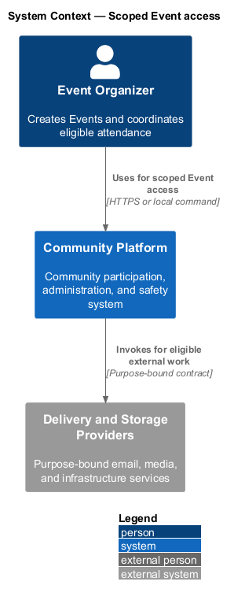
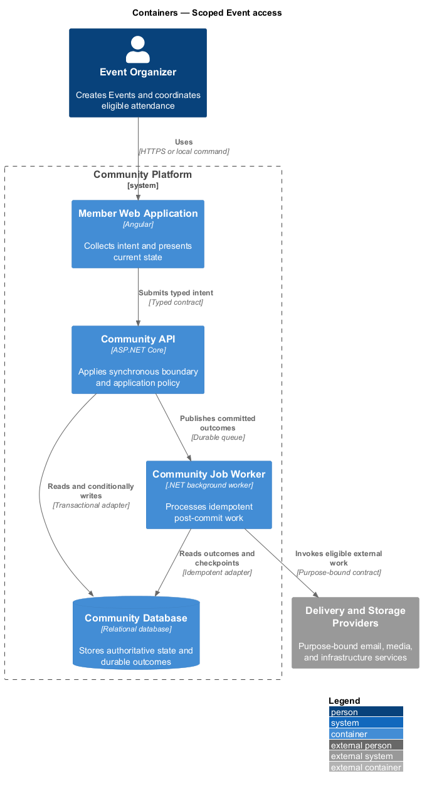
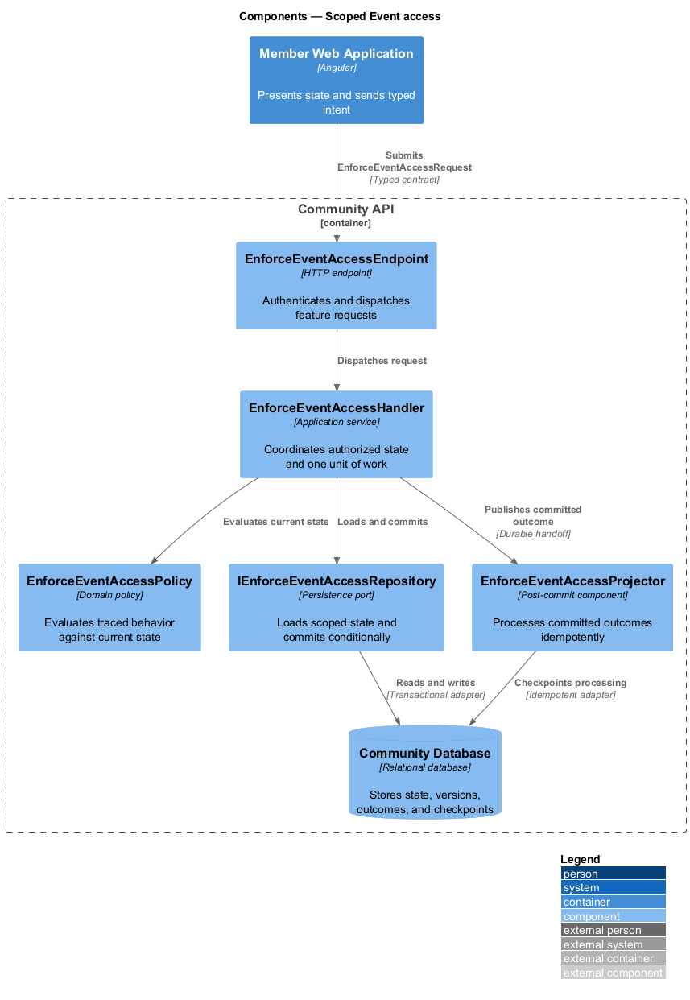
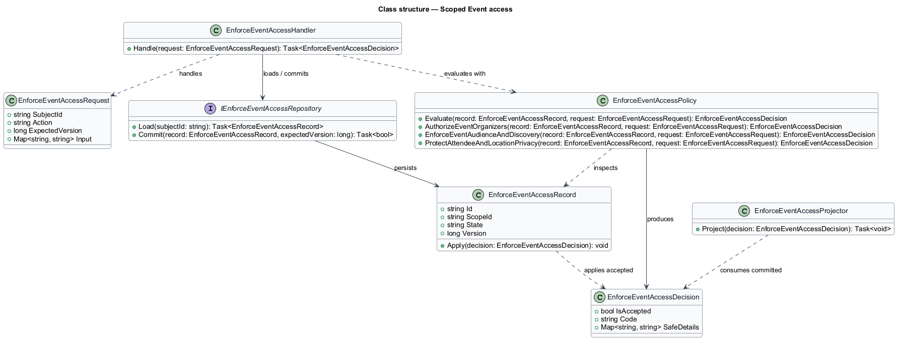
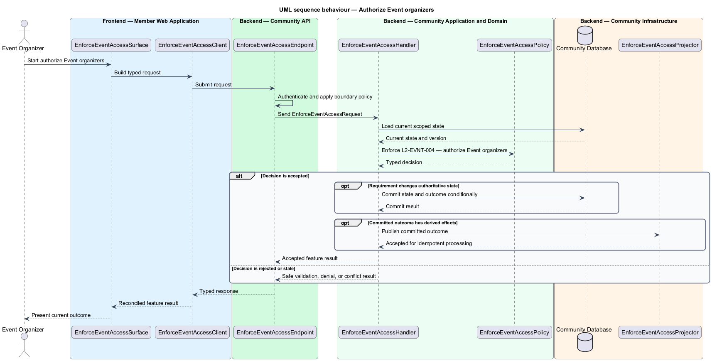
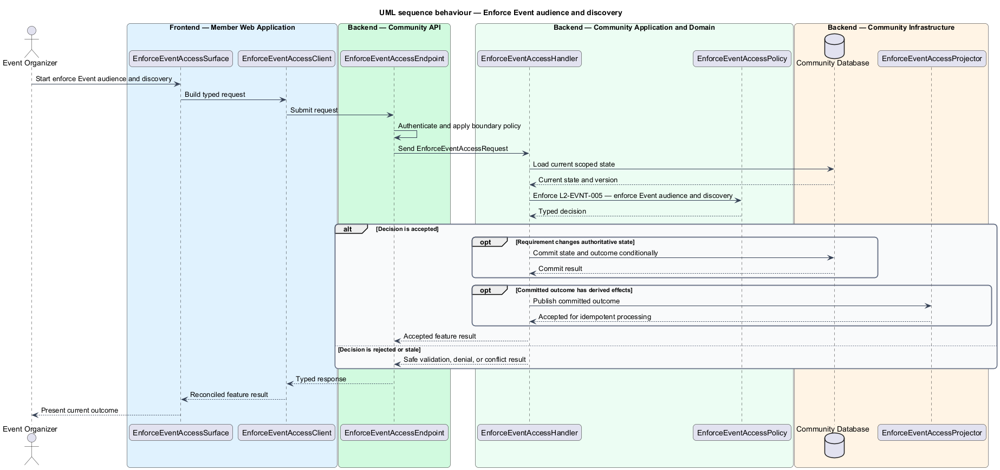

# Scoped Event access

## Overview

Community Starter is a community platform divided into product and platform subsystems. The
Community events subsystem owns this feature.

*scoped Event access* — subsystem capability that covers authorize Event organizers, enforce Event audience and discovery, and protect attendee and location privacy

Communities need to schedule activities, control who can discover and attend them, coordinate finite capacity, and communicate changes across time zones. Event and RSVP rules are server-owned and shall remain correct under concurrent requests, cancellation, privacy, and moderation. The platform shall enforce organizer authority, Community and Space visibility, attendee privacy, and location disclosure at every read, mutation, Search, Feed, and Delivery boundary.

The feature groups 3 traced behaviors behind one policy and evidence
boundary: `L2-EVNT-004`, `L2-EVNT-005`, and `L2-EVNT-006`. Authoritative state commits before projections, delivery, or external work reports
success.

## Description

The repository contains specifications but no application implementation. This greenfield slice
defines the following building blocks across `Member Web Application`, `Community API`, the
application and domain layer, and infrastructure.

- **`EnforceEventAccessSurface`** — page component in `Member Web Application`. It presents current
  state, submits user intent, and reconciles the typed result.
- **`EnforceEventAccessClient`** — typed Angular client. It creates `EnforceEventAccessRequest` values and maps stable
  transport failures into feature results.
- **`EnforceEventAccessEndpoint`** — HTTP endpoint in `Community API`. It authenticates the
  caller, applies boundary policy, and dispatches the request.
- **`EnforceEventAccessRequest`** — immutable request carrying `SubjectId`, `Action`, `ExpectedVersion`, and the
  scoped input needed by one traced behavior.
- **`EnforceEventAccessHandler`** — application service that loads authorized state through
  `IEnforceEventAccessRepository`, invokes `EnforceEventAccessPolicy`, and commits an accepted transition.
- **`EnforceEventAccessPolicy`** — domain policy that evaluates current state and returns a typed
  `EnforceEventAccessDecision` without performing external work.
- **`EnforceEventAccessRecord`** — authoritative record containing the feature state, scope, and concurrency
  version.
- **`IEnforceEventAccessRepository`** — persistence port that loads scoped state and commits one conditional
  unit of work.
- **`EnforceEventAccessProjector`** — idempotent post-commit component in `Community Job Worker`. It updates
  eligible projections and invokes configured external providers.

`EnforceEventAccessPolicy` exposes one named operation for each traced behavior:

- **`EnforceEventAccessPolicy.AuthorizeEventOrganizers(record, request)`** — evaluates `L2-EVNT-004` (authorize Event organizers) and returns a typed decision before any state change.
- **`EnforceEventAccessPolicy.EnforceEventAudienceAndDiscovery(record, request)`** — evaluates `L2-EVNT-005` (enforce Event audience and discovery) and returns a typed decision before any state change.
- **`EnforceEventAccessPolicy.ProtectAttendeeAndLocationPrivacy(record, request)`** — evaluates `L2-EVNT-006` (protect attendee and location privacy) and returns a typed decision before any state change.

## Requirements

The feature realizes the following level-2 (L2) requirements. Each row preserves the specification
identifier, its level-1 (L1) parent, and the requirement statement verbatim.

| L2 ID | Refines (L1) | Requirement |
|-------|--------------|-------------|
| `L2-EVNT-004` | `L1-EVNT-002` | Every nonterminal Event has exactly one accepted responsible organizer assignment and zero or more accepted co-organizer assignments. Their bounded authority derives from current Account, Community, Membership, Role, Permission, Space, Event state, and assignment rather than a client-supplied ID. |
| `L2-EVNT-005` | `L1-EVNT-002` | Event visibility is enforced consistently across direct URL, Community and Space lists, Feed, Search, Notifications, realtime, and caches. |
| `L2-EVNT-006` | `L1-EVNT-002` | Attendee identity, RSVP response, contact data, virtual access links, and precise venue details follow separate least-disclosure policies evaluated at request and Delivery time. |

## Diagrams

### System context

The `Event Organizer` uses `Community Platform` for the feature. The system invokes
`Delivery and Storage Providers` only for configured external work after authoritative decisions.

### Containers

`Member Web Application` collects intent, `Community API` applies the synchronous boundary,
and `Community Database` holds authoritative state. `Community Job Worker` handles eligible
post-commit work against `Delivery and Storage Providers`.

### Components

Inside `Community API`, `EnforceEventAccessEndpoint` dispatches `EnforceEventAccessHandler`. The handler evaluates
`EnforceEventAccessPolicy`, persists through `IEnforceEventAccessRepository`, and hands committed outcomes to
`EnforceEventAccessProjector`.

### Class structure

`EnforceEventAccessHandler` depends on the immutable request, domain policy, and repository port.
`EnforceEventAccessRecord` owns versioned state, while `EnforceEventAccessProjector` consumes committed results.

### Behaviour — authorize Event organizers

The interaction loads current scoped state before `EnforceEventAccessPolicy` enforces
`L2-EVNT-004`. Rejected decisions return without changing authoritative state; accepted
state changes commit before optional derived work starts.

### Behaviour — enforce Event audience and discovery

The interaction loads current scoped state before `EnforceEventAccessPolicy` enforces
`L2-EVNT-005`. Rejected decisions return without changing authoritative state; accepted
state changes commit before optional derived work starts.

### Behaviour — protect attendee and location privacy

The interaction loads current scoped state before `EnforceEventAccessPolicy` enforces
`L2-EVNT-006`. Rejected decisions return without changing authoritative state; accepted
state changes commit before optional derived work starts.

