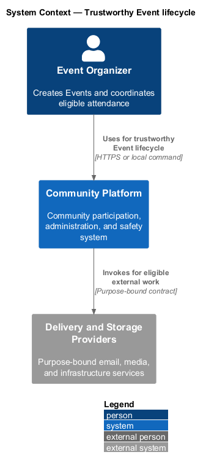
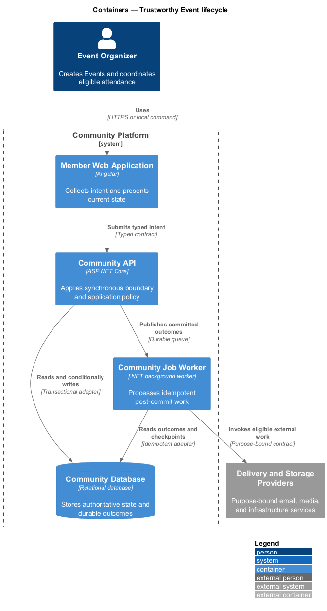
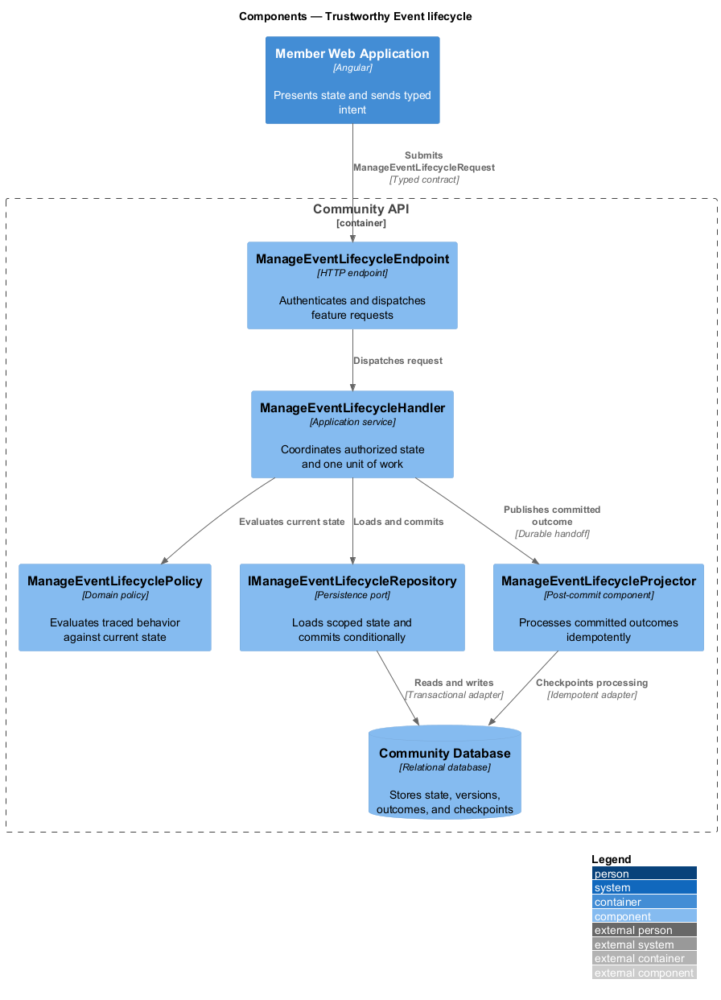
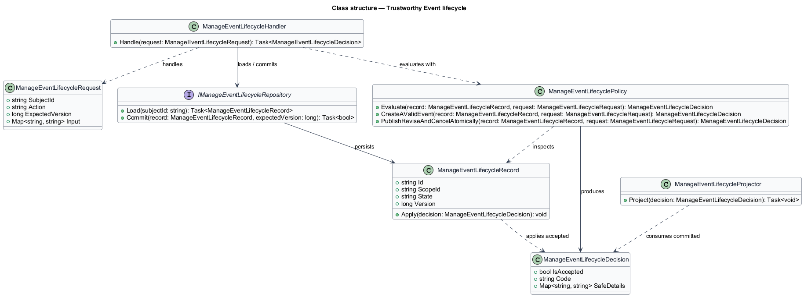
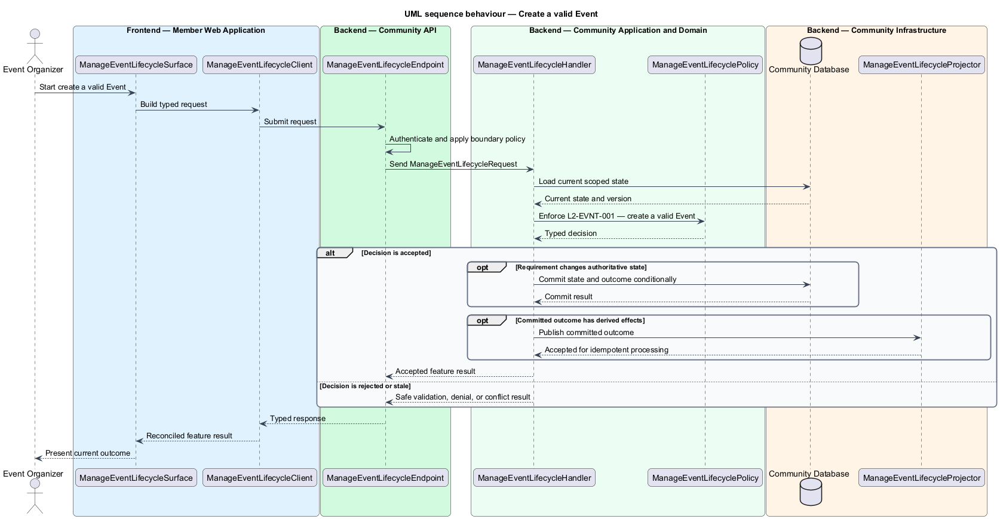
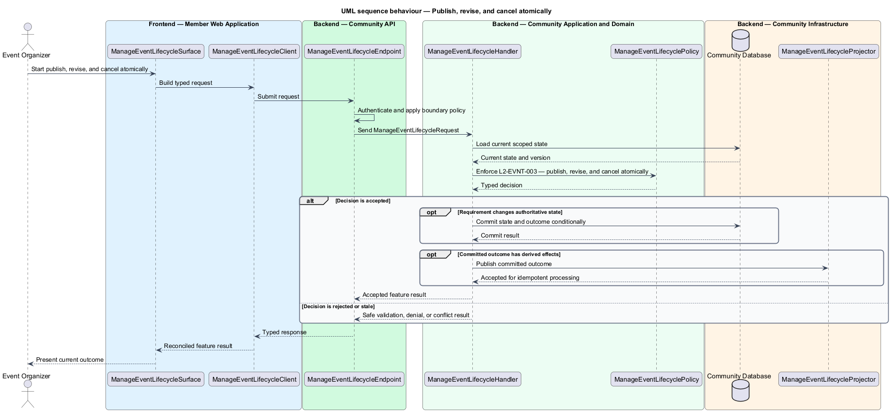

# Trustworthy Event lifecycle

## Overview

Community Starter is a community platform divided into product and platform subsystems. The
Community events subsystem owns this feature.

*trustworthy Event lifecycle* — subsystem capability that covers create a valid Event and publish, revise, and cancel atomically

Communities need to schedule activities, control who can discover and attend them, coordinate finite capacity, and communicate changes across time zones. Event and RSVP rules are server-owned and shall remain correct under concurrent requests, cancellation, privacy, and moderation. The platform shall create, publish, revise, cancel, and retain Events with unambiguous time, location, ownership, version, and lifecycle behavior.

The feature groups 2 traced behaviors behind one policy and evidence
boundary: `L2-EVNT-001` and `L2-EVNT-003`. Authoritative state commits before projections, delivery, or external work reports
success.

## Description

The repository contains specifications but no application implementation. This greenfield slice
defines the following building blocks across `Member Web Application`, `Community API`, the
application and domain layer, and infrastructure.

- **`ManageEventLifecycleSurface`** — page component in `Member Web Application`. It presents current
  state, submits user intent, and reconciles the typed result.
- **`ManageEventLifecycleClient`** — typed Angular client. It creates `ManageEventLifecycleRequest` values and maps stable
  transport failures into feature results.
- **`ManageEventLifecycleEndpoint`** — HTTP endpoint in `Community API`. It authenticates the
  caller, applies boundary policy, and dispatches the request.
- **`ManageEventLifecycleRequest`** — immutable request carrying `SubjectId`, `Action`, `ExpectedVersion`, and the
  scoped input needed by one traced behavior.
- **`ManageEventLifecycleHandler`** — application service that loads authorized state through
  `IManageEventLifecycleRepository`, invokes `ManageEventLifecyclePolicy`, and commits an accepted transition.
- **`ManageEventLifecyclePolicy`** — domain policy that evaluates current state and returns a typed
  `ManageEventLifecycleDecision` without performing external work.
- **`ManageEventLifecycleRecord`** — authoritative record containing the feature state, scope, and concurrency
  version.
- **`IManageEventLifecycleRepository`** — persistence port that loads scoped state and commits one conditional
  unit of work.
- **`ManageEventLifecycleProjector`** — idempotent post-commit component in `Community Job Worker`. It updates
  eligible projections and invokes configured external providers.

`ManageEventLifecyclePolicy` exposes one named operation for each traced behavior:

- **`ManageEventLifecyclePolicy.CreateAValidEvent(record, request)`** — evaluates `L2-EVNT-001` (create a valid Event) and returns a typed decision before any state change.
- **`ManageEventLifecyclePolicy.PublishReviseAndCancelAtomically(record, request)`** — evaluates `L2-EVNT-003` (publish, revise, and cancel atomically) and returns a typed decision before any state change.

## Requirements

The feature realizes the following level-2 (L2) requirements. Each row preserves the specification
identifier, its level-1 (L1) parent, and the requirement statement verbatim.

| L2 ID | Refines (L1) | Requirement |
|-------|--------------|-------------|
| `L2-EVNT-001` | `L1-EVNT-001` | An authorized organizer creates a draft Event in exactly one Community and optionally one active same-Community Space, with bounded content, an explicit canonical time zone, valid schedule, audience, location type, accepted applicable rules, and stable identity. |
| `L2-EVNT-003` | `L1-EVNT-001` | Publication, material revision, cancellation, completion, and archival are explicit versioned Event transitions whose downstream work begins only after persistence succeeds. |

## Diagrams

### System context

The `Event Organizer` uses `Community Platform` for the feature. The system invokes
`Delivery and Storage Providers` only for configured external work after authoritative decisions.

### Containers

`Member Web Application` collects intent, `Community API` applies the synchronous boundary,
and `Community Database` holds authoritative state. `Community Job Worker` handles eligible
post-commit work against `Delivery and Storage Providers`.

### Components

Inside `Community API`, `ManageEventLifecycleEndpoint` dispatches `ManageEventLifecycleHandler`. The handler evaluates
`ManageEventLifecyclePolicy`, persists through `IManageEventLifecycleRepository`, and hands committed outcomes to
`ManageEventLifecycleProjector`.

### Class structure

`ManageEventLifecycleHandler` depends on the immutable request, domain policy, and repository port.
`ManageEventLifecycleRecord` owns versioned state, while `ManageEventLifecycleProjector` consumes committed results.

### Behaviour — create a valid Event

The interaction loads current scoped state before `ManageEventLifecyclePolicy` enforces
`L2-EVNT-001`. Rejected decisions return without changing authoritative state; accepted
state changes commit before optional derived work starts.

### Behaviour — publish, revise, and cancel atomically

The interaction loads current scoped state before `ManageEventLifecyclePolicy` enforces
`L2-EVNT-003`. Rejected decisions return without changing authoritative state; accepted
state changes commit before optional derived work starts.

