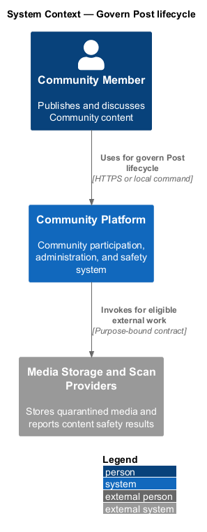
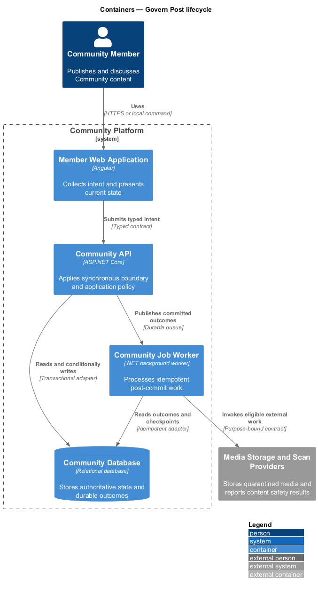
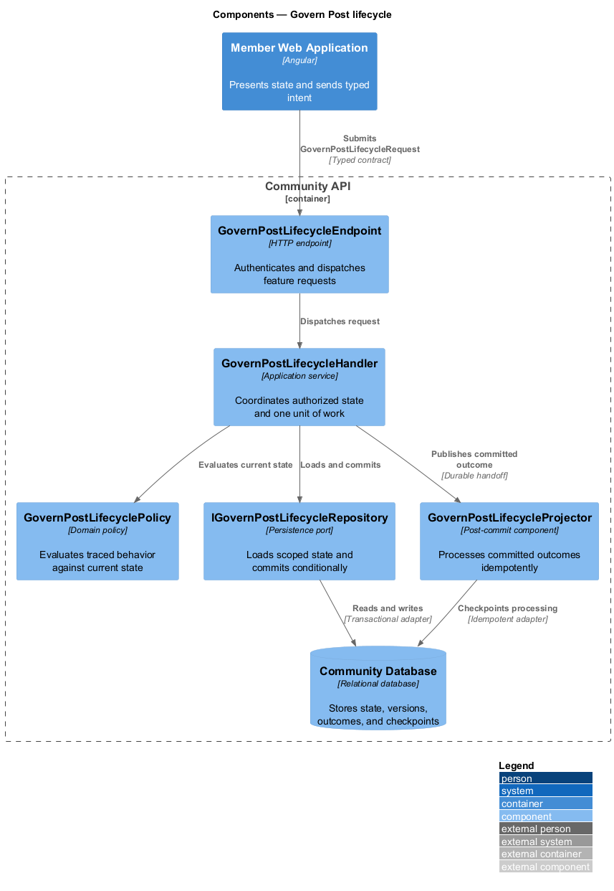
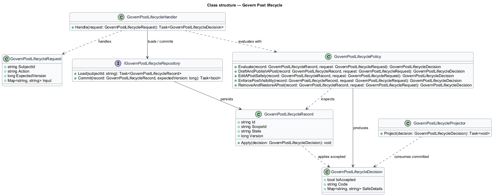
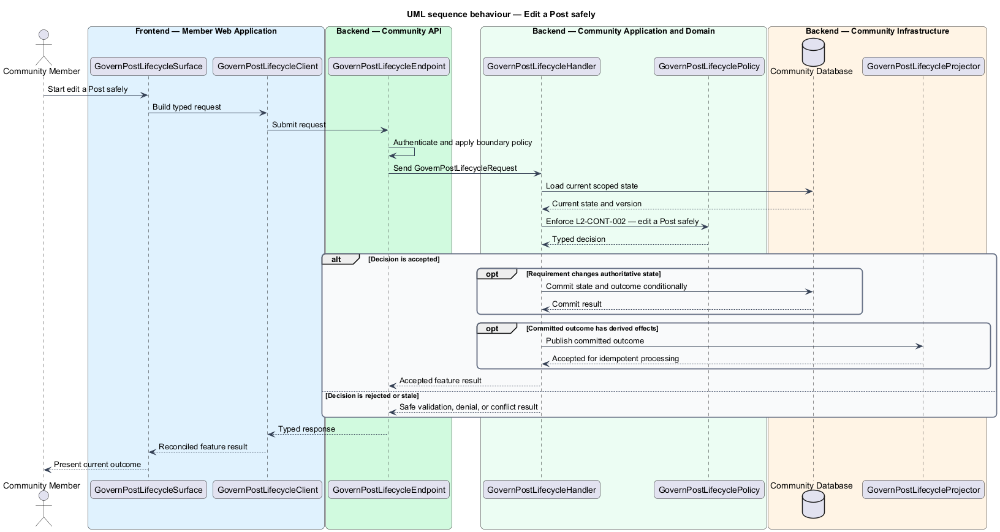
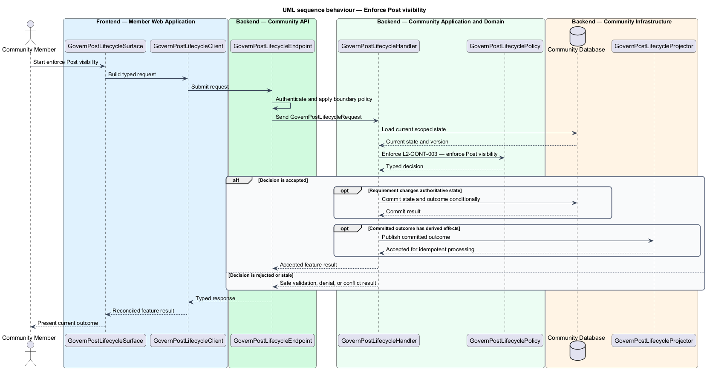

# Govern Post lifecycle

## Overview

Community Starter is a community platform divided into product and platform subsystems. The
Content and media subsystem owns this feature.

*govern Post lifecycle* — subsystem capability that covers draft and publish a Post, edit a Post safely, enforce Post visibility, and remove and restore a Post

Accounts create Posts and Comments inside a Community and may associate Tags and Attachments. Content identity, authorship, visibility, lifecycle, validation, and safety are server-owned, with all reads and mutations constrained to the current Community and Membership. The platform shall let eligible Accounts draft, publish, read, edit, and remove Posts without stale overwrites, duplicate publication, unauthorized disclosure, or ambiguous retention.

The feature groups 4 traced behaviors behind one policy and evidence
boundary: `L2-CONT-001`, `L2-CONT-002`, `L2-CONT-003`, and `L2-CONT-004`. Authoritative state commits before projections, delivery, or external work reports
success.

## Description

The repository contains specifications but no application implementation. This greenfield slice
defines the following building blocks across `Member Web Application`, `Community API`, the
application and domain layer, and infrastructure.

- **`GovernPostLifecycleSurface`** — page component in `Member Web Application`. It presents current
  state, submits user intent, and reconciles the typed result.
- **`GovernPostLifecycleClient`** — typed Angular client. It creates `GovernPostLifecycleRequest` values and maps stable
  transport failures into feature results.
- **`GovernPostLifecycleEndpoint`** — HTTP endpoint in `Community API`. It authenticates the
  caller, applies boundary policy, and dispatches the request.
- **`GovernPostLifecycleRequest`** — immutable request carrying `SubjectId`, `Action`, `ExpectedVersion`, and the
  scoped input needed by one traced behavior.
- **`GovernPostLifecycleHandler`** — application service that loads authorized state through
  `IGovernPostLifecycleRepository`, invokes `GovernPostLifecyclePolicy`, and commits an accepted transition.
- **`GovernPostLifecyclePolicy`** — domain policy that evaluates current state and returns a typed
  `GovernPostLifecycleDecision` without performing external work.
- **`GovernPostLifecycleRecord`** — authoritative record containing the feature state, scope, and concurrency
  version.
- **`IGovernPostLifecycleRepository`** — persistence port that loads scoped state and commits one conditional
  unit of work.
- **`GovernPostLifecycleProjector`** — idempotent post-commit component in `Community Job Worker`. It updates
  eligible projections and invokes configured external providers.

`GovernPostLifecyclePolicy` exposes one named operation for each traced behavior:

- **`GovernPostLifecyclePolicy.DraftAndPublishAPost(record, request)`** — evaluates `L2-CONT-001` (draft and publish a Post) and returns a typed decision before any state change.
- **`GovernPostLifecyclePolicy.EditAPostSafely(record, request)`** — evaluates `L2-CONT-002` (edit a Post safely) and returns a typed decision before any state change.
- **`GovernPostLifecyclePolicy.EnforcePostVisibility(record, request)`** — evaluates `L2-CONT-003` (enforce Post visibility) and returns a typed decision before any state change.
- **`GovernPostLifecyclePolicy.RemoveAndRestoreAPost(record, request)`** — evaluates `L2-CONT-004` (remove and restore a Post) and returns a typed decision before any state change.

## Requirements

The feature realizes the following level-2 (L2) requirements. Each row preserves the specification
identifier, its level-1 (L1) parent, and the requirement statement verbatim.

| L2 ID | Refines (L1) | Requirement |
|-------|--------------|-------------|
| `L2-CONT-001` | `L1-CONT-001` | An eligible Membership with the required Permission can create a draft or published Post in exactly one Community and optionally one active Space in that Community; publication requires current scope, accepted rules, valid content, and approved Attachments. |
| `L2-CONT-002` | `L1-CONT-001` | Post edits require current author or delegated Permission, valid content, compatible Attachments, and the current version; authorship and Community ownership cannot be reassigned, and Space movement is an explicit same-Community transition rather than a forged field edit. |
| `L2-CONT-003` | `L1-CONT-001` | Every Post read is server-filtered by publication state, Community and optional Space visibility, current Membership, Role, Permission, Block, moderation, and retention state; drafts remain owner/authorized only. |
| `L2-CONT-004` | `L1-CONT-001` | Post removal is a server-authorized lifecycle transition with declared author/moderator behavior, restoration window, Comment treatment, Attachment retention, and irreversible purge policy. |

## Diagrams

### System context

The `Community Member` uses `Community Platform` for the feature. The system invokes
`Media Storage and Scan Providers` only for configured external work after authoritative decisions.

### Containers

`Member Web Application` collects intent, `Community API` applies the synchronous boundary,
and `Community Database` holds authoritative state. `Community Job Worker` handles eligible
post-commit work against `Media Storage and Scan Providers`.

### Components

Inside `Community API`, `GovernPostLifecycleEndpoint` dispatches `GovernPostLifecycleHandler`. The handler evaluates
`GovernPostLifecyclePolicy`, persists through `IGovernPostLifecycleRepository`, and hands committed outcomes to
`GovernPostLifecycleProjector`.

### Class structure

`GovernPostLifecycleHandler` depends on the immutable request, domain policy, and repository port.
`GovernPostLifecycleRecord` owns versioned state, while `GovernPostLifecycleProjector` consumes committed results.

### Behaviour — draft and publish a Post

The interaction loads current scoped state before `GovernPostLifecyclePolicy` enforces
`L2-CONT-001`. Rejected decisions return without changing authoritative state; accepted
state changes commit before optional derived work starts.

### Behaviour — edit a Post safely

The interaction loads current scoped state before `GovernPostLifecyclePolicy` enforces
`L2-CONT-002`. Rejected decisions return without changing authoritative state; accepted
state changes commit before optional derived work starts.

### Behaviour — enforce Post visibility

The interaction loads current scoped state before `GovernPostLifecyclePolicy` enforces
`L2-CONT-003`. Rejected decisions return without changing authoritative state; accepted
state changes commit before optional derived work starts.

### Behaviour — remove and restore a Post

The interaction loads current scoped state before `GovernPostLifecyclePolicy` enforces
`L2-CONT-004`. Rejected decisions return without changing authoritative state; accepted
state changes commit before optional derived work starts.

