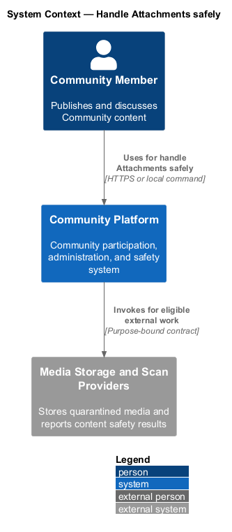
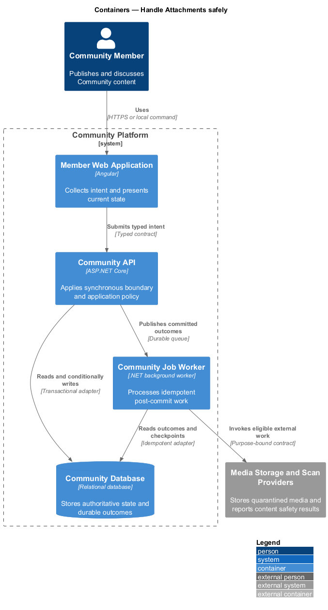
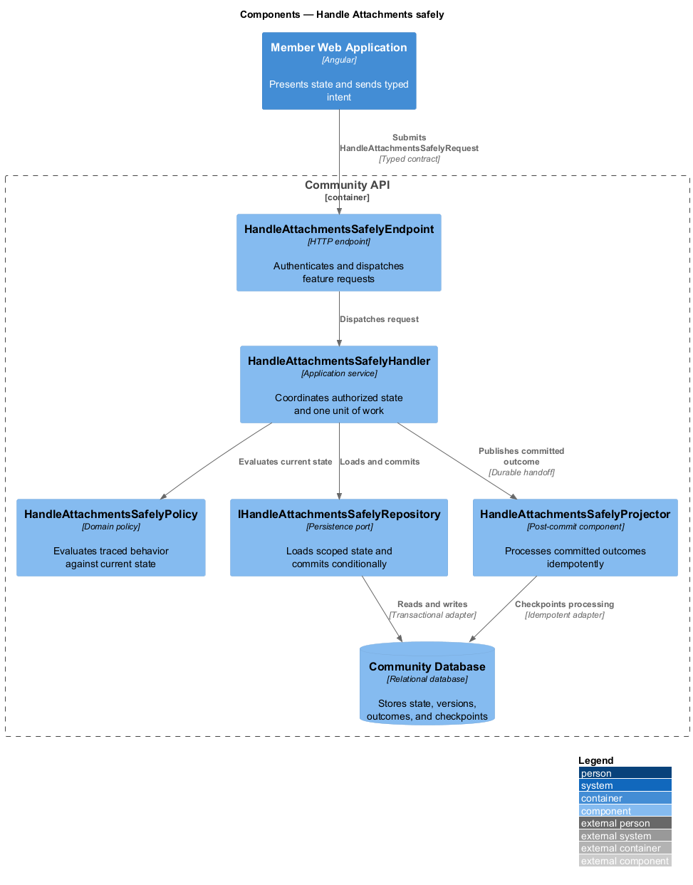
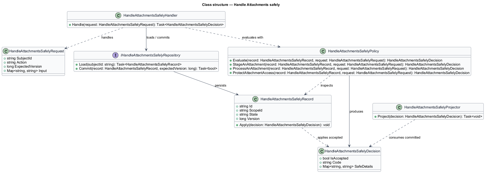
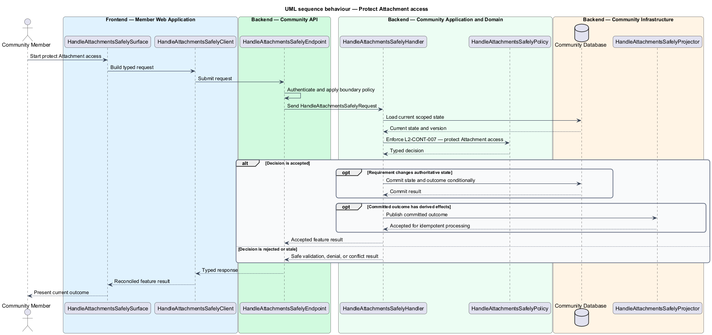

# Handle Attachments safely

## Overview

Community Starter is a community platform divided into product and platform subsystems. The
Content and media subsystem owns this feature.

*handle Attachments safely* — subsystem capability that covers stage an Attachment, process an Attachment, and protect Attachment access

Accounts create Posts and Comments inside a Community and may associate Tags and Attachments. Content identity, authorship, visibility, lifecycle, validation, and safety are server-owned, with all reads and mutations constrained to the current Community and Membership. The platform shall validate, process, retrieve, and retire Attachments without trusting filenames, declared media types, upload paths, or client ownership claims.

The feature groups 3 traced behaviors behind one policy and evidence
boundary: `L2-CONT-005`, `L2-CONT-006`, and `L2-CONT-007`. Authoritative state commits before projections, delivery, or external work reports
success.

## Description

The repository contains specifications but no application implementation. This greenfield slice
defines the following building blocks across `Member Web Application`, `Community API`, the
application and domain layer, and infrastructure.

- **`HandleAttachmentsSafelySurface`** — page component in `Member Web Application`. It presents current
  state, submits user intent, and reconciles the typed result.
- **`HandleAttachmentsSafelyClient`** — typed Angular client. It creates `HandleAttachmentsSafelyRequest` values and maps stable
  transport failures into feature results.
- **`HandleAttachmentsSafelyEndpoint`** — HTTP endpoint in `Community API`. It authenticates the
  caller, applies boundary policy, and dispatches the request.
- **`HandleAttachmentsSafelyRequest`** — immutable request carrying `SubjectId`, `Action`, `ExpectedVersion`, and the
  scoped input needed by one traced behavior.
- **`HandleAttachmentsSafelyHandler`** — application service that loads authorized state through
  `IHandleAttachmentsSafelyRepository`, invokes `HandleAttachmentsSafelyPolicy`, and commits an accepted transition.
- **`HandleAttachmentsSafelyPolicy`** — domain policy that evaluates current state and returns a typed
  `HandleAttachmentsSafelyDecision` without performing external work.
- **`HandleAttachmentsSafelyRecord`** — authoritative record containing the feature state, scope, and concurrency
  version.
- **`IHandleAttachmentsSafelyRepository`** — persistence port that loads scoped state and commits one conditional
  unit of work.
- **`HandleAttachmentsSafelyProjector`** — idempotent post-commit component in `Community Job Worker`. It updates
  eligible projections and invokes configured external providers.

`HandleAttachmentsSafelyPolicy` exposes one named operation for each traced behavior:

- **`HandleAttachmentsSafelyPolicy.StageAnAttachment(record, request)`** — evaluates `L2-CONT-005` (stage an Attachment) and returns a typed decision before any state change.
- **`HandleAttachmentsSafelyPolicy.ProcessAnAttachment(record, request)`** — evaluates `L2-CONT-006` (process an Attachment) and returns a typed decision before any state change.
- **`HandleAttachmentsSafelyPolicy.ProtectAttachmentAccess(record, request)`** — evaluates `L2-CONT-007` (protect Attachment access) and returns a typed decision before any state change.

## Requirements

The feature realizes the following level-2 (L2) requirements. Each row preserves the specification
identifier, its level-1 (L1) parent, and the requirement statement verbatim.

| L2 ID | Refines (L1) | Requirement |
|-------|--------------|-------------|
| `L2-CONT-005` | `L1-CONT-002` | The server issues a bounded upload intent for an authorized Account, Community, purpose, size, and declared media type; uploaded bytes remain untrusted and non-public until processing succeeds. |
| `L2-CONT-006` | `L1-CONT-002` | An uploaded Attachment passes authoritative malware/safety validation and media processing before it can become approved; processing is retry-safe and preserves a stable observable state. |
| `L2-CONT-007` | `L1-CONT-002` | Attachment retrieval and deletion derive authorization from current owning content, Account, Community, Membership, approval, and retention state rather than possession of a storage path. |

## Diagrams

### System context

The `Community Member` uses `Community Platform` for the feature. The system invokes
`Media Storage and Scan Providers` only for configured external work after authoritative decisions.

### Containers

`Member Web Application` collects intent, `Community API` applies the synchronous boundary,
and `Community Database` holds authoritative state. `Community Job Worker` handles eligible
post-commit work against `Media Storage and Scan Providers`.

### Components

Inside `Community API`, `HandleAttachmentsSafelyEndpoint` dispatches `HandleAttachmentsSafelyHandler`. The handler evaluates
`HandleAttachmentsSafelyPolicy`, persists through `IHandleAttachmentsSafelyRepository`, and hands committed outcomes to
`HandleAttachmentsSafelyProjector`.

### Class structure

`HandleAttachmentsSafelyHandler` depends on the immutable request, domain policy, and repository port.
`HandleAttachmentsSafelyRecord` owns versioned state, while `HandleAttachmentsSafelyProjector` consumes committed results.

### Behaviour — stage an Attachment

The interaction loads current scoped state before `HandleAttachmentsSafelyPolicy` enforces
`L2-CONT-005`. Rejected decisions return without changing authoritative state; accepted
state changes commit before optional derived work starts.

### Behaviour — process an Attachment

The interaction loads current scoped state before `HandleAttachmentsSafelyPolicy` enforces
`L2-CONT-006`. Rejected decisions return without changing authoritative state; accepted
state changes commit before optional derived work starts.

### Behaviour — protect Attachment access

The interaction loads current scoped state before `HandleAttachmentsSafelyPolicy` enforces
`L2-CONT-007`. Rejected decisions return without changing authoritative state; accepted
state changes commit before optional derived work starts.

