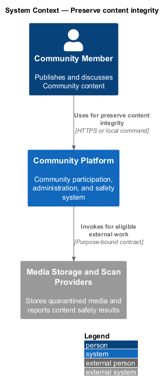
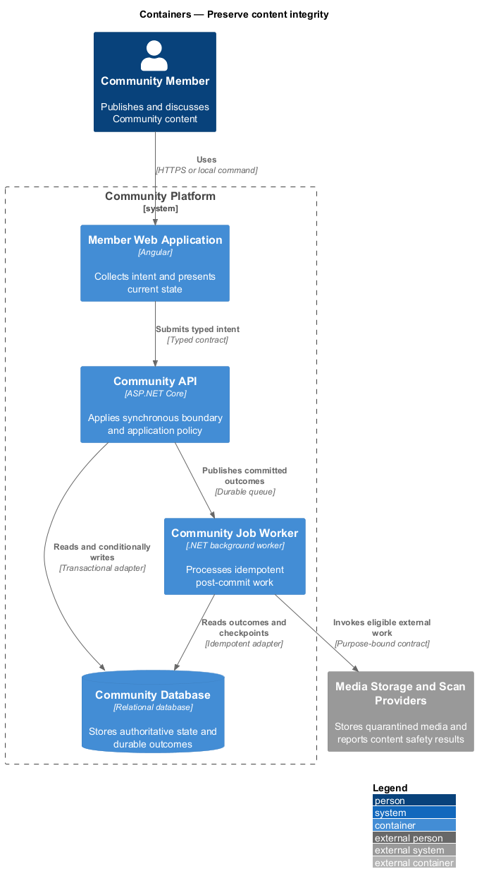
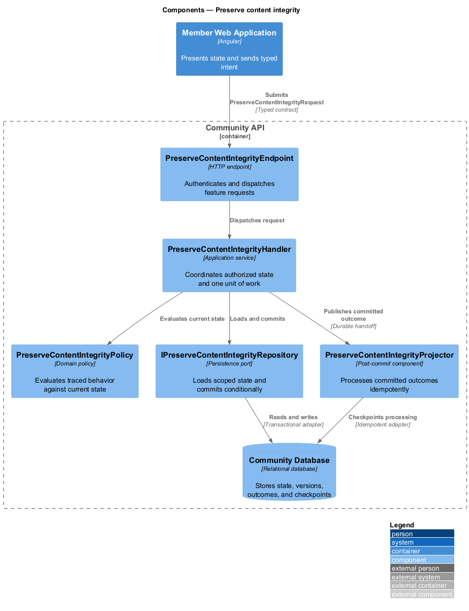
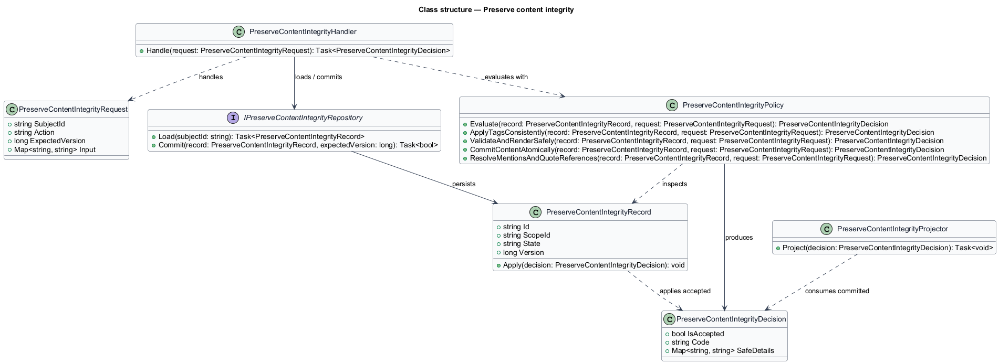
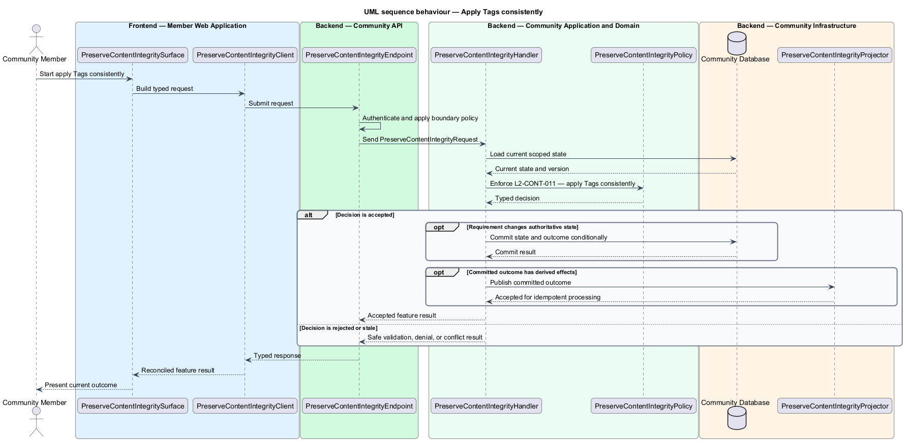
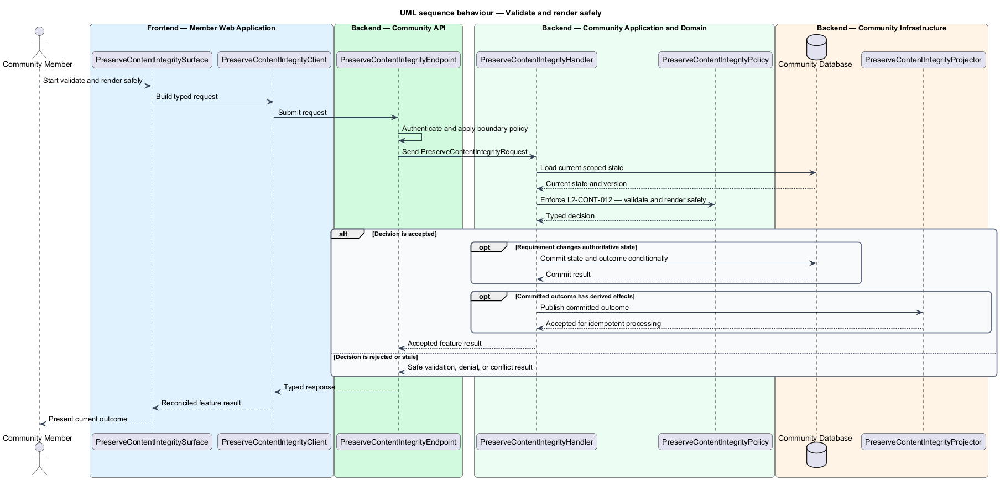
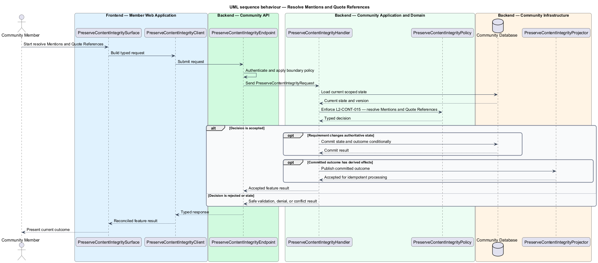

# Preserve content integrity

## Overview

Community Starter is a community platform divided into product and platform subsystems. The
Content and media subsystem owns this feature.

*preserve content integrity* — subsystem capability that covers apply Tags consistently, validate and render safely, commit content atomically, and resolve Mentions and Quote References

Accounts create Posts and Comments inside a Community and may associate Tags and Attachments. Content identity, authorship, visibility, lifecycle, validation, and safety are server-owned, with all reads and mutations constrained to the current Community and Membership. The platform shall apply a stable Tag model, render untrusted content safely, enforce bounded inputs, and make committed content state agree with returned results and downstream projections.

The feature groups 4 traced behaviors behind one policy and evidence
boundary: `L2-CONT-011`, `L2-CONT-012`, `L2-CONT-013`, and `L2-CONT-015`. Authoritative state commits before projections, delivery, or external work reports
success.

## Description

The repository contains specifications but no application implementation. This greenfield slice
defines the following building blocks across `Member Web Application`, `Community API`, the
application and domain layer, and infrastructure.

- **`PreserveContentIntegritySurface`** — page component in `Member Web Application`. It presents current
  state, submits user intent, and reconciles the typed result.
- **`PreserveContentIntegrityClient`** — typed Angular client. It creates `PreserveContentIntegrityRequest` values and maps stable
  transport failures into feature results.
- **`PreserveContentIntegrityEndpoint`** — HTTP endpoint in `Community API`. It authenticates the
  caller, applies boundary policy, and dispatches the request.
- **`PreserveContentIntegrityRequest`** — immutable request carrying `SubjectId`, `Action`, `ExpectedVersion`, and the
  scoped input needed by one traced behavior.
- **`PreserveContentIntegrityHandler`** — application service that loads authorized state through
  `IPreserveContentIntegrityRepository`, invokes `PreserveContentIntegrityPolicy`, and commits an accepted transition.
- **`PreserveContentIntegrityPolicy`** — domain policy that evaluates current state and returns a typed
  `PreserveContentIntegrityDecision` without performing external work.
- **`PreserveContentIntegrityRecord`** — authoritative record containing the feature state, scope, and concurrency
  version.
- **`IPreserveContentIntegrityRepository`** — persistence port that loads scoped state and commits one conditional
  unit of work.
- **`PreserveContentIntegrityProjector`** — idempotent post-commit component in `Community Job Worker`. It updates
  eligible projections and invokes configured external providers.

`PreserveContentIntegrityPolicy` exposes one named operation for each traced behavior:

- **`PreserveContentIntegrityPolicy.ApplyTagsConsistently(record, request)`** — evaluates `L2-CONT-011` (apply Tags consistently) and returns a typed decision before any state change.
- **`PreserveContentIntegrityPolicy.ValidateAndRenderSafely(record, request)`** — evaluates `L2-CONT-012` (validate and render safely) and returns a typed decision before any state change.
- **`PreserveContentIntegrityPolicy.CommitContentAtomically(record, request)`** — evaluates `L2-CONT-013` (commit content atomically) and returns a typed decision before any state change.
- **`PreserveContentIntegrityPolicy.ResolveMentionsAndQuoteReferences(record, request)`** — evaluates `L2-CONT-015` (resolve Mentions and Quote References) and returns a typed decision before any state change.

## Requirements

The feature realizes the following level-2 (L2) requirements. Each row preserves the specification
identifier, its level-1 (L1) parent, and the requirement statement verbatim.

| L2 ID | Refines (L1) | Requirement |
|-------|--------------|-------------|
| `L2-CONT-011` | `L1-CONT-004` | Tags use normalized stable identity and bounded assignment rules; Community-scoped Tags never merge with another Community merely because their display names match. |
| `L2-CONT-012` | `L1-CONT-004` | Post and Comment input is bounded and converted to a documented safe rendering contract that cannot execute untrusted markup, scripts, URLs, embeds, or file content. |
| `L2-CONT-013` | `L1-CONT-004` | Each content mutation commits its Post or Comment state, Tag/Attachment associations, counters, and durable projection intent coherently before returning success or emitting realtime updates. |
| `L2-CONT-015` | `L1-CONT-004` | Mentions and Quote References are stable content relationships resolved under current visibility and safety policy; typed display text alone never identifies a target or grants access. |

## Diagrams

### System context

The `Community Member` uses `Community Platform` for the feature. The system invokes
`Media Storage and Scan Providers` only for configured external work after authoritative decisions.

### Containers

`Member Web Application` collects intent, `Community API` applies the synchronous boundary,
and `Community Database` holds authoritative state. `Community Job Worker` handles eligible
post-commit work against `Media Storage and Scan Providers`.

### Components

Inside `Community API`, `PreserveContentIntegrityEndpoint` dispatches `PreserveContentIntegrityHandler`. The handler evaluates
`PreserveContentIntegrityPolicy`, persists through `IPreserveContentIntegrityRepository`, and hands committed outcomes to
`PreserveContentIntegrityProjector`.

### Class structure

`PreserveContentIntegrityHandler` depends on the immutable request, domain policy, and repository port.
`PreserveContentIntegrityRecord` owns versioned state, while `PreserveContentIntegrityProjector` consumes committed results.

### Behaviour — apply Tags consistently

The interaction loads current scoped state before `PreserveContentIntegrityPolicy` enforces
`L2-CONT-011`. Rejected decisions return without changing authoritative state; accepted
state changes commit before optional derived work starts.

### Behaviour — validate and render safely

The interaction loads current scoped state before `PreserveContentIntegrityPolicy` enforces
`L2-CONT-012`. Rejected decisions return without changing authoritative state; accepted
state changes commit before optional derived work starts.

### Behaviour — commit content atomically

The interaction loads current scoped state before `PreserveContentIntegrityPolicy` enforces
`L2-CONT-013`. Rejected decisions return without changing authoritative state; accepted
state changes commit before optional derived work starts.

### Behaviour — resolve Mentions and Quote References

The interaction loads current scoped state before `PreserveContentIntegrityPolicy` enforces
`L2-CONT-015`. Rejected decisions return without changing authoritative state; accepted
state changes commit before optional derived work starts.

