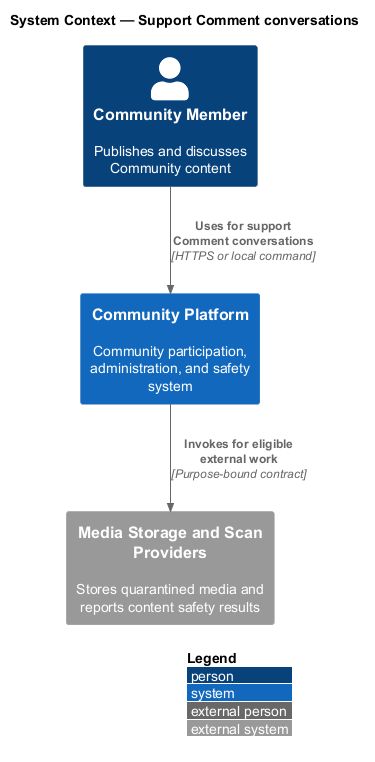
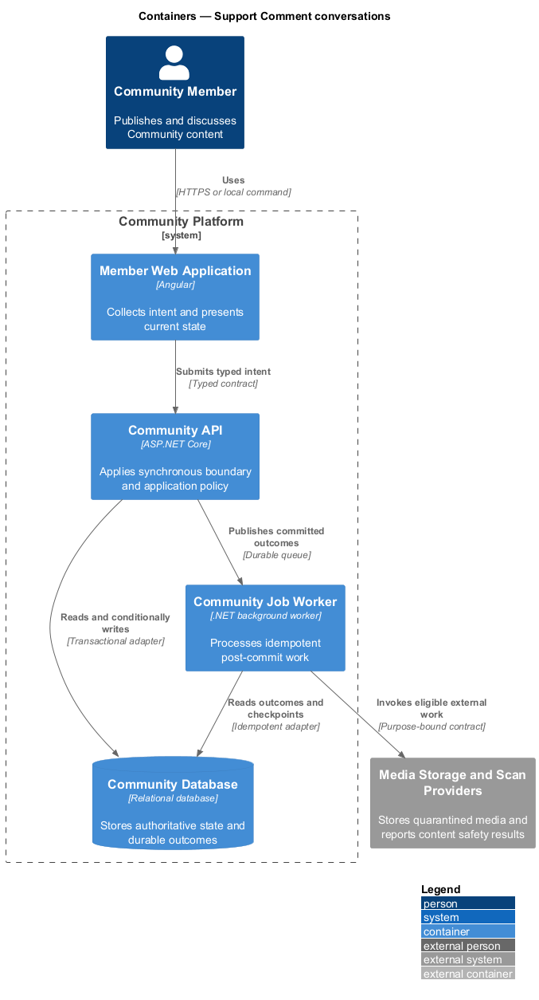
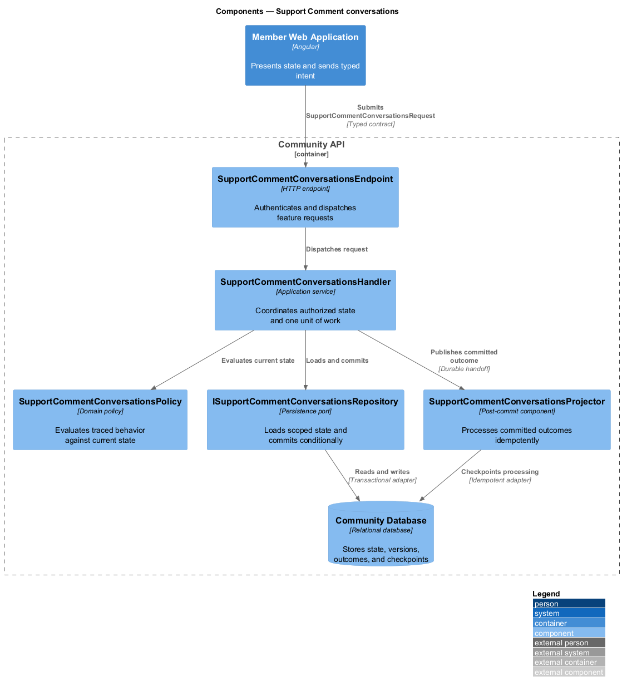
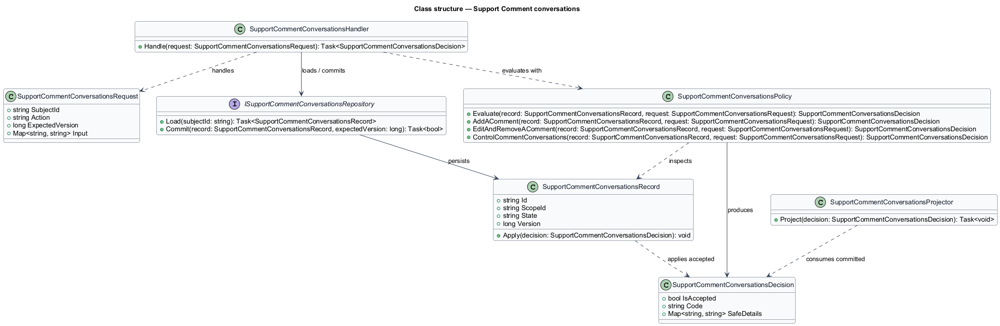
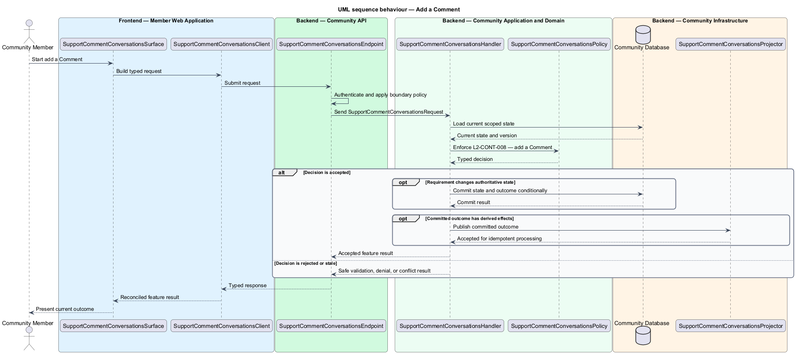
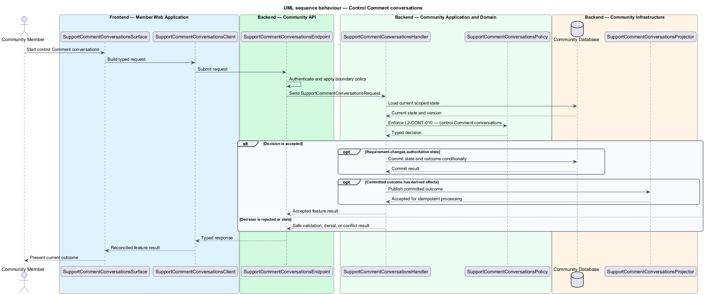

# Support Comment conversations

## Overview

Community Starter is a community platform divided into product and platform subsystems. The
Content and media subsystem owns this feature.

*support Comment conversations* — subsystem capability that covers add a Comment, edit and remove a Comment, and control Comment conversations

Accounts create Posts and Comments inside a Community and may associate Tags and Attachments. Content identity, authorship, visibility, lifecycle, validation, and safety are server-owned, with all reads and mutations constrained to the current Community and Membership. The platform shall support bounded Comment creation, editing, removal, threading, and conversation controls that remain consistent with Post, Community, Membership, and safety state.

The feature groups 3 traced behaviors behind one policy and evidence
boundary: `L2-CONT-008`, `L2-CONT-009`, and `L2-CONT-010`. Authoritative state commits before projections, delivery, or external work reports
success.

## Description

The repository contains specifications but no application implementation. This greenfield slice
defines the following building blocks across `Member Web Application`, `Community API`, the
application and domain layer, and infrastructure.

- **`SupportCommentConversationsSurface`** — page component in `Member Web Application`. It presents current
  state, submits user intent, and reconciles the typed result.
- **`SupportCommentConversationsClient`** — typed Angular client. It creates `SupportCommentConversationsRequest` values and maps stable
  transport failures into feature results.
- **`SupportCommentConversationsEndpoint`** — HTTP endpoint in `Community API`. It authenticates the
  caller, applies boundary policy, and dispatches the request.
- **`SupportCommentConversationsRequest`** — immutable request carrying `SubjectId`, `Action`, `ExpectedVersion`, and the
  scoped input needed by one traced behavior.
- **`SupportCommentConversationsHandler`** — application service that loads authorized state through
  `ISupportCommentConversationsRepository`, invokes `SupportCommentConversationsPolicy`, and commits an accepted transition.
- **`SupportCommentConversationsPolicy`** — domain policy that evaluates current state and returns a typed
  `SupportCommentConversationsDecision` without performing external work.
- **`SupportCommentConversationsRecord`** — authoritative record containing the feature state, scope, and concurrency
  version.
- **`ISupportCommentConversationsRepository`** — persistence port that loads scoped state and commits one conditional
  unit of work.
- **`SupportCommentConversationsProjector`** — idempotent post-commit component in `Community Job Worker`. It updates
  eligible projections and invokes configured external providers.

`SupportCommentConversationsPolicy` exposes one named operation for each traced behavior:

- **`SupportCommentConversationsPolicy.AddAComment(record, request)`** — evaluates `L2-CONT-008` (add a Comment) and returns a typed decision before any state change.
- **`SupportCommentConversationsPolicy.EditAndRemoveAComment(record, request)`** — evaluates `L2-CONT-009` (edit and remove a Comment) and returns a typed decision before any state change.
- **`SupportCommentConversationsPolicy.ControlCommentConversations(record, request)`** — evaluates `L2-CONT-010` (control Comment conversations) and returns a typed decision before any state change.

## Requirements

The feature realizes the following level-2 (L2) requirements. Each row preserves the specification
identifier, its level-1 (L1) parent, and the requirement statement verbatim.

| L2 ID | Refines (L1) | Requirement |
|-------|--------------|-------------|
| `L2-CONT-008` | `L1-CONT-003` | An eligible Membership can add one bounded Comment to a commentable Post or supported parent Comment in the same Community and inherited optional Space, subject to current Space access/rules, safety, depth, and rate policy; a Comment cannot select or move scope independently of its Post. |
| `L2-CONT-009` | `L1-CONT-003` | Comment authors and authorized Memberships can edit or remove under distinct policy, current version, retention, and conversation-integrity constraints. |
| `L2-CONT-010` | `L1-CONT-003` | The Post author where policy permits and Memberships with required Permission can lock, unlock, or otherwise constrain future Comments without rewriting prior authorship or Community access. |

## Diagrams

### System context

The `Community Member` uses `Community Platform` for the feature. The system invokes
`Media Storage and Scan Providers` only for configured external work after authoritative decisions.

### Containers

`Member Web Application` collects intent, `Community API` applies the synchronous boundary,
and `Community Database` holds authoritative state. `Community Job Worker` handles eligible
post-commit work against `Media Storage and Scan Providers`.

### Components

Inside `Community API`, `SupportCommentConversationsEndpoint` dispatches `SupportCommentConversationsHandler`. The handler evaluates
`SupportCommentConversationsPolicy`, persists through `ISupportCommentConversationsRepository`, and hands committed outcomes to
`SupportCommentConversationsProjector`.

### Class structure

`SupportCommentConversationsHandler` depends on the immutable request, domain policy, and repository port.
`SupportCommentConversationsRecord` owns versioned state, while `SupportCommentConversationsProjector` consumes committed results.

### Behaviour — add a Comment

The interaction loads current scoped state before `SupportCommentConversationsPolicy` enforces
`L2-CONT-008`. Rejected decisions return without changing authoritative state; accepted
state changes commit before optional derived work starts.

### Behaviour — edit and remove a Comment

The interaction loads current scoped state before `SupportCommentConversationsPolicy` enforces
`L2-CONT-009`. Rejected decisions return without changing authoritative state; accepted
state changes commit before optional derived work starts.

### Behaviour — control Comment conversations

The interaction loads current scoped state before `SupportCommentConversationsPolicy` enforces
`L2-CONT-010`. Rejected decisions return without changing authoritative state; accepted
state changes commit before optional derived work starts.

