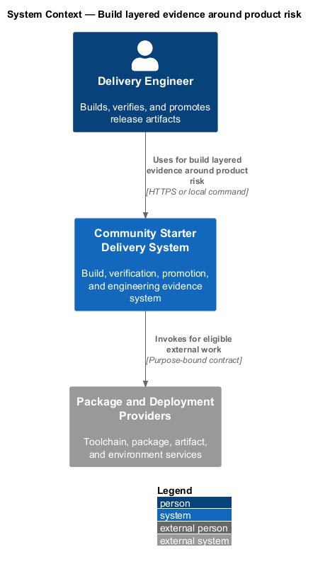
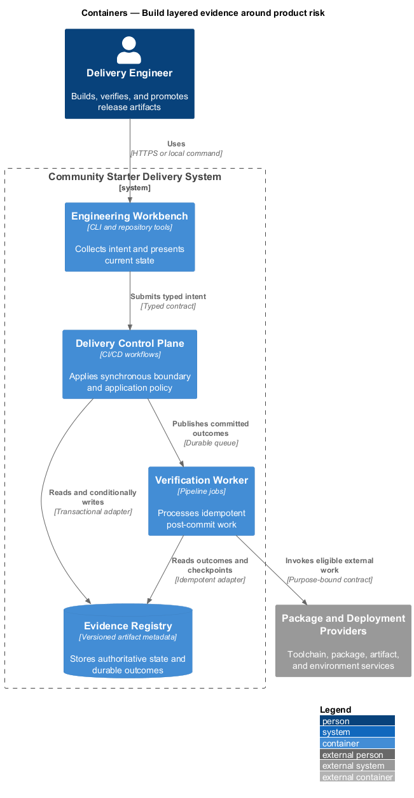
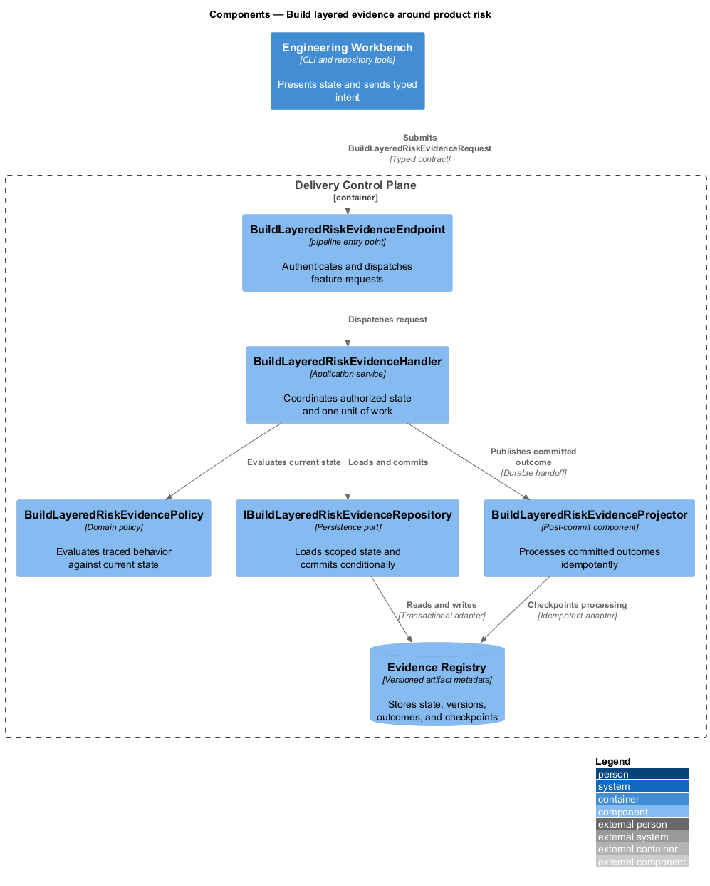
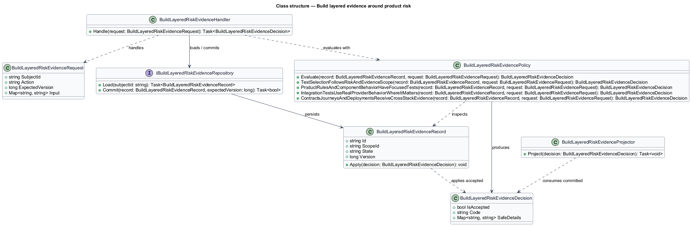
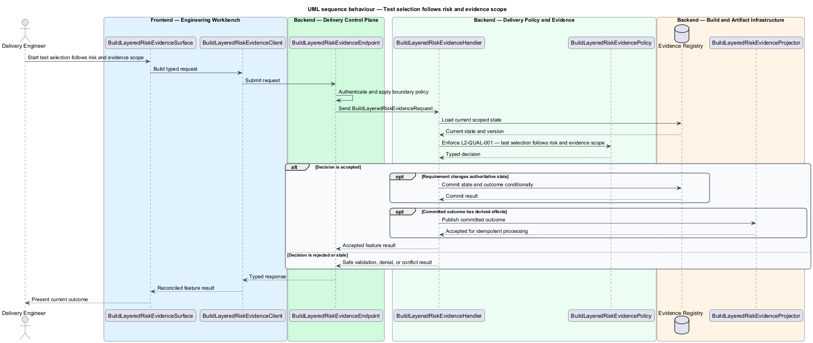
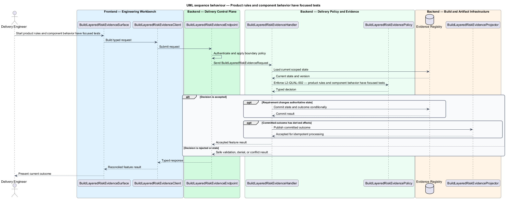
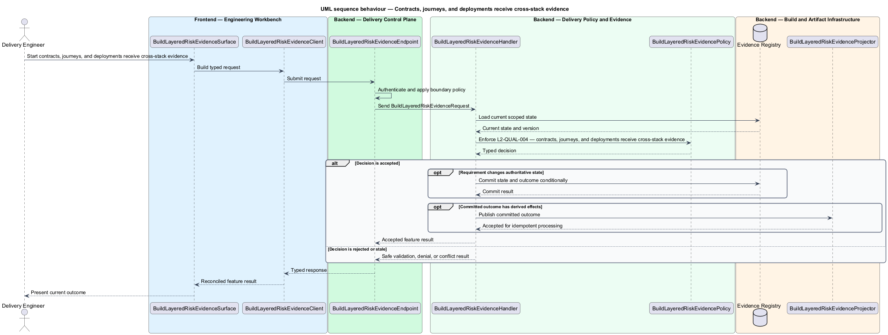

# Build layered evidence around product risk

## Overview

Community Starter is a community platform divided into product and platform subsystems. The
Delivery, quality, and operations subsystem owns this feature.

*build layered evidence around product risk* — subsystem capability that covers test selection follows risk and evidence scope, product rules and component behavior have focused tests, integration tests use real provider behavior where it matters, and contracts, journeys, and deployments receive cross-stack evidence

The starter shall make production-scale community behavior reproducible, falsifiable, deployable, and supportable. Quality evidence shall match the risk being claimed: an isolated test cannot prove a cross-stack journey, a development server cannot prove routing, and passing builds cannot substitute for operational, recovery, accessibility, privacy, security, or load review. Domain policy, application coordination, UI behavior, provider integration, public contracts, member journeys, and deployed routing shall each be verified at the layer capable of exposing their failures.

The feature groups 4 traced behaviors behind one policy and evidence
boundary: `L2-QUAL-001`, `L2-QUAL-002`, `L2-QUAL-003`, and `L2-QUAL-004`. Authoritative state commits before projections, delivery, or external work reports
success.

## Description

The repository contains specifications but no application implementation. This greenfield slice
defines the following building blocks across `Engineering Workbench`, `Delivery Control Plane`, the
application and domain layer, and infrastructure.

- **`BuildLayeredRiskEvidenceSurface`** — engineering command surface in `Engineering Workbench`. It presents current
  state, submits user intent, and reconciles the typed result.
- **`BuildLayeredRiskEvidenceClient`** — typed workflow adapter. It creates `BuildLayeredRiskEvidenceRequest` values and maps stable
  transport failures into feature results.
- **`BuildLayeredRiskEvidenceEndpoint`** — pipeline entry point in `Delivery Control Plane`. It authenticates the
  caller, applies boundary policy, and dispatches the request.
- **`BuildLayeredRiskEvidenceRequest`** — immutable request carrying `SubjectId`, `Action`, `ExpectedVersion`, and the
  scoped input needed by one traced behavior.
- **`BuildLayeredRiskEvidenceHandler`** — application service that loads authorized state through
  `IBuildLayeredRiskEvidenceRepository`, invokes `BuildLayeredRiskEvidencePolicy`, and commits an accepted transition.
- **`BuildLayeredRiskEvidencePolicy`** — domain policy that evaluates current state and returns a typed
  `BuildLayeredRiskEvidenceDecision` without performing external work.
- **`BuildLayeredRiskEvidenceRecord`** — authoritative record containing the feature state, scope, and concurrency
  version.
- **`IBuildLayeredRiskEvidenceRepository`** — persistence port that loads scoped state and commits one conditional
  unit of work.
- **`BuildLayeredRiskEvidenceProjector`** — idempotent post-commit component in `Verification Worker`. It updates
  eligible projections and invokes configured external providers.

`BuildLayeredRiskEvidencePolicy` exposes one named operation for each traced behavior:

- **`BuildLayeredRiskEvidencePolicy.TestSelectionFollowsRiskAndEvidenceScope(record, request)`** — evaluates `L2-QUAL-001` (test selection follows risk and evidence scope) and returns a typed decision before any state change.
- **`BuildLayeredRiskEvidencePolicy.ProductRulesAndComponentBehaviorHaveFocusedTests(record, request)`** — evaluates `L2-QUAL-002` (product rules and component behavior have focused tests) and returns a typed decision before any state change.
- **`BuildLayeredRiskEvidencePolicy.IntegrationTestsUseRealProviderBehaviorWhereItMatters(record, request)`** — evaluates `L2-QUAL-003` (integration tests use real provider behavior where it matters) and returns a typed decision before any state change.
- **`BuildLayeredRiskEvidencePolicy.ContractsJourneysAndDeploymentsReceiveCrossStackEvidence(record, request)`** — evaluates `L2-QUAL-004` (contracts, journeys, and deployments receive cross-stack evidence) and returns a typed decision before any state change.

## Requirements

The feature realizes the following level-2 (L2) requirements. Each row preserves the specification
identifier, its level-1 (L1) parent, and the requirement statement verbatim.

| L2 ID | Refines (L1) | Requirement |
|-------|--------------|-------------|
| `L2-QUAL-001` | `L1-QUAL-001` | Verification shall use the layer closest to the risk and add cross-stack evidence for important community journeys. Domain/unit tests shall cover transitions, policies, and pure transforms; application/component tests shall cover coordination and UI states; integration tests shall cover HTTP, authentication, authorization, middleware, serialization, persistence, migrations, and providers; contract tests shall cover client/server compatibility; Playwright shall cover user outcomes; and published-artifact or staging smoke tests shall cover deployment behavior. |
| `L2-QUAL-002` | `L1-QUAL-001` | Every product-defining invariant shall be unit-tested directly, including rejected transitions and proof that state remains unchanged. Application tests shall verify handler coordination, validation boundaries, persistence-before-notification, and typed failures. Backend tests shall prefer plain xUnit assertions or an explicitly approved permissively licensed assertion library. Angular service and component tests shall remain adjacent and focus on observable behavior, including applicable success and material failure states. |
| `L2-QUAL-003` | `L1-QUAL-001` | Integration tests shall exercise authentication and authorization, Community scoping, persistence mappings, relational constraints, migrations, serialization, middleware, error mapping, and public endpoint contracts. When behavior can differ by database or another provider, tests shall use the production provider or a faithful production-compatible instance rather than an in-memory substitute. Test data shall be isolated by database or transaction and cleaned deterministically. |
| `L2-QUAL-004` | `L1-QUAL-001` | Typed DTO and error compatibility shall be checked through generated schema validation or live smoke tests. Playwright specs shall be journey-oriented and prove user outcomes across feature composition. Critical paths shall run against a live API whenever the default browser suite fakes the backend. Deployment tests shall verify route ownership, assets, headers, migrations, health, and critical API behavior from the exact published artifact or staging deployment. |

## Diagrams

### System context

The `Delivery Engineer` uses `Community Starter Delivery System` for the feature. The system invokes
`Package and Deployment Providers` only for configured external work after authoritative decisions.

### Containers

`Engineering Workbench` collects intent, `Delivery Control Plane` applies the synchronous boundary,
and `Evidence Registry` holds authoritative state. `Verification Worker` handles eligible
post-commit work against `Package and Deployment Providers`.

### Components

Inside `Delivery Control Plane`, `BuildLayeredRiskEvidenceEndpoint` dispatches `BuildLayeredRiskEvidenceHandler`. The handler evaluates
`BuildLayeredRiskEvidencePolicy`, persists through `IBuildLayeredRiskEvidenceRepository`, and hands committed outcomes to
`BuildLayeredRiskEvidenceProjector`.

### Class structure

`BuildLayeredRiskEvidenceHandler` depends on the immutable request, domain policy, and repository port.
`BuildLayeredRiskEvidenceRecord` owns versioned state, while `BuildLayeredRiskEvidenceProjector` consumes committed results.

### Behaviour — test selection follows risk and evidence scope

The interaction loads current scoped state before `BuildLayeredRiskEvidencePolicy` enforces
`L2-QUAL-001`. Rejected decisions return without changing authoritative state; accepted
state changes commit before optional derived work starts.

### Behaviour — product rules and component behavior have focused tests

The interaction loads current scoped state before `BuildLayeredRiskEvidencePolicy` enforces
`L2-QUAL-002`. Rejected decisions return without changing authoritative state; accepted
state changes commit before optional derived work starts.

### Behaviour — integration tests use real provider behavior where it matters

The interaction loads current scoped state before `BuildLayeredRiskEvidencePolicy` enforces
`L2-QUAL-003`. Rejected decisions return without changing authoritative state; accepted
state changes commit before optional derived work starts.

### Behaviour — contracts, journeys, and deployments receive cross-stack evidence

The interaction loads current scoped state before `BuildLayeredRiskEvidencePolicy` enforces
`L2-QUAL-004`. Rejected decisions return without changing authoritative state; accepted
state changes commit before optional derived work starts.

