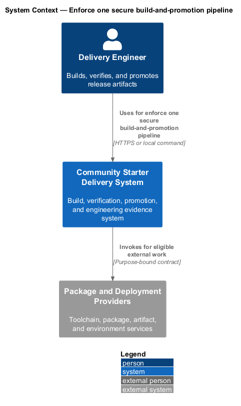
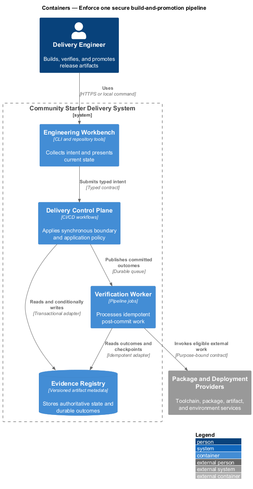
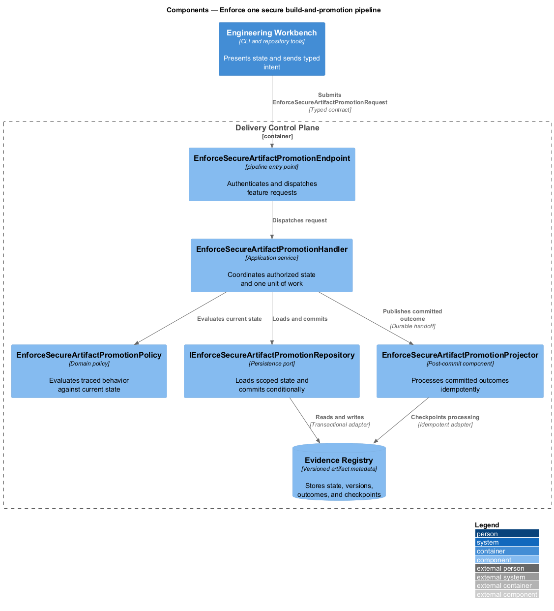
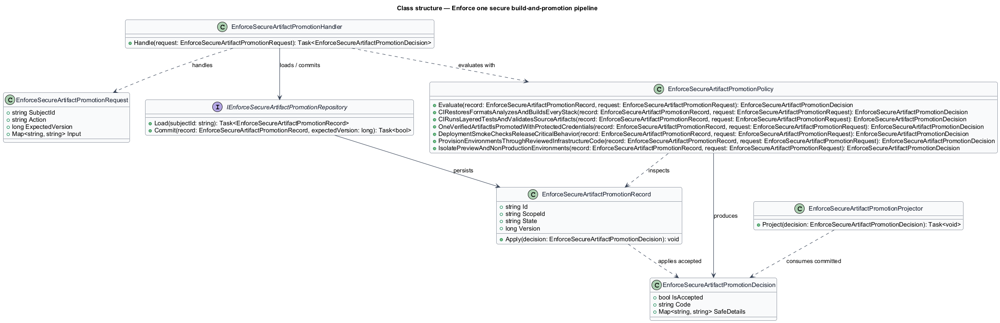
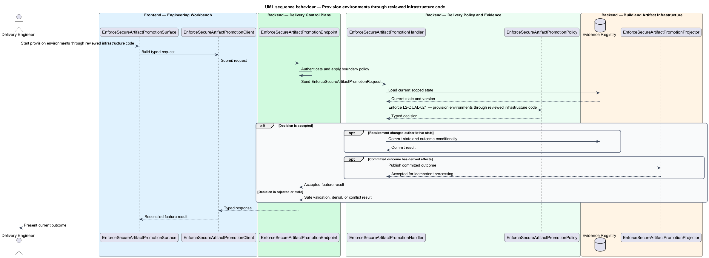
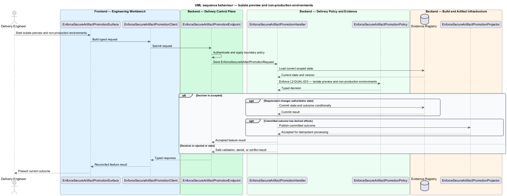

# Enforce one secure build-and-promotion pipeline

## Overview

Community Starter is a community platform divided into product and platform subsystems. The
Delivery, quality, and operations subsystem owns this feature.

*enforce one secure build-and-promotion pipeline* — subsystem capability that covers CI restores, formats, analyzes, and builds every stack, CI runs layered tests and validates source artifacts, one verified artifact is promoted with protected credentials, deployment smoke checks release-critical behavior, provision environments through reviewed infrastructure code, and isolate preview and non-production environments

The starter shall make production-scale community behavior reproducible, falsifiable, deployable, and supportable. Quality evidence shall match the risk being claimed: an isolated test cannot prove a cross-stack journey, a development server cannot prove routing, and passing builds cannot substitute for operational, recovery, accessibility, privacy, security, or load review. Pull requests shall pass reproducible static, build, test, documentation, and security gates before one immutable artifact is promoted through protected environments and smoke-tested.

The feature groups 6 traced behaviors behind one policy and evidence
boundary: `L2-QUAL-012`, `L2-QUAL-013`, `L2-QUAL-014`, `L2-QUAL-015`, `L2-QUAL-021`, and `L2-QUAL-023`. Authoritative state commits before projections, delivery, or external work reports
success.

## Description

The repository contains specifications but no application implementation. This greenfield slice
defines the following building blocks across `Engineering Workbench`, `Delivery Control Plane`, the
application and domain layer, and infrastructure.

- **`EnforceSecureArtifactPromotionSurface`** — engineering command surface in `Engineering Workbench`. It presents current
  state, submits user intent, and reconciles the typed result.
- **`EnforceSecureArtifactPromotionClient`** — typed workflow adapter. It creates `EnforceSecureArtifactPromotionRequest` values and maps stable
  transport failures into feature results.
- **`EnforceSecureArtifactPromotionEndpoint`** — pipeline entry point in `Delivery Control Plane`. It authenticates the
  caller, applies boundary policy, and dispatches the request.
- **`EnforceSecureArtifactPromotionRequest`** — immutable request carrying `SubjectId`, `Action`, `ExpectedVersion`, and the
  scoped input needed by one traced behavior.
- **`EnforceSecureArtifactPromotionHandler`** — application service that loads authorized state through
  `IEnforceSecureArtifactPromotionRepository`, invokes `EnforceSecureArtifactPromotionPolicy`, and commits an accepted transition.
- **`EnforceSecureArtifactPromotionPolicy`** — domain policy that evaluates current state and returns a typed
  `EnforceSecureArtifactPromotionDecision` without performing external work.
- **`EnforceSecureArtifactPromotionRecord`** — authoritative record containing the feature state, scope, and concurrency
  version.
- **`IEnforceSecureArtifactPromotionRepository`** — persistence port that loads scoped state and commits one conditional
  unit of work.
- **`EnforceSecureArtifactPromotionProjector`** — idempotent post-commit component in `Verification Worker`. It updates
  eligible projections and invokes configured external providers.

`EnforceSecureArtifactPromotionPolicy` exposes one named operation for each traced behavior:

- **`EnforceSecureArtifactPromotionPolicy.CIRestoresFormatsAnalyzesAndBuildsEveryStack(record, request)`** — evaluates `L2-QUAL-012` (CI restores, formats, analyzes, and builds every stack) and returns a typed decision before any state change.
- **`EnforceSecureArtifactPromotionPolicy.CIRunsLayeredTestsAndValidatesSourceArtifacts(record, request)`** — evaluates `L2-QUAL-013` (CI runs layered tests and validates source artifacts) and returns a typed decision before any state change.
- **`EnforceSecureArtifactPromotionPolicy.OneVerifiedArtifactIsPromotedWithProtectedCredentials(record, request)`** — evaluates `L2-QUAL-014` (one verified artifact is promoted with protected credentials) and returns a typed decision before any state change.
- **`EnforceSecureArtifactPromotionPolicy.DeploymentSmokeChecksReleaseCriticalBehavior(record, request)`** — evaluates `L2-QUAL-015` (deployment smoke checks release-critical behavior) and returns a typed decision before any state change.
- **`EnforceSecureArtifactPromotionPolicy.ProvisionEnvironmentsThroughReviewedInfrastructureCode(record, request)`** — evaluates `L2-QUAL-021` (provision environments through reviewed infrastructure code) and returns a typed decision before any state change.
- **`EnforceSecureArtifactPromotionPolicy.IsolatePreviewAndNonProductionEnvironments(record, request)`** — evaluates `L2-QUAL-023` (isolate preview and non-production environments) and returns a typed decision before any state change.

## Requirements

The feature realizes the following level-2 (L2) requirements. Each row preserves the specification
identifier, its level-1 (L1) parent, and the requirement statement verbatim.

| L2 ID | Refines (L1) | Requirement |
|-------|--------------|-------------|
| `L2-QUAL-012` | `L1-QUAL-004` | Every pull request pipeline shall restore from committed lockfiles and pinned SDKs, run format/lint/analyzer checks, and build backend and frontend with the documented warnings policy enforced. CI shall execute the same canonical commands as local development and shall fail on formatting drift, analyzer violations, type/template errors, warnings covered by policy, lockfile drift, or build failure. |
| `L2-QUAL-013` | `L1-QUAL-004` | CI shall run unit, application, component, integration, contract, and deterministic browser suites required by scope; validate documentation links and required generated artifacts; and scan dependencies and source for vulnerabilities and secrets. Jobs shall preserve trustworthy exit codes and useful diagnostics. Failures shall block merge or artifact publication except through an explicit authorized exception process. |
| `L2-QUAL-014` | `L1-QUAL-004` | The pipeline shall publish deployable artifacts once after required gates and promote the same immutable artifact through environments. Deployment shall run only from protected branches/environments using OIDC or equivalent short-lived scoped credentials. Untrusted pull requests shall have no production credentials. Environments intentionally lacking configuration shall skip or stop deployment explicitly rather than weaken build and test behavior. |
| `L2-QUAL-015` | `L1-QUAL-004` | After deployment and before promotion completion, automated smoke tests shall verify process health and dependency readiness where distinguished, root marketing ownership, refreshed application deep links, critical API behavior, authentication entry, realtime endpoint routing where used, static assets and metadata, cache/security headers, and migration readiness. A failed release-critical smoke shall stop promotion and invoke documented rollback or forward-fix handling. |
| `L2-QUAL-021` | `L1-QUAL-004` | Development, staging, and production infrastructure shall be declared under `infra/` through a reviewable, repeatable infrastructure-as-code workflow covering network boundaries, compute, relational data, object storage, DNS and TLS, workload identities, secrets references, telemetry, backups, and configured optional services. Manual emergency changes require capture and drift repair. |
| `L2-QUAL-023` | `L1-QUAL-004` | Preview, development, test, and staging environments shall use distinct least-privilege identities, data, secrets, domains, callbacks, delivery destinations, analytics, and access policy. They shall not receive production credentials or unapproved production personal data, and publicly reachable ephemeral environments shall have authentication, expiry, ownership, cleanup, and indexing controls. |

## Diagrams

### System context

The `Delivery Engineer` uses `Community Starter Delivery System` for the feature. The system invokes
`Package and Deployment Providers` only for configured external work after authoritative decisions.

### Containers

`Engineering Workbench` collects intent, `Delivery Control Plane` applies the synchronous boundary,
and `Evidence Registry` holds authoritative state. `Verification Worker` handles eligible
post-commit work against `Package and Deployment Providers`.

### Components

Inside `Delivery Control Plane`, `EnforceSecureArtifactPromotionEndpoint` dispatches `EnforceSecureArtifactPromotionHandler`. The handler evaluates
`EnforceSecureArtifactPromotionPolicy`, persists through `IEnforceSecureArtifactPromotionRepository`, and hands committed outcomes to
`EnforceSecureArtifactPromotionProjector`.

### Class structure

`EnforceSecureArtifactPromotionHandler` depends on the immutable request, domain policy, and repository port.
`EnforceSecureArtifactPromotionRecord` owns versioned state, while `EnforceSecureArtifactPromotionProjector` consumes committed results.

### Behaviour — CI restores, formats, analyzes, and builds every stack

The interaction loads current scoped state before `EnforceSecureArtifactPromotionPolicy` enforces
`L2-QUAL-012`. Rejected decisions return without changing authoritative state; accepted
state changes commit before optional derived work starts.

### Behaviour — CI runs layered tests and validates source artifacts

The interaction loads current scoped state before `EnforceSecureArtifactPromotionPolicy` enforces
`L2-QUAL-013`. Rejected decisions return without changing authoritative state; accepted
state changes commit before optional derived work starts.

### Behaviour — one verified artifact is promoted with protected credentials

The interaction loads current scoped state before `EnforceSecureArtifactPromotionPolicy` enforces
`L2-QUAL-014`. Rejected decisions return without changing authoritative state; accepted
state changes commit before optional derived work starts.

### Behaviour — deployment smoke checks release-critical behavior

The interaction loads current scoped state before `EnforceSecureArtifactPromotionPolicy` enforces
`L2-QUAL-015`. Rejected decisions return without changing authoritative state; accepted
state changes commit before optional derived work starts.

### Behaviour — provision environments through reviewed infrastructure code

The interaction loads current scoped state before `EnforceSecureArtifactPromotionPolicy` enforces
`L2-QUAL-021`. Rejected decisions return without changing authoritative state; accepted
state changes commit before optional derived work starts.

### Behaviour — isolate preview and non-production environments

The interaction loads current scoped state before `EnforceSecureArtifactPromotionPolicy` enforces
`L2-QUAL-023`. Rejected decisions return without changing authoritative state; accepted
state changes commit before optional derived work starts.

