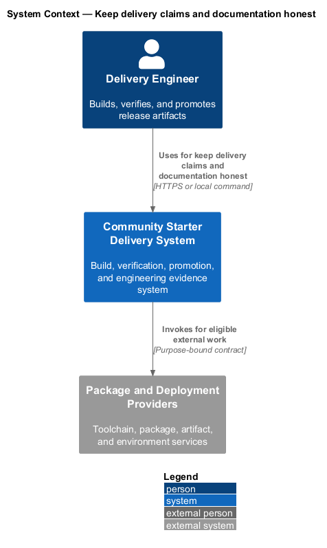
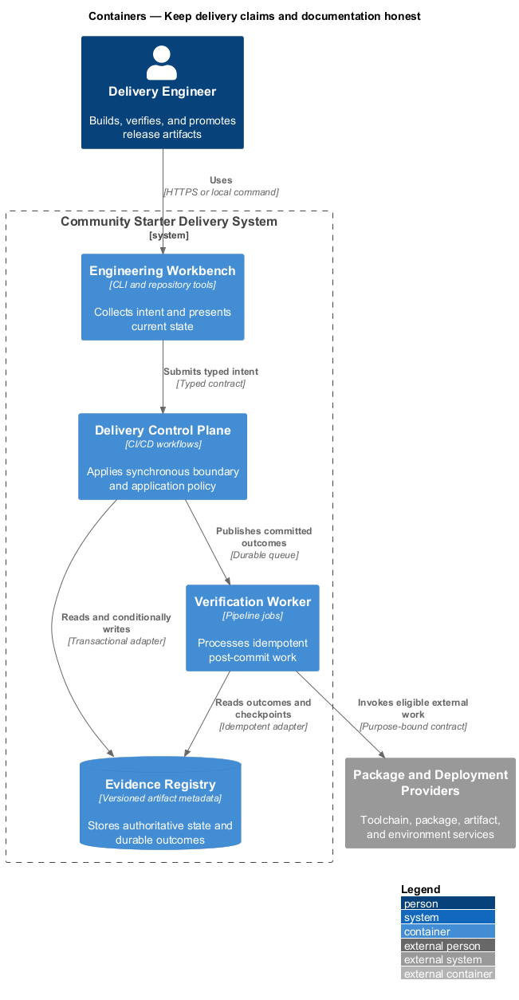
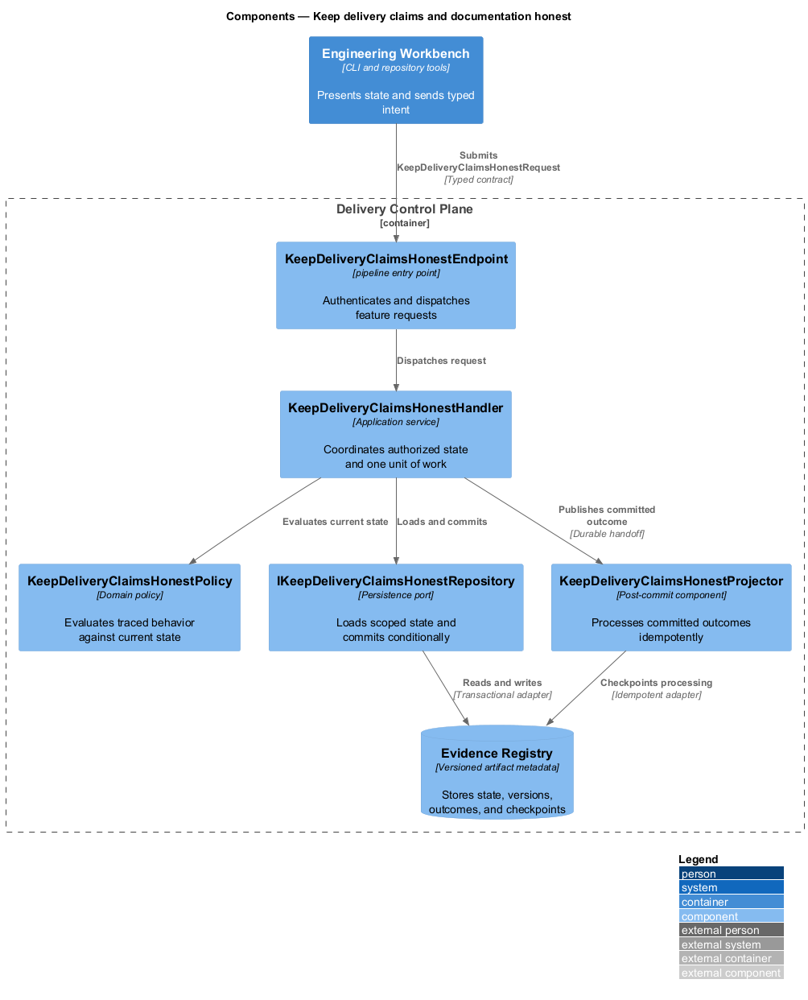
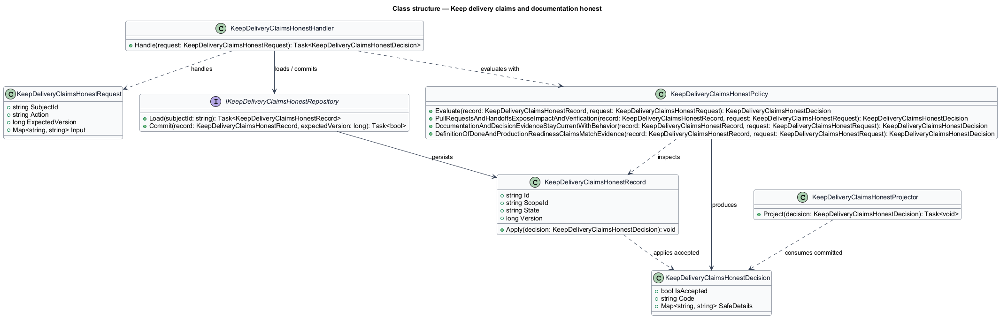
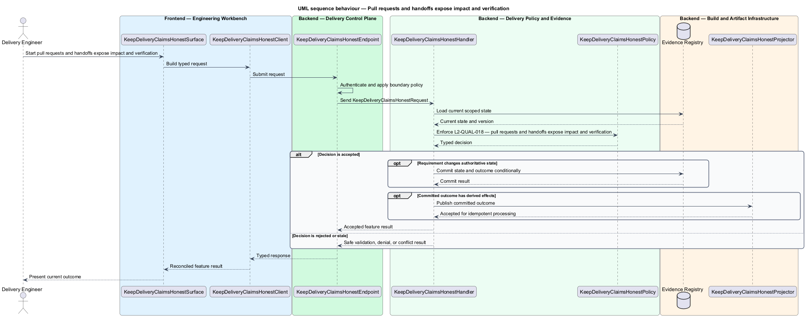
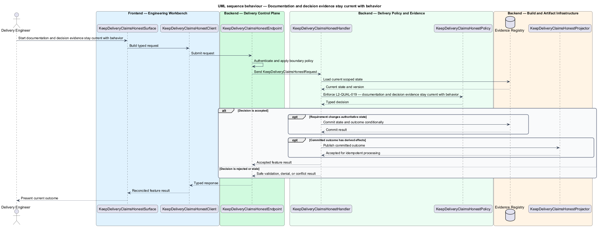
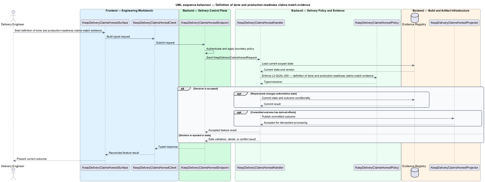

# Keep delivery claims and documentation honest

## Overview

Community Starter is a community platform divided into product and platform subsystems. The
Delivery, quality, and operations subsystem owns this feature.

*keep delivery claims and documentation honest* — subsystem capability that covers pull requests and handoffs expose impact and verification, documentation and decision evidence stay current with behavior, and definition of done and production-readiness claims match evidence

The starter shall make production-scale community behavior reproducible, falsifiable, deployable, and supportable. Quality evidence shall match the risk being claimed: an isolated test cannot prove a cross-stack journey, a development server cannot prove routing, and passing builds cannot substitute for operational, recovery, accessibility, privacy, security, or load review. Every pull request and release shall connect the user outcome to requirements, decisions, exact verification, visual evidence, rollback, current documentation, and plainly stated residual risk.

The feature groups 3 traced behaviors behind one policy and evidence
boundary: `L2-QUAL-018`, `L2-QUAL-019`, and `L2-QUAL-020`. Authoritative state commits before projections, delivery, or external work reports
success.

## Description

The repository contains specifications but no application implementation. This greenfield slice
defines the following building blocks across `Engineering Workbench`, `Delivery Control Plane`, the
application and domain layer, and infrastructure.

- **`KeepDeliveryClaimsHonestSurface`** — engineering command surface in `Engineering Workbench`. It presents current
  state, submits user intent, and reconciles the typed result.
- **`KeepDeliveryClaimsHonestClient`** — typed workflow adapter. It creates `KeepDeliveryClaimsHonestRequest` values and maps stable
  transport failures into feature results.
- **`KeepDeliveryClaimsHonestEndpoint`** — pipeline entry point in `Delivery Control Plane`. It authenticates the
  caller, applies boundary policy, and dispatches the request.
- **`KeepDeliveryClaimsHonestRequest`** — immutable request carrying `SubjectId`, `Action`, `ExpectedVersion`, and the
  scoped input needed by one traced behavior.
- **`KeepDeliveryClaimsHonestHandler`** — application service that loads authorized state through
  `IKeepDeliveryClaimsHonestRepository`, invokes `KeepDeliveryClaimsHonestPolicy`, and commits an accepted transition.
- **`KeepDeliveryClaimsHonestPolicy`** — domain policy that evaluates current state and returns a typed
  `KeepDeliveryClaimsHonestDecision` without performing external work.
- **`KeepDeliveryClaimsHonestRecord`** — authoritative record containing the feature state, scope, and concurrency
  version.
- **`IKeepDeliveryClaimsHonestRepository`** — persistence port that loads scoped state and commits one conditional
  unit of work.
- **`KeepDeliveryClaimsHonestProjector`** — idempotent post-commit component in `Verification Worker`. It updates
  eligible projections and invokes configured external providers.

`KeepDeliveryClaimsHonestPolicy` exposes one named operation for each traced behavior:

- **`KeepDeliveryClaimsHonestPolicy.PullRequestsAndHandoffsExposeImpactAndVerification(record, request)`** — evaluates `L2-QUAL-018` (pull requests and handoffs expose impact and verification) and returns a typed decision before any state change.
- **`KeepDeliveryClaimsHonestPolicy.DocumentationAndDecisionEvidenceStayCurrentWithBehavior(record, request)`** — evaluates `L2-QUAL-019` (documentation and decision evidence stay current with behavior) and returns a typed decision before any state change.
- **`KeepDeliveryClaimsHonestPolicy.DefinitionOfDoneAndProductionReadinessClaimsMatchEvidence(record, request)`** — evaluates `L2-QUAL-020` (definition of done and production-readiness claims match evidence) and returns a typed decision before any state change.

## Requirements

The feature realizes the following level-2 (L2) requirements. Each row preserves the specification
identifier, its level-1 (L1) parent, and the requirement statement verbatim.

| L2 ID | Refines (L1) | Requirement |
|-------|--------------|-------------|
| `L2-QUAL-018` | `L1-QUAL-006` | Every pull request and handoff shall state the user problem and resulting behavior, requirement or issue links, architecture/data/security/deployment impact, exact verification commands and results, screenshots for meaningful UI changes, known risks, follow-up triggers, and rollback notes where applicable. Review shall check server-authoritative rules, migrations, absence of secrets/real data, documentation/changelog updates, focused diff, and green relevant gates. |
| `L2-QUAL-019` | `L1-QUAL-006` | The same change that alters behavior, commands, configuration, architecture, data, deployment, or user-visible flows shall update affected documentation. Reviews shall inspect root setup/commands/project map, architecture diagrams, requirement status and coverage, ADR consequences, deployment and support runbooks, security notes, and changelog. Broken links, invalid commands, and stale implemented labels are defects. |
| `L2-QUAL-020` | `L1-QUAL-006` | A change is done only when its requested user outcome and material failures work, the server owns affected invariants, accepted design-system behavior is implemented, appropriately traced tests pass, builds/static checks pass, accessibility/security/data/deployment effects are addressed, documentation/specs/decisions/changelog are current, the diff is focused, and handoff reports verification and genuine remaining risk. Production-readiness language shall separately state the status of independent security, privacy, accessibility, recovery, load, and operational review; demos and vertical slices shall be labeled honestly. |

## Diagrams

### System context

The `Delivery Engineer` uses `Community Starter Delivery System` for the feature. The system invokes
`Package and Deployment Providers` only for configured external work after authoritative decisions.

### Containers

`Engineering Workbench` collects intent, `Delivery Control Plane` applies the synchronous boundary,
and `Evidence Registry` holds authoritative state. `Verification Worker` handles eligible
post-commit work against `Package and Deployment Providers`.

### Components

Inside `Delivery Control Plane`, `KeepDeliveryClaimsHonestEndpoint` dispatches `KeepDeliveryClaimsHonestHandler`. The handler evaluates
`KeepDeliveryClaimsHonestPolicy`, persists through `IKeepDeliveryClaimsHonestRepository`, and hands committed outcomes to
`KeepDeliveryClaimsHonestProjector`.

### Class structure

`KeepDeliveryClaimsHonestHandler` depends on the immutable request, domain policy, and repository port.
`KeepDeliveryClaimsHonestRecord` owns versioned state, while `KeepDeliveryClaimsHonestProjector` consumes committed results.

### Behaviour — pull requests and handoffs expose impact and verification

The interaction loads current scoped state before `KeepDeliveryClaimsHonestPolicy` enforces
`L2-QUAL-018`. Rejected decisions return without changing authoritative state; accepted
state changes commit before optional derived work starts.

### Behaviour — documentation and decision evidence stay current with behavior

The interaction loads current scoped state before `KeepDeliveryClaimsHonestPolicy` enforces
`L2-QUAL-019`. Rejected decisions return without changing authoritative state; accepted
state changes commit before optional derived work starts.

### Behaviour — definition of done and production-readiness claims match evidence

The interaction loads current scoped state before `KeepDeliveryClaimsHonestPolicy` enforces
`L2-QUAL-020`. Rejected decisions return without changing authoritative state; accepted
state changes commit before optional derived work starts.

