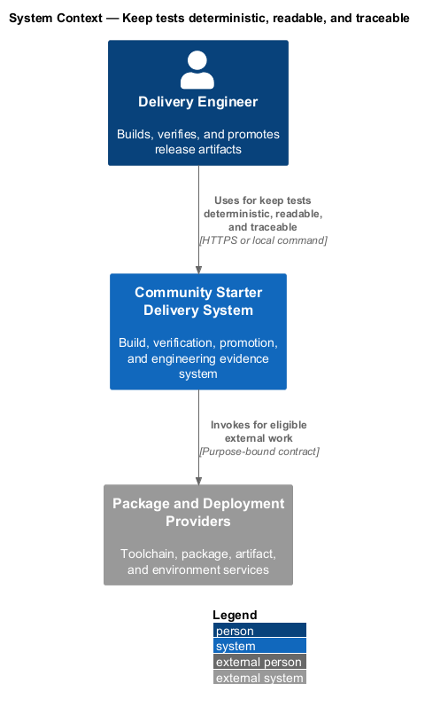
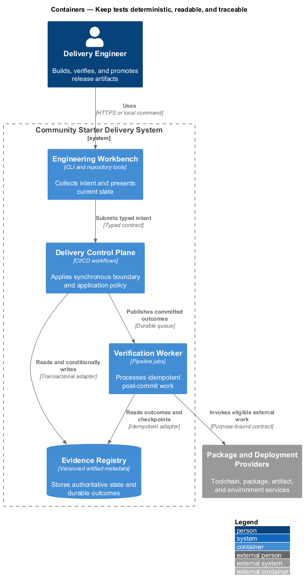
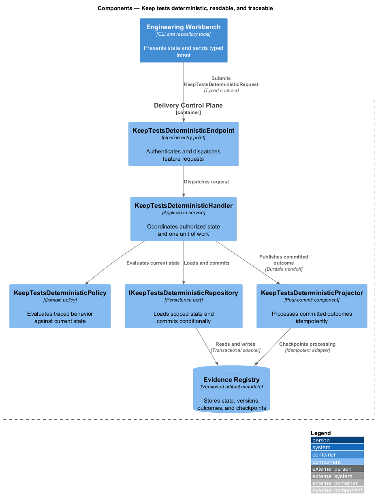
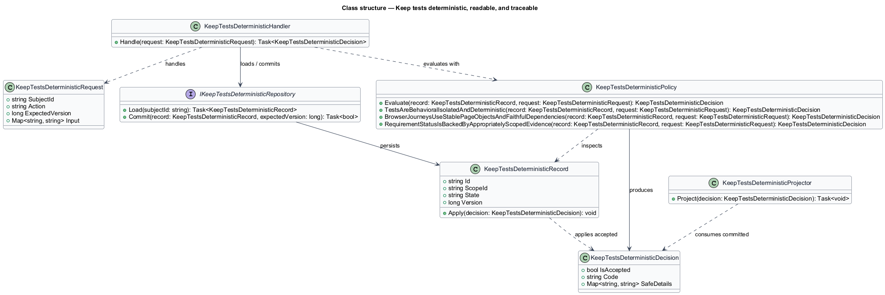
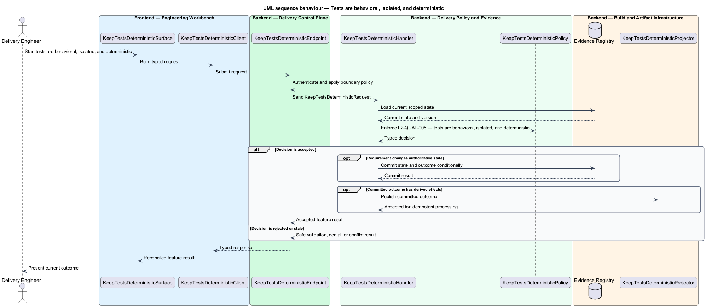
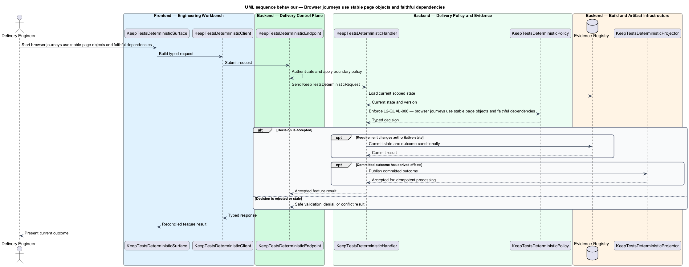
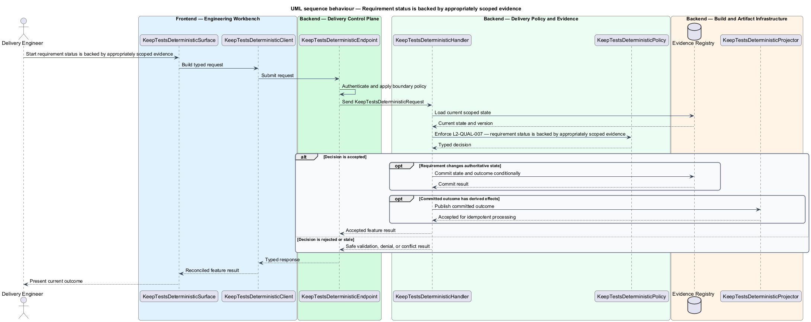

# Keep tests deterministic, readable, and traceable

## Overview

Community Starter is a community platform divided into product and platform subsystems. The
Delivery, quality, and operations subsystem owns this feature.

*keep tests deterministic, readable, and traceable* — subsystem capability that covers tests are behavioral, isolated, and deterministic, browser journeys use stable page objects and faithful dependencies, and requirement status is backed by appropriately scoped evidence

The starter shall make production-scale community behavior reproducible, falsifiable, deployable, and supportable. Quality evidence shall match the risk being claimed: an isolated test cannot prove a cross-stack journey, a development server cannot prove routing, and passing builds cannot substitute for operational, recovery, accessibility, privacy, security, or load review. Tests shall fail for one observable behavioral reason, use controlled time and external seams, locate UI by user-facing semantics, and trace acceptance evidence to stable requirement identifiers.

The feature groups 3 traced behaviors behind one policy and evidence
boundary: `L2-QUAL-005`, `L2-QUAL-006`, and `L2-QUAL-007`. Authoritative state commits before projections, delivery, or external work reports
success.

## Description

The repository contains specifications but no application implementation. This greenfield slice
defines the following building blocks across `Engineering Workbench`, `Delivery Control Plane`, the
application and domain layer, and infrastructure.

- **`KeepTestsDeterministicSurface`** — engineering command surface in `Engineering Workbench`. It presents current
  state, submits user intent, and reconciles the typed result.
- **`KeepTestsDeterministicClient`** — typed workflow adapter. It creates `KeepTestsDeterministicRequest` values and maps stable
  transport failures into feature results.
- **`KeepTestsDeterministicEndpoint`** — pipeline entry point in `Delivery Control Plane`. It authenticates the
  caller, applies boundary policy, and dispatches the request.
- **`KeepTestsDeterministicRequest`** — immutable request carrying `SubjectId`, `Action`, `ExpectedVersion`, and the
  scoped input needed by one traced behavior.
- **`KeepTestsDeterministicHandler`** — application service that loads authorized state through
  `IKeepTestsDeterministicRepository`, invokes `KeepTestsDeterministicPolicy`, and commits an accepted transition.
- **`KeepTestsDeterministicPolicy`** — domain policy that evaluates current state and returns a typed
  `KeepTestsDeterministicDecision` without performing external work.
- **`KeepTestsDeterministicRecord`** — authoritative record containing the feature state, scope, and concurrency
  version.
- **`IKeepTestsDeterministicRepository`** — persistence port that loads scoped state and commits one conditional
  unit of work.
- **`KeepTestsDeterministicProjector`** — idempotent post-commit component in `Verification Worker`. It updates
  eligible projections and invokes configured external providers.

`KeepTestsDeterministicPolicy` exposes one named operation for each traced behavior:

- **`KeepTestsDeterministicPolicy.TestsAreBehavioralIsolatedAndDeterministic(record, request)`** — evaluates `L2-QUAL-005` (tests are behavioral, isolated, and deterministic) and returns a typed decision before any state change.
- **`KeepTestsDeterministicPolicy.BrowserJourneysUseStablePageObjectsAndFaithfulDependencies(record, request)`** — evaluates `L2-QUAL-006` (browser journeys use stable page objects and faithful dependencies) and returns a typed decision before any state change.
- **`KeepTestsDeterministicPolicy.RequirementStatusIsBackedByAppropriatelyScopedEvidence(record, request)`** — evaluates `L2-QUAL-007` (requirement status is backed by appropriately scoped evidence) and returns a typed decision before any state change.

## Requirements

The feature realizes the following level-2 (L2) requirements. Each row preserves the specification
identifier, its level-1 (L1) parent, and the requirement statement verbatim.

| L2 ID | Refines (L1) | Requirement |
|-------|--------------|-------------|
| `L2-QUAL-005` | `L1-QUAL-002` | Tests shall be named for observable behavior and expected outcome, use Arrange/Act/Assert or Given/When/Then consistently, and have one behavioral reason to fail. Valid domain state shall use small builders or fixtures rather than mocks that erase product meaning. Clocks, identifiers, external services, and startup readiness shall be deterministic at defined seams. Tests shall not depend on order, a developer's seeded state, arbitrary sleeps, or arbitrary timeouts. |
| `L2-QUAL-006` | `L1-QUAL-002` | Playwright specifications shall be organized around member outcomes and use capability-oriented page objects. Locators shall prefer roles, labels, and visible names; test IDs shall be reserved for cases without stable semantics. A fake backend may improve speed and determinism, but it shall implement the documented API and failure contracts, be maintained as a test dependency, and never serve as the sole evidence for critical server behavior. |
| `L2-QUAL-007` | `L1-QUAL-002` | Acceptance and integration tests that prove a named behavior shall carry a `Traces to: L2-...` reference. `docs/specs/README.md` shall maintain a lightweight coverage table linking each requirement to current evidence and status. Evidence shall not be overstated: prose, mocks, acceptance criteria, focused tests, live journeys, and production telemetry prove progressively different scopes. |

## Diagrams

### System context

The `Delivery Engineer` uses `Community Starter Delivery System` for the feature. The system invokes
`Package and Deployment Providers` only for configured external work after authoritative decisions.

### Containers

`Engineering Workbench` collects intent, `Delivery Control Plane` applies the synchronous boundary,
and `Evidence Registry` holds authoritative state. `Verification Worker` handles eligible
post-commit work against `Package and Deployment Providers`.

### Components

Inside `Delivery Control Plane`, `KeepTestsDeterministicEndpoint` dispatches `KeepTestsDeterministicHandler`. The handler evaluates
`KeepTestsDeterministicPolicy`, persists through `IKeepTestsDeterministicRepository`, and hands committed outcomes to
`KeepTestsDeterministicProjector`.

### Class structure

`KeepTestsDeterministicHandler` depends on the immutable request, domain policy, and repository port.
`KeepTestsDeterministicRecord` owns versioned state, while `KeepTestsDeterministicProjector` consumes committed results.

### Behaviour — tests are behavioral, isolated, and deterministic

The interaction loads current scoped state before `KeepTestsDeterministicPolicy` enforces
`L2-QUAL-005`. Rejected decisions return without changing authoritative state; accepted
state changes commit before optional derived work starts.

### Behaviour — browser journeys use stable page objects and faithful dependencies

The interaction loads current scoped state before `KeepTestsDeterministicPolicy` enforces
`L2-QUAL-006`. Rejected decisions return without changing authoritative state; accepted
state changes commit before optional derived work starts.

### Behaviour — requirement status is backed by appropriately scoped evidence

The interaction loads current scoped state before `KeepTestsDeterministicPolicy` enforces
`L2-QUAL-007`. Rejected decisions return without changing authoritative state; accepted
state changes commit before optional derived work starts.

