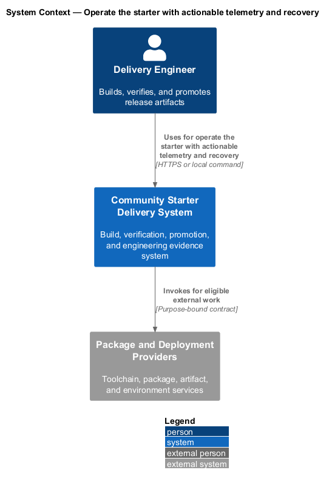
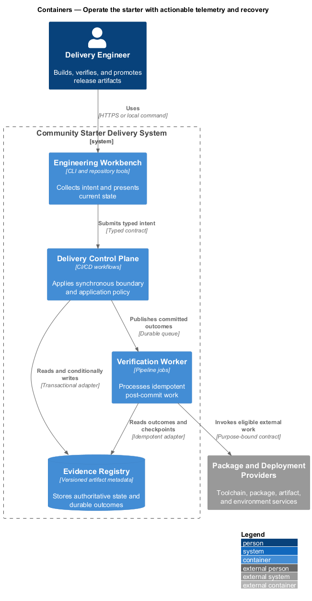
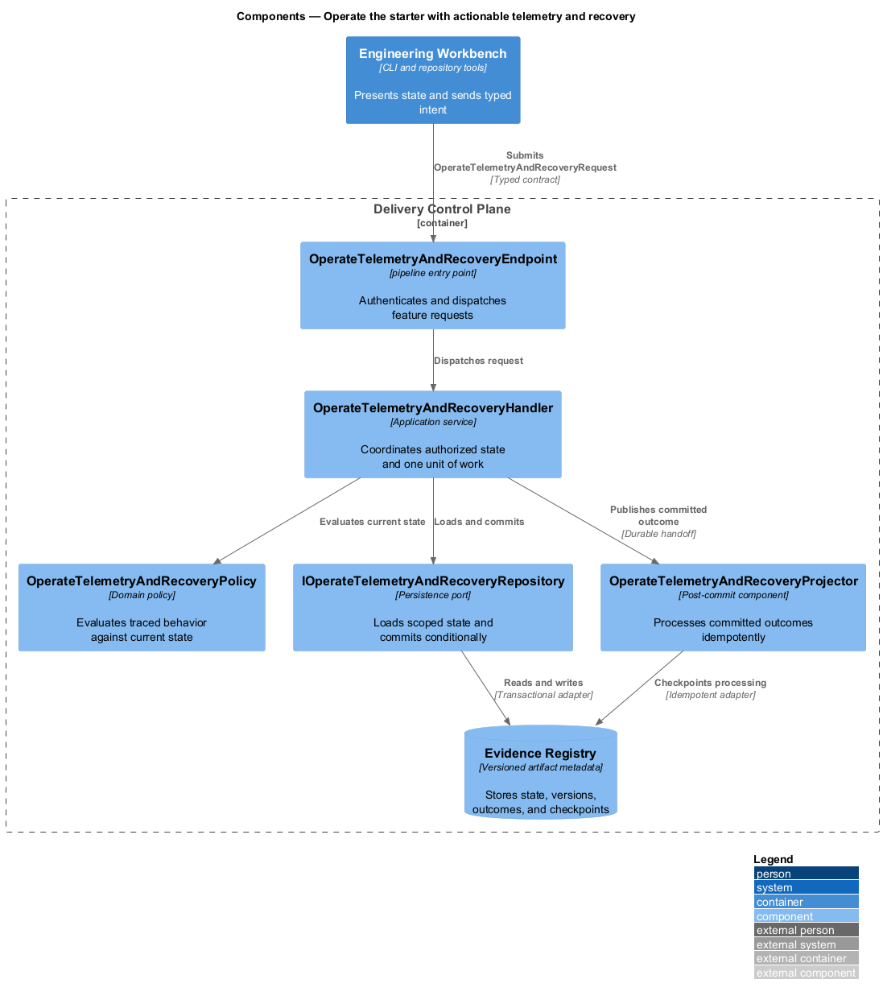
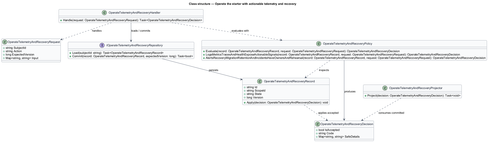
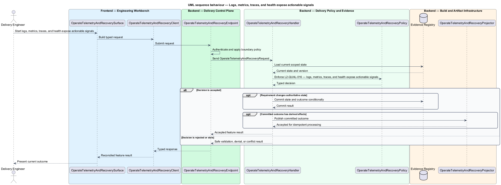
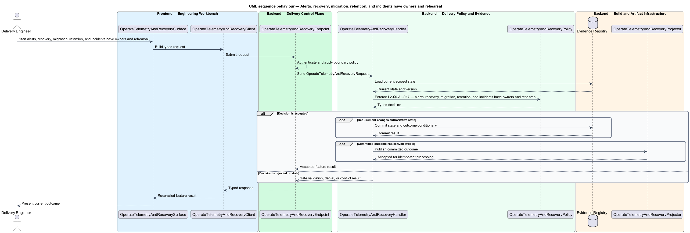

# Operate the starter with actionable telemetry and recovery

## Overview

Community Starter is a community platform divided into product and platform subsystems. The
Delivery, quality, and operations subsystem owns this feature.

*operate the starter with actionable telemetry and recovery* — subsystem capability that covers logs, metrics, traces, and health expose actionable signals and alerts, recovery, migration, retention, and incidents have owners and rehearsal

The starter shall make production-scale community behavior reproducible, falsifiable, deployable, and supportable. Quality evidence shall match the risk being claimed: an isolated test cannot prove a cross-stack journey, a development server cannot prove routing, and passing builds cannot substitute for operational, recovery, accessibility, privacy, security, or load review. Structured telemetry, health, alerts, backups, migrations, retention, incident response, and support ownership shall exist before the starter is described as production-ready.

The feature groups 2 traced behaviors behind one policy and evidence
boundary: `L2-QUAL-016` and `L2-QUAL-017`. Authoritative state commits before projections, delivery, or external work reports
success.

## Description

The repository contains specifications but no application implementation. This greenfield slice
defines the following building blocks across `Engineering Workbench`, `Delivery Control Plane`, the
application and domain layer, and infrastructure.

- **`OperateTelemetryAndRecoverySurface`** — engineering command surface in `Engineering Workbench`. It presents current
  state, submits user intent, and reconciles the typed result.
- **`OperateTelemetryAndRecoveryClient`** — typed workflow adapter. It creates `OperateTelemetryAndRecoveryRequest` values and maps stable
  transport failures into feature results.
- **`OperateTelemetryAndRecoveryEndpoint`** — pipeline entry point in `Delivery Control Plane`. It authenticates the
  caller, applies boundary policy, and dispatches the request.
- **`OperateTelemetryAndRecoveryRequest`** — immutable request carrying `SubjectId`, `Action`, `ExpectedVersion`, and the
  scoped input needed by one traced behavior.
- **`OperateTelemetryAndRecoveryHandler`** — application service that loads authorized state through
  `IOperateTelemetryAndRecoveryRepository`, invokes `OperateTelemetryAndRecoveryPolicy`, and commits an accepted transition.
- **`OperateTelemetryAndRecoveryPolicy`** — domain policy that evaluates current state and returns a typed
  `OperateTelemetryAndRecoveryDecision` without performing external work.
- **`OperateTelemetryAndRecoveryRecord`** — authoritative record containing the feature state, scope, and concurrency
  version.
- **`IOperateTelemetryAndRecoveryRepository`** — persistence port that loads scoped state and commits one conditional
  unit of work.
- **`OperateTelemetryAndRecoveryProjector`** — idempotent post-commit component in `Verification Worker`. It updates
  eligible projections and invokes configured external providers.

`OperateTelemetryAndRecoveryPolicy` exposes one named operation for each traced behavior:

- **`OperateTelemetryAndRecoveryPolicy.LogsMetricsTracesAndHealthExposeActionableSignals(record, request)`** — evaluates `L2-QUAL-016` (logs, metrics, traces, and health expose actionable signals) and returns a typed decision before any state change.
- **`OperateTelemetryAndRecoveryPolicy.AlertsRecoveryMigrationRetentionAndIncidentsHaveOwnersAndRehearsal(record, request)`** — evaluates `L2-QUAL-017` (alerts, recovery, migration, retention, and incidents have owners and rehearsal) and returns a typed decision before any state change.

## Requirements

The feature realizes the following level-2 (L2) requirements. Each row preserves the specification
identifier, its level-1 (L1) parent, and the requirement statement verbatim.

| L2 ID | Refines (L1) | Requirement |
|-------|--------------|-------------|
| `L2-QUAL-016` | `L1-QUAL-005` | Production telemetry shall use structured logs with correlation/request identifiers and stable event names while excluding sensitive payloads. Metrics shall cover latency, failures, saturation, and product-defining community transitions. Health shall distinguish process liveness from dependency readiness when useful. External calls and background work shall propagate trace context across boundaries. Product analytics shall be emitted only for declared questions under privacy/consent policy. |
| `L2-QUAL-017` | `L1-QUAL-005` | Before production launch, the project shall define alert conditions and ownership, backup and restore procedures, migration rollback or forward-fix strategy, data retention/deletion behavior, and incident/support paths. Recovery and migration procedures shall be rehearsed with recorded results, objectives, dependencies, and follow-up. Runbooks shall identify decision authority, communication, verification of restored service/data, and escalation. |

## Diagrams

### System context

The `Delivery Engineer` uses `Community Starter Delivery System` for the feature. The system invokes
`Package and Deployment Providers` only for configured external work after authoritative decisions.

### Containers

`Engineering Workbench` collects intent, `Delivery Control Plane` applies the synchronous boundary,
and `Evidence Registry` holds authoritative state. `Verification Worker` handles eligible
post-commit work against `Package and Deployment Providers`.

### Components

Inside `Delivery Control Plane`, `OperateTelemetryAndRecoveryEndpoint` dispatches `OperateTelemetryAndRecoveryHandler`. The handler evaluates
`OperateTelemetryAndRecoveryPolicy`, persists through `IOperateTelemetryAndRecoveryRepository`, and hands committed outcomes to
`OperateTelemetryAndRecoveryProjector`.

### Class structure

`OperateTelemetryAndRecoveryHandler` depends on the immutable request, domain policy, and repository port.
`OperateTelemetryAndRecoveryRecord` owns versioned state, while `OperateTelemetryAndRecoveryProjector` consumes committed results.

### Behaviour — logs, metrics, traces, and health expose actionable signals

The interaction loads current scoped state before `OperateTelemetryAndRecoveryPolicy` enforces
`L2-QUAL-016`. Rejected decisions return without changing authoritative state; accepted
state changes commit before optional derived work starts.

### Behaviour — alerts, recovery, migration, retention, and incidents have owners and rehearsal

The interaction loads current scoped state before `OperateTelemetryAndRecoveryPolicy` enforces
`L2-QUAL-017`. Rejected decisions return without changing authoritative state; accepted
state changes commit before optional derived work starts.

