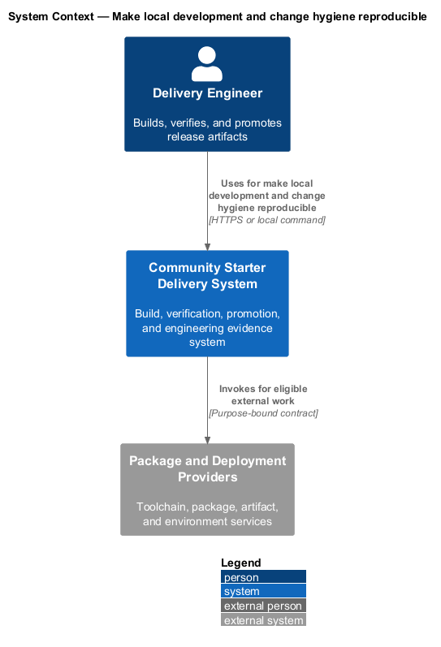
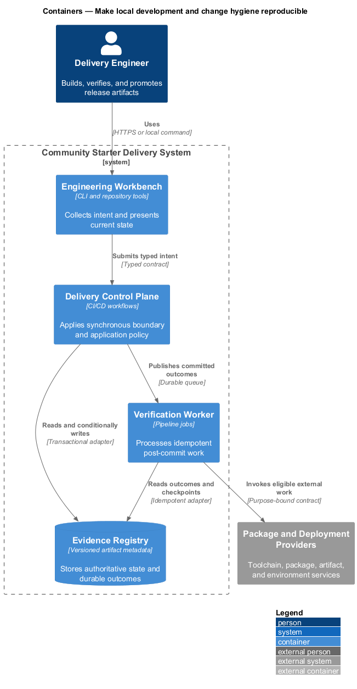
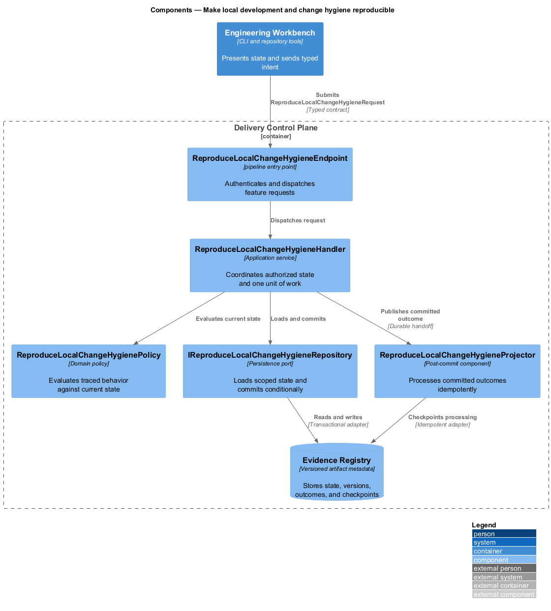
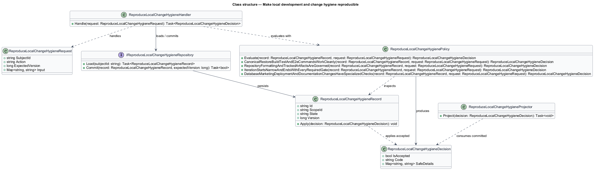
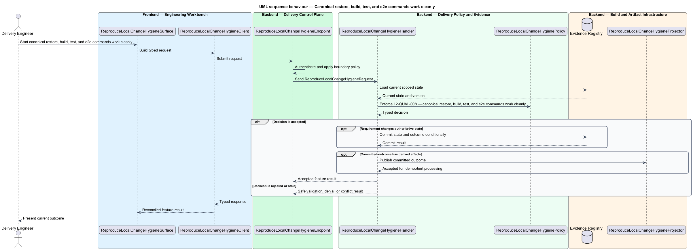
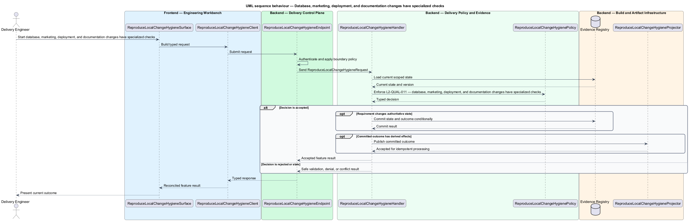

# Make local development and change hygiene reproducible

## Overview

Community Starter is a community platform divided into product and platform subsystems. The
Delivery, quality, and operations subsystem owns this feature.

*make local development and change hygiene reproducible* — subsystem capability that covers canonical restore, build, test, and e2e commands work cleanly, repository formatting and tracked artifacts are governed, iteration starts narrow and ends with every required gate, and database, marketing, deployment, and documentation changes have specialized checks

The starter shall make production-scale community behavior reproducible, falsifiable, deployable, and supportable. Quality evidence shall match the risk being claimed: an isolated test cannot prove a cross-stack journey, a development server cannot prove routing, and passing builds cannot substitute for operational, recovery, accessibility, privacy, security, or load review. Pinned tools, canonical commands, automated formatting/analyzers, source-control hygiene, and change-specific verification shall make results repeatable from a clean checkout and focused during iteration.

The feature groups 4 traced behaviors behind one policy and evidence
boundary: `L2-QUAL-008`, `L2-QUAL-009`, `L2-QUAL-010`, and `L2-QUAL-011`. Authoritative state commits before projections, delivery, or external work reports
success.

## Description

The repository contains specifications but no application implementation. This greenfield slice
defines the following building blocks across `Engineering Workbench`, `Delivery Control Plane`, the
application and domain layer, and infrastructure.

- **`ReproduceLocalChangeHygieneSurface`** — engineering command surface in `Engineering Workbench`. It presents current
  state, submits user intent, and reconciles the typed result.
- **`ReproduceLocalChangeHygieneClient`** — typed workflow adapter. It creates `ReproduceLocalChangeHygieneRequest` values and maps stable
  transport failures into feature results.
- **`ReproduceLocalChangeHygieneEndpoint`** — pipeline entry point in `Delivery Control Plane`. It authenticates the
  caller, applies boundary policy, and dispatches the request.
- **`ReproduceLocalChangeHygieneRequest`** — immutable request carrying `SubjectId`, `Action`, `ExpectedVersion`, and the
  scoped input needed by one traced behavior.
- **`ReproduceLocalChangeHygieneHandler`** — application service that loads authorized state through
  `IReproduceLocalChangeHygieneRepository`, invokes `ReproduceLocalChangeHygienePolicy`, and commits an accepted transition.
- **`ReproduceLocalChangeHygienePolicy`** — domain policy that evaluates current state and returns a typed
  `ReproduceLocalChangeHygieneDecision` without performing external work.
- **`ReproduceLocalChangeHygieneRecord`** — authoritative record containing the feature state, scope, and concurrency
  version.
- **`IReproduceLocalChangeHygieneRepository`** — persistence port that loads scoped state and commits one conditional
  unit of work.
- **`ReproduceLocalChangeHygieneProjector`** — idempotent post-commit component in `Verification Worker`. It updates
  eligible projections and invokes configured external providers.

`ReproduceLocalChangeHygienePolicy` exposes one named operation for each traced behavior:

- **`ReproduceLocalChangeHygienePolicy.CanonicalRestoreBuildTestAndE2eCommandsWorkCleanly(record, request)`** — evaluates `L2-QUAL-008` (canonical restore, build, test, and e2e commands work cleanly) and returns a typed decision before any state change.
- **`ReproduceLocalChangeHygienePolicy.RepositoryFormattingAndTrackedArtifactsAreGoverned(record, request)`** — evaluates `L2-QUAL-009` (repository formatting and tracked artifacts are governed) and returns a typed decision before any state change.
- **`ReproduceLocalChangeHygienePolicy.IterationStartsNarrowAndEndsWithEveryRequiredGate(record, request)`** — evaluates `L2-QUAL-010` (iteration starts narrow and ends with every required gate) and returns a typed decision before any state change.
- **`ReproduceLocalChangeHygienePolicy.DatabaseMarketingDeploymentAndDocumentationChangesHaveSpecializedChecks(record, request)`** — evaluates `L2-QUAL-011` (database, marketing, deployment, and documentation changes have specialized checks) and returns a typed decision before any state change.

## Requirements

The feature realizes the following level-2 (L2) requirements. Each row preserves the specification
identifier, its level-1 (L1) parent, and the requirement statement verbatim.

| L2 ID | Refines (L1) | Requirement |
|-------|--------------|-------------|
| `L2-QUAL-008` | `L1-QUAL-003` | The root README shall expose canonical commands that restore, build, and test the backend solution and install, build, unit-test, and end-to-end-test the frontend. Automation shall use pinned SDK/package-manager inputs and `npm ci`, not `npm install`. Optional `eng/` wrappers shall preserve clear exit codes, run the same underlying commands locally and in CI, and require no undocumented developer state. |
| `L2-QUAL-009` | `L1-QUAL-003` | Tracked text shall use UTF-8, final newline, no trailing whitespace, and LF except Windows-only scripts when required. JSON, YAML, HTML, SCSS, TypeScript, and Markdown structure shall use two spaces; C# shall use four. Root and stack-specific `.editorconfig`, frontend Prettier, and build-enforced .NET analyzers shall match CI. Lockfiles, pinned SDK files, migrations, required deterministic contracts, and intentionally distributed documents shall be tracked; build output, local databases, coverage, test-runner screenshots/results, IDE state, secrets, credentials, and real personal data shall not. Changes shall not reformat unrelated files. |
| `L2-QUAL-010` | `L1-QUAL-003` | During implementation, engineers shall run the narrowest relevant test for fast feedback, then complete every gate required by the affected scope before handoff. Backend-only changes require focused unit/integration evidence then backend build/test; frontend-only changes require focused component tests then frontend build/test; cross-stack journeys require both stacks plus Playwright and live contract; visual changes require screenshots and accessibility checks. |
| `L2-QUAL-011` | `L1-QUAL-003` | Database changes shall include migration generation/review, clean-database apply, supported upgrade rehearsal, and integration tests. Marketing/deployment changes shall include static validation/build and published routing smoke. Documentation-only changes shall validate affected links, formatting, commands, identifiers, and claims. No specialized change may rely solely on the generic unit suite. |

## Diagrams

### System context

The `Delivery Engineer` uses `Community Starter Delivery System` for the feature. The system invokes
`Package and Deployment Providers` only for configured external work after authoritative decisions.

### Containers

`Engineering Workbench` collects intent, `Delivery Control Plane` applies the synchronous boundary,
and `Evidence Registry` holds authoritative state. `Verification Worker` handles eligible
post-commit work against `Package and Deployment Providers`.

### Components

Inside `Delivery Control Plane`, `ReproduceLocalChangeHygieneEndpoint` dispatches `ReproduceLocalChangeHygieneHandler`. The handler evaluates
`ReproduceLocalChangeHygienePolicy`, persists through `IReproduceLocalChangeHygieneRepository`, and hands committed outcomes to
`ReproduceLocalChangeHygieneProjector`.

### Class structure

`ReproduceLocalChangeHygieneHandler` depends on the immutable request, domain policy, and repository port.
`ReproduceLocalChangeHygieneRecord` owns versioned state, while `ReproduceLocalChangeHygieneProjector` consumes committed results.

### Behaviour — canonical restore, build, test, and e2e commands work cleanly

The interaction loads current scoped state before `ReproduceLocalChangeHygienePolicy` enforces
`L2-QUAL-008`. Rejected decisions return without changing authoritative state; accepted
state changes commit before optional derived work starts.

### Behaviour — repository formatting and tracked artifacts are governed

The interaction loads current scoped state before `ReproduceLocalChangeHygienePolicy` enforces
`L2-QUAL-009`. Rejected decisions return without changing authoritative state; accepted
state changes commit before optional derived work starts.

### Behaviour — iteration starts narrow and ends with every required gate

The interaction loads current scoped state before `ReproduceLocalChangeHygienePolicy` enforces
`L2-QUAL-010`. Rejected decisions return without changing authoritative state; accepted
state changes commit before optional derived work starts.

### Behaviour — database, marketing, deployment, and documentation changes have specialized checks

The interaction loads current scoped state before `ReproduceLocalChangeHygienePolicy` enforces
`L2-QUAL-011`. Rejected decisions return without changing authoritative state; accepted
state changes commit before optional derived work starts.

