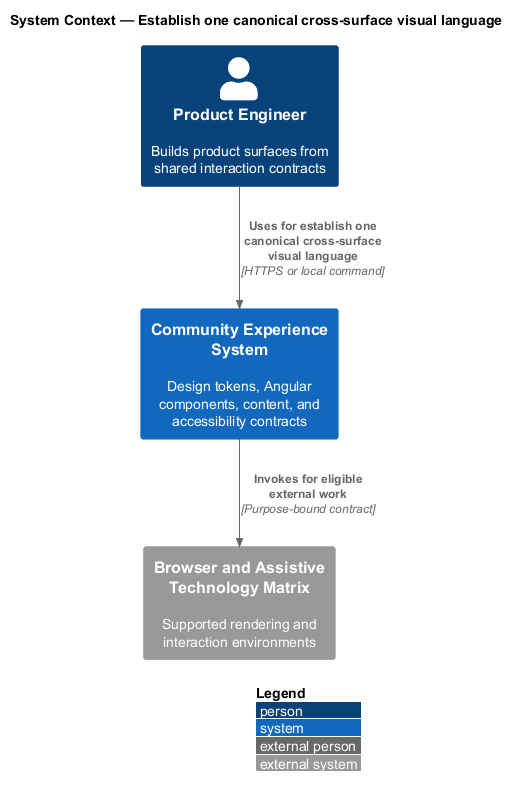
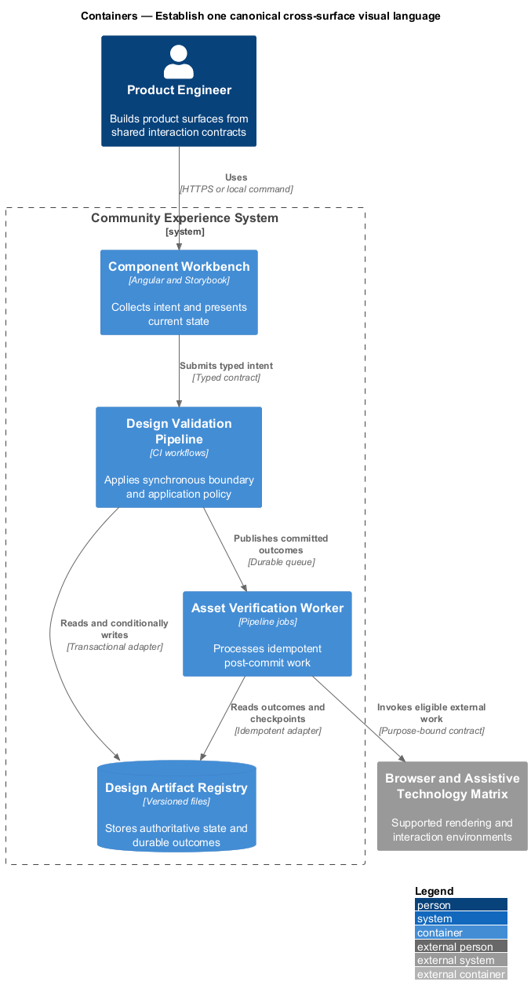
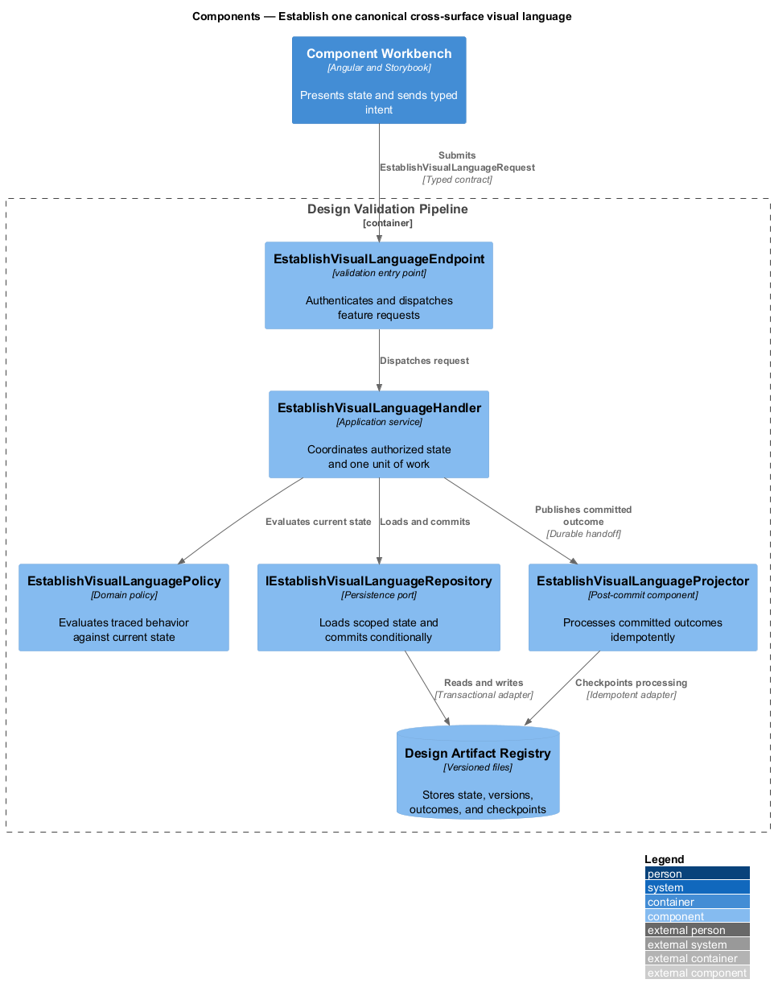
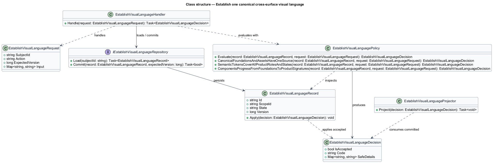
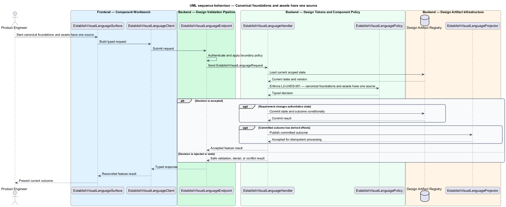
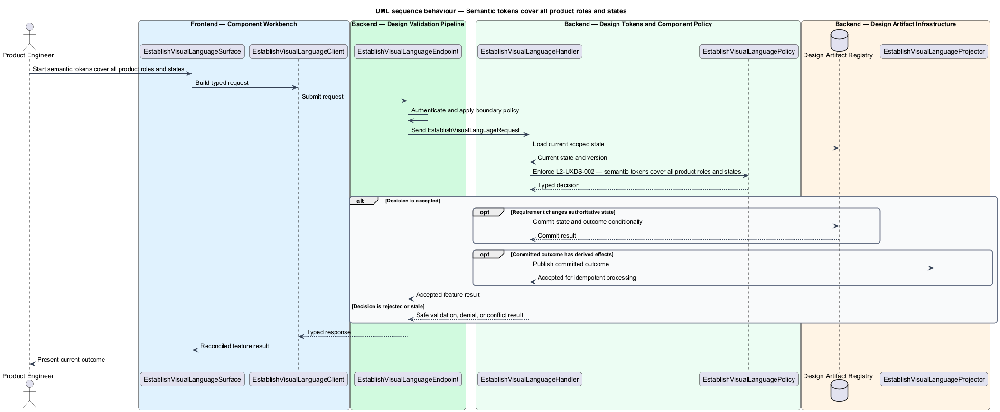
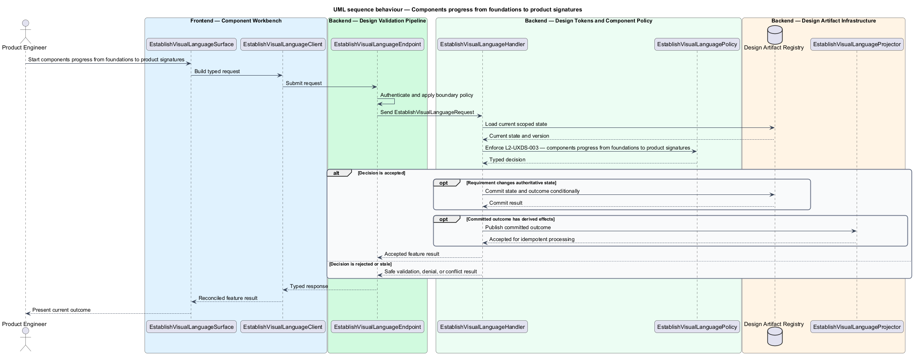

# Establish one canonical cross-surface visual language

## Overview

Community Starter is a community platform divided into product and platform subsystems. The
Experience and design system subsystem owns this feature.

*establish one canonical cross-surface visual language* — subsystem capability that covers canonical foundations and assets have one source, semantic tokens cover all product roles and states, and components progress from foundations to product signatures

The starter shall support a recognizable, accessible community experience across anonymous and authenticated surfaces without letting individual features invent competing visual rules. The primary community journey is the proving ground for a small canonical design system, reusable Angular contracts, resilient interaction states, and evidence-backed visual change. The member application and static public site shall consume a single platform-neutral source of foundations, semantic tokens, assets, and documented component states.

The feature groups 3 traced behaviors behind one policy and evidence
boundary: `L2-UXDS-001`, `L2-UXDS-002`, and `L2-UXDS-003`. Authoritative state commits before projections, delivery, or external work reports
success.

## Description

The repository contains specifications but no application implementation. This greenfield slice
defines the following building blocks across `Component Workbench`, `Design Validation Pipeline`, the
application and domain layer, and infrastructure.

- **`EstablishVisualLanguageSurface`** — component workbench surface in `Component Workbench`. It presents current
  state, submits user intent, and reconciles the typed result.
- **`EstablishVisualLanguageClient`** — typed component adapter. It creates `EstablishVisualLanguageRequest` values and maps stable
  transport failures into feature results.
- **`EstablishVisualLanguageEndpoint`** — validation entry point in `Design Validation Pipeline`. It authenticates the
  caller, applies boundary policy, and dispatches the request.
- **`EstablishVisualLanguageRequest`** — immutable request carrying `SubjectId`, `Action`, `ExpectedVersion`, and the
  scoped input needed by one traced behavior.
- **`EstablishVisualLanguageHandler`** — application service that loads authorized state through
  `IEstablishVisualLanguageRepository`, invokes `EstablishVisualLanguagePolicy`, and commits an accepted transition.
- **`EstablishVisualLanguagePolicy`** — domain policy that evaluates current state and returns a typed
  `EstablishVisualLanguageDecision` without performing external work.
- **`EstablishVisualLanguageRecord`** — authoritative record containing the feature state, scope, and concurrency
  version.
- **`IEstablishVisualLanguageRepository`** — persistence port that loads scoped state and commits one conditional
  unit of work.
- **`EstablishVisualLanguageProjector`** — idempotent post-commit component in `Asset Verification Worker`. It updates
  eligible projections and invokes configured external providers.

`EstablishVisualLanguagePolicy` exposes one named operation for each traced behavior:

- **`EstablishVisualLanguagePolicy.CanonicalFoundationsAndAssetsHaveOneSource(record, request)`** — evaluates `L2-UXDS-001` (canonical foundations and assets have one source) and returns a typed decision before any state change.
- **`EstablishVisualLanguagePolicy.SemanticTokensCoverAllProductRolesAndStates(record, request)`** — evaluates `L2-UXDS-002` (semantic tokens cover all product roles and states) and returns a typed decision before any state change.
- **`EstablishVisualLanguagePolicy.ComponentsProgressFromFoundationsToProductSignatures(record, request)`** — evaluates `L2-UXDS-003` (components progress from foundations to product signatures) and returns a typed decision before any state change.

## Requirements

The feature realizes the following level-2 (L2) requirements. Each row preserves the specification
identifier, its level-1 (L1) parent, and the requirement statement verbatim.

| L2 ID | Refines (L1) | Requirement |
|-------|--------------|-------------|
| `L2-UXDS-001` | `L1-UXDS-001` | The repository shall provide `design-system/tokens.css`, `base.css`, licensed shared assets, a rendered `index.html` reference, and usage/change documentation as the canonical platform-neutral web source. Angular and static marketing shall consume these files through deterministic build or copy steps rather than maintain hand-copied token sets. A referenced missing design-system asset shall fail the build. |
| `L2-UXDS-002` | `L1-UXDS-001` | The design system shall define a limited primitive palette and scale, then expose semantic CSS custom properties by purpose rather than screen or literal color. Semantic coverage shall include surfaces, text, borders, actions, statuses, category/data colors, typography roles and responsive scale, spacing, content widths, control sizes, radius, elevation, z-index, focus, selection, disabled/destructive/success/warning/error states, motion duration/easing, and reduced motion. Themes shall be added only when the product requires them. |
| `L2-UXDS-003` | `L1-UXDS-001` | Shared UI shall progress from foundations to primitives, feedback, composition, product-signature components, and page patterns using the primary journey as its proving ground. A component shall enter the shared library only when two contexts need the same semantics or it is an intentional platform primitive. The starter shall not create a broad abstract library before product behavior and visual states are understood. |

## Diagrams

### System context

The `Product Engineer` uses `Community Experience System` for the feature. The system invokes
`Browser and Assistive Technology Matrix` only for configured external work after authoritative decisions.

### Containers

`Component Workbench` collects intent, `Design Validation Pipeline` applies the synchronous boundary,
and `Design Artifact Registry` holds authoritative state. `Asset Verification Worker` handles eligible
post-commit work against `Browser and Assistive Technology Matrix`.

### Components

Inside `Design Validation Pipeline`, `EstablishVisualLanguageEndpoint` dispatches `EstablishVisualLanguageHandler`. The handler evaluates
`EstablishVisualLanguagePolicy`, persists through `IEstablishVisualLanguageRepository`, and hands committed outcomes to
`EstablishVisualLanguageProjector`.

### Class structure

`EstablishVisualLanguageHandler` depends on the immutable request, domain policy, and repository port.
`EstablishVisualLanguageRecord` owns versioned state, while `EstablishVisualLanguageProjector` consumes committed results.

### Behaviour — canonical foundations and assets have one source

The interaction loads current scoped state before `EstablishVisualLanguagePolicy` enforces
`L2-UXDS-001`. Rejected decisions return without changing authoritative state; accepted
state changes commit before optional derived work starts.

### Behaviour — semantic tokens cover all product roles and states

The interaction loads current scoped state before `EstablishVisualLanguagePolicy` enforces
`L2-UXDS-002`. Rejected decisions return without changing authoritative state; accepted
state changes commit before optional derived work starts.

### Behaviour — components progress from foundations to product signatures

The interaction loads current scoped state before `EstablishVisualLanguagePolicy` enforces
`L2-UXDS-003`. Rejected decisions return without changing authoritative state; accepted
state changes commit before optional derived work starts.

