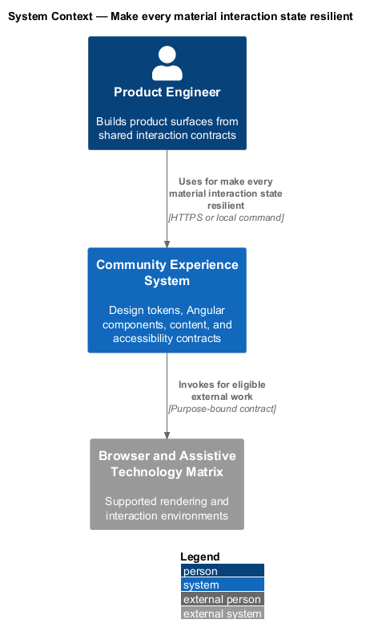
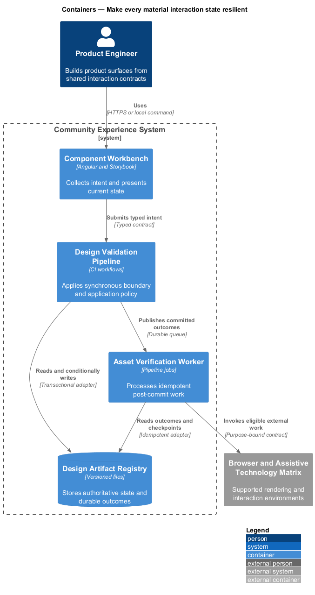
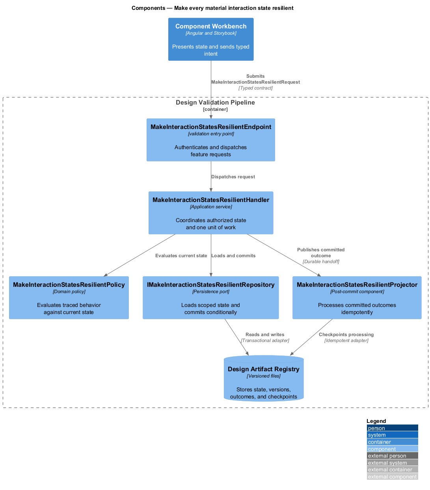
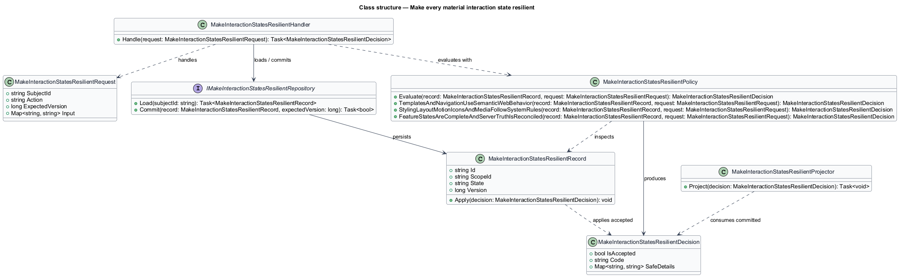
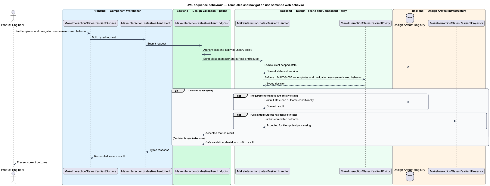
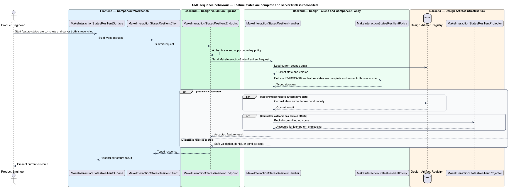

# Make every material interaction state resilient

## Overview

Community Starter is a community platform divided into product and platform subsystems. The
Experience and design system subsystem owns this feature.

*make every material interaction state resilient* — subsystem capability that covers templates and navigation use semantic web behavior, styling, layout, motion, icons, and media follow system rules, and feature states are complete and server truth is reconciled

The starter shall support a recognizable, accessible community experience across anonymous and authenticated surfaces without letting individual features invent competing visual rules. The primary community journey is the proving ground for a small canonical design system, reusable Angular contracts, resilient interaction states, and evidence-backed visual change. Community features shall render meaningful success, absence, delay, failure, authorization, conflict, destructive, responsive, and motion states without fragile templates or feature-local visual inventions.

The feature groups 3 traced behaviors behind one policy and evidence
boundary: `L2-UXDS-007`, `L2-UXDS-008`, and `L2-UXDS-009`. Authoritative state commits before projections, delivery, or external work reports
success.

## Description

The repository contains specifications but no application implementation. This greenfield slice
defines the following building blocks across `Component Workbench`, `Design Validation Pipeline`, the
application and domain layer, and infrastructure.

- **`MakeInteractionStatesResilientSurface`** — component workbench surface in `Component Workbench`. It presents current
  state, submits user intent, and reconciles the typed result.
- **`MakeInteractionStatesResilientClient`** — typed component adapter. It creates `MakeInteractionStatesResilientRequest` values and maps stable
  transport failures into feature results.
- **`MakeInteractionStatesResilientEndpoint`** — validation entry point in `Design Validation Pipeline`. It authenticates the
  caller, applies boundary policy, and dispatches the request.
- **`MakeInteractionStatesResilientRequest`** — immutable request carrying `SubjectId`, `Action`, `ExpectedVersion`, and the
  scoped input needed by one traced behavior.
- **`MakeInteractionStatesResilientHandler`** — application service that loads authorized state through
  `IMakeInteractionStatesResilientRepository`, invokes `MakeInteractionStatesResilientPolicy`, and commits an accepted transition.
- **`MakeInteractionStatesResilientPolicy`** — domain policy that evaluates current state and returns a typed
  `MakeInteractionStatesResilientDecision` without performing external work.
- **`MakeInteractionStatesResilientRecord`** — authoritative record containing the feature state, scope, and concurrency
  version.
- **`IMakeInteractionStatesResilientRepository`** — persistence port that loads scoped state and commits one conditional
  unit of work.
- **`MakeInteractionStatesResilientProjector`** — idempotent post-commit component in `Asset Verification Worker`. It updates
  eligible projections and invokes configured external providers.

`MakeInteractionStatesResilientPolicy` exposes one named operation for each traced behavior:

- **`MakeInteractionStatesResilientPolicy.TemplatesAndNavigationUseSemanticWebBehavior(record, request)`** — evaluates `L2-UXDS-007` (templates and navigation use semantic web behavior) and returns a typed decision before any state change.
- **`MakeInteractionStatesResilientPolicy.StylingLayoutMotionIconsAndMediaFollowSystemRules(record, request)`** — evaluates `L2-UXDS-008` (styling, layout, motion, icons, and media follow system rules) and returns a typed decision before any state change.
- **`MakeInteractionStatesResilientPolicy.FeatureStatesAreCompleteAndServerTruthIsReconciled(record, request)`** — evaluates `L2-UXDS-009` (feature states are complete and server truth is reconciled) and returns a typed decision before any state change.

## Requirements

The feature realizes the following level-2 (L2) requirements. Each row preserves the specification
identifier, its level-1 (L1) parent, and the requirement statement verbatim.

| L2 ID | Refines (L1) | Requirement |
|-------|--------------|-------------|
| `L2-UXDS-007` | `L1-UXDS-003` | Templates shall prefer native buttons, links, labels, headings, lists, forms, and dialogs before ARIA substitutes. Real router links or anchors shall replace click handlers on generic containers. Template expressions shall remain simple, non-trivial derivation shall move to computed values or pure helpers, current Angular control-flow syntax shall be consistent, and repeated rows shall track stable identity. |
| `L2-UXDS-008` | `L1-UXDS-003` | Feature styles shall remain component-scoped and consume semantic CSS custom properties, with SCSS used for component composition where useful; global CSS shall contain only tokens, reset, typography, and truly global layout or utilities. Component selectors shall use a short product prefix. CSS layout and responsive primitives shall be preferred over viewport-reading TypeScript. Feature code shall avoid `!important`, deep selectors, global tag overrides, and one-off z-index escalation. Class names shall be readable and semantic rather than encode a literal color. Icons shall be accessible SVG or an approved set rather than emoji. Media and other assets shall be optimized, license-checked, never hotlinked as undeclared production brand dependencies, and shall reserve dimensions. Purposeful bounded animation shall provide a reduced-motion alternative. |
| `L2-UXDS-009` | `L1-UXDS-003` | Every feature shall intentionally handle applicable loading, empty, success, validation, error, conflict, unauthorized, forbidden, destructive-confirmation, retry, reconnect, narrow-screen, keyboard, long-content, and reduced-motion states. Server-returned permissions and allowed actions shall be treated as authoritative hints, and the client shall reload or reconcile after stale-state conflicts. Route guards are navigation experience only and shall never be treated as authorization. |

## Diagrams

### System context

The `Product Engineer` uses `Community Experience System` for the feature. The system invokes
`Browser and Assistive Technology Matrix` only for configured external work after authoritative decisions.

### Containers

`Component Workbench` collects intent, `Design Validation Pipeline` applies the synchronous boundary,
and `Design Artifact Registry` holds authoritative state. `Asset Verification Worker` handles eligible
post-commit work against `Browser and Assistive Technology Matrix`.

### Components

Inside `Design Validation Pipeline`, `MakeInteractionStatesResilientEndpoint` dispatches `MakeInteractionStatesResilientHandler`. The handler evaluates
`MakeInteractionStatesResilientPolicy`, persists through `IMakeInteractionStatesResilientRepository`, and hands committed outcomes to
`MakeInteractionStatesResilientProjector`.

### Class structure

`MakeInteractionStatesResilientHandler` depends on the immutable request, domain policy, and repository port.
`MakeInteractionStatesResilientRecord` owns versioned state, while `MakeInteractionStatesResilientProjector` consumes committed results.

### Behaviour — templates and navigation use semantic web behavior

The interaction loads current scoped state before `MakeInteractionStatesResilientPolicy` enforces
`L2-UXDS-007`. Rejected decisions return without changing authoritative state; accepted
state changes commit before optional derived work starts.

### Behaviour — styling, layout, motion, icons, and media follow system rules

The interaction loads current scoped state before `MakeInteractionStatesResilientPolicy` enforces
`L2-UXDS-008`. Rejected decisions return without changing authoritative state; accepted
state changes commit before optional derived work starts.

### Behaviour — feature states are complete and server truth is reconciled

The interaction loads current scoped state before `MakeInteractionStatesResilientPolicy` enforces
`L2-UXDS-009`. Rejected decisions return without changing authoritative state; accepted
state changes commit before optional derived work starts.

