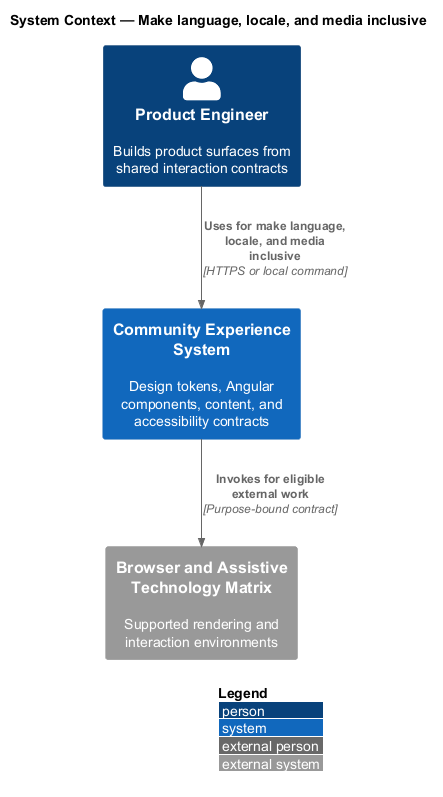
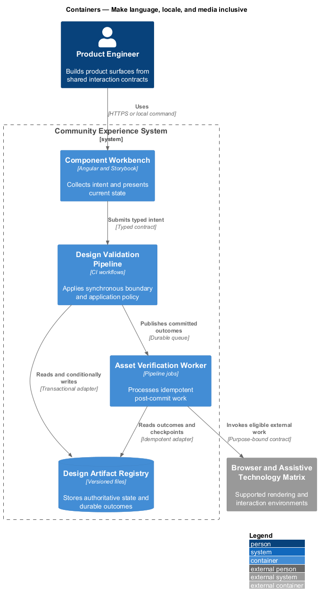
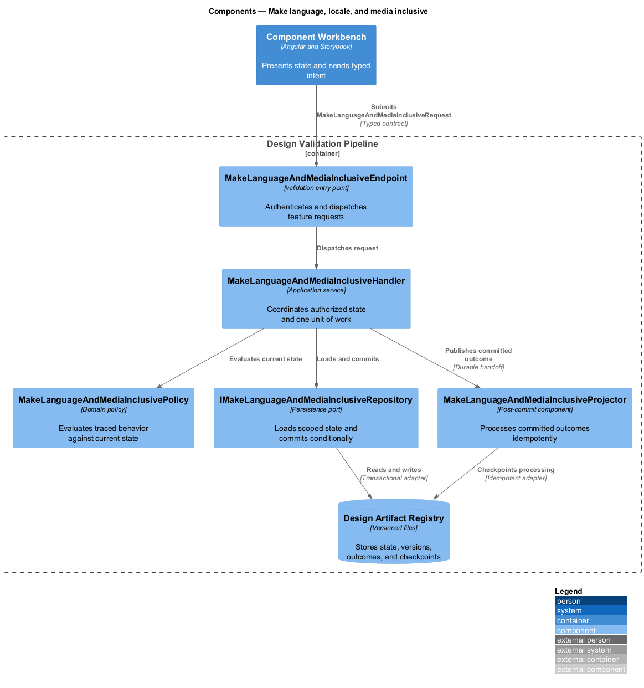
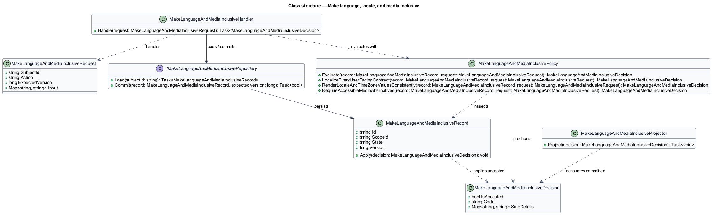
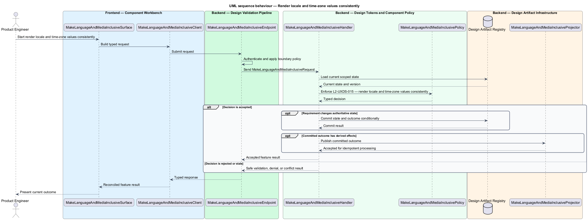
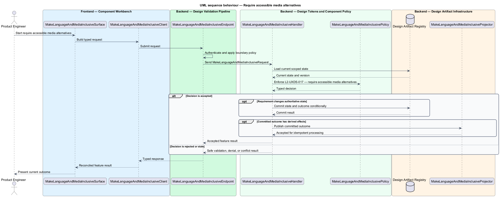

# Make language, locale, and media inclusive

## Overview

Community Starter is a community platform divided into product and platform subsystems. The
Experience and design system subsystem owns this feature.

*make language, locale, and media inclusive* — subsystem capability that covers localize every user-facing contract, render locale and time-zone values consistently, and require accessible media alternatives

The starter shall support a recognizable, accessible community experience across anonymous and authenticated surfaces without letting individual features invent competing visual rules. The primary community journey is the proving ground for a small canonical design system, reusable Angular contracts, resilient interaction states, and evidence-backed visual change. Application, marketing, email, administration, moderation, and generated content shall support translation, locale and time-zone differences, variable-length text, and accessible media without changing server-owned meaning or exposing different authorization behavior.

The feature groups 3 traced behaviors behind one policy and evidence
boundary: `L2-UXDS-014`, `L2-UXDS-015`, and `L2-UXDS-017`. Authoritative state commits before projections, delivery, or external work reports
success.

## Description

The repository contains specifications but no application implementation. This greenfield slice
defines the following building blocks across `Component Workbench`, `Design Validation Pipeline`, the
application and domain layer, and infrastructure.

- **`MakeLanguageAndMediaInclusiveSurface`** — component workbench surface in `Component Workbench`. It presents current
  state, submits user intent, and reconciles the typed result.
- **`MakeLanguageAndMediaInclusiveClient`** — typed component adapter. It creates `MakeLanguageAndMediaInclusiveRequest` values and maps stable
  transport failures into feature results.
- **`MakeLanguageAndMediaInclusiveEndpoint`** — validation entry point in `Design Validation Pipeline`. It authenticates the
  caller, applies boundary policy, and dispatches the request.
- **`MakeLanguageAndMediaInclusiveRequest`** — immutable request carrying `SubjectId`, `Action`, `ExpectedVersion`, and the
  scoped input needed by one traced behavior.
- **`MakeLanguageAndMediaInclusiveHandler`** — application service that loads authorized state through
  `IMakeLanguageAndMediaInclusiveRepository`, invokes `MakeLanguageAndMediaInclusivePolicy`, and commits an accepted transition.
- **`MakeLanguageAndMediaInclusivePolicy`** — domain policy that evaluates current state and returns a typed
  `MakeLanguageAndMediaInclusiveDecision` without performing external work.
- **`MakeLanguageAndMediaInclusiveRecord`** — authoritative record containing the feature state, scope, and concurrency
  version.
- **`IMakeLanguageAndMediaInclusiveRepository`** — persistence port that loads scoped state and commits one conditional
  unit of work.
- **`MakeLanguageAndMediaInclusiveProjector`** — idempotent post-commit component in `Asset Verification Worker`. It updates
  eligible projections and invokes configured external providers.

`MakeLanguageAndMediaInclusivePolicy` exposes one named operation for each traced behavior:

- **`MakeLanguageAndMediaInclusivePolicy.LocalizeEveryUserFacingContract(record, request)`** — evaluates `L2-UXDS-014` (localize every user-facing contract) and returns a typed decision before any state change.
- **`MakeLanguageAndMediaInclusivePolicy.RenderLocaleAndTimeZoneValuesConsistently(record, request)`** — evaluates `L2-UXDS-015` (render locale and time-zone values consistently) and returns a typed decision before any state change.
- **`MakeLanguageAndMediaInclusivePolicy.RequireAccessibleMediaAlternatives(record, request)`** — evaluates `L2-UXDS-017` (require accessible media alternatives) and returns a typed decision before any state change.

## Requirements

The feature realizes the following level-2 (L2) requirements. Each row preserves the specification
identifier, its level-1 (L1) parent, and the requirement statement verbatim.

| L2 ID | Refines (L1) | Requirement |
|-------|--------------|-------------|
| `L2-UXDS-014` | `L1-UXDS-006` | All user-facing application, marketing, email, administration, moderation, validation, and system text shall be extractable and keyed by stable meaning. Locale selection shall use an explicit Account preference where present, then an approved negotiation and fallback chain. Server failures shall carry stable machine codes and parameters so clients never parse English prose to decide behavior. |
| `L2-UXDS-015` | `L1-UXDS-006` | Numbers, measurements, plural forms, lists, dates, and times shall use the viewer's supported locale and IANA time-zone preference with a documented fallback. The server shall persist instants in UTC and preserve a local-time zone or offset only when product meaning, such as an Event schedule, requires it. |
| `L2-UXDS-017` | `L1-UXDS-006` | Meaningful images require author-supplied alternative text or an explicit decorative decision; audio and video require captions, transcripts, and controls appropriate to the accepted media scope. Automated suggestions may assist but cannot silently replace author responsibility, and Moderation Actions may restrict an unsafe alternative without exposing hidden media. |

## Diagrams

### System context

The `Product Engineer` uses `Community Experience System` for the feature. The system invokes
`Browser and Assistive Technology Matrix` only for configured external work after authoritative decisions.

### Containers

`Component Workbench` collects intent, `Design Validation Pipeline` applies the synchronous boundary,
and `Design Artifact Registry` holds authoritative state. `Asset Verification Worker` handles eligible
post-commit work against `Browser and Assistive Technology Matrix`.

### Components

Inside `Design Validation Pipeline`, `MakeLanguageAndMediaInclusiveEndpoint` dispatches `MakeLanguageAndMediaInclusiveHandler`. The handler evaluates
`MakeLanguageAndMediaInclusivePolicy`, persists through `IMakeLanguageAndMediaInclusiveRepository`, and hands committed outcomes to
`MakeLanguageAndMediaInclusiveProjector`.

### Class structure

`MakeLanguageAndMediaInclusiveHandler` depends on the immutable request, domain policy, and repository port.
`MakeLanguageAndMediaInclusiveRecord` owns versioned state, while `MakeLanguageAndMediaInclusiveProjector` consumes committed results.

### Behaviour — localize every user-facing contract

The interaction loads current scoped state before `MakeLanguageAndMediaInclusivePolicy` enforces
`L2-UXDS-014`. Rejected decisions return without changing authoritative state; accepted
state changes commit before optional derived work starts.

### Behaviour — render locale and time-zone values consistently

The interaction loads current scoped state before `MakeLanguageAndMediaInclusivePolicy` enforces
`L2-UXDS-015`. Rejected decisions return without changing authoritative state; accepted
state changes commit before optional derived work starts.

### Behaviour — require accessible media alternatives

The interaction loads current scoped state before `MakeLanguageAndMediaInclusivePolicy` enforces
`L2-UXDS-017`. Rejected decisions return without changing authoritative state; accepted
state changes commit before optional derived work starts.

