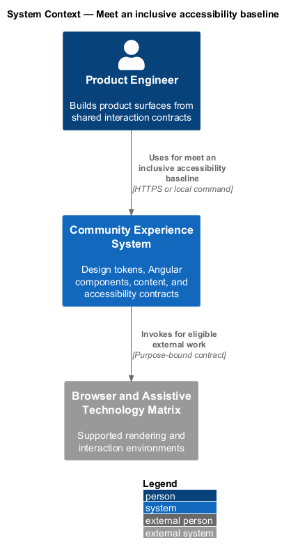
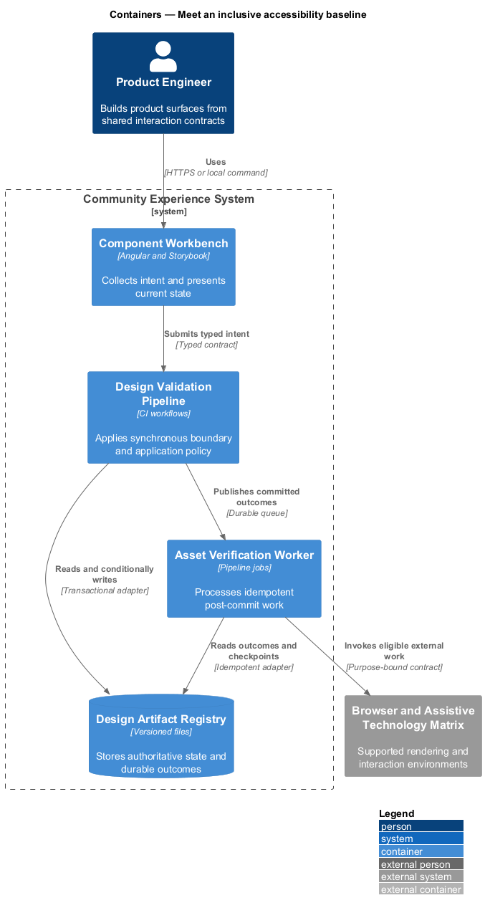
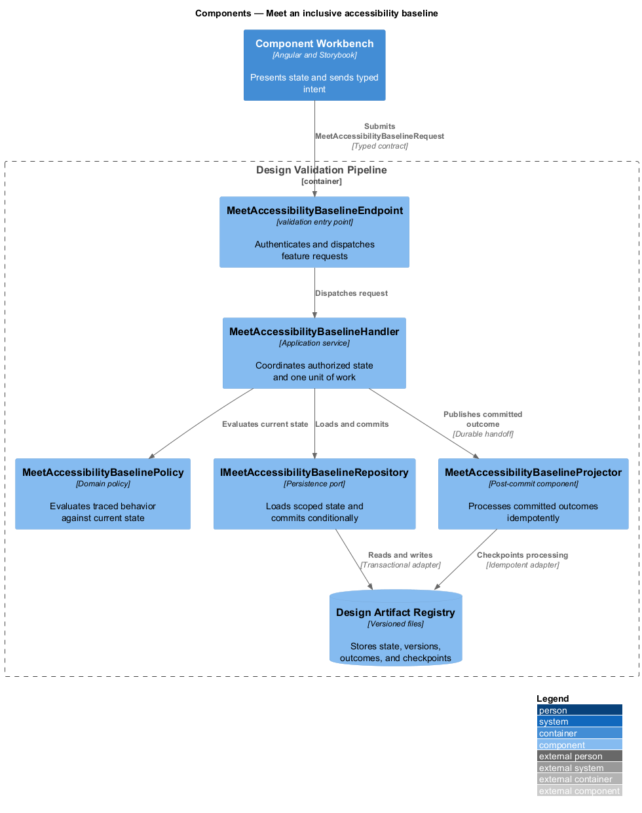
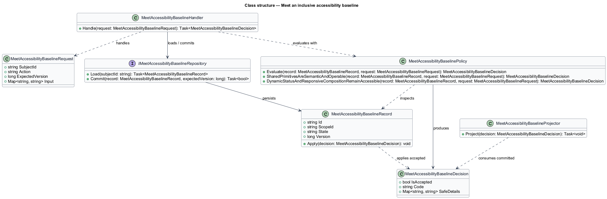
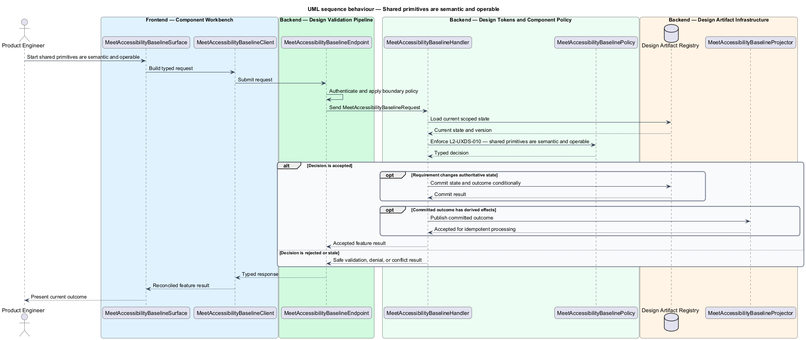
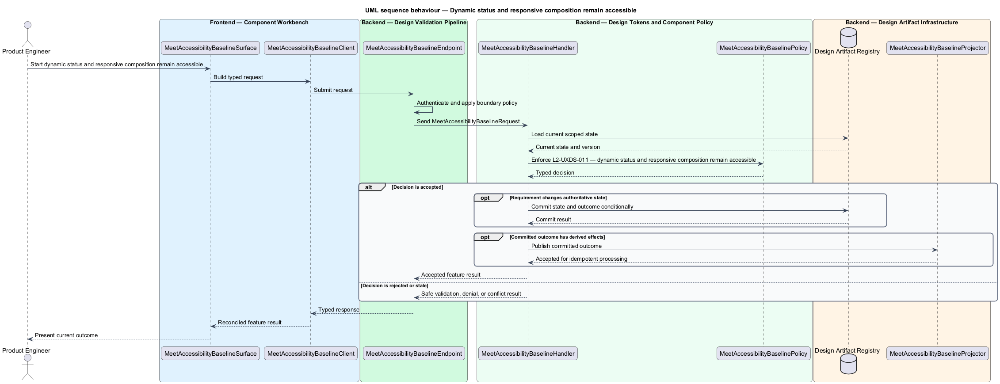

# Meet an inclusive accessibility baseline

## Overview

Community Starter is a community platform divided into product and platform subsystems. The
Experience and design system subsystem owns this feature.

*meet an inclusive accessibility baseline* — subsystem capability that covers shared primitives are semantic and operable and dynamic status and responsive composition remain accessible

The starter shall support a recognizable, accessible community experience across anonymous and authenticated surfaces without letting individual features invent competing visual rules. The primary community journey is the proving ground for a small canonical design system, reusable Angular contracts, resilient interaction states, and evidence-backed visual change. All product and marketing experiences shall meet WCAG 2.2 AA and preserve understandable, operable behavior across keyboard, assistive technology, zoom, reflow, contrast modes, and reduced motion.

The feature groups 2 traced behaviors behind one policy and evidence
boundary: `L2-UXDS-010` and `L2-UXDS-011`. Authoritative state commits before projections, delivery, or external work reports
success.

## Description

The repository contains specifications but no application implementation. This greenfield slice
defines the following building blocks across `Component Workbench`, `Design Validation Pipeline`, the
application and domain layer, and infrastructure.

- **`MeetAccessibilityBaselineSurface`** — component workbench surface in `Component Workbench`. It presents current
  state, submits user intent, and reconciles the typed result.
- **`MeetAccessibilityBaselineClient`** — typed component adapter. It creates `MeetAccessibilityBaselineRequest` values and maps stable
  transport failures into feature results.
- **`MeetAccessibilityBaselineEndpoint`** — validation entry point in `Design Validation Pipeline`. It authenticates the
  caller, applies boundary policy, and dispatches the request.
- **`MeetAccessibilityBaselineRequest`** — immutable request carrying `SubjectId`, `Action`, `ExpectedVersion`, and the
  scoped input needed by one traced behavior.
- **`MeetAccessibilityBaselineHandler`** — application service that loads authorized state through
  `IMeetAccessibilityBaselineRepository`, invokes `MeetAccessibilityBaselinePolicy`, and commits an accepted transition.
- **`MeetAccessibilityBaselinePolicy`** — domain policy that evaluates current state and returns a typed
  `MeetAccessibilityBaselineDecision` without performing external work.
- **`MeetAccessibilityBaselineRecord`** — authoritative record containing the feature state, scope, and concurrency
  version.
- **`IMeetAccessibilityBaselineRepository`** — persistence port that loads scoped state and commits one conditional
  unit of work.
- **`MeetAccessibilityBaselineProjector`** — idempotent post-commit component in `Asset Verification Worker`. It updates
  eligible projections and invokes configured external providers.

`MeetAccessibilityBaselinePolicy` exposes one named operation for each traced behavior:

- **`MeetAccessibilityBaselinePolicy.SharedPrimitivesAreSemanticAndOperable(record, request)`** — evaluates `L2-UXDS-010` (shared primitives are semantic and operable) and returns a typed decision before any state change.
- **`MeetAccessibilityBaselinePolicy.DynamicStatusAndResponsiveCompositionRemainAccessible(record, request)`** — evaluates `L2-UXDS-011` (dynamic status and responsive composition remain accessible) and returns a typed decision before any state change.

## Requirements

The feature realizes the following level-2 (L2) requirements. Each row preserves the specification
identifier, its level-1 (L1) parent, and the requirement statement verbatim.

| L2 ID | Refines (L1) | Requirement |
|-------|--------------|-------------|
| `L2-UXDS-010` | `L1-UXDS-004` | Product and marketing surfaces shall meet WCAG 2.2 AA. Shared primitives shall provide visible `:focus-visible`, logical headings and landmarks, a skip link where navigation repeats, real labels and accessible names, usable control/touch sizes, keyboard-equivalent operation, and text, iconography, shape, or position in addition to color for state. Native semantics shall be used before ARIA substitutes. |
| `L2-UXDS-011` | `L1-UXDS-004` | Asynchronous errors and status changes shall be announced deliberately without making routine updates noisy. Page composition shall remain understandable under zoom, text reflow, forced colors, reduced motion, narrow and wide viewports, long localized content, and screen-reader navigation. Shared primitives shall receive deep accessibility testing, while pages shall be tested for accessible names, reading order, focus flow, and composed behavior. |

## Diagrams

### System context

The `Product Engineer` uses `Community Experience System` for the feature. The system invokes
`Browser and Assistive Technology Matrix` only for configured external work after authoritative decisions.

### Containers

`Component Workbench` collects intent, `Design Validation Pipeline` applies the synchronous boundary,
and `Design Artifact Registry` holds authoritative state. `Asset Verification Worker` handles eligible
post-commit work against `Browser and Assistive Technology Matrix`.

### Components

Inside `Design Validation Pipeline`, `MeetAccessibilityBaselineEndpoint` dispatches `MeetAccessibilityBaselineHandler`. The handler evaluates
`MeetAccessibilityBaselinePolicy`, persists through `IMeetAccessibilityBaselineRepository`, and hands committed outcomes to
`MeetAccessibilityBaselineProjector`.

### Class structure

`MeetAccessibilityBaselineHandler` depends on the immutable request, domain policy, and repository port.
`MeetAccessibilityBaselineRecord` owns versioned state, while `MeetAccessibilityBaselineProjector` consumes committed results.

### Behaviour — shared primitives are semantic and operable

The interaction loads current scoped state before `MeetAccessibilityBaselinePolicy` enforces
`L2-UXDS-010`. Rejected decisions return without changing authoritative state; accepted
state changes commit before optional derived work starts.

### Behaviour — dynamic status and responsive composition remain accessible

The interaction loads current scoped state before `MeetAccessibilityBaselinePolicy` enforces
`L2-UXDS-011`. Rejected decisions return without changing authoritative state; accepted
state changes commit before optional derived work starts.

