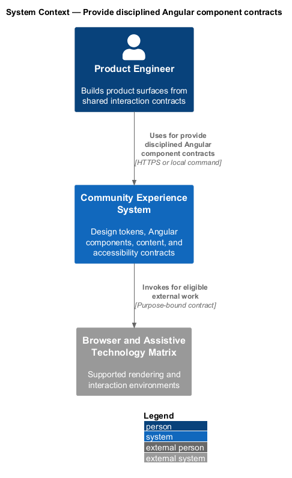
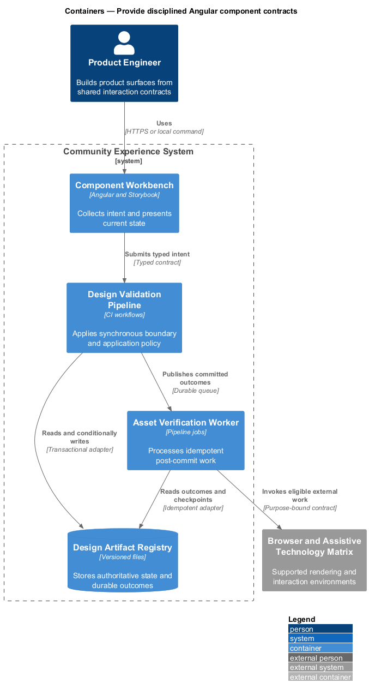
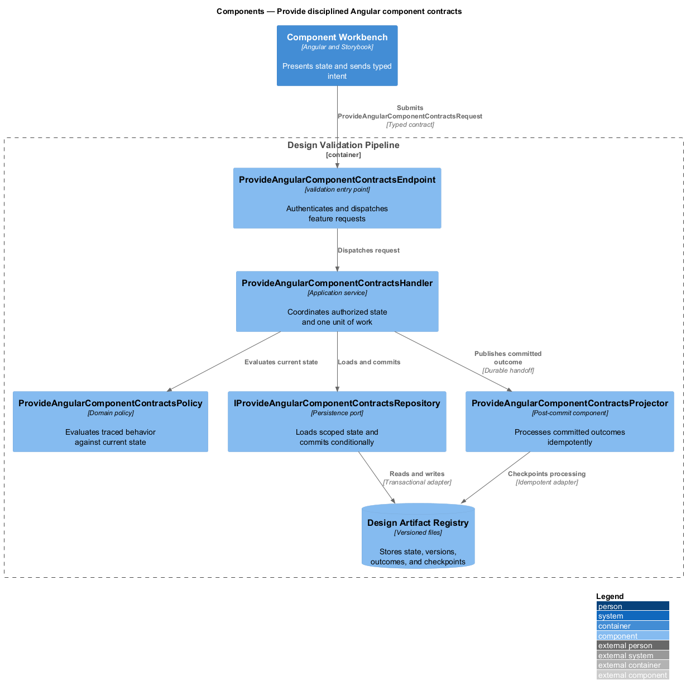
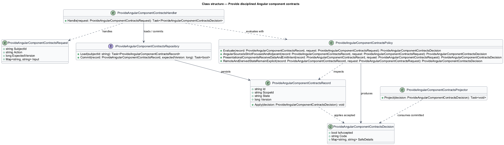
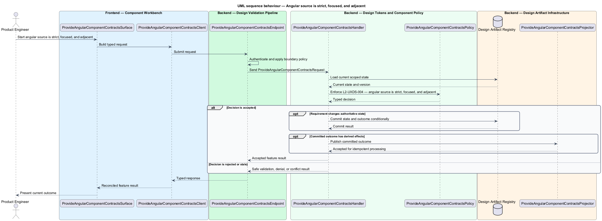
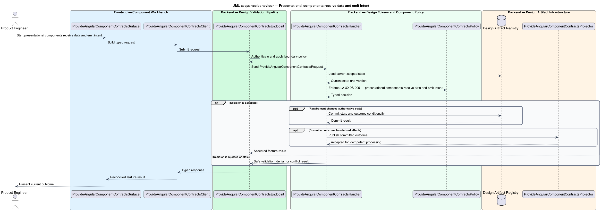
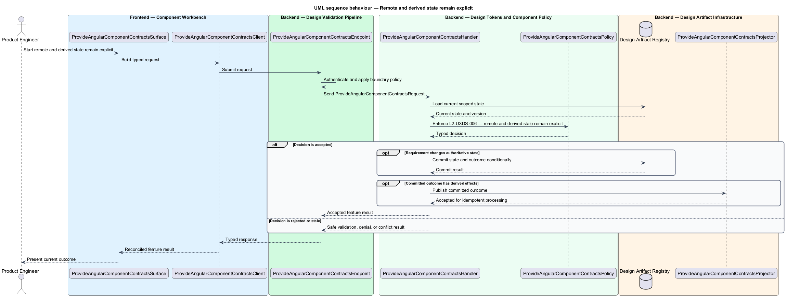

# Provide disciplined Angular component contracts

## Overview

Community Starter is a community platform divided into product and platform subsystems. The
Experience and design system subsystem owns this feature.

*provide disciplined Angular component contracts* — subsystem capability that covers angular source is strict, focused, and adjacent, presentational components receive data and emit intent, and remote and derived state remain explicit

The starter shall support a recognizable, accessible community experience across anonymous and authenticated surfaces without letting individual features invent competing visual rules. The primary community journey is the proving ground for a small canonical design system, reusable Angular contracts, resilient interaction states, and evidence-backed visual change. Angular implementation shall use strict, standalone, signal-oriented components with clear separation between reusable presentation, page coordination, and remote state.

The feature groups 3 traced behaviors behind one policy and evidence
boundary: `L2-UXDS-004`, `L2-UXDS-005`, and `L2-UXDS-006`. Authoritative state commits before projections, delivery, or external work reports
success.

## Description

The repository contains specifications but no application implementation. This greenfield slice
defines the following building blocks across `Component Workbench`, `Design Validation Pipeline`, the
application and domain layer, and infrastructure.

- **`ProvideAngularComponentContractsSurface`** — component workbench surface in `Component Workbench`. It presents current
  state, submits user intent, and reconciles the typed result.
- **`ProvideAngularComponentContractsClient`** — typed component adapter. It creates `ProvideAngularComponentContractsRequest` values and maps stable
  transport failures into feature results.
- **`ProvideAngularComponentContractsEndpoint`** — validation entry point in `Design Validation Pipeline`. It authenticates the
  caller, applies boundary policy, and dispatches the request.
- **`ProvideAngularComponentContractsRequest`** — immutable request carrying `SubjectId`, `Action`, `ExpectedVersion`, and the
  scoped input needed by one traced behavior.
- **`ProvideAngularComponentContractsHandler`** — application service that loads authorized state through
  `IProvideAngularComponentContractsRepository`, invokes `ProvideAngularComponentContractsPolicy`, and commits an accepted transition.
- **`ProvideAngularComponentContractsPolicy`** — domain policy that evaluates current state and returns a typed
  `ProvideAngularComponentContractsDecision` without performing external work.
- **`ProvideAngularComponentContractsRecord`** — authoritative record containing the feature state, scope, and concurrency
  version.
- **`IProvideAngularComponentContractsRepository`** — persistence port that loads scoped state and commits one conditional
  unit of work.
- **`ProvideAngularComponentContractsProjector`** — idempotent post-commit component in `Asset Verification Worker`. It updates
  eligible projections and invokes configured external providers.

`ProvideAngularComponentContractsPolicy` exposes one named operation for each traced behavior:

- **`ProvideAngularComponentContractsPolicy.AngularSourceIsStrictFocusedAndAdjacent(record, request)`** — evaluates `L2-UXDS-004` (angular source is strict, focused, and adjacent) and returns a typed decision before any state change.
- **`ProvideAngularComponentContractsPolicy.PresentationalComponentsReceiveDataAndEmitIntent(record, request)`** — evaluates `L2-UXDS-005` (presentational components receive data and emit intent) and returns a typed decision before any state change.
- **`ProvideAngularComponentContractsPolicy.RemoteAndDerivedStateRemainExplicit(record, request)`** — evaluates `L2-UXDS-006` (remote and derived state remain explicit) and returns a typed decision before any state change.

## Requirements

The feature realizes the following level-2 (L2) requirements. Each row preserves the specification
identifier, its level-1 (L1) parent, and the requirement statement verbatim.

| L2 ID | Refines (L1) | Requirement |
|-------|--------------|-------------|
| `L2-UXDS-004` | `L1-UXDS-002` | Angular shall enable strict TypeScript and template checking, use standalone components with `ChangeDetectionStrategy.OnPush`, and add no NgModule without a framework or integration reason. Kebab-case filenames shall use explicit `.component`, `.service`, `.guard`, `.interceptor`, `.model`, and `.spec` roles, with component TypeScript, template, SCSS, and tests adjacent. Types and classes shall use `PascalCase`, values and functions `camelCase`, and boolean names shall read as questions such as `isOpen`, `canModerate`, or `hasError`. Focused files shall extract non-trivial pure transforms into named helpers with focused adjacent tests. Prettier shall enforce single quotes and a 100-character width using the Angular HTML parser. |
| `L2-UXDS-005` | `L1-UXDS-002` | New Angular code shall use `inject()` and prefer signal `input()`, `output()`, `signal()`, and `computed()` for local synchronous state. Presentational components shall receive typed product data and emit user intent; pages and services shall own routing, remote calls, and feature coordination. Component APIs shall use canonical product nouns, and only deliberate public components shall be exported from a library's `public-api.ts`. |
| `L2-UXDS-006` | `L1-UXDS-002` | Typed remote contracts, authentication, interceptors, HTTP services, and realtime clients shall remain in the API library. API origins shall be injected and same-origin production shall use relative URLs. Services shall expose narrow methods named for community actions and return the established typed asynchronous primitive. Subscriptions shall not merely copy values between state containers; necessary subscriptions shall handle lifecycle, error, and completion explicitly. |

## Diagrams

### System context

The `Product Engineer` uses `Community Experience System` for the feature. The system invokes
`Browser and Assistive Technology Matrix` only for configured external work after authoritative decisions.

### Containers

`Component Workbench` collects intent, `Design Validation Pipeline` applies the synchronous boundary,
and `Design Artifact Registry` holds authoritative state. `Asset Verification Worker` handles eligible
post-commit work against `Browser and Assistive Technology Matrix`.

### Components

Inside `Design Validation Pipeline`, `ProvideAngularComponentContractsEndpoint` dispatches `ProvideAngularComponentContractsHandler`. The handler evaluates
`ProvideAngularComponentContractsPolicy`, persists through `IProvideAngularComponentContractsRepository`, and hands committed outcomes to
`ProvideAngularComponentContractsProjector`.

### Class structure

`ProvideAngularComponentContractsHandler` depends on the immutable request, domain policy, and repository port.
`ProvideAngularComponentContractsRecord` owns versioned state, while `ProvideAngularComponentContractsProjector` consumes committed results.

### Behaviour — angular source is strict, focused, and adjacent

The interaction loads current scoped state before `ProvideAngularComponentContractsPolicy` enforces
`L2-UXDS-004`. Rejected decisions return without changing authoritative state; accepted
state changes commit before optional derived work starts.

### Behaviour — presentational components receive data and emit intent

The interaction loads current scoped state before `ProvideAngularComponentContractsPolicy` enforces
`L2-UXDS-005`. Rejected decisions return without changing authoritative state; accepted
state changes commit before optional derived work starts.

### Behaviour — remote and derived state remain explicit

The interaction loads current scoped state before `ProvideAngularComponentContractsPolicy` enforces
`L2-UXDS-006`. Rejected decisions return without changing authoritative state; accepted
state changes commit before optional derived work starts.

