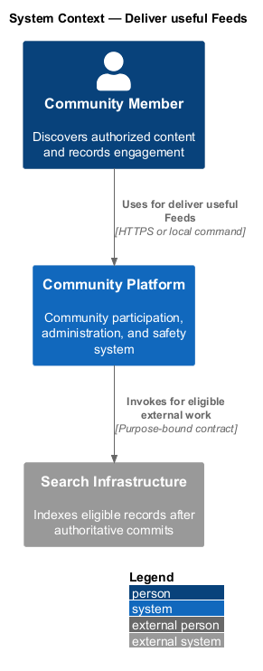
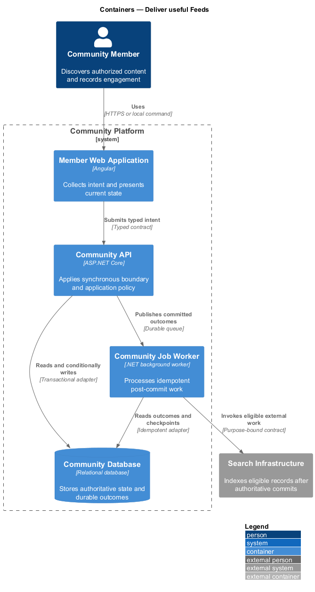
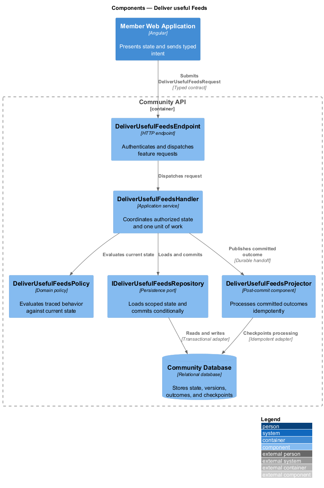
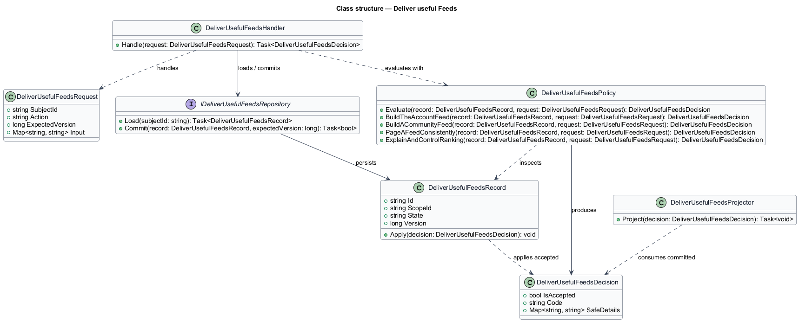
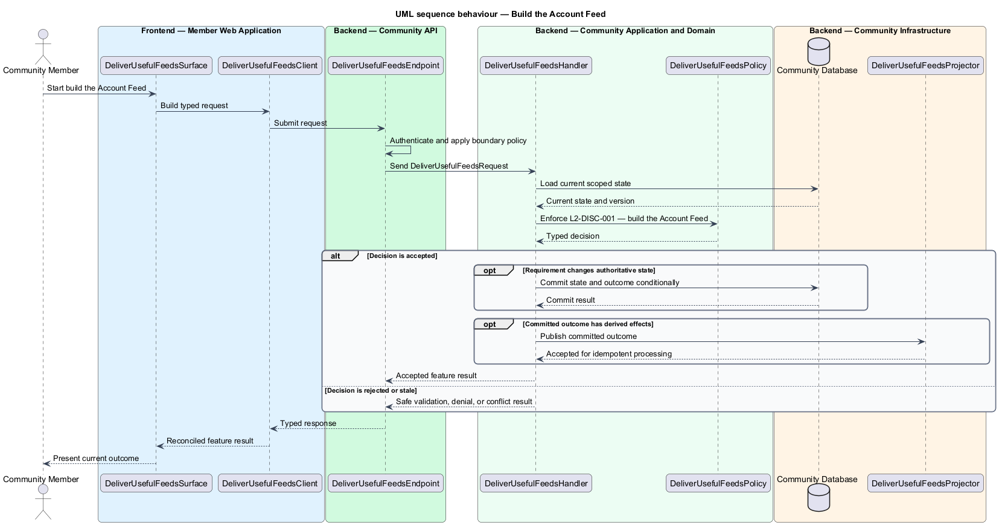
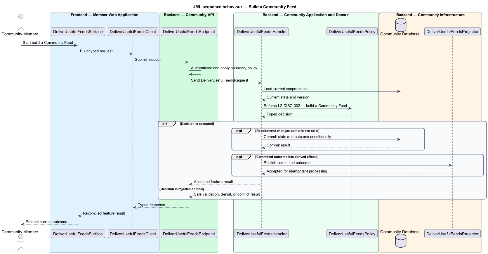
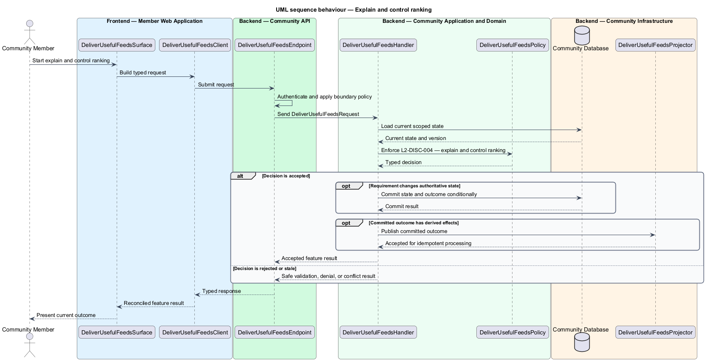

# Deliver useful Feeds

## Overview

Community Starter is a community platform divided into product and platform subsystems. The
Feeds, search, and engagement subsystem owns this feature.

*deliver useful Feeds* — subsystem capability that covers build the Account Feed, build a Community Feed, page a Feed consistently, and explain and control ranking

Feeds and Search results help an Account find permitted Posts, Events, Communities, Profiles, and Tags; Reactions and Bookmarks let the Account engage without changing content ownership. Every projection is advisory and server-filtered against current Community, Membership, relationship, and content state. The platform shall deliver personal and Community Feeds that are authorized, stable to page, honest about ranking, and controllable without treating cached or ranked data as access authority.

The feature groups 4 traced behaviors behind one policy and evidence
boundary: `L2-DISC-001`, `L2-DISC-002`, `L2-DISC-003`, and `L2-DISC-004`. Authoritative state commits before projections, delivery, or external work reports
success.

## Description

The repository contains specifications but no application implementation. This greenfield slice
defines the following building blocks across `Member Web Application`, `Community API`, the
application and domain layer, and infrastructure.

- **`DeliverUsefulFeedsSurface`** — page component in `Member Web Application`. It presents current
  state, submits user intent, and reconciles the typed result.
- **`DeliverUsefulFeedsClient`** — typed Angular client. It creates `DeliverUsefulFeedsRequest` values and maps stable
  transport failures into feature results.
- **`DeliverUsefulFeedsEndpoint`** — HTTP endpoint in `Community API`. It authenticates the
  caller, applies boundary policy, and dispatches the request.
- **`DeliverUsefulFeedsRequest`** — immutable request carrying `SubjectId`, `Action`, `ExpectedVersion`, and the
  scoped input needed by one traced behavior.
- **`DeliverUsefulFeedsHandler`** — application service that loads authorized state through
  `IDeliverUsefulFeedsRepository`, invokes `DeliverUsefulFeedsPolicy`, and commits an accepted transition.
- **`DeliverUsefulFeedsPolicy`** — domain policy that evaluates current state and returns a typed
  `DeliverUsefulFeedsDecision` without performing external work.
- **`DeliverUsefulFeedsRecord`** — authoritative record containing the feature state, scope, and concurrency
  version.
- **`IDeliverUsefulFeedsRepository`** — persistence port that loads scoped state and commits one conditional
  unit of work.
- **`DeliverUsefulFeedsProjector`** — idempotent post-commit component in `Community Job Worker`. It updates
  eligible projections and invokes configured external providers.

`DeliverUsefulFeedsPolicy` exposes one named operation for each traced behavior:

- **`DeliverUsefulFeedsPolicy.BuildTheAccountFeed(record, request)`** — evaluates `L2-DISC-001` (build the Account Feed) and returns a typed decision before any state change.
- **`DeliverUsefulFeedsPolicy.BuildACommunityFeed(record, request)`** — evaluates `L2-DISC-002` (build a Community Feed) and returns a typed decision before any state change.
- **`DeliverUsefulFeedsPolicy.PageAFeedConsistently(record, request)`** — evaluates `L2-DISC-003` (page a Feed consistently) and returns a typed decision before any state change.
- **`DeliverUsefulFeedsPolicy.ExplainAndControlRanking(record, request)`** — evaluates `L2-DISC-004` (explain and control ranking) and returns a typed decision before any state change.

## Requirements

The feature realizes the following level-2 (L2) requirements. Each row preserves the specification
identifier, its level-1 (L1) parent, and the requirement statement verbatim.

| L2 ID | Refines (L1) | Requirement |
|-------|--------------|-------------|
| `L2-DISC-001` | `L1-DISC-001` | An Account Feed contains eligible Posts and individual published upcoming Events selected from current Memberships, then filtered by Community, Space, audience, Permission, Block, Mute, Moderation Action, Event lifecycle, and retention state. |
| `L2-DISC-002` | `L1-DISC-001` | A Community Feed contains only eligible Posts and published upcoming Events owned by that Community and applies the viewer's current Membership, relationship safety, audience, lifecycle, content, and visibility rules on every response. |
| `L2-DISC-003` | `L1-DISC-001` | Feed cursors are opaque, bounded to Account and Feed scope, and produce deterministic mixed Post and Event paging without duplicates under publication, reschedule, cancellation, completion, removal, and access changes. |
| `L2-DISC-004` | `L1-DISC-001` | Supported Feed orderings use declared Membership, publication-time, and upcoming-Event signals, expose a concise reason, and preserve an Account control path without using inferred affinity as access proof. |

## Diagrams

### System context

The `Community Member` uses `Community Platform` for the feature. The system invokes
`Search Infrastructure` only for configured external work after authoritative decisions.

### Containers

`Member Web Application` collects intent, `Community API` applies the synchronous boundary,
and `Community Database` holds authoritative state. `Community Job Worker` handles eligible
post-commit work against `Search Infrastructure`.

### Components

Inside `Community API`, `DeliverUsefulFeedsEndpoint` dispatches `DeliverUsefulFeedsHandler`. The handler evaluates
`DeliverUsefulFeedsPolicy`, persists through `IDeliverUsefulFeedsRepository`, and hands committed outcomes to
`DeliverUsefulFeedsProjector`.

### Class structure

`DeliverUsefulFeedsHandler` depends on the immutable request, domain policy, and repository port.
`DeliverUsefulFeedsRecord` owns versioned state, while `DeliverUsefulFeedsProjector` consumes committed results.

### Behaviour — build the Account Feed

The interaction loads current scoped state before `DeliverUsefulFeedsPolicy` enforces
`L2-DISC-001`. Rejected decisions return without changing authoritative state; accepted
state changes commit before optional derived work starts.

### Behaviour — build a Community Feed

The interaction loads current scoped state before `DeliverUsefulFeedsPolicy` enforces
`L2-DISC-002`. Rejected decisions return without changing authoritative state; accepted
state changes commit before optional derived work starts.

### Behaviour — page a Feed consistently

The interaction loads current scoped state before `DeliverUsefulFeedsPolicy` enforces
`L2-DISC-003`. Rejected decisions return without changing authoritative state; accepted
state changes commit before optional derived work starts.

### Behaviour — explain and control ranking

The interaction loads current scoped state before `DeliverUsefulFeedsPolicy` enforces
`L2-DISC-004`. Rejected decisions return without changing authoritative state; accepted
state changes commit before optional derived work starts.

