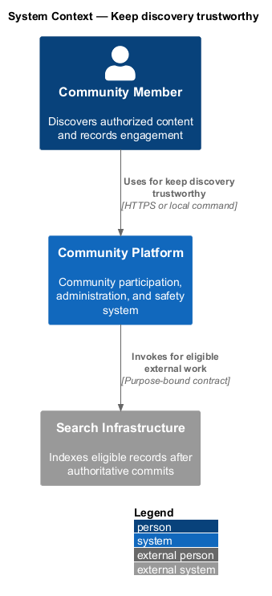
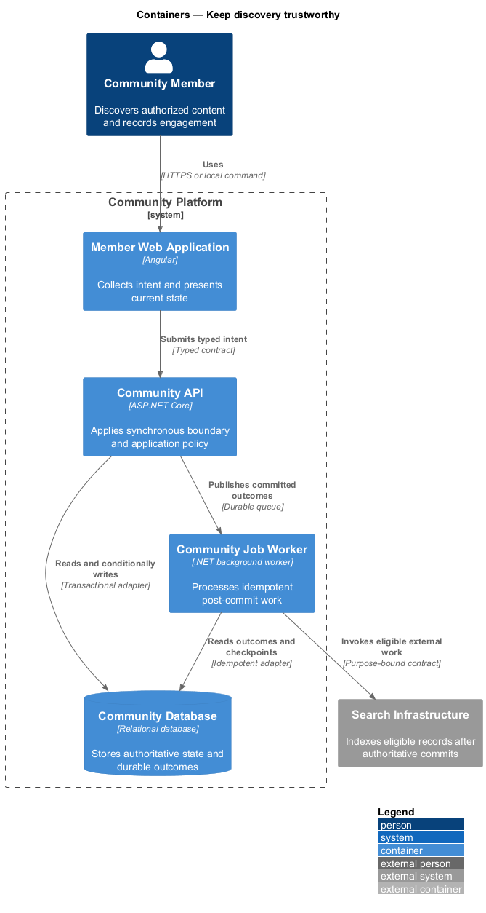
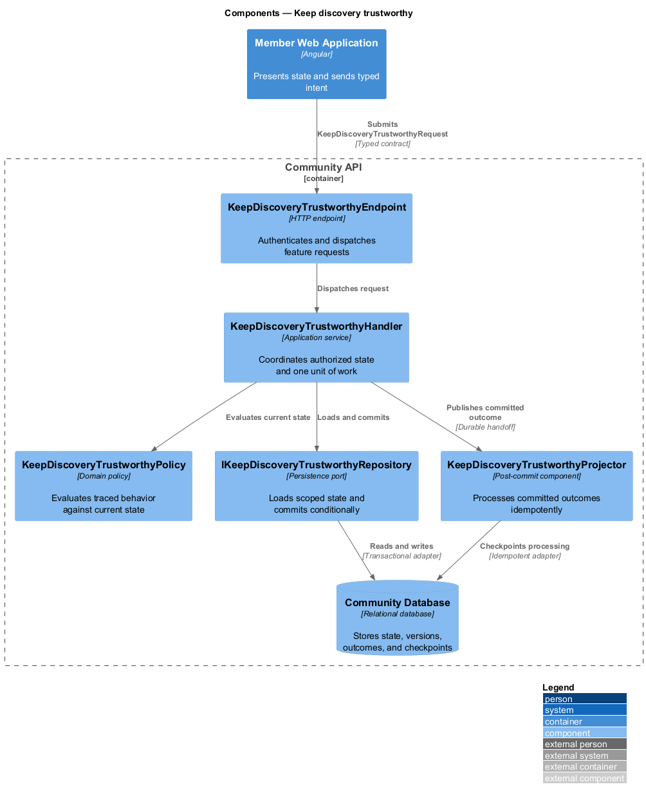
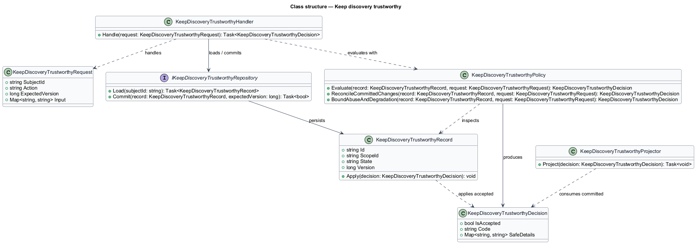
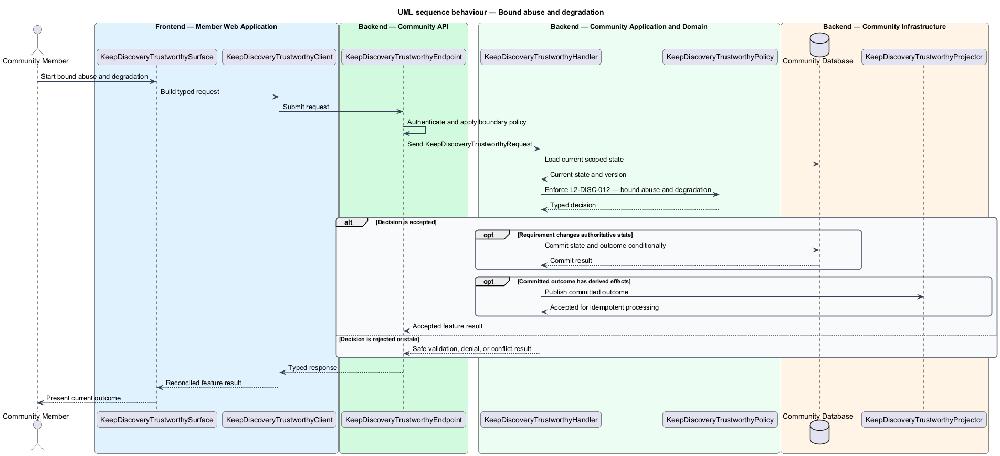

# Keep discovery trustworthy

## Overview

Community Starter is a community platform divided into product and platform subsystems. The
Feeds, search, and engagement subsystem owns this feature.

*keep discovery trustworthy* — subsystem capability that covers reconcile committed changes and bound abuse and degradation

Feeds and Search results help an Account find permitted Posts, Events, Communities, Profiles, and Tags; Reactions and Bookmarks let the Account engage without changing content ownership. Every projection is advisory and server-filtered against current Community, Membership, relationship, and content state. The platform shall reconcile committed changes, tolerate projection failure, and bound automated Feed, Search, Reaction, and Bookmark abuse without leaking cross-Community state.

The feature groups 2 traced behaviors behind one policy and evidence
boundary: `L2-DISC-011` and `L2-DISC-012`. Authoritative state commits before projections, delivery, or external work reports
success.

## Description

The repository contains specifications but no application implementation. This greenfield slice
defines the following building blocks across `Member Web Application`, `Community API`, the
application and domain layer, and infrastructure.

- **`KeepDiscoveryTrustworthySurface`** — page component in `Member Web Application`. It presents current
  state, submits user intent, and reconciles the typed result.
- **`KeepDiscoveryTrustworthyClient`** — typed Angular client. It creates `KeepDiscoveryTrustworthyRequest` values and maps stable
  transport failures into feature results.
- **`KeepDiscoveryTrustworthyEndpoint`** — HTTP endpoint in `Community API`. It authenticates the
  caller, applies boundary policy, and dispatches the request.
- **`KeepDiscoveryTrustworthyRequest`** — immutable request carrying `SubjectId`, `Action`, `ExpectedVersion`, and the
  scoped input needed by one traced behavior.
- **`KeepDiscoveryTrustworthyHandler`** — application service that loads authorized state through
  `IKeepDiscoveryTrustworthyRepository`, invokes `KeepDiscoveryTrustworthyPolicy`, and commits an accepted transition.
- **`KeepDiscoveryTrustworthyPolicy`** — domain policy that evaluates current state and returns a typed
  `KeepDiscoveryTrustworthyDecision` without performing external work.
- **`KeepDiscoveryTrustworthyRecord`** — authoritative record containing the feature state, scope, and concurrency
  version.
- **`IKeepDiscoveryTrustworthyRepository`** — persistence port that loads scoped state and commits one conditional
  unit of work.
- **`KeepDiscoveryTrustworthyProjector`** — idempotent post-commit component in `Community Job Worker`. It updates
  eligible projections and invokes configured external providers.

`KeepDiscoveryTrustworthyPolicy` exposes one named operation for each traced behavior:

- **`KeepDiscoveryTrustworthyPolicy.ReconcileCommittedChanges(record, request)`** — evaluates `L2-DISC-011` (reconcile committed changes) and returns a typed decision before any state change.
- **`KeepDiscoveryTrustworthyPolicy.BoundAbuseAndDegradation(record, request)`** — evaluates `L2-DISC-012` (bound abuse and degradation) and returns a typed decision before any state change.

## Requirements

The feature realizes the following level-2 (L2) requirements. Each row preserves the specification
identifier, its level-1 (L1) parent, and the requirement statement verbatim.

| L2 ID | Refines (L1) | Requirement |
|-------|--------------|-------------|
| `L2-DISC-011` | `L1-DISC-004` | Committed content, Event, and relationship changes propagate idempotently to Feed, Search, Reaction, and Bookmark projections; clients reconcile realtime hints with authoritative reads after gaps or conflict. |
| `L2-DISC-012` | `L1-DISC-004` | Feed, Search, Reaction, and Bookmark operations enforce query, pagination, frequency, and workload bounds by Account and broader risk context, with privacy-safe failure and deliberate degradation. |

## Diagrams

### System context

The `Community Member` uses `Community Platform` for the feature. The system invokes
`Search Infrastructure` only for configured external work after authoritative decisions.

### Containers

`Member Web Application` collects intent, `Community API` applies the synchronous boundary,
and `Community Database` holds authoritative state. `Community Job Worker` handles eligible
post-commit work against `Search Infrastructure`.

### Components

Inside `Community API`, `KeepDiscoveryTrustworthyEndpoint` dispatches `KeepDiscoveryTrustworthyHandler`. The handler evaluates
`KeepDiscoveryTrustworthyPolicy`, persists through `IKeepDiscoveryTrustworthyRepository`, and hands committed outcomes to
`KeepDiscoveryTrustworthyProjector`.

### Class structure

`KeepDiscoveryTrustworthyHandler` depends on the immutable request, domain policy, and repository port.
`KeepDiscoveryTrustworthyRecord` owns versioned state, while `KeepDiscoveryTrustworthyProjector` consumes committed results.

### Behaviour — reconcile committed changes

The interaction loads current scoped state before `KeepDiscoveryTrustworthyPolicy` enforces
`L2-DISC-011`. Rejected decisions return without changing authoritative state; accepted
state changes commit before optional derived work starts.

### Behaviour — bound abuse and degradation

The interaction loads current scoped state before `KeepDiscoveryTrustworthyPolicy` enforces
`L2-DISC-012`. Rejected decisions return without changing authoritative state; accepted
state changes commit before optional derived work starts.

