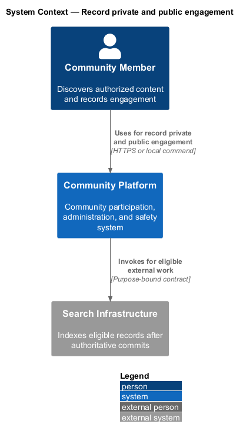
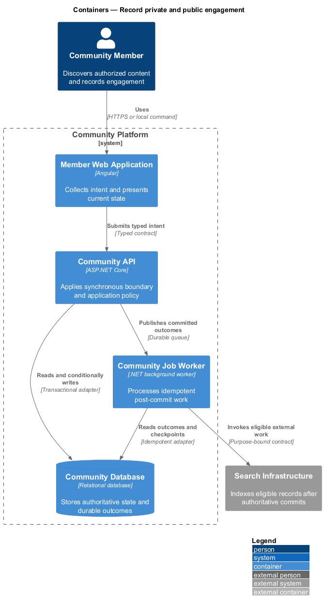
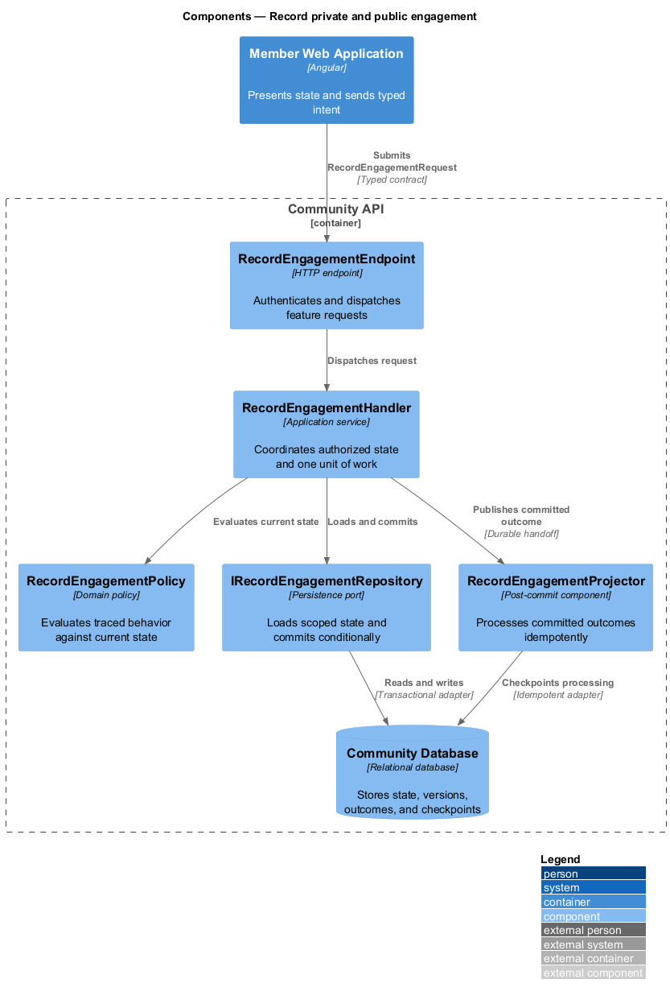
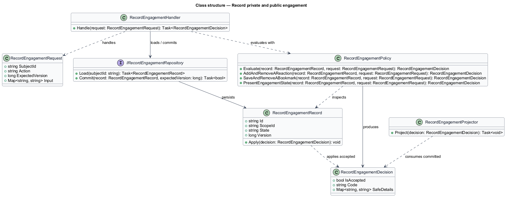
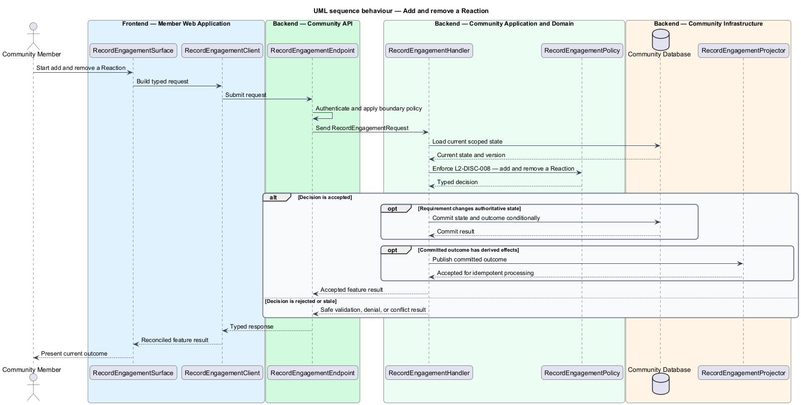
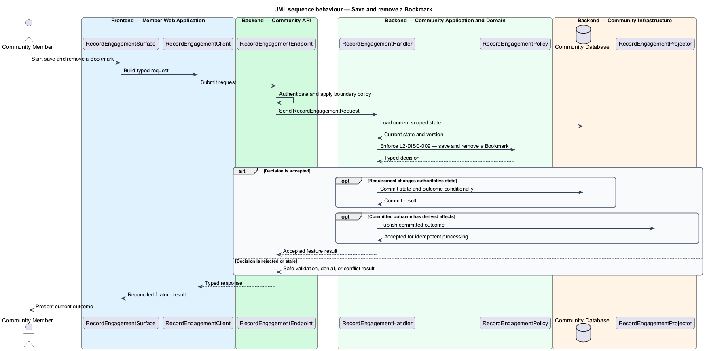
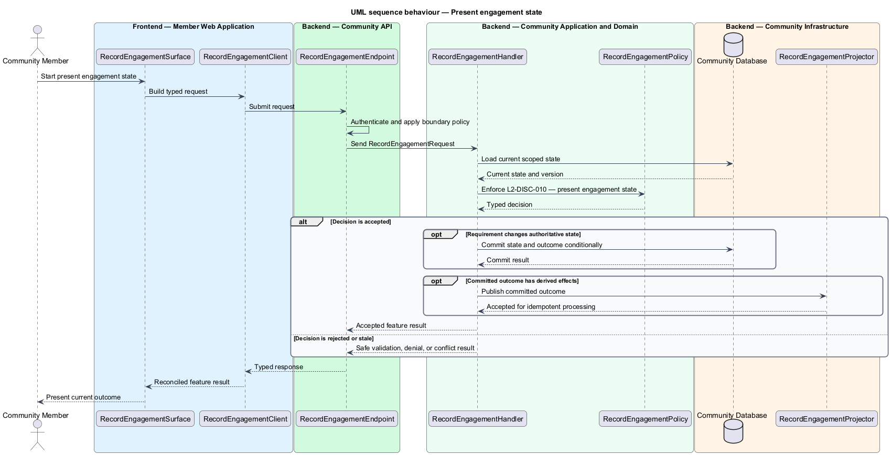

# Record private and public engagement

## Overview

Community Starter is a community platform divided into product and platform subsystems. The
Feeds, search, and engagement subsystem owns this feature.

*record private and public engagement* — subsystem capability that covers add and remove a Reaction, save and remove a Bookmark, and present engagement state

Feeds and Search results help an Account find permitted Posts, Events, Communities, Profiles, and Tags; Reactions and Bookmarks let the Account engage without changing content ownership. Every projection is advisory and server-filtered against current Community, Membership, relationship, and content state. The platform shall let eligible Accounts create and remove Reactions and Bookmarks exactly once while keeping private engagement private and public counts consistent with current visibility.

The feature groups 3 traced behaviors behind one policy and evidence
boundary: `L2-DISC-008`, `L2-DISC-009`, and `L2-DISC-010`. Authoritative state commits before projections, delivery, or external work reports
success.

## Description

The repository contains specifications but no application implementation. This greenfield slice
defines the following building blocks across `Member Web Application`, `Community API`, the
application and domain layer, and infrastructure.

- **`RecordEngagementSurface`** — page component in `Member Web Application`. It presents current
  state, submits user intent, and reconciles the typed result.
- **`RecordEngagementClient`** — typed Angular client. It creates `RecordEngagementRequest` values and maps stable
  transport failures into feature results.
- **`RecordEngagementEndpoint`** — HTTP endpoint in `Community API`. It authenticates the
  caller, applies boundary policy, and dispatches the request.
- **`RecordEngagementRequest`** — immutable request carrying `SubjectId`, `Action`, `ExpectedVersion`, and the
  scoped input needed by one traced behavior.
- **`RecordEngagementHandler`** — application service that loads authorized state through
  `IRecordEngagementRepository`, invokes `RecordEngagementPolicy`, and commits an accepted transition.
- **`RecordEngagementPolicy`** — domain policy that evaluates current state and returns a typed
  `RecordEngagementDecision` without performing external work.
- **`RecordEngagementRecord`** — authoritative record containing the feature state, scope, and concurrency
  version.
- **`IRecordEngagementRepository`** — persistence port that loads scoped state and commits one conditional
  unit of work.
- **`RecordEngagementProjector`** — idempotent post-commit component in `Community Job Worker`. It updates
  eligible projections and invokes configured external providers.

`RecordEngagementPolicy` exposes one named operation for each traced behavior:

- **`RecordEngagementPolicy.AddAndRemoveAReaction(record, request)`** — evaluates `L2-DISC-008` (add and remove a Reaction) and returns a typed decision before any state change.
- **`RecordEngagementPolicy.SaveAndRemoveABookmark(record, request)`** — evaluates `L2-DISC-009` (save and remove a Bookmark) and returns a typed decision before any state change.
- **`RecordEngagementPolicy.PresentEngagementState(record, request)`** — evaluates `L2-DISC-010` (present engagement state) and returns a typed decision before any state change.

## Requirements

The feature realizes the following level-2 (L2) requirements. Each row preserves the specification
identifier, its level-1 (L1) parent, and the requirement statement verbatim.

| L2 ID | Refines (L1) | Requirement |
|-------|--------------|-------------|
| `L2-DISC-008` | `L1-DISC-003` | An eligible Account can add, change where supported, or remove its bounded Reaction on accessible Post or Comment content in the same Community, exactly once per declared Reaction policy. |
| `L2-DISC-009` | `L1-DISC-003` | A Bookmark is private to its owning Account, references accessible content, is unique per target, and never grants continued access after content or Community authorization changes. |
| `L2-DISC-010` | `L1-DISC-003` | Reaction summaries and the current Account's Bookmark/Reaction state are derived from committed, visible records and follow explicit disclosure, privacy-threshold, and moderation policy. |

## Diagrams

### System context

The `Community Member` uses `Community Platform` for the feature. The system invokes
`Search Infrastructure` only for configured external work after authoritative decisions.

### Containers

`Member Web Application` collects intent, `Community API` applies the synchronous boundary,
and `Community Database` holds authoritative state. `Community Job Worker` handles eligible
post-commit work against `Search Infrastructure`.

### Components

Inside `Community API`, `RecordEngagementEndpoint` dispatches `RecordEngagementHandler`. The handler evaluates
`RecordEngagementPolicy`, persists through `IRecordEngagementRepository`, and hands committed outcomes to
`RecordEngagementProjector`.

### Class structure

`RecordEngagementHandler` depends on the immutable request, domain policy, and repository port.
`RecordEngagementRecord` owns versioned state, while `RecordEngagementProjector` consumes committed results.

### Behaviour — add and remove a Reaction

The interaction loads current scoped state before `RecordEngagementPolicy` enforces
`L2-DISC-008`. Rejected decisions return without changing authoritative state; accepted
state changes commit before optional derived work starts.

### Behaviour — save and remove a Bookmark

The interaction loads current scoped state before `RecordEngagementPolicy` enforces
`L2-DISC-009`. Rejected decisions return without changing authoritative state; accepted
state changes commit before optional derived work starts.

### Behaviour — present engagement state

The interaction loads current scoped state before `RecordEngagementPolicy` enforces
`L2-DISC-010`. Rejected decisions return without changing authoritative state; accepted
state changes commit before optional derived work starts.

