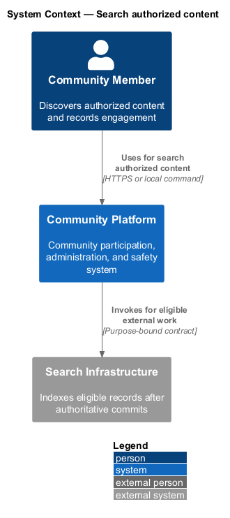
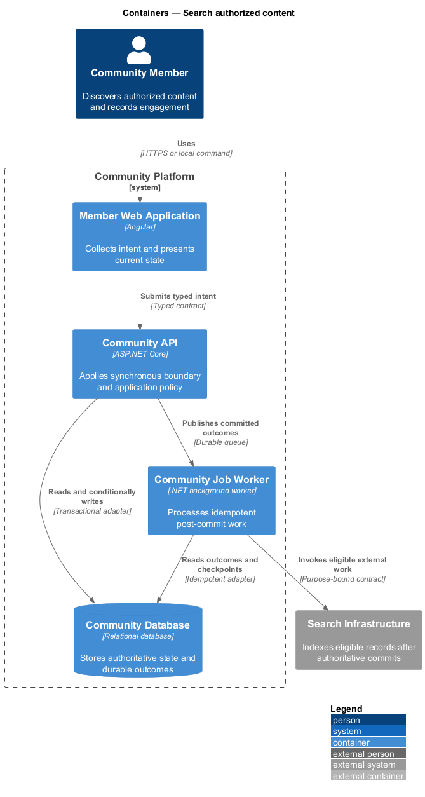
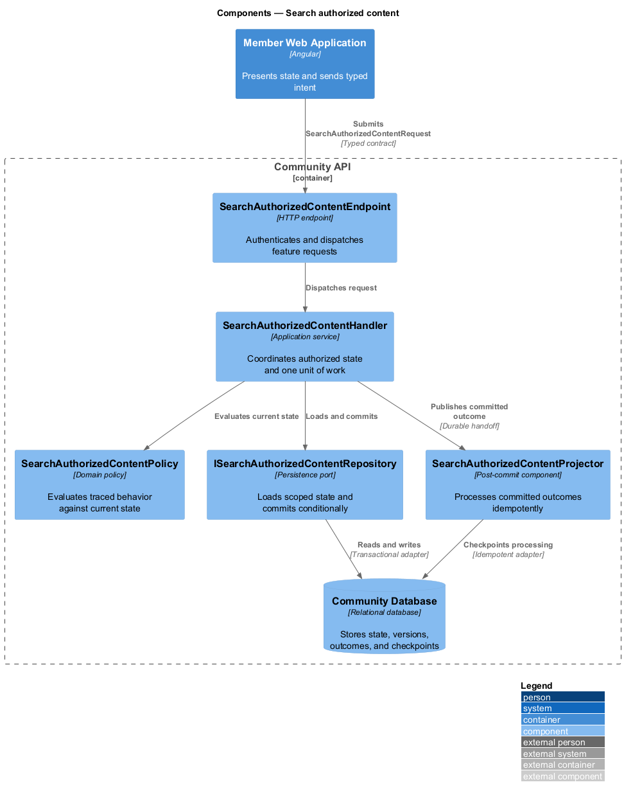
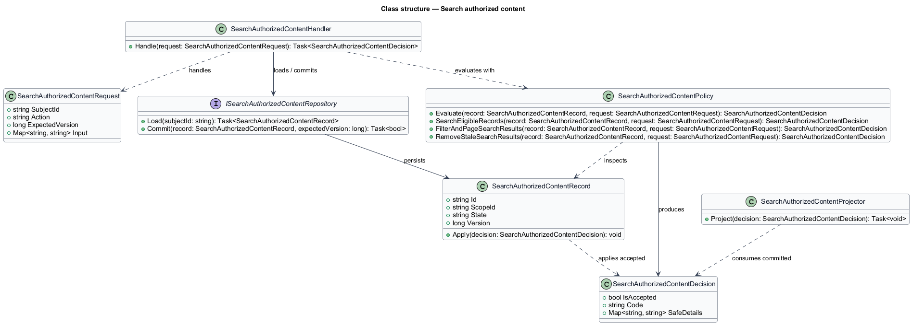
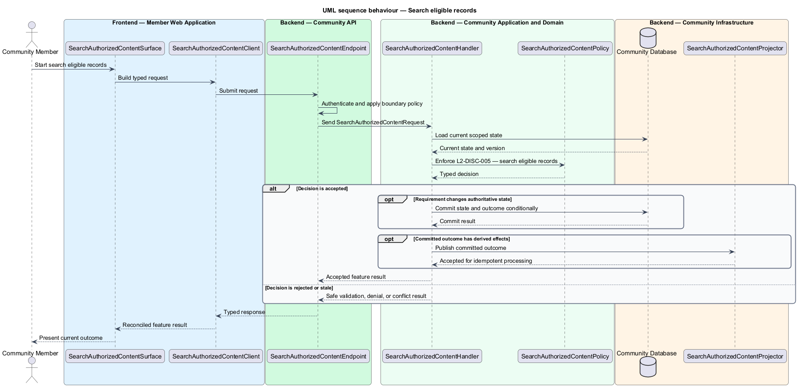

# Search authorized content

## Overview

Community Starter is a community platform divided into product and platform subsystems. The
Feeds, search, and engagement subsystem owns this feature.

*search authorized content* — subsystem capability that covers search eligible records, filter and page Search results, and remove stale Search results

Feeds and Search results help an Account find permitted Posts, Events, Communities, Profiles, and Tags; Reactions and Bookmarks let the Account engage without changing content ownership. Every projection is advisory and server-filtered against current Community, Membership, relationship, and content state. The platform shall search supported nouns with bounded queries, useful filters, stable results, and authoritative privacy filtering even when indexes or caches lag current state.

The feature groups 3 traced behaviors behind one policy and evidence
boundary: `L2-DISC-005`, `L2-DISC-006`, and `L2-DISC-007`. Authoritative state commits before projections, delivery, or external work reports
success.

## Description

The repository contains specifications but no application implementation. This greenfield slice
defines the following building blocks across `Member Web Application`, `Community API`, the
application and domain layer, and infrastructure.

- **`SearchAuthorizedContentSurface`** — page component in `Member Web Application`. It presents current
  state, submits user intent, and reconciles the typed result.
- **`SearchAuthorizedContentClient`** — typed Angular client. It creates `SearchAuthorizedContentRequest` values and maps stable
  transport failures into feature results.
- **`SearchAuthorizedContentEndpoint`** — HTTP endpoint in `Community API`. It authenticates the
  caller, applies boundary policy, and dispatches the request.
- **`SearchAuthorizedContentRequest`** — immutable request carrying `SubjectId`, `Action`, `ExpectedVersion`, and the
  scoped input needed by one traced behavior.
- **`SearchAuthorizedContentHandler`** — application service that loads authorized state through
  `ISearchAuthorizedContentRepository`, invokes `SearchAuthorizedContentPolicy`, and commits an accepted transition.
- **`SearchAuthorizedContentPolicy`** — domain policy that evaluates current state and returns a typed
  `SearchAuthorizedContentDecision` without performing external work.
- **`SearchAuthorizedContentRecord`** — authoritative record containing the feature state, scope, and concurrency
  version.
- **`ISearchAuthorizedContentRepository`** — persistence port that loads scoped state and commits one conditional
  unit of work.
- **`SearchAuthorizedContentProjector`** — idempotent post-commit component in `Community Job Worker`. It updates
  eligible projections and invokes configured external providers.

`SearchAuthorizedContentPolicy` exposes one named operation for each traced behavior:

- **`SearchAuthorizedContentPolicy.SearchEligibleRecords(record, request)`** — evaluates `L2-DISC-005` (search eligible records) and returns a typed decision before any state change.
- **`SearchAuthorizedContentPolicy.FilterAndPageSearchResults(record, request)`** — evaluates `L2-DISC-006` (filter and page Search results) and returns a typed decision before any state change.
- **`SearchAuthorizedContentPolicy.RemoveStaleSearchResults(record, request)`** — evaluates `L2-DISC-007` (remove stale Search results) and returns a typed decision before any state change.

## Requirements

The feature realizes the following level-2 (L2) requirements. Each row preserves the specification
identifier, its level-1 (L1) parent, and the requirement statement verbatim.

| L2 ID | Refines (L1) | Requirement |
|-------|--------------|-------------|
| `L2-DISC-005` | `L1-DISC-002` | Search returns bounded Search results for supported Posts, Events, Communities, Profiles, and Tags only after current authoritative Community, Space, Membership, audience, visibility, Block, Moderation Action, Event lifecycle, and retention filtering. |
| `L2-DISC-006` | `L1-DISC-002` | Search filters, sorting, facets, and cursors are validated, scope-bound, and calculated only from the result population the Account is permitted to know about. |
| `L2-DISC-007` | `L1-DISC-002` | Published, edited, rescheduled, cancelled, completed, restricted, removed, and restored records drive retryable Search projection changes, while result-time authorization remains the final disclosure boundary. |

## Diagrams

### System context

The `Community Member` uses `Community Platform` for the feature. The system invokes
`Search Infrastructure` only for configured external work after authoritative decisions.

### Containers

`Member Web Application` collects intent, `Community API` applies the synchronous boundary,
and `Community Database` holds authoritative state. `Community Job Worker` handles eligible
post-commit work against `Search Infrastructure`.

### Components

Inside `Community API`, `SearchAuthorizedContentEndpoint` dispatches `SearchAuthorizedContentHandler`. The handler evaluates
`SearchAuthorizedContentPolicy`, persists through `ISearchAuthorizedContentRepository`, and hands committed outcomes to
`SearchAuthorizedContentProjector`.

### Class structure

`SearchAuthorizedContentHandler` depends on the immutable request, domain policy, and repository port.
`SearchAuthorizedContentRecord` owns versioned state, while `SearchAuthorizedContentProjector` consumes committed results.

### Behaviour — search eligible records

The interaction loads current scoped state before `SearchAuthorizedContentPolicy` enforces
`L2-DISC-005`. Rejected decisions return without changing authoritative state; accepted
state changes commit before optional derived work starts.

### Behaviour — filter and page Search results

The interaction loads current scoped state before `SearchAuthorizedContentPolicy` enforces
`L2-DISC-006`. Rejected decisions return without changing authoritative state; accepted
state changes commit before optional derived work starts.

### Behaviour — remove stale Search results

The interaction loads current scoped state before `SearchAuthorizedContentPolicy` enforces
`L2-DISC-007`. Rejected decisions return without changing authoritative state; accepted
state changes commit before optional derived work starts.

