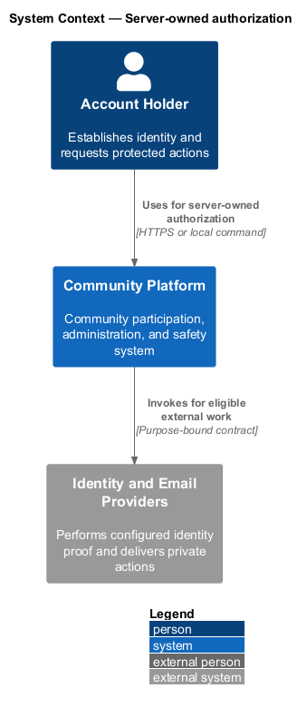
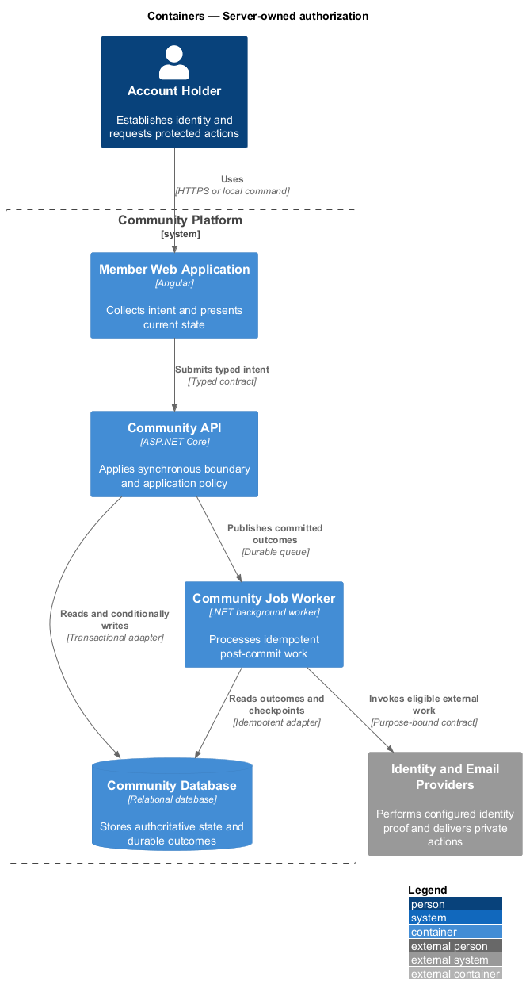
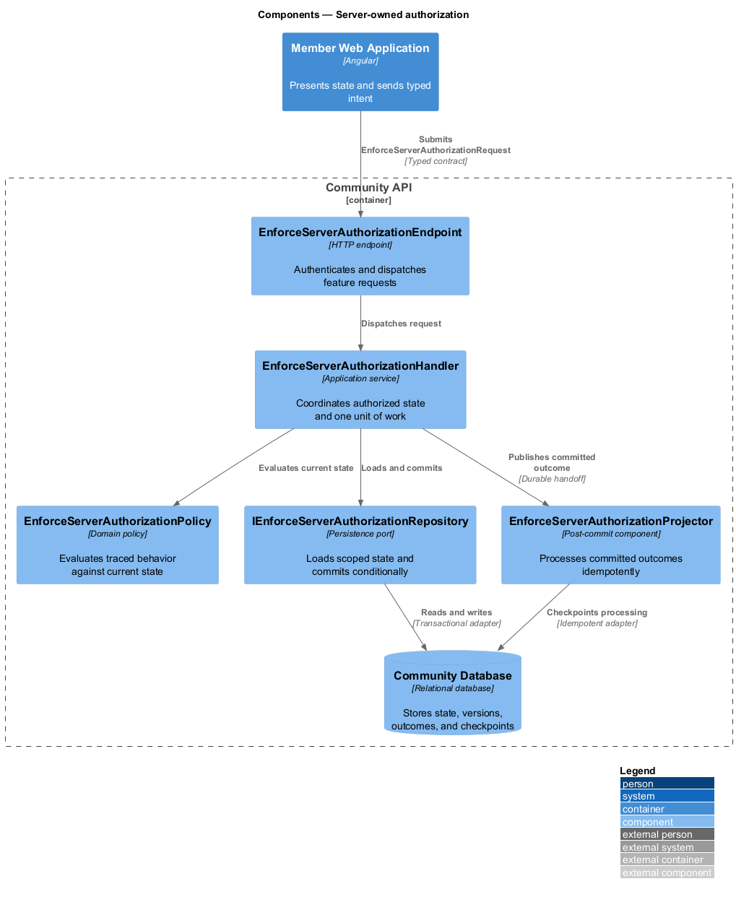
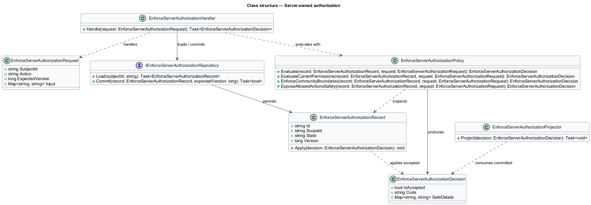
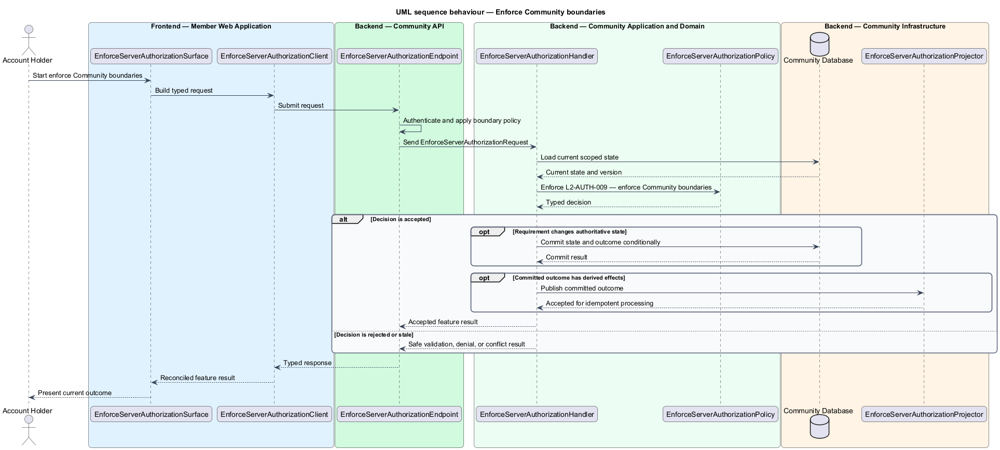
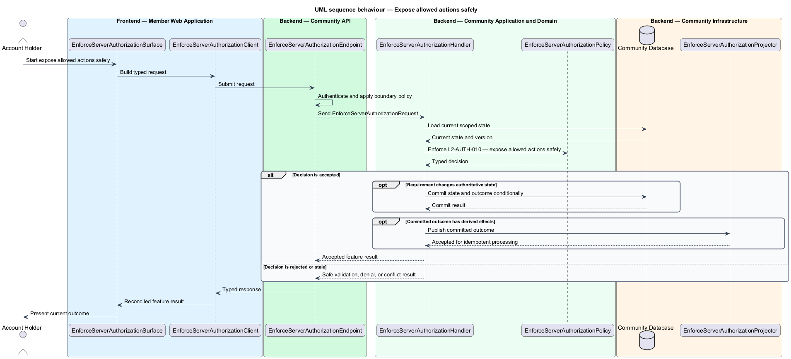

# Server-owned authorization

## Overview

Community Starter is a community platform divided into product and platform subsystems. The
Identity and access subsystem owns this feature.

*server-owned authorization* — subsystem capability that covers evaluate current Permissions, enforce Community boundaries, and expose allowed actions safely

Accounts need secure, recoverable access across many Communities without allowing credentials, sessions, Roles, or Permissions from one Community to grant access in another. Authentication and authorization decisions are server-owned; clients may explain allowed actions but never establish them. The platform shall authorize every protected action from current Account, Community, Membership, Role, Permission, and resource state rather than trusting client-supplied scope or presentation.

The feature groups 3 traced behaviors behind one policy and evidence
boundary: `L2-AUTH-008`, `L2-AUTH-009`, and `L2-AUTH-010`. Authoritative state commits before projections, delivery, or external work reports
success.

## Description

The repository contains specifications but no application implementation. This greenfield slice
defines the following building blocks across `Member Web Application`, `Community API`, the
application and domain layer, and infrastructure.

- **`EnforceServerAuthorizationSurface`** — page component in `Member Web Application`. It presents current
  state, submits user intent, and reconciles the typed result.
- **`EnforceServerAuthorizationClient`** — typed Angular client. It creates `EnforceServerAuthorizationRequest` values and maps stable
  transport failures into feature results.
- **`EnforceServerAuthorizationEndpoint`** — HTTP endpoint in `Community API`. It authenticates the
  caller, applies boundary policy, and dispatches the request.
- **`EnforceServerAuthorizationRequest`** — immutable request carrying `SubjectId`, `Action`, `ExpectedVersion`, and the
  scoped input needed by one traced behavior.
- **`EnforceServerAuthorizationHandler`** — application service that loads authorized state through
  `IEnforceServerAuthorizationRepository`, invokes `EnforceServerAuthorizationPolicy`, and commits an accepted transition.
- **`EnforceServerAuthorizationPolicy`** — domain policy that evaluates current state and returns a typed
  `EnforceServerAuthorizationDecision` without performing external work.
- **`EnforceServerAuthorizationRecord`** — authoritative record containing the feature state, scope, and concurrency
  version.
- **`IEnforceServerAuthorizationRepository`** — persistence port that loads scoped state and commits one conditional
  unit of work.
- **`EnforceServerAuthorizationProjector`** — idempotent post-commit component in `Community Job Worker`. It updates
  eligible projections and invokes configured external providers.

`EnforceServerAuthorizationPolicy` exposes one named operation for each traced behavior:

- **`EnforceServerAuthorizationPolicy.EvaluateCurrentPermissions(record, request)`** — evaluates `L2-AUTH-008` (evaluate current Permissions) and returns a typed decision before any state change.
- **`EnforceServerAuthorizationPolicy.EnforceCommunityBoundaries(record, request)`** — evaluates `L2-AUTH-009` (enforce Community boundaries) and returns a typed decision before any state change.
- **`EnforceServerAuthorizationPolicy.ExposeAllowedActionsSafely(record, request)`** — evaluates `L2-AUTH-010` (expose allowed actions safely) and returns a typed decision before any state change.

## Requirements

The feature realizes the following level-2 (L2) requirements. Each row preserves the specification
identifier, its level-1 (L1) parent, and the requirement statement verbatim.

| L2 ID | Refines (L1) | Requirement |
|-------|--------------|-------------|
| `L2-AUTH-008` | `L1-AUTH-003` | Each protected Community action is authorized on the server from the current Account lifecycle, Moderation Actions, active Membership, assigned Role, effective Permissions, and target state at request time. |
| `L2-AUTH-009` | `L1-AUTH-003` | Every Community-owned read and mutation is scoped by the server to the target Community and current Membership; a supplied Community identifier is never proof of access. |
| `L2-AUTH-010` | `L1-AUTH-003` | Responses may expose current allowed actions and safe denial reasons so clients can explain state, but those fields are advisory snapshots and never replace server authorization. |

## Diagrams

### System context

The `Account Holder` uses `Community Platform` for the feature. The system invokes
`Identity and Email Providers` only for configured external work after authoritative decisions.

### Containers

`Member Web Application` collects intent, `Community API` applies the synchronous boundary,
and `Community Database` holds authoritative state. `Community Job Worker` handles eligible
post-commit work against `Identity and Email Providers`.

### Components

Inside `Community API`, `EnforceServerAuthorizationEndpoint` dispatches `EnforceServerAuthorizationHandler`. The handler evaluates
`EnforceServerAuthorizationPolicy`, persists through `IEnforceServerAuthorizationRepository`, and hands committed outcomes to
`EnforceServerAuthorizationProjector`.

### Class structure

`EnforceServerAuthorizationHandler` depends on the immutable request, domain policy, and repository port.
`EnforceServerAuthorizationRecord` owns versioned state, while `EnforceServerAuthorizationProjector` consumes committed results.

### Behaviour — evaluate current Permissions

The interaction loads current scoped state before `EnforceServerAuthorizationPolicy` enforces
`L2-AUTH-008`. Rejected decisions return without changing authoritative state; accepted
state changes commit before optional derived work starts.

### Behaviour — enforce Community boundaries

The interaction loads current scoped state before `EnforceServerAuthorizationPolicy` enforces
`L2-AUTH-009`. Rejected decisions return without changing authoritative state; accepted
state changes commit before optional derived work starts.

### Behaviour — expose allowed actions safely

The interaction loads current scoped state before `EnforceServerAuthorizationPolicy` enforces
`L2-AUTH-010`. Rejected decisions return without changing authoritative state; accepted
state changes commit before optional derived work starts.

