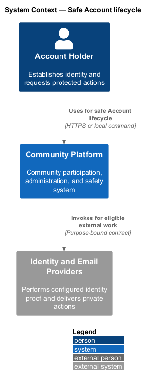
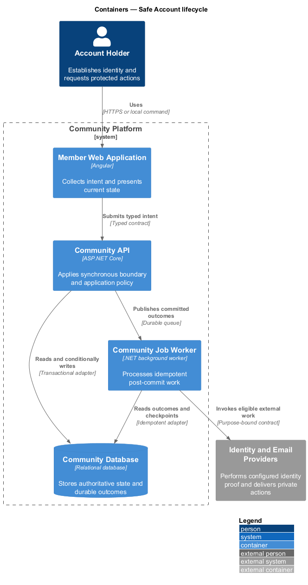
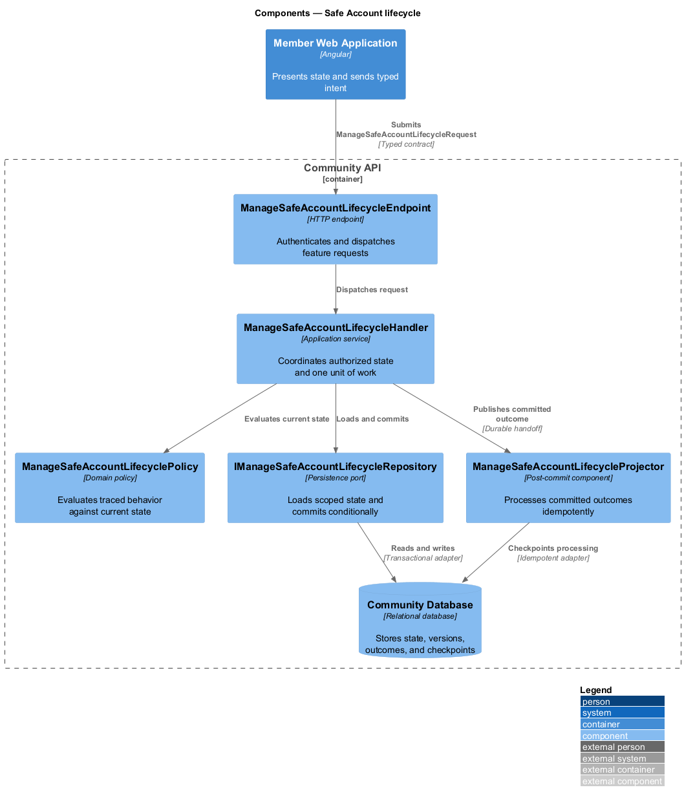
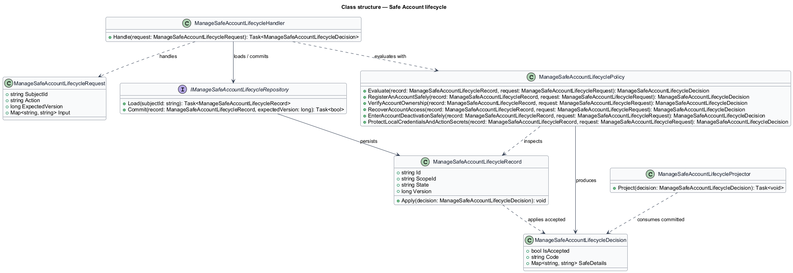
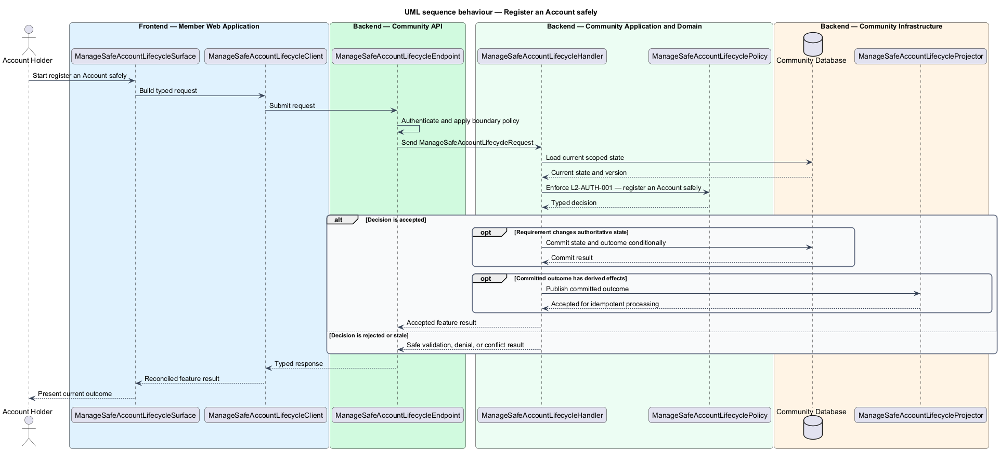
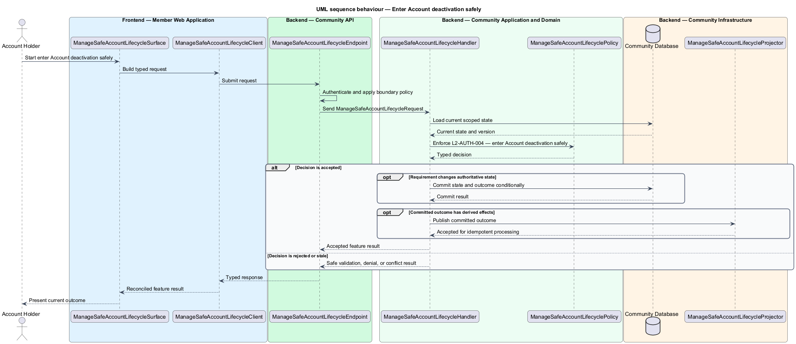
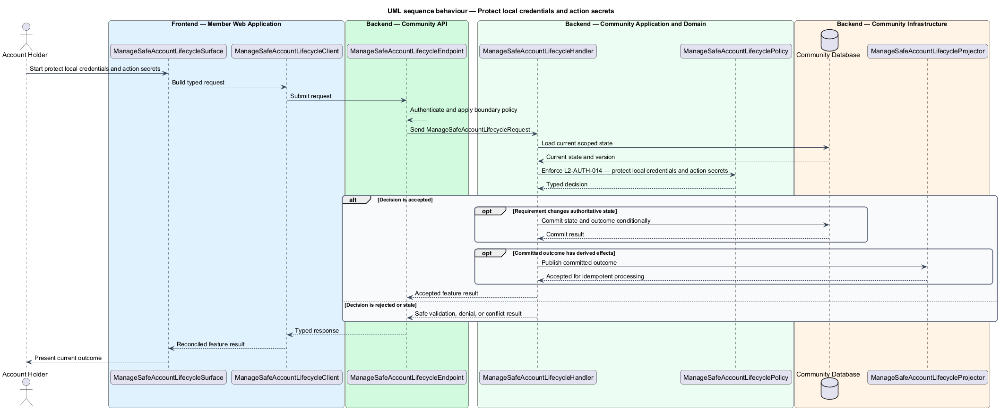

# Safe Account lifecycle

## Overview

Community Starter is a community platform divided into product and platform subsystems. The
Identity and access subsystem owns this feature.

*safe Account lifecycle* — subsystem capability that covers register an Account safely, verify Account ownership, recover Account access, enter Account deactivation safely, and protect local credentials and action secrets

Accounts need secure, recoverable access across many Communities without allowing credentials, sessions, Roles, or Permissions from one Community to grant access in another. Authentication and authorization decisions are server-owned; clients may explain allowed actions but never establish them. The platform shall create, verify, recover, deactivate, and securely retire an Account without disclosing whether an identifier is registered or leaving reusable recovery credentials.

The feature groups 5 traced behaviors behind one policy and evidence
boundary: `L2-AUTH-001`, `L2-AUTH-002`, `L2-AUTH-003`, `L2-AUTH-004`, and `L2-AUTH-014`. Authoritative state commits before projections, delivery, or external work reports
success.

## Description

The repository contains specifications but no application implementation. This greenfield slice
defines the following building blocks across `Member Web Application`, `Community API`, the
application and domain layer, and infrastructure.

- **`ManageSafeAccountLifecycleSurface`** — page component in `Member Web Application`. It presents current
  state, submits user intent, and reconciles the typed result.
- **`ManageSafeAccountLifecycleClient`** — typed Angular client. It creates `ManageSafeAccountLifecycleRequest` values and maps stable
  transport failures into feature results.
- **`ManageSafeAccountLifecycleEndpoint`** — HTTP endpoint in `Community API`. It authenticates the
  caller, applies boundary policy, and dispatches the request.
- **`ManageSafeAccountLifecycleRequest`** — immutable request carrying `SubjectId`, `Action`, `ExpectedVersion`, and the
  scoped input needed by one traced behavior.
- **`ManageSafeAccountLifecycleHandler`** — application service that loads authorized state through
  `IManageSafeAccountLifecycleRepository`, invokes `ManageSafeAccountLifecyclePolicy`, and commits an accepted transition.
- **`ManageSafeAccountLifecyclePolicy`** — domain policy that evaluates current state and returns a typed
  `ManageSafeAccountLifecycleDecision` without performing external work.
- **`ManageSafeAccountLifecycleRecord`** — authoritative record containing the feature state, scope, and concurrency
  version.
- **`IManageSafeAccountLifecycleRepository`** — persistence port that loads scoped state and commits one conditional
  unit of work.
- **`ManageSafeAccountLifecycleProjector`** — idempotent post-commit component in `Community Job Worker`. It updates
  eligible projections and invokes configured external providers.

`ManageSafeAccountLifecyclePolicy` exposes one named operation for each traced behavior:

- **`ManageSafeAccountLifecyclePolicy.RegisterAnAccountSafely(record, request)`** — evaluates `L2-AUTH-001` (register an Account safely) and returns a typed decision before any state change.
- **`ManageSafeAccountLifecyclePolicy.VerifyAccountOwnership(record, request)`** — evaluates `L2-AUTH-002` (verify Account ownership) and returns a typed decision before any state change.
- **`ManageSafeAccountLifecyclePolicy.RecoverAccountAccess(record, request)`** — evaluates `L2-AUTH-003` (recover Account access) and returns a typed decision before any state change.
- **`ManageSafeAccountLifecyclePolicy.EnterAccountDeactivationSafely(record, request)`** — evaluates `L2-AUTH-004` (enter Account deactivation safely) and returns a typed decision before any state change.
- **`ManageSafeAccountLifecyclePolicy.ProtectLocalCredentialsAndActionSecrets(record, request)`** — evaluates `L2-AUTH-014` (protect local credentials and action secrets) and returns a typed decision before any state change.

## Requirements

The feature realizes the following level-2 (L2) requirements. Each row preserves the specification
identifier, its level-1 (L1) parent, and the requirement statement verbatim.

| L2 ID | Refines (L1) | Requirement |
|-------|--------------|-------------|
| `L2-AUTH-001` | `L1-AUTH-001` | Registration creates at most one pending Account for a normalized sign-in identifier and does not grant authenticated or Community access before required verification succeeds. |
| `L2-AUTH-002` | `L1-AUTH-001` | A single-use, time-bounded verification action proves control of an Account identifier before that identifier is treated as verified; replacement is a versioned security transition, not an in-place string edit. |
| `L2-AUTH-003` | `L1-AUTH-001` | Recovery uses a private, single-use, time-bounded proof bound to the Account's current identifier and authentication epoch, and invalidates access that could remain under a displaced credential holder. |
| `L2-AUTH-004` | `L1-AUTH-001` | `active`, `deactivated`, `deletion-pending`, and `deleted` are the canonical Account lifecycle states. Deactivation is the one reversible `active → deactivated` transition; deletion is the separate privacy workflow. Identity enforces access effects, while the shared lifecycle policy resolves every required ownership and operational responsibility before either transition. |
| `L2-AUTH-014` | `L1-AUTH-001` | When local password credentials are enabled, each password shall be stored only as a uniquely salted, adaptive one-way hash using a reviewed memory-hard or identity-platform algorithm with versioned cost parameters. Verification, recovery, identifier-change, invitation, export, and other bearer action secrets shall be generated with cryptographic entropy and stored only as purpose-bound non-recoverable verifiers; database disclosure alone must not reveal a usable password or bearer action. |

## Diagrams

### System context

The `Account Holder` uses `Community Platform` for the feature. The system invokes
`Identity and Email Providers` only for configured external work after authoritative decisions.

### Containers

`Member Web Application` collects intent, `Community API` applies the synchronous boundary,
and `Community Database` holds authoritative state. `Community Job Worker` handles eligible
post-commit work against `Identity and Email Providers`.

### Components

Inside `Community API`, `ManageSafeAccountLifecycleEndpoint` dispatches `ManageSafeAccountLifecycleHandler`. The handler evaluates
`ManageSafeAccountLifecyclePolicy`, persists through `IManageSafeAccountLifecycleRepository`, and hands committed outcomes to
`ManageSafeAccountLifecycleProjector`.

### Class structure

`ManageSafeAccountLifecycleHandler` depends on the immutable request, domain policy, and repository port.
`ManageSafeAccountLifecycleRecord` owns versioned state, while `ManageSafeAccountLifecycleProjector` consumes committed results.

### Behaviour — register an Account safely

The interaction loads current scoped state before `ManageSafeAccountLifecyclePolicy` enforces
`L2-AUTH-001`. Rejected decisions return without changing authoritative state; accepted
state changes commit before optional derived work starts.

### Behaviour — verify Account ownership

The interaction loads current scoped state before `ManageSafeAccountLifecyclePolicy` enforces
`L2-AUTH-002`. Rejected decisions return without changing authoritative state; accepted
state changes commit before optional derived work starts.

### Behaviour — recover Account access

The interaction loads current scoped state before `ManageSafeAccountLifecyclePolicy` enforces
`L2-AUTH-003`. Rejected decisions return without changing authoritative state; accepted
state changes commit before optional derived work starts.

### Behaviour — enter Account deactivation safely

The interaction loads current scoped state before `ManageSafeAccountLifecyclePolicy` enforces
`L2-AUTH-004`. Rejected decisions return without changing authoritative state; accepted
state changes commit before optional derived work starts.

### Behaviour — protect local credentials and action secrets

The interaction loads current scoped state before `ManageSafeAccountLifecyclePolicy` enforces
`L2-AUTH-014`. Rejected decisions return without changing authoritative state; accepted
state changes commit before optional derived work starts.

