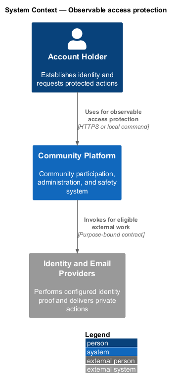
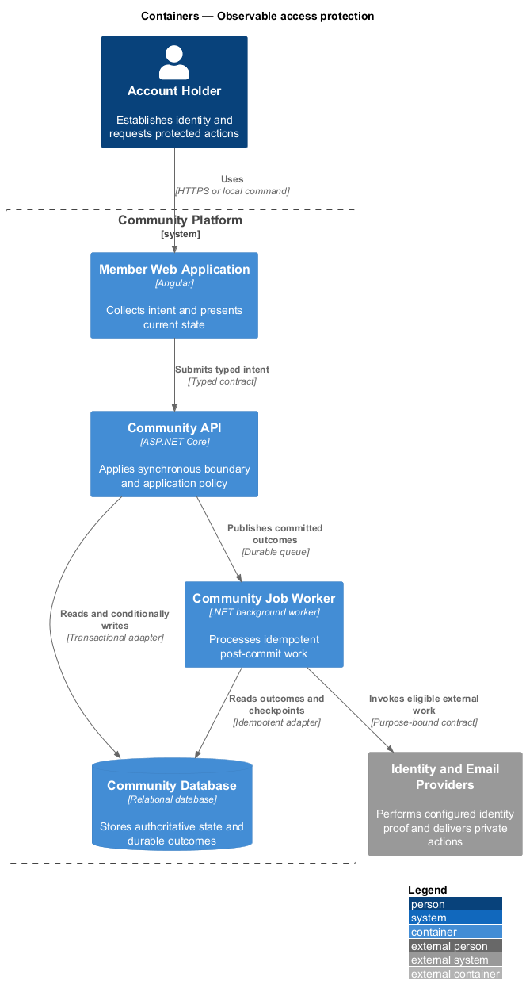
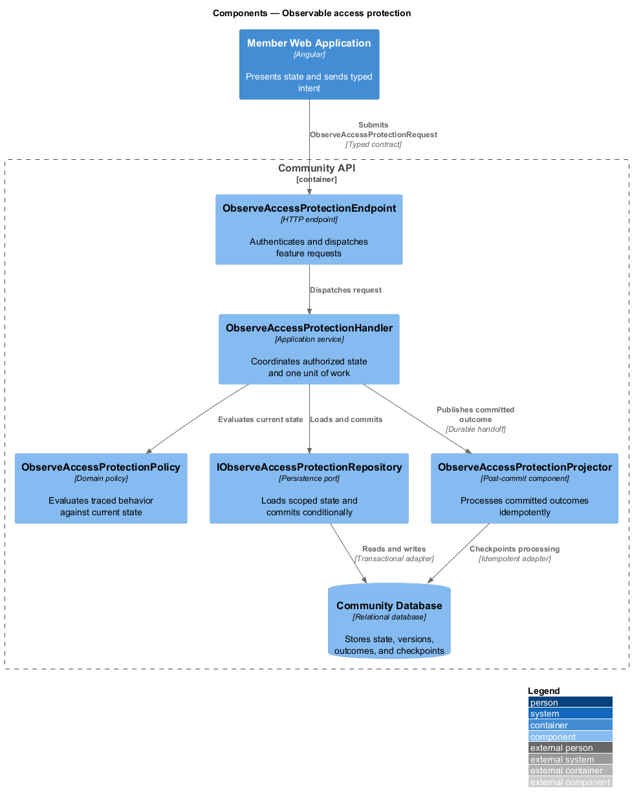
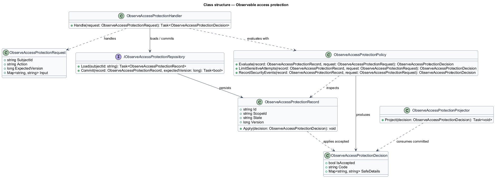
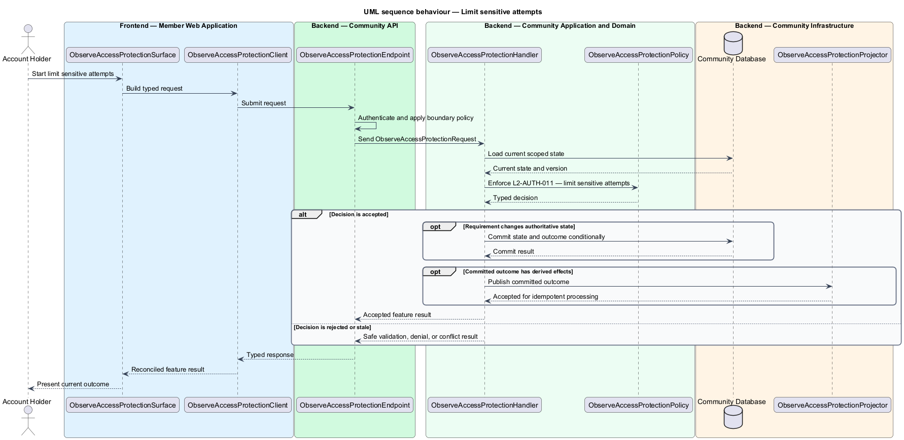
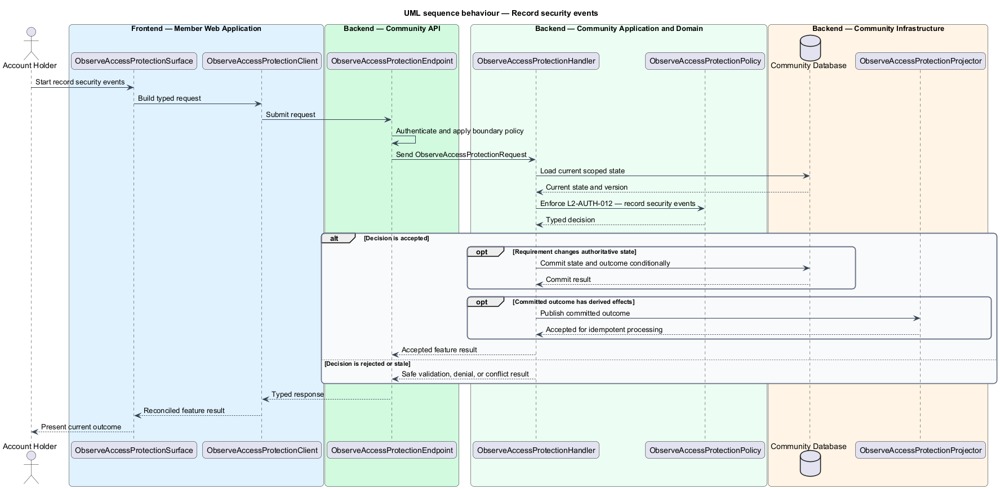

# Observable access protection

## Overview

Community Starter is a community platform divided into product and platform subsystems. The
Identity and access subsystem owns this feature.

*observable access protection* — subsystem capability that covers limit sensitive attempts and record security events

Accounts need secure, recoverable access across many Communities without allowing credentials, sessions, Roles, or Permissions from one Community to grant access in another. Authentication and authorization decisions are server-owned; clients may explain allowed actions but never establish them. The platform shall limit automated abuse and create privacy-safe evidence for security-sensitive Account and authorization events.

The feature groups 2 traced behaviors behind one policy and evidence
boundary: `L2-AUTH-011` and `L2-AUTH-012`. Authoritative state commits before projections, delivery, or external work reports
success.

## Description

The repository contains specifications but no application implementation. This greenfield slice
defines the following building blocks across `Member Web Application`, `Community API`, the
application and domain layer, and infrastructure.

- **`ObserveAccessProtectionSurface`** — page component in `Member Web Application`. It presents current
  state, submits user intent, and reconciles the typed result.
- **`ObserveAccessProtectionClient`** — typed Angular client. It creates `ObserveAccessProtectionRequest` values and maps stable
  transport failures into feature results.
- **`ObserveAccessProtectionEndpoint`** — HTTP endpoint in `Community API`. It authenticates the
  caller, applies boundary policy, and dispatches the request.
- **`ObserveAccessProtectionRequest`** — immutable request carrying `SubjectId`, `Action`, `ExpectedVersion`, and the
  scoped input needed by one traced behavior.
- **`ObserveAccessProtectionHandler`** — application service that loads authorized state through
  `IObserveAccessProtectionRepository`, invokes `ObserveAccessProtectionPolicy`, and commits an accepted transition.
- **`ObserveAccessProtectionPolicy`** — domain policy that evaluates current state and returns a typed
  `ObserveAccessProtectionDecision` without performing external work.
- **`ObserveAccessProtectionRecord`** — authoritative record containing the feature state, scope, and concurrency
  version.
- **`IObserveAccessProtectionRepository`** — persistence port that loads scoped state and commits one conditional
  unit of work.
- **`ObserveAccessProtectionProjector`** — idempotent post-commit component in `Community Job Worker`. It updates
  eligible projections and invokes configured external providers.

`ObserveAccessProtectionPolicy` exposes one named operation for each traced behavior:

- **`ObserveAccessProtectionPolicy.LimitSensitiveAttempts(record, request)`** — evaluates `L2-AUTH-011` (limit sensitive attempts) and returns a typed decision before any state change.
- **`ObserveAccessProtectionPolicy.RecordSecurityEvents(record, request)`** — evaluates `L2-AUTH-012` (record security events) and returns a typed decision before any state change.

## Requirements

The feature realizes the following level-2 (L2) requirements. Each row preserves the specification
identifier, its level-1 (L1) parent, and the requirement statement verbatim.

| L2 ID | Refines (L1) | Requirement |
|-------|--------------|-------------|
| `L2-AUTH-011` | `L1-AUTH-004` | The platform limits authentication, verification, recovery, invitation, and other security-sensitive attempts using privacy-safe controls that do not become an Account-enumeration oracle. |
| `L2-AUTH-012` | `L1-AUTH-004` | Security-significant Account, session, Membership, Role, and Permission changes produce durable, privacy-minimized audit evidence and appropriate Account notification after committed state changes. |

## Diagrams

### System context

The `Account Holder` uses `Community Platform` for the feature. The system invokes
`Identity and Email Providers` only for configured external work after authoritative decisions.

### Containers

`Member Web Application` collects intent, `Community API` applies the synchronous boundary,
and `Community Database` holds authoritative state. `Community Job Worker` handles eligible
post-commit work against `Identity and Email Providers`.

### Components

Inside `Community API`, `ObserveAccessProtectionEndpoint` dispatches `ObserveAccessProtectionHandler`. The handler evaluates
`ObserveAccessProtectionPolicy`, persists through `IObserveAccessProtectionRepository`, and hands committed outcomes to
`ObserveAccessProtectionProjector`.

### Class structure

`ObserveAccessProtectionHandler` depends on the immutable request, domain policy, and repository port.
`ObserveAccessProtectionRecord` owns versioned state, while `ObserveAccessProtectionProjector` consumes committed results.

### Behaviour — limit sensitive attempts

The interaction loads current scoped state before `ObserveAccessProtectionPolicy` enforces
`L2-AUTH-011`. Rejected decisions return without changing authoritative state; accepted
state changes commit before optional derived work starts.

### Behaviour — record security events

The interaction loads current scoped state before `ObserveAccessProtectionPolicy` enforces
`L2-AUTH-012`. Rejected decisions return without changing authoritative state; accepted
state changes commit before optional derived work starts.

