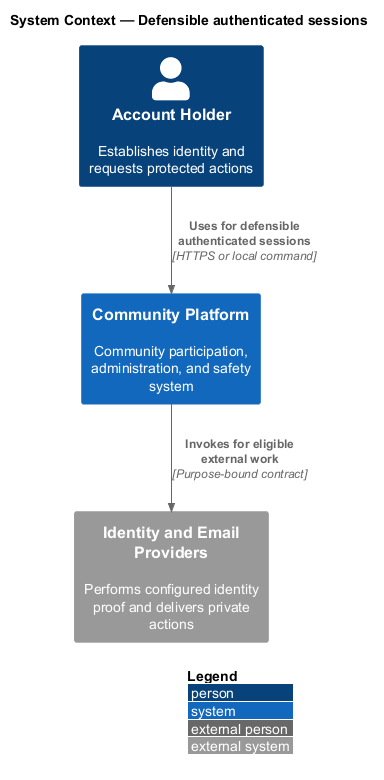
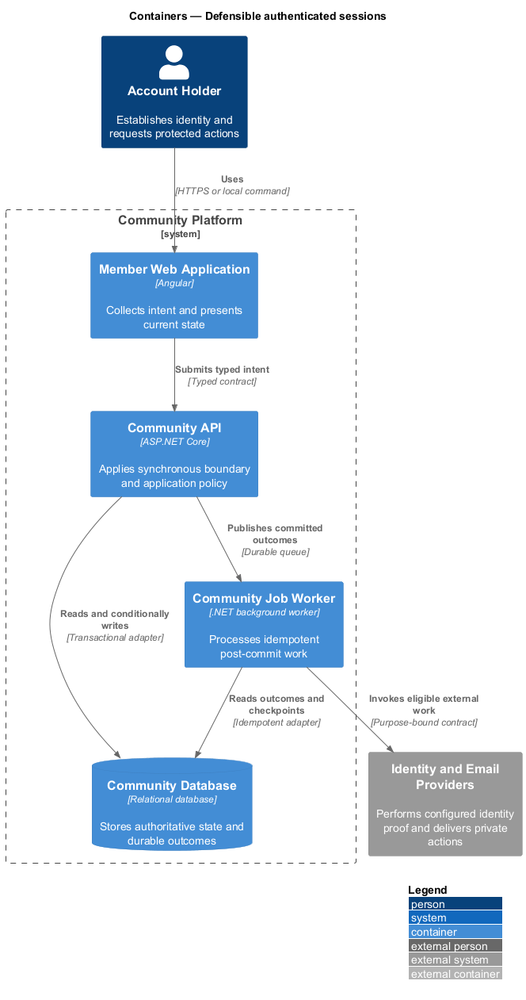
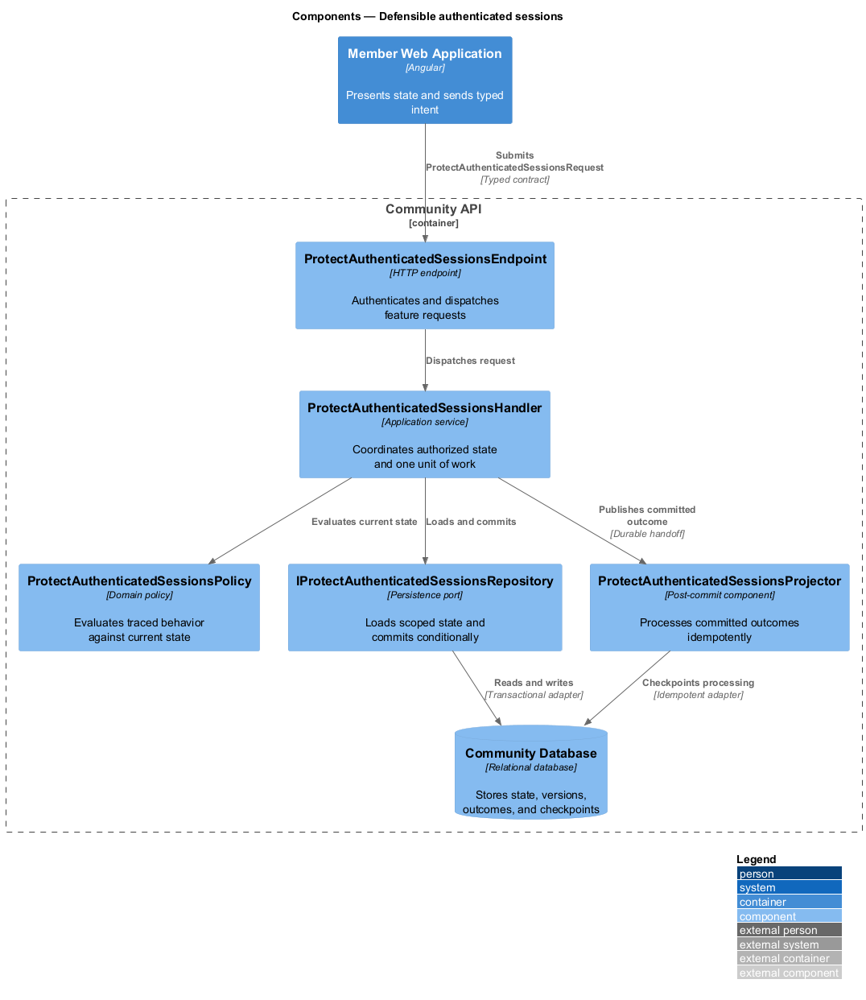
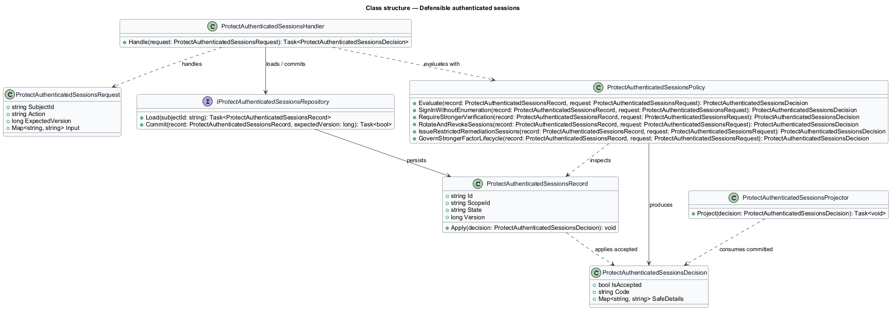
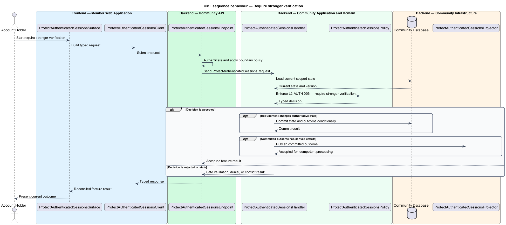
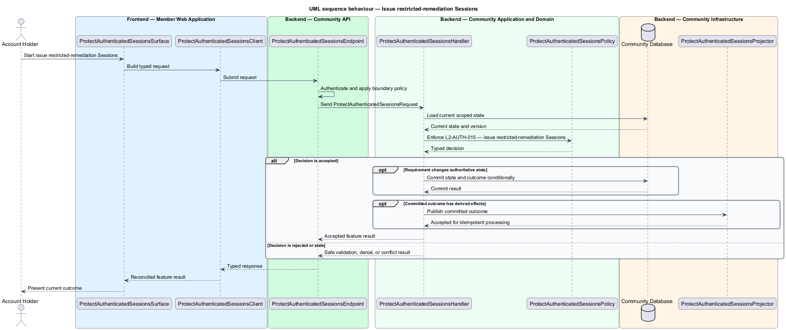

# Defensible authenticated sessions

## Overview

Community Starter is a community platform divided into product and platform subsystems. The
Identity and access subsystem owns this feature.

*defensible authenticated sessions* — subsystem capability that covers sign in without enumeration, require stronger verification, rotate and revoke sessions, issue restricted-remediation Sessions, and govern stronger-factor lifecycle

Accounts need secure, recoverable access across many Communities without allowing credentials, sessions, Roles, or Permissions from one Community to grant access in another. Authentication and authorization decisions are server-owned; clients may explain allowed actions but never establish them. The platform shall establish, strengthen, renew, and revoke authenticated sessions while limiting credential, token, replay, and redirect attacks.

The feature groups 5 traced behaviors behind one policy and evidence
boundary: `L2-AUTH-005`, `L2-AUTH-006`, `L2-AUTH-007`, `L2-AUTH-015`, and `L2-AUTH-016`. Authoritative state commits before projections, delivery, or external work reports
success.

## Description

The repository contains specifications but no application implementation. This greenfield slice
defines the following building blocks across `Member Web Application`, `Community API`, the
application and domain layer, and infrastructure.

- **`ProtectAuthenticatedSessionsSurface`** — page component in `Member Web Application`. It presents current
  state, submits user intent, and reconciles the typed result.
- **`ProtectAuthenticatedSessionsClient`** — typed Angular client. It creates `ProtectAuthenticatedSessionsRequest` values and maps stable
  transport failures into feature results.
- **`ProtectAuthenticatedSessionsEndpoint`** — HTTP endpoint in `Community API`. It authenticates the
  caller, applies boundary policy, and dispatches the request.
- **`ProtectAuthenticatedSessionsRequest`** — immutable request carrying `SubjectId`, `Action`, `ExpectedVersion`, and the
  scoped input needed by one traced behavior.
- **`ProtectAuthenticatedSessionsHandler`** — application service that loads authorized state through
  `IProtectAuthenticatedSessionsRepository`, invokes `ProtectAuthenticatedSessionsPolicy`, and commits an accepted transition.
- **`ProtectAuthenticatedSessionsPolicy`** — domain policy that evaluates current state and returns a typed
  `ProtectAuthenticatedSessionsDecision` without performing external work.
- **`ProtectAuthenticatedSessionsRecord`** — authoritative record containing the feature state, scope, and concurrency
  version.
- **`IProtectAuthenticatedSessionsRepository`** — persistence port that loads scoped state and commits one conditional
  unit of work.
- **`ProtectAuthenticatedSessionsProjector`** — idempotent post-commit component in `Community Job Worker`. It updates
  eligible projections and invokes configured external providers.

`ProtectAuthenticatedSessionsPolicy` exposes one named operation for each traced behavior:

- **`ProtectAuthenticatedSessionsPolicy.SignInWithoutEnumeration(record, request)`** — evaluates `L2-AUTH-005` (sign in without enumeration) and returns a typed decision before any state change.
- **`ProtectAuthenticatedSessionsPolicy.RequireStrongerVerification(record, request)`** — evaluates `L2-AUTH-006` (require stronger verification) and returns a typed decision before any state change.
- **`ProtectAuthenticatedSessionsPolicy.RotateAndRevokeSessions(record, request)`** — evaluates `L2-AUTH-007` (rotate and revoke sessions) and returns a typed decision before any state change.
- **`ProtectAuthenticatedSessionsPolicy.IssueRestrictedRemediationSessions(record, request)`** — evaluates `L2-AUTH-015` (issue restricted-remediation Sessions) and returns a typed decision before any state change.
- **`ProtectAuthenticatedSessionsPolicy.GovernStrongerFactorLifecycle(record, request)`** — evaluates `L2-AUTH-016` (govern stronger-factor lifecycle) and returns a typed decision before any state change.

## Requirements

The feature realizes the following level-2 (L2) requirements. Each row preserves the specification
identifier, its level-1 (L1) parent, and the requirement statement verbatim.

| L2 ID | Refines (L1) | Requirement |
|-------|--------------|-------------|
| `L2-AUTH-005` | `L1-AUTH-002` | Sign-in establishes an ordinary Session only after valid proof of an active eligible Account. Deactivated, deletion-pending, eligibility-restricted, or Moderation-Action state may instead use the separate restricted-remediation issuance matrix; observable failures do not distinguish Accounts. |
| `L2-AUTH-006` | `L1-AUTH-002` | The server requires an enrolled stronger proof for configured high-risk sign-ins and sensitive Account or Community actions, with bounded elevation and recoverable enrollment. |
| `L2-AUTH-007` | `L1-AUTH-002` | Sessions have bounded lifetimes, rotate renewal proof, support Account-visible revocation, and treat reuse as possible compromise. |
| `L2-AUTH-015` | `L1-AUTH-002` | A restricted-remediation Session is a short-lived, non-participatory authentication class issued through stronger Account proof and a versioned matrix for current lifecycle, eligibility, security, privacy, support, and Moderation Action state. |
| `L2-AUTH-016` | `L1-AUTH-002` | Stronger factors and recovery material have explicit enroll, list, add, replace, remove, reset, consume, rotate, compromise, and audit behavior without exposing reusable secrets. |

## Diagrams

### System context

The `Account Holder` uses `Community Platform` for the feature. The system invokes
`Identity and Email Providers` only for configured external work after authoritative decisions.

### Containers

`Member Web Application` collects intent, `Community API` applies the synchronous boundary,
and `Community Database` holds authoritative state. `Community Job Worker` handles eligible
post-commit work against `Identity and Email Providers`.

### Components

Inside `Community API`, `ProtectAuthenticatedSessionsEndpoint` dispatches `ProtectAuthenticatedSessionsHandler`. The handler evaluates
`ProtectAuthenticatedSessionsPolicy`, persists through `IProtectAuthenticatedSessionsRepository`, and hands committed outcomes to
`ProtectAuthenticatedSessionsProjector`.

### Class structure

`ProtectAuthenticatedSessionsHandler` depends on the immutable request, domain policy, and repository port.
`ProtectAuthenticatedSessionsRecord` owns versioned state, while `ProtectAuthenticatedSessionsProjector` consumes committed results.

### Behaviour — sign in without enumeration

The interaction loads current scoped state before `ProtectAuthenticatedSessionsPolicy` enforces
`L2-AUTH-005`. Rejected decisions return without changing authoritative state; accepted
state changes commit before optional derived work starts.

### Behaviour — require stronger verification

The interaction loads current scoped state before `ProtectAuthenticatedSessionsPolicy` enforces
`L2-AUTH-006`. Rejected decisions return without changing authoritative state; accepted
state changes commit before optional derived work starts.

### Behaviour — rotate and revoke sessions

The interaction loads current scoped state before `ProtectAuthenticatedSessionsPolicy` enforces
`L2-AUTH-007`. Rejected decisions return without changing authoritative state; accepted
state changes commit before optional derived work starts.

### Behaviour — issue restricted-remediation Sessions

The interaction loads current scoped state before `ProtectAuthenticatedSessionsPolicy` enforces
`L2-AUTH-015`. Rejected decisions return without changing authoritative state; accepted
state changes commit before optional derived work starts.

### Behaviour — govern stronger-factor lifecycle

The interaction loads current scoped state before `ProtectAuthenticatedSessionsPolicy` enforces
`L2-AUTH-016`. Rejected decisions return without changing authoritative state; accepted
state changes commit before optional derived work starts.

