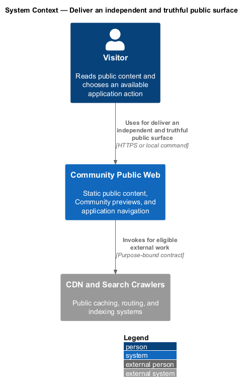
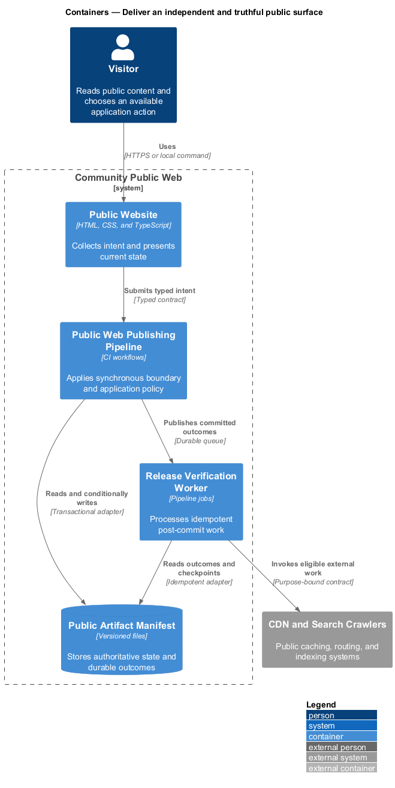
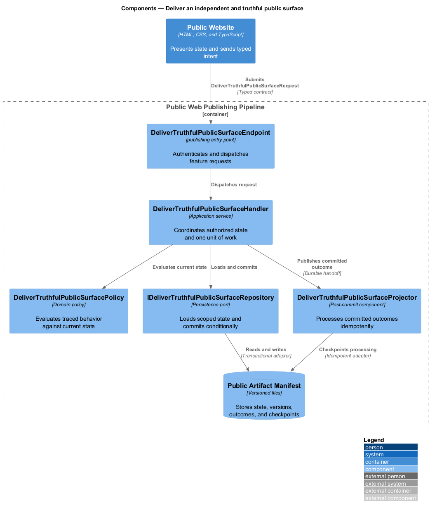
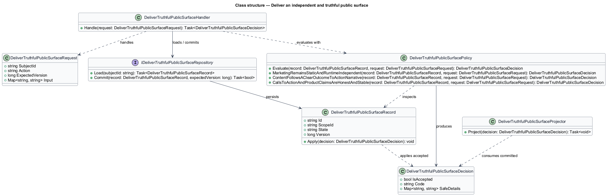
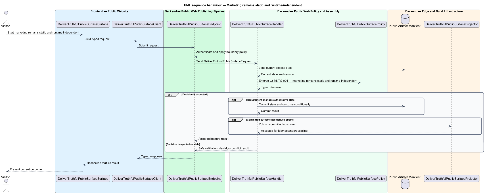
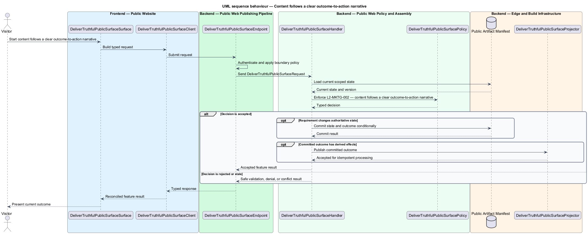
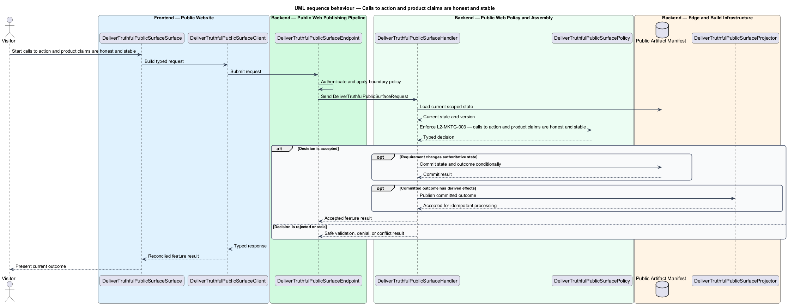

# Deliver an independent and truthful public surface

## Overview

Community Starter is a community platform divided into product and platform subsystems. The
Marketing and public web subsystem owns this feature.

*deliver an independent and truthful public surface* — subsystem capability that covers marketing remains static and runtime-independent, content follows a clear outcome-to-action narrative, and calls to action and product claims are honest and stable

The starter shall give an unfamiliar visitor a fast, crawlable, trustworthy explanation of whom the community serves, how participation works, and what action to take next. The public surface shares the product's visual language but shall remain operationally independent of the authenticated Angular runtime and private community APIs. Public pages shall render as resilient static web content, communicate the real community proposition in visitor language, and link deliberately into authentication or onboarding.

The feature groups 3 traced behaviors behind one policy and evidence
boundary: `L2-MKTG-001`, `L2-MKTG-002`, and `L2-MKTG-003`. Authoritative state commits before projections, delivery, or external work reports
success.

## Description

The repository contains specifications but no application implementation. This greenfield slice
defines the following building blocks across `Public Website`, `Public Web Publishing Pipeline`, the
application and domain layer, and infrastructure.

- **`DeliverTruthfulPublicSurfaceSurface`** — public page in `Public Website`. It presents current
  state, submits user intent, and reconciles the typed result.
- **`DeliverTruthfulPublicSurfaceClient`** — deployment configuration adapter. It creates `DeliverTruthfulPublicSurfaceRequest` values and maps stable
  transport failures into feature results.
- **`DeliverTruthfulPublicSurfaceEndpoint`** — publishing entry point in `Public Web Publishing Pipeline`. It authenticates the
  caller, applies boundary policy, and dispatches the request.
- **`DeliverTruthfulPublicSurfaceRequest`** — immutable request carrying `SubjectId`, `Action`, `ExpectedVersion`, and the
  scoped input needed by one traced behavior.
- **`DeliverTruthfulPublicSurfaceHandler`** — application service that loads authorized state through
  `IDeliverTruthfulPublicSurfaceRepository`, invokes `DeliverTruthfulPublicSurfacePolicy`, and commits an accepted transition.
- **`DeliverTruthfulPublicSurfacePolicy`** — domain policy that evaluates current state and returns a typed
  `DeliverTruthfulPublicSurfaceDecision` without performing external work.
- **`DeliverTruthfulPublicSurfaceRecord`** — authoritative record containing the feature state, scope, and concurrency
  version.
- **`IDeliverTruthfulPublicSurfaceRepository`** — persistence port that loads scoped state and commits one conditional
  unit of work.
- **`DeliverTruthfulPublicSurfaceProjector`** — idempotent post-commit component in `Release Verification Worker`. It updates
  eligible projections and invokes configured external providers.

`DeliverTruthfulPublicSurfacePolicy` exposes one named operation for each traced behavior:

- **`DeliverTruthfulPublicSurfacePolicy.MarketingRemainsStaticAndRuntimeIndependent(record, request)`** — evaluates `L2-MKTG-001` (marketing remains static and runtime-independent) and returns a typed decision before any state change.
- **`DeliverTruthfulPublicSurfacePolicy.ContentFollowsAClearOutcomeToActionNarrative(record, request)`** — evaluates `L2-MKTG-002` (content follows a clear outcome-to-action narrative) and returns a typed decision before any state change.
- **`DeliverTruthfulPublicSurfacePolicy.CallsToActionAndProductClaimsAreHonestAndStable(record, request)`** — evaluates `L2-MKTG-003` (calls to action and product claims are honest and stable) and returns a typed decision before any state change.

## Requirements

The feature realizes the following level-2 (L2) requirements. Each row preserves the specification
identifier, its level-1 (L1) parent, and the requirement statement verbatim.

| L2 ID | Refines (L1) | Requirement |
|-------|--------------|-------------|
| `L2-MKTG-001` | `L1-MKTG-001` | The public marketing site shall use meaningful static HTML and CSS with only minimal progressive JavaScript. It shall reside outside the Angular workspace, own `/`, consume canonical design-system assets through a deterministic build step, render useful navigation and content with JavaScript unavailable, and neither load the Angular application bundle nor call private authenticated APIs. |
| `L2-MKTG-002` | `L1-MKTG-001` | The initial public content shall communicate, in order, the people served and outcome, the problem in their vocabulary, the community's differentiating mechanism, a concrete workflow or artifact, credible proof or honest current constraints, the next action, and applicable privacy, terms, contact/support, and accessibility links. Real interface imagery or lightweight HTML demonstrations shall be preferred to generic decoration. |
| `L2-MKTG-003` | `L1-MKTG-001` | Every primary call to action shall have one stable destination and measurable intent. Sign-in shall target `/sign-in`; account creation shall target `/sign-up` or the canonical onboarding route. Marketing shall not link primary actions to an authenticated dashboard or a mock file, and shall use ordinary anchors that work before JavaScript. Application sign-out shall return to its sign-in route rather than ambiguous `/`. |

## Diagrams

### System context

The `Visitor` uses `Community Public Web` for the feature. The system invokes
`CDN and Search Crawlers` only for configured external work after authoritative decisions.

### Containers

`Public Website` collects intent, `Public Web Publishing Pipeline` applies the synchronous boundary,
and `Public Artifact Manifest` holds authoritative state. `Release Verification Worker` handles eligible
post-commit work against `CDN and Search Crawlers`.

### Components

Inside `Public Web Publishing Pipeline`, `DeliverTruthfulPublicSurfaceEndpoint` dispatches `DeliverTruthfulPublicSurfaceHandler`. The handler evaluates
`DeliverTruthfulPublicSurfacePolicy`, persists through `IDeliverTruthfulPublicSurfaceRepository`, and hands committed outcomes to
`DeliverTruthfulPublicSurfaceProjector`.

### Class structure

`DeliverTruthfulPublicSurfaceHandler` depends on the immutable request, domain policy, and repository port.
`DeliverTruthfulPublicSurfaceRecord` owns versioned state, while `DeliverTruthfulPublicSurfaceProjector` consumes committed results.

### Behaviour — marketing remains static and runtime-independent

The interaction loads current scoped state before `DeliverTruthfulPublicSurfacePolicy` enforces
`L2-MKTG-001`. Rejected decisions return without changing authoritative state; accepted
state changes commit before optional derived work starts.

### Behaviour — content follows a clear outcome-to-action narrative

The interaction loads current scoped state before `DeliverTruthfulPublicSurfacePolicy` enforces
`L2-MKTG-002`. Rejected decisions return without changing authoritative state; accepted
state changes commit before optional derived work starts.

### Behaviour — calls to action and product claims are honest and stable

The interaction loads current scoped state before `DeliverTruthfulPublicSurfacePolicy` enforces
`L2-MKTG-003`. Rejected decisions return without changing authoritative state; accepted
state changes commit before optional derived work starts.

