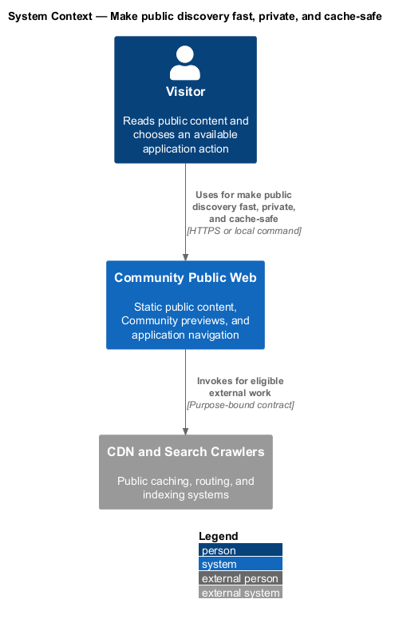
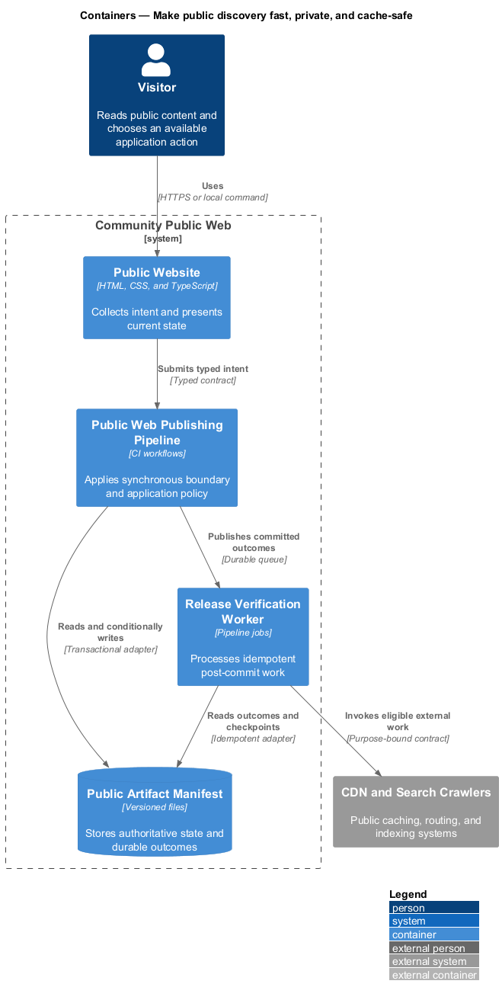
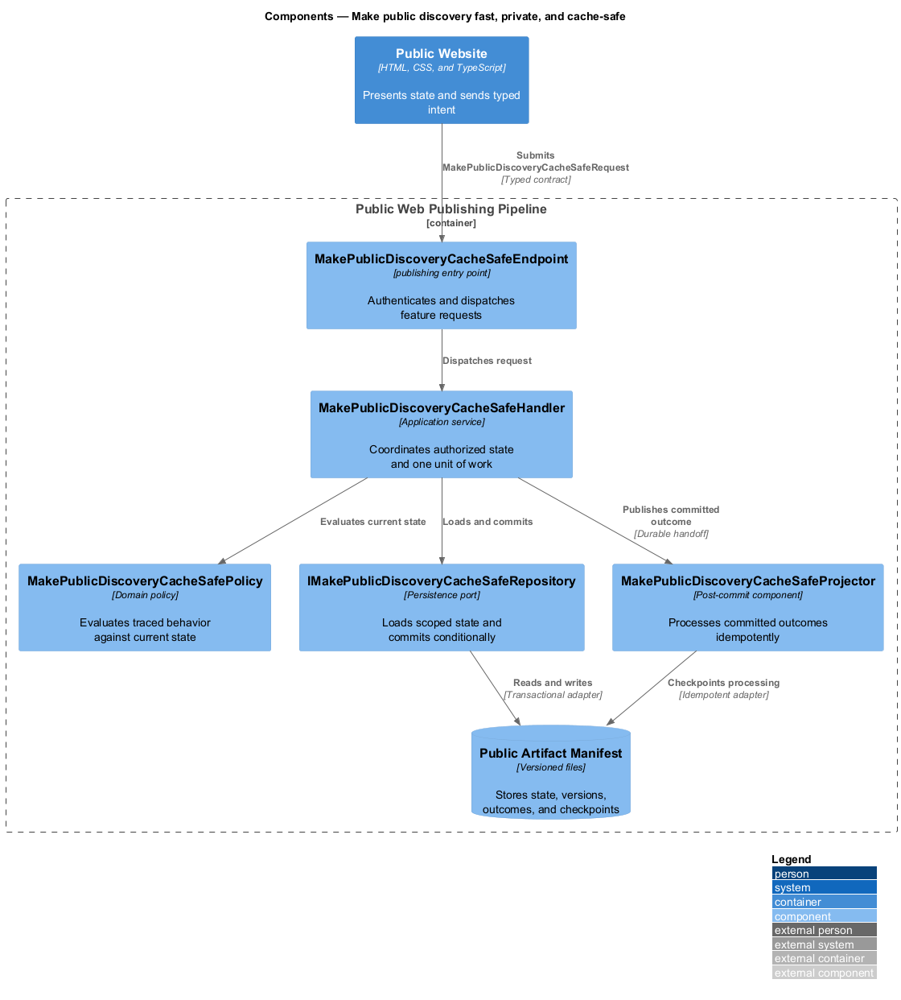
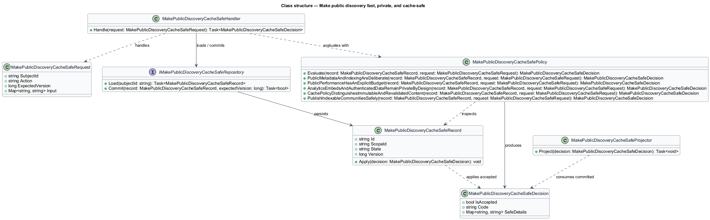
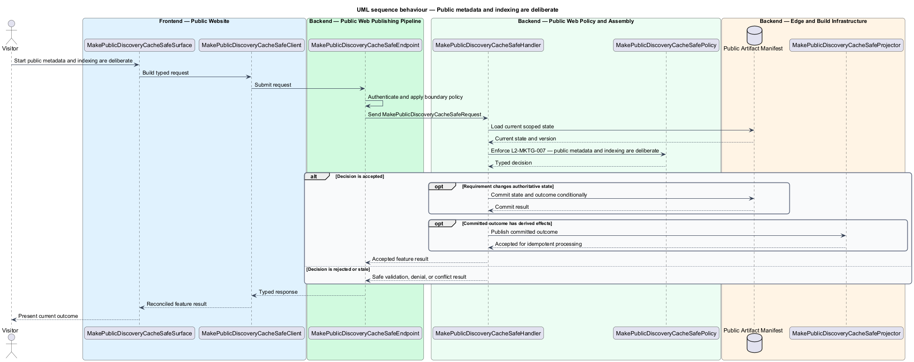
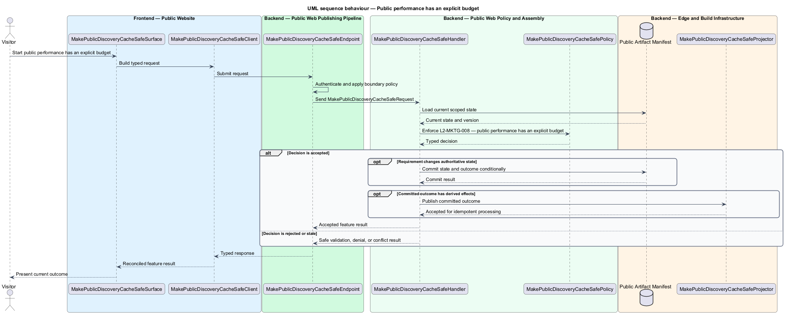
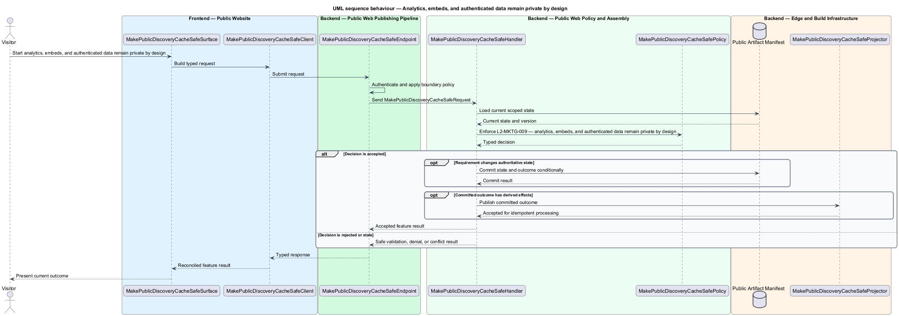
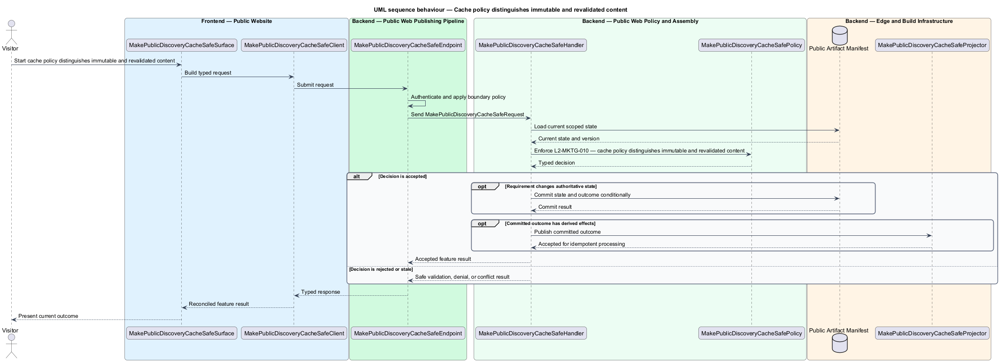

# Make public discovery fast, private, and cache-safe

## Overview

Community Starter is a community platform divided into product and platform subsystems. The
Marketing and public web subsystem owns this feature.

*make public discovery fast, private, and cache-safe* — subsystem capability that covers public metadata and indexing are deliberate, public performance has an explicit budget, analytics, embeds, and authenticated data remain private by design, cache policy distinguishes immutable and revalidated content, and publish indexable Communities safely

The starter shall give an unfamiliar visitor a fast, crawlable, trustworthy explanation of whom the community serves, how participation works, and what action to take next. The public surface shares the product's visual language but shall remain operationally independent of the authenticated Angular runtime and private community APIs. Every public page shall provide complete search/social metadata, a useful JavaScript-free first render, explicit privacy behavior, and caching that cannot strand stale application shells.

The feature groups 5 traced behaviors behind one policy and evidence
boundary: `L2-MKTG-007`, `L2-MKTG-008`, `L2-MKTG-009`, `L2-MKTG-010`, and `L2-MKTG-013`. Authoritative state commits before projections, delivery, or external work reports
success.

## Description

The repository contains specifications but no application implementation. This greenfield slice
defines the following building blocks across `Public Website`, `Public Web Publishing Pipeline`, the
application and domain layer, and infrastructure.

- **`MakePublicDiscoveryCacheSafeSurface`** — public page in `Public Website`. It presents current
  state, submits user intent, and reconciles the typed result.
- **`MakePublicDiscoveryCacheSafeClient`** — deployment configuration adapter. It creates `MakePublicDiscoveryCacheSafeRequest` values and maps stable
  transport failures into feature results.
- **`MakePublicDiscoveryCacheSafeEndpoint`** — publishing entry point in `Public Web Publishing Pipeline`. It authenticates the
  caller, applies boundary policy, and dispatches the request.
- **`MakePublicDiscoveryCacheSafeRequest`** — immutable request carrying `SubjectId`, `Action`, `ExpectedVersion`, and the
  scoped input needed by one traced behavior.
- **`MakePublicDiscoveryCacheSafeHandler`** — application service that loads authorized state through
  `IMakePublicDiscoveryCacheSafeRepository`, invokes `MakePublicDiscoveryCacheSafePolicy`, and commits an accepted transition.
- **`MakePublicDiscoveryCacheSafePolicy`** — domain policy that evaluates current state and returns a typed
  `MakePublicDiscoveryCacheSafeDecision` without performing external work.
- **`MakePublicDiscoveryCacheSafeRecord`** — authoritative record containing the feature state, scope, and concurrency
  version.
- **`IMakePublicDiscoveryCacheSafeRepository`** — persistence port that loads scoped state and commits one conditional
  unit of work.
- **`MakePublicDiscoveryCacheSafeProjector`** — idempotent post-commit component in `Release Verification Worker`. It updates
  eligible projections and invokes configured external providers.

`MakePublicDiscoveryCacheSafePolicy` exposes one named operation for each traced behavior:

- **`MakePublicDiscoveryCacheSafePolicy.PublicMetadataAndIndexingAreDeliberate(record, request)`** — evaluates `L2-MKTG-007` (public metadata and indexing are deliberate) and returns a typed decision before any state change.
- **`MakePublicDiscoveryCacheSafePolicy.PublicPerformanceHasAnExplicitBudget(record, request)`** — evaluates `L2-MKTG-008` (public performance has an explicit budget) and returns a typed decision before any state change.
- **`MakePublicDiscoveryCacheSafePolicy.AnalyticsEmbedsAndAuthenticatedDataRemainPrivateByDesign(record, request)`** — evaluates `L2-MKTG-009` (analytics, embeds, and authenticated data remain private by design) and returns a typed decision before any state change.
- **`MakePublicDiscoveryCacheSafePolicy.CachePolicyDistinguishesImmutableAndRevalidatedContent(record, request)`** — evaluates `L2-MKTG-010` (cache policy distinguishes immutable and revalidated content) and returns a typed decision before any state change.
- **`MakePublicDiscoveryCacheSafePolicy.PublishIndexableCommunitiesSafely(record, request)`** — evaluates `L2-MKTG-013` (publish indexable Communities safely) and returns a typed decision before any state change.

## Requirements

The feature realizes the following level-2 (L2) requirements. Each row preserves the specification
identifier, its level-1 (L1) parent, and the requirement statement verbatim.

| L2 ID | Refines (L1) | Requirement |
|-------|--------------|-------------|
| `L2-MKTG-007` | `L1-MKTG-003` | Every public page shall provide a unique title and description, semantic headings, Open Graph and social-card metadata, a social image, favicon, and canonical URL when the production domain is known. The public site shall provide `robots.txt`, `sitemap.xml`, and appropriate structured data. Authenticated application and API routes shall be excluded from indexing, and robots/sitemap content shall describe only intended public URLs. |
| `L2-MKTG-008` | `L1-MKTG-003` | The public site shall define and enforce a performance budget for useful-content rendering, transferred JavaScript, CSS, fonts, images, and layout stability. Useful content shall not require client JavaScript or the Angular bundle. Images shall use suitable dimensions and formats with reserved layout space; fonts should be self-hosted when licensing permits; and non-critical scripts shall be deferred. |
| `L2-MKTG-009` | `L1-MKTG-003` | Public analytics and embeds shall have a documented product question, data purpose, minimization rule, retention/ownership, and consent behavior before activation. The static marketing site shall not call authenticated/private APIs or expose member data. Privacy, support, accessibility, and applicable legal destinations shall be reachable without requiring tracking consent. |
| `L2-MKTG-010` | `L1-MKTG-003` | Content-hashed Angular bundles and versioned immutable assets shall receive long-lived immutable caching, normally one year. HTML, unhashed CSS/JavaScript, robots, sitemap, and unversioned downloads shall require revalidation unless their filenames are versioned. Release retention or invalidation shall ensure an older cached HTML shell cannot reference removed bundles. |
| `L2-MKTG-013` | `L1-MKTG-003` | An explicitly public Community may have a crawlable Public Projection whose route, allow-listed summary fields, metadata, cache, and removal remain separate from the authenticated application. |

## Diagrams

### System context

The `Visitor` uses `Community Public Web` for the feature. The system invokes
`CDN and Search Crawlers` only for configured external work after authoritative decisions.

### Containers

`Public Website` collects intent, `Public Web Publishing Pipeline` applies the synchronous boundary,
and `Public Artifact Manifest` holds authoritative state. `Release Verification Worker` handles eligible
post-commit work against `CDN and Search Crawlers`.

### Components

Inside `Public Web Publishing Pipeline`, `MakePublicDiscoveryCacheSafeEndpoint` dispatches `MakePublicDiscoveryCacheSafeHandler`. The handler evaluates
`MakePublicDiscoveryCacheSafePolicy`, persists through `IMakePublicDiscoveryCacheSafeRepository`, and hands committed outcomes to
`MakePublicDiscoveryCacheSafeProjector`.

### Class structure

`MakePublicDiscoveryCacheSafeHandler` depends on the immutable request, domain policy, and repository port.
`MakePublicDiscoveryCacheSafeRecord` owns versioned state, while `MakePublicDiscoveryCacheSafeProjector` consumes committed results.

### Behaviour — public metadata and indexing are deliberate

The interaction loads current scoped state before `MakePublicDiscoveryCacheSafePolicy` enforces
`L2-MKTG-007`. Rejected decisions return without changing authoritative state; accepted
state changes commit before optional derived work starts.

### Behaviour — public performance has an explicit budget

The interaction loads current scoped state before `MakePublicDiscoveryCacheSafePolicy` enforces
`L2-MKTG-008`. Rejected decisions return without changing authoritative state; accepted
state changes commit before optional derived work starts.

### Behaviour — analytics, embeds, and authenticated data remain private by design

The interaction loads current scoped state before `MakePublicDiscoveryCacheSafePolicy` enforces
`L2-MKTG-009`. Rejected decisions return without changing authoritative state; accepted
state changes commit before optional derived work starts.

### Behaviour — cache policy distinguishes immutable and revalidated content

The interaction loads current scoped state before `MakePublicDiscoveryCacheSafePolicy` enforces
`L2-MKTG-010`. Rejected decisions return without changing authoritative state; accepted
state changes commit before optional derived work starts.

### Behaviour — publish indexable Communities safely

The interaction loads current scoped state before `MakePublicDiscoveryCacheSafePolicy` enforces
`L2-MKTG-013`. Rejected decisions return without changing authoritative state; accepted
state changes commit before optional derived work starts.

