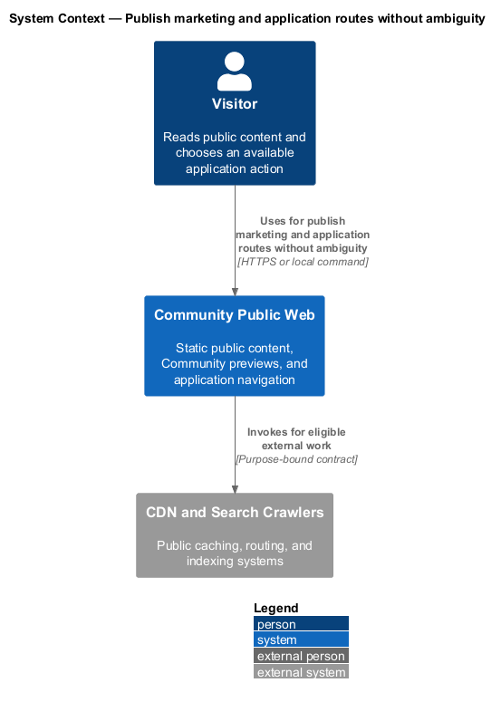
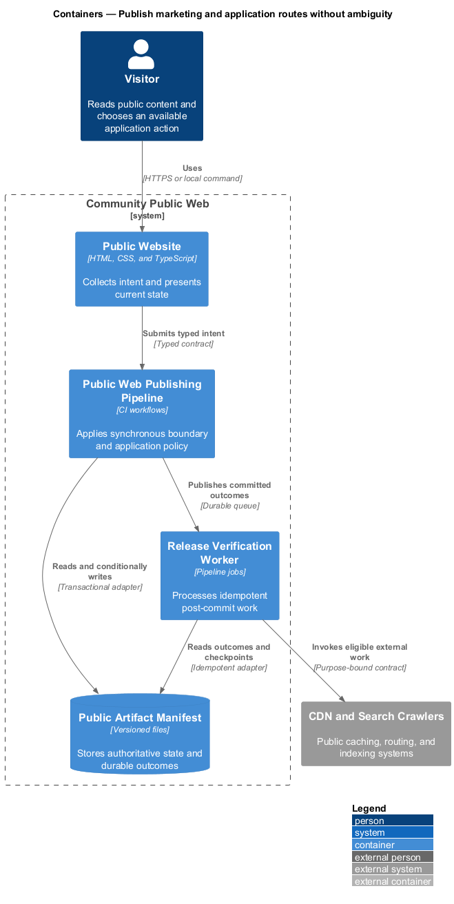
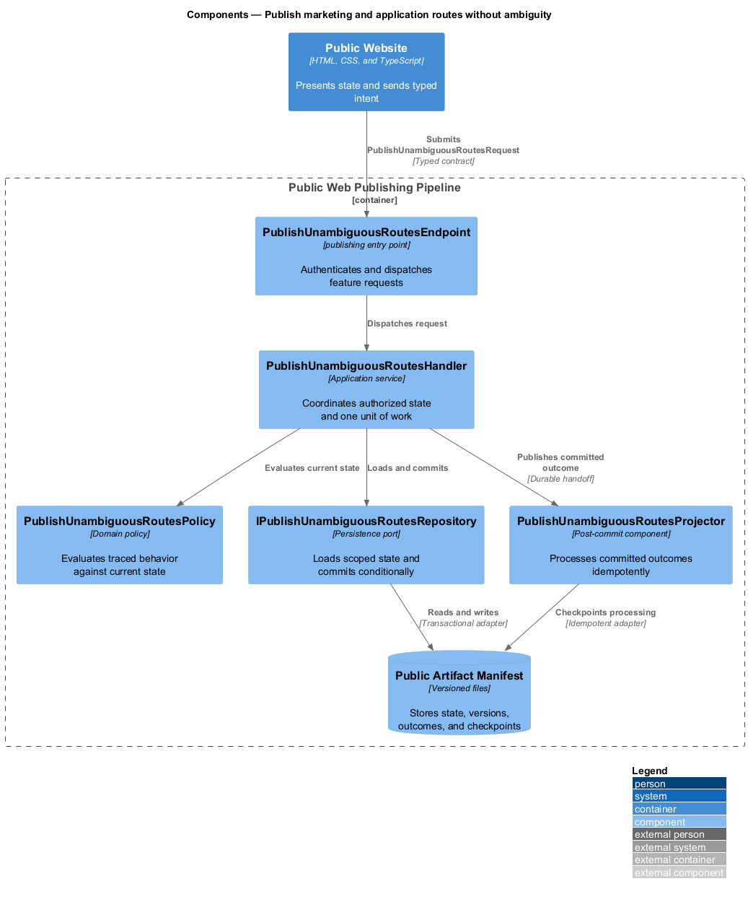
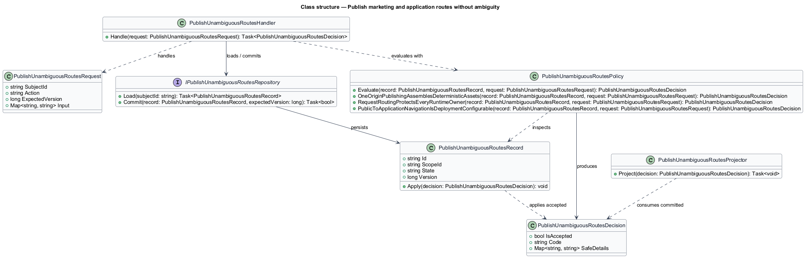
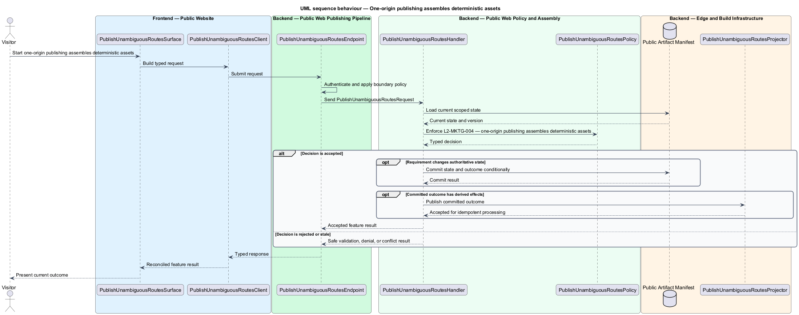
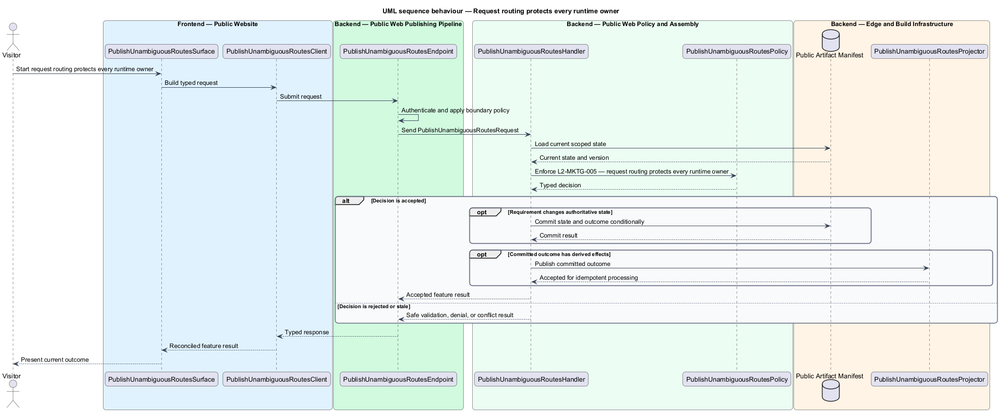
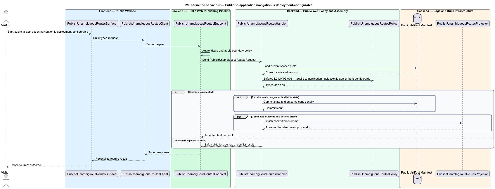

# Publish marketing and application routes without ambiguity

## Overview

Community Starter is a community platform divided into product and platform subsystems. The
Marketing and public web subsystem owns this feature.

*publish marketing and application routes without ambiguity* — subsystem capability that covers one-origin publishing assembles deterministic assets, request routing protects every runtime owner, and public-to-application navigation is deployment-configurable

The starter shall give an unfamiliar visitor a fast, crawlable, trustworthy explanation of whom the community serves, how participation works, and what action to take next. The public surface shares the product's visual language but shall remain operationally independent of the authenticated Angular runtime and private community APIs. The initial same-origin artifact shall preserve distinct ownership for public files, Angular deep links, APIs, realtime endpoints, health checks, and unknown paths.

The feature groups 3 traced behaviors behind one policy and evidence
boundary: `L2-MKTG-004`, `L2-MKTG-005`, and `L2-MKTG-006`. Authoritative state commits before projections, delivery, or external work reports
success.

## Description

The repository contains specifications but no application implementation. This greenfield slice
defines the following building blocks across `Public Website`, `Public Web Publishing Pipeline`, the
application and domain layer, and infrastructure.

- **`PublishUnambiguousRoutesSurface`** — public page in `Public Website`. It presents current
  state, submits user intent, and reconciles the typed result.
- **`PublishUnambiguousRoutesClient`** — deployment configuration adapter. It creates `PublishUnambiguousRoutesRequest` values and maps stable
  transport failures into feature results.
- **`PublishUnambiguousRoutesEndpoint`** — publishing entry point in `Public Web Publishing Pipeline`. It authenticates the
  caller, applies boundary policy, and dispatches the request.
- **`PublishUnambiguousRoutesRequest`** — immutable request carrying `SubjectId`, `Action`, `ExpectedVersion`, and the
  scoped input needed by one traced behavior.
- **`PublishUnambiguousRoutesHandler`** — application service that loads authorized state through
  `IPublishUnambiguousRoutesRepository`, invokes `PublishUnambiguousRoutesPolicy`, and commits an accepted transition.
- **`PublishUnambiguousRoutesPolicy`** — domain policy that evaluates current state and returns a typed
  `PublishUnambiguousRoutesDecision` without performing external work.
- **`PublishUnambiguousRoutesRecord`** — authoritative record containing the feature state, scope, and concurrency
  version.
- **`IPublishUnambiguousRoutesRepository`** — persistence port that loads scoped state and commits one conditional
  unit of work.
- **`PublishUnambiguousRoutesProjector`** — idempotent post-commit component in `Release Verification Worker`. It updates
  eligible projections and invokes configured external providers.

`PublishUnambiguousRoutesPolicy` exposes one named operation for each traced behavior:

- **`PublishUnambiguousRoutesPolicy.OneOriginPublishingAssemblesDeterministicAssets(record, request)`** — evaluates `L2-MKTG-004` (one-origin publishing assembles deterministic assets) and returns a typed decision before any state change.
- **`PublishUnambiguousRoutesPolicy.RequestRoutingProtectsEveryRuntimeOwner(record, request)`** — evaluates `L2-MKTG-005` (request routing protects every runtime owner) and returns a typed decision before any state change.
- **`PublishUnambiguousRoutesPolicy.PublicToApplicationNavigationIsDeploymentConfigurable(record, request)`** — evaluates `L2-MKTG-006` (public-to-application navigation is deployment-configurable) and returns a typed decision before any state change.

## Requirements

The feature realizes the following level-2 (L2) requirements. Each row preserves the specification
identifier, its level-1 (L1) parent, and the requirement statement verbatim.

| L2 ID | Refines (L1) | Requirement |
|-------|--------------|-------------|
| `L2-MKTG-004` | `L1-MKTG-002` | The first-phase publish process shall build Angular with content-hashed bundles, emit its entry under a non-marketing name such as `app.html`, copy Angular output into API static files, copy canonical design-system assets, copy marketing while leaving its `index.html` as the root default, and publish one API artifact. Every step shall be deterministic and fail on missing expected output. |
| `L2-MKTG-005` | `L1-MKTG-002` | The deployed middleware pipeline shall allow static defaults to claim `/` before any SPA fallback. Known marketing and asset paths shall serve static files; known Public Projection routes shall reach their anonymous HTML renderer; `/api/*`, `/hubs/*`, and `/health` shall reach ASP.NET Core; known member routes shall serve `app.html` and then Angular; unknown non-file routes shall follow a documented app-fallback or 404 policy; and unknown files shall never receive an accidental SPA shell with `200`. |
| `L2-MKTG-006` | `L1-MKTG-002` | In the MVP's same-origin deployment, Angular shall use relative API and hub paths and development shall use a proxy or injected base URL. Library code shall receive base paths through injection tokens. Marketing CTA destinations shall be ordinary relative anchors resolved from the configured deployment base path without source edits to reusable libraries. |

## Diagrams

### System context

The `Visitor` uses `Community Public Web` for the feature. The system invokes
`CDN and Search Crawlers` only for configured external work after authoritative decisions.

### Containers

`Public Website` collects intent, `Public Web Publishing Pipeline` applies the synchronous boundary,
and `Public Artifact Manifest` holds authoritative state. `Release Verification Worker` handles eligible
post-commit work against `CDN and Search Crawlers`.

### Components

Inside `Public Web Publishing Pipeline`, `PublishUnambiguousRoutesEndpoint` dispatches `PublishUnambiguousRoutesHandler`. The handler evaluates
`PublishUnambiguousRoutesPolicy`, persists through `IPublishUnambiguousRoutesRepository`, and hands committed outcomes to
`PublishUnambiguousRoutesProjector`.

### Class structure

`PublishUnambiguousRoutesHandler` depends on the immutable request, domain policy, and repository port.
`PublishUnambiguousRoutesRecord` owns versioned state, while `PublishUnambiguousRoutesProjector` consumes committed results.

### Behaviour — one-origin publishing assembles deterministic assets

The interaction loads current scoped state before `PublishUnambiguousRoutesPolicy` enforces
`L2-MKTG-004`. Rejected decisions return without changing authoritative state; accepted
state changes commit before optional derived work starts.

### Behaviour — request routing protects every runtime owner

The interaction loads current scoped state before `PublishUnambiguousRoutesPolicy` enforces
`L2-MKTG-005`. Rejected decisions return without changing authoritative state; accepted
state changes commit before optional derived work starts.

### Behaviour — public-to-application navigation is deployment-configurable

The interaction loads current scoped state before `PublishUnambiguousRoutesPolicy` enforces
`L2-MKTG-006`. Rejected decisions return without changing authoritative state; accepted
state changes commit before optional derived work starts.

