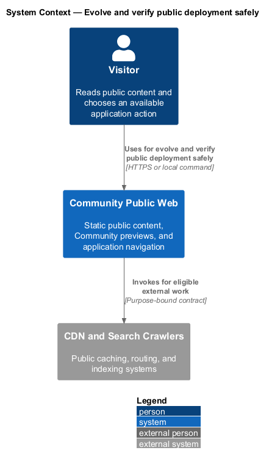
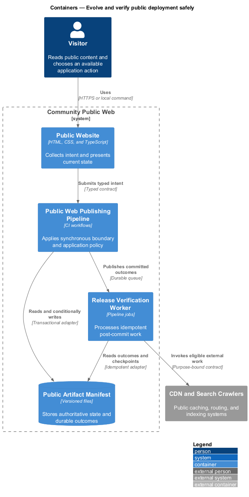
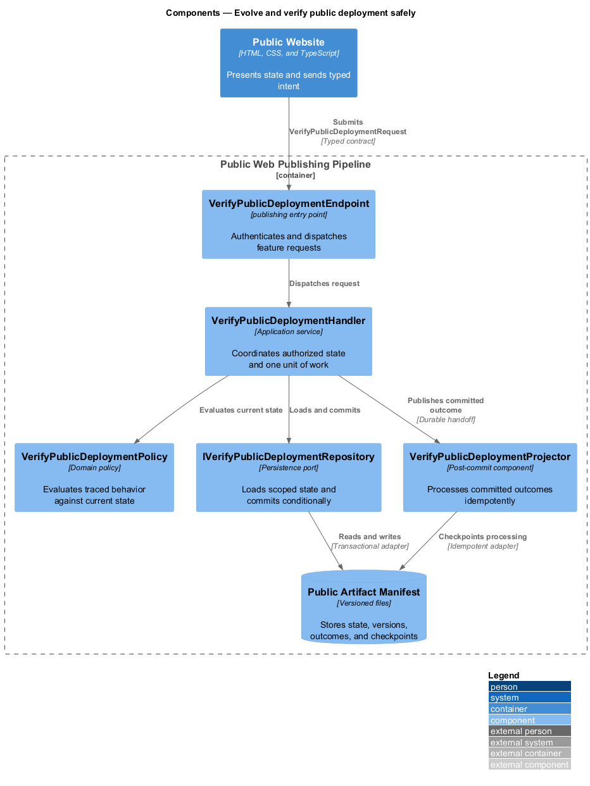
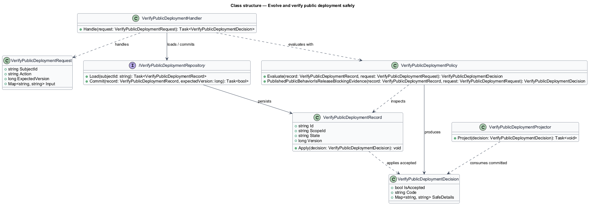
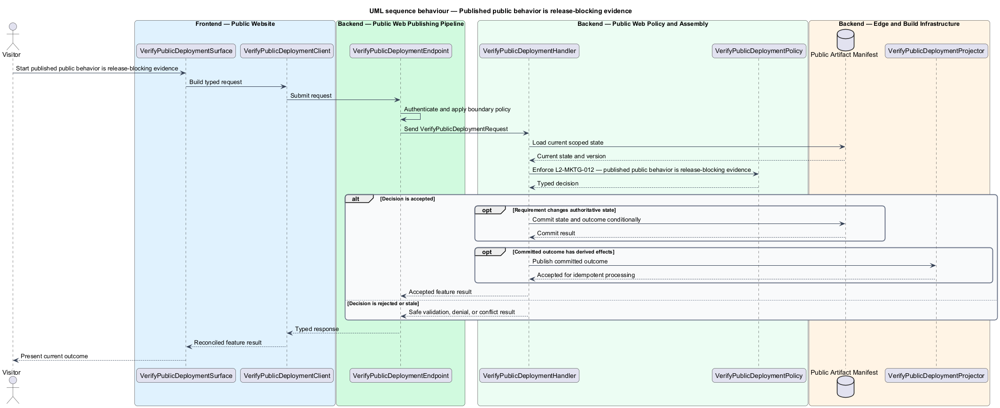

# Evolve and verify public deployment safely

## Overview

Community Starter is a community platform divided into product and platform subsystems. The
Marketing and public web subsystem owns this feature.

*evolve and verify public deployment safely* — subsystem capability that covers published public behavior is release-blocking evidence

The starter shall give an unfamiliar visitor a fast, crawlable, trustworthy explanation of whom the community serves, how participation works, and what action to take next. The public surface shares the product's visual language but shall remain operationally independent of the authenticated Angular runtime and private community APIs. One-origin publishing shall remain deterministic, and every release shall prove public, application, API, asset, accessibility, and indexing behavior from the published artifact.

The feature groups 1 traced behaviors behind one policy and evidence
boundary: `L2-MKTG-012`. Authoritative state commits before projections, delivery, or external work reports
success.

## Description

The repository contains specifications but no application implementation. This greenfield slice
defines the following building blocks across `Public Website`, `Public Web Publishing Pipeline`, the
application and domain layer, and infrastructure.

- **`VerifyPublicDeploymentSurface`** — public page in `Public Website`. It presents current
  state, submits user intent, and reconciles the typed result.
- **`VerifyPublicDeploymentClient`** — deployment configuration adapter. It creates `VerifyPublicDeploymentRequest` values and maps stable
  transport failures into feature results.
- **`VerifyPublicDeploymentEndpoint`** — publishing entry point in `Public Web Publishing Pipeline`. It authenticates the
  caller, applies boundary policy, and dispatches the request.
- **`VerifyPublicDeploymentRequest`** — immutable request carrying `SubjectId`, `Action`, `ExpectedVersion`, and the
  scoped input needed by one traced behavior.
- **`VerifyPublicDeploymentHandler`** — application service that loads authorized state through
  `IVerifyPublicDeploymentRepository`, invokes `VerifyPublicDeploymentPolicy`, and commits an accepted transition.
- **`VerifyPublicDeploymentPolicy`** — domain policy that evaluates current state and returns a typed
  `VerifyPublicDeploymentDecision` without performing external work.
- **`VerifyPublicDeploymentRecord`** — authoritative record containing the feature state, scope, and concurrency
  version.
- **`IVerifyPublicDeploymentRepository`** — persistence port that loads scoped state and commits one conditional
  unit of work.
- **`VerifyPublicDeploymentProjector`** — idempotent post-commit component in `Release Verification Worker`. It updates
  eligible projections and invokes configured external providers.

`VerifyPublicDeploymentPolicy` exposes one named operation for each traced behavior:

- **`VerifyPublicDeploymentPolicy.PublishedPublicBehaviorIsReleaseBlockingEvidence(record, request)`** — evaluates `L2-MKTG-012` (published public behavior is release-blocking evidence) and returns a typed decision before any state change.

## Requirements

The feature realizes the following level-2 (L2) requirements. Each row preserves the specification
identifier, its level-1 (L1) parent, and the requirement statement verbatim.

| L2 ID | Refines (L1) | Requirement |
|-------|--------------|-------------|
| `L2-MKTG-012` | `L1-MKTG-004` | Every release shall verify the published artifact or staging host over HTTP rather than relying on a development server. Verification shall cover marketing root ownership without Angular, refreshed application deep links, API/health/realtime exclusion from fallback, all styles/fonts/media/downloads/social metadata, sign-in/onboarding destinations, cache headers, unknown-file behavior, keyboard flow, zoom/reflow, reduced motion, representative viewports, robots, and sitemap. A failure in those contracts shall block release. |

## Diagrams

### System context

The `Visitor` uses `Community Public Web` for the feature. The system invokes
`CDN and Search Crawlers` only for configured external work after authoritative decisions.

### Containers

`Public Website` collects intent, `Public Web Publishing Pipeline` applies the synchronous boundary,
and `Public Artifact Manifest` holds authoritative state. `Release Verification Worker` handles eligible
post-commit work against `CDN and Search Crawlers`.

### Components

Inside `Public Web Publishing Pipeline`, `VerifyPublicDeploymentEndpoint` dispatches `VerifyPublicDeploymentHandler`. The handler evaluates
`VerifyPublicDeploymentPolicy`, persists through `IVerifyPublicDeploymentRepository`, and hands committed outcomes to
`VerifyPublicDeploymentProjector`.

### Class structure

`VerifyPublicDeploymentHandler` depends on the immutable request, domain policy, and repository port.
`VerifyPublicDeploymentRecord` owns versioned state, while `VerifyPublicDeploymentProjector` consumes committed results.

### Behaviour — published public behavior is release-blocking evidence

The interaction loads current scoped state before `VerifyPublicDeploymentPolicy` enforces
`L2-MKTG-012`. Rejected decisions return without changing authoritative state; accepted
state changes commit before optional derived work starts.

