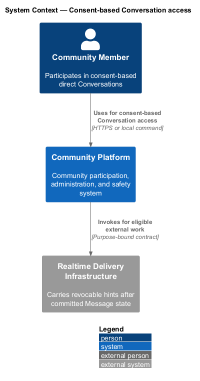
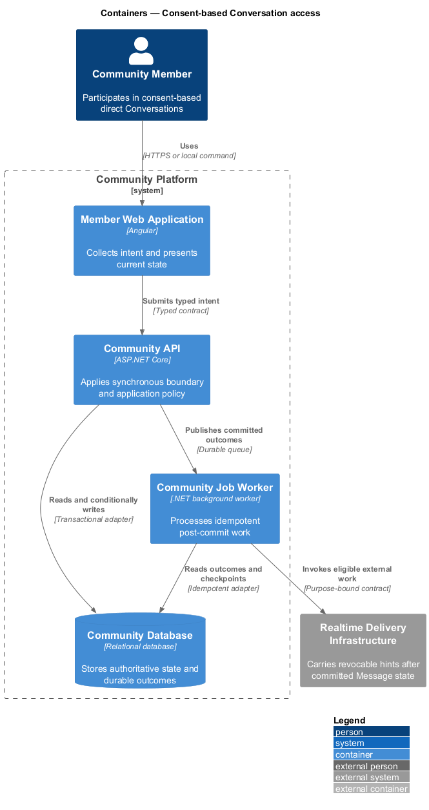
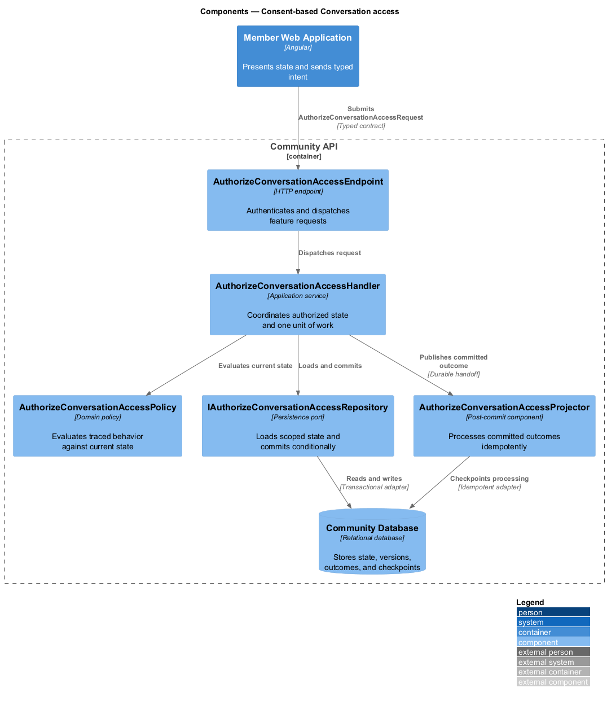
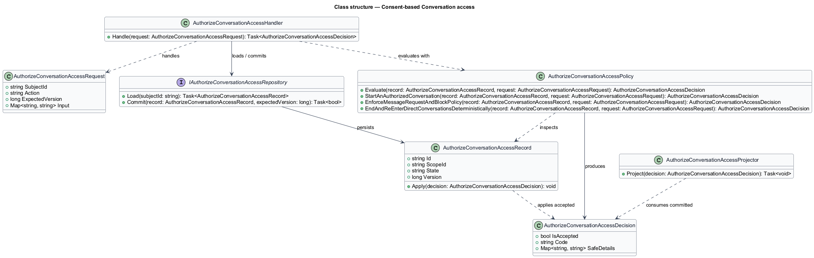
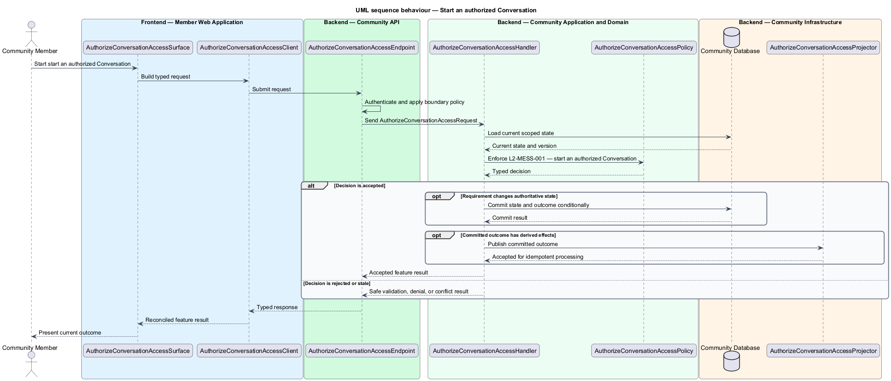
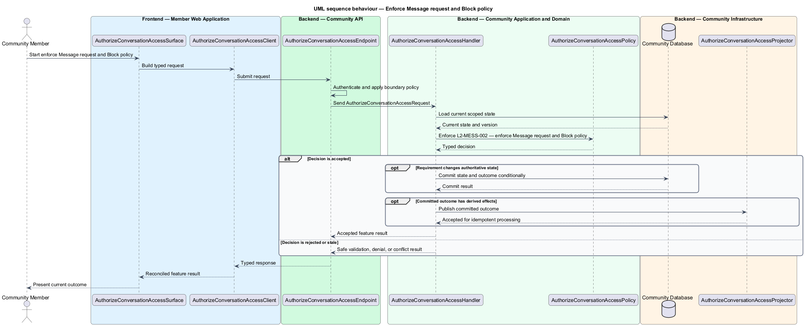
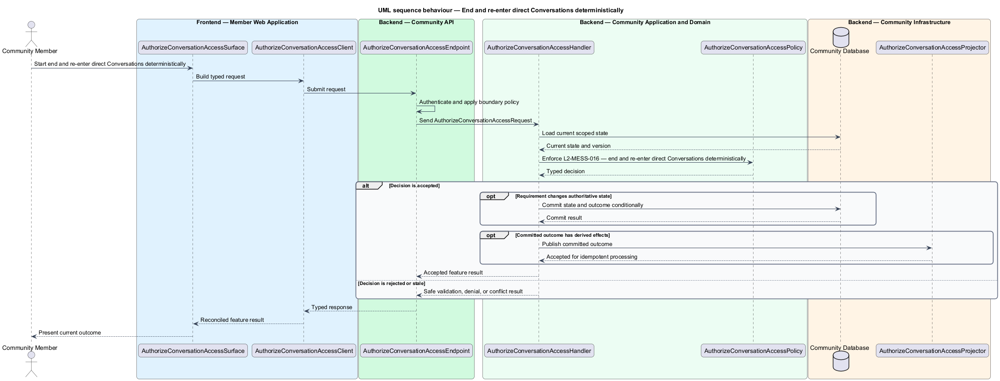

# Consent-based Conversation access

## Overview

Community Starter is a community platform divided into product and platform subsystems. The
Messaging and realtime subsystem owns this feature.

*consent-based Conversation access* — subsystem capability that covers start an authorized Conversation, enforce Message request and Block policy, and end and re-enter direct Conversations deterministically

Members need private conversation without allowing guessed identifiers, stale Memberships, Blocks, or realtime connections to bypass current Community and recipient policy. Messages are durable API state; realtime delivery is a post-commit hint and may be disabled without weakening other paths. The platform shall establish and maintain Conversation participation from current identity, Membership, recipient preferences, Blocks, and permitted audience state.

The feature groups 3 traced behaviors behind one policy and evidence
boundary: `L2-MESS-001`, `L2-MESS-002`, and `L2-MESS-016`. Authoritative state commits before projections, delivery, or external work reports
success.

## Description

The repository contains specifications but no application implementation. This greenfield slice
defines the following building blocks across `Member Web Application`, `Community API`, the
application and domain layer, and infrastructure.

- **`AuthorizeConversationAccessSurface`** — page component in `Member Web Application`. It presents current
  state, submits user intent, and reconciles the typed result.
- **`AuthorizeConversationAccessClient`** — typed Angular client. It creates `AuthorizeConversationAccessRequest` values and maps stable
  transport failures into feature results.
- **`AuthorizeConversationAccessEndpoint`** — HTTP endpoint in `Community API`. It authenticates the
  caller, applies boundary policy, and dispatches the request.
- **`AuthorizeConversationAccessRequest`** — immutable request carrying `SubjectId`, `Action`, `ExpectedVersion`, and the
  scoped input needed by one traced behavior.
- **`AuthorizeConversationAccessHandler`** — application service that loads authorized state through
  `IAuthorizeConversationAccessRepository`, invokes `AuthorizeConversationAccessPolicy`, and commits an accepted transition.
- **`AuthorizeConversationAccessPolicy`** — domain policy that evaluates current state and returns a typed
  `AuthorizeConversationAccessDecision` without performing external work.
- **`AuthorizeConversationAccessRecord`** — authoritative record containing the feature state, scope, and concurrency
  version.
- **`IAuthorizeConversationAccessRepository`** — persistence port that loads scoped state and commits one conditional
  unit of work.
- **`AuthorizeConversationAccessProjector`** — idempotent post-commit component in `Community Job Worker`. It updates
  eligible projections and invokes configured external providers.

`AuthorizeConversationAccessPolicy` exposes one named operation for each traced behavior:

- **`AuthorizeConversationAccessPolicy.StartAnAuthorizedConversation(record, request)`** — evaluates `L2-MESS-001` (start an authorized Conversation) and returns a typed decision before any state change.
- **`AuthorizeConversationAccessPolicy.EnforceMessageRequestAndBlockPolicy(record, request)`** — evaluates `L2-MESS-002` (enforce Message request and Block policy) and returns a typed decision before any state change.
- **`AuthorizeConversationAccessPolicy.EndAndReEnterDirectConversationsDeterministically(record, request)`** — evaluates `L2-MESS-016` (end and re-enter direct Conversations deterministically) and returns a typed decision before any state change.

## Requirements

The feature realizes the following level-2 (L2) requirements. Each row preserves the specification
identifier, its level-1 (L1) parent, and the requirement statement verbatim.

| L2 ID | Refines (L1) | Requirement |
|-------|--------------|-------------|
| `L2-MESS-001` | `L1-MESS-001` | Every Conversation has one immutable Community and optional immutable same-Community Space scope. The server creates it only when every initial participant is eligible under current Account, Membership, Space, rules, Moderation Action, Block, and recipient-contact policy. |
| `L2-MESS-002` | `L1-MESS-001` | Recipient preferences, Message-request state, and Blocks are evaluated on the server for discovery, Conversation creation, sending, notifications, and realtime delivery. |
| `L2-MESS-016` | `L1-MESS-001` | The one stable direct Conversation for an Account pair and scope may hold multiple explicitly accepted consent intervals. Either participant, current eligibility policy, or a confirmed Space- archive dependency plan may end the exact current interval without reading content; neither an ended interval, leave, Block removal, nor later eligibility silently restores interaction or history. |

## Diagrams

### System context

The `Community Member` uses `Community Platform` for the feature. The system invokes
`Realtime Delivery Infrastructure` only for configured external work after authoritative decisions.

### Containers

`Member Web Application` collects intent, `Community API` applies the synchronous boundary,
and `Community Database` holds authoritative state. `Community Job Worker` handles eligible
post-commit work against `Realtime Delivery Infrastructure`.

### Components

Inside `Community API`, `AuthorizeConversationAccessEndpoint` dispatches `AuthorizeConversationAccessHandler`. The handler evaluates
`AuthorizeConversationAccessPolicy`, persists through `IAuthorizeConversationAccessRepository`, and hands committed outcomes to
`AuthorizeConversationAccessProjector`.

### Class structure

`AuthorizeConversationAccessHandler` depends on the immutable request, domain policy, and repository port.
`AuthorizeConversationAccessRecord` owns versioned state, while `AuthorizeConversationAccessProjector` consumes committed results.

### Behaviour — start an authorized Conversation

The interaction loads current scoped state before `AuthorizeConversationAccessPolicy` enforces
`L2-MESS-001`. Rejected decisions return without changing authoritative state; accepted
state changes commit before optional derived work starts.

### Behaviour — enforce Message request and Block policy

The interaction loads current scoped state before `AuthorizeConversationAccessPolicy` enforces
`L2-MESS-002`. Rejected decisions return without changing authoritative state; accepted
state changes commit before optional derived work starts.

### Behaviour — end and re-enter direct Conversations deterministically

The interaction loads current scoped state before `AuthorizeConversationAccessPolicy` enforces
`L2-MESS-016`. Rejected decisions return without changing authoritative state; accepted
state changes commit before optional derived work starts.

