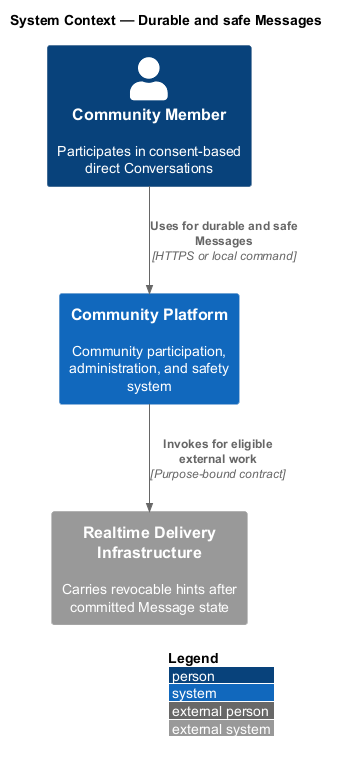
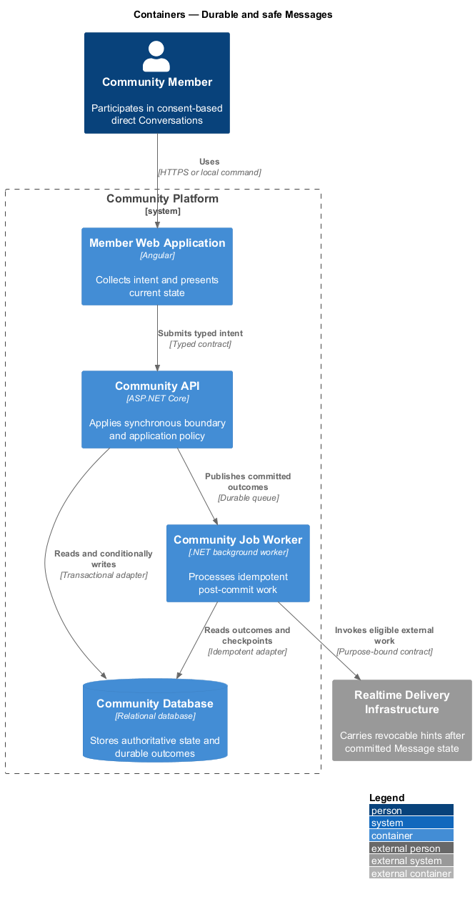
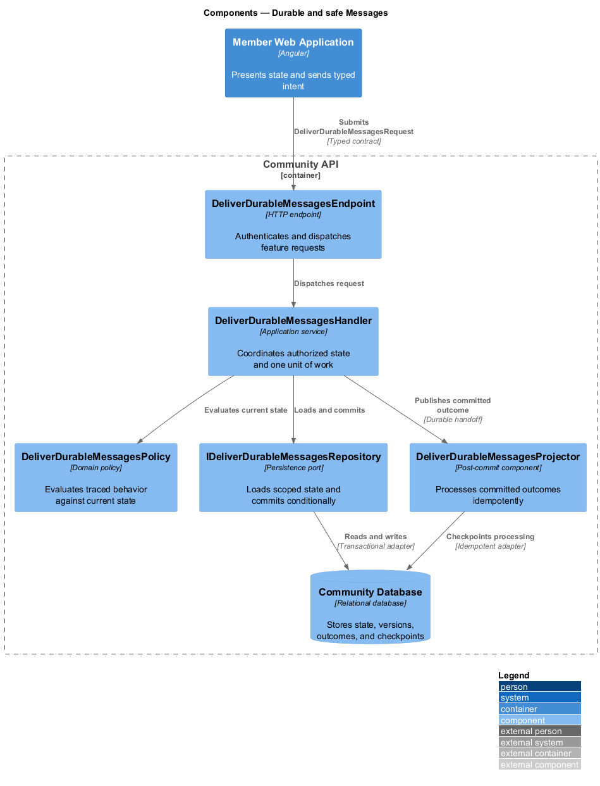
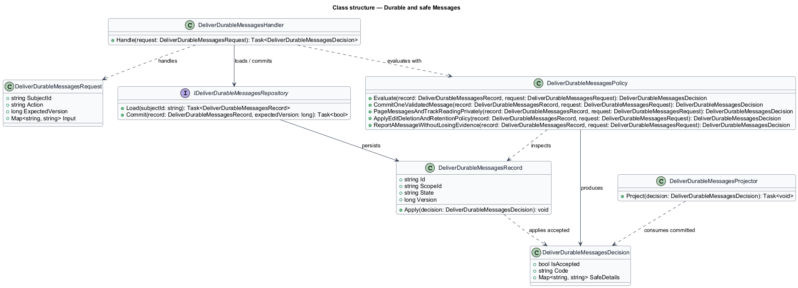
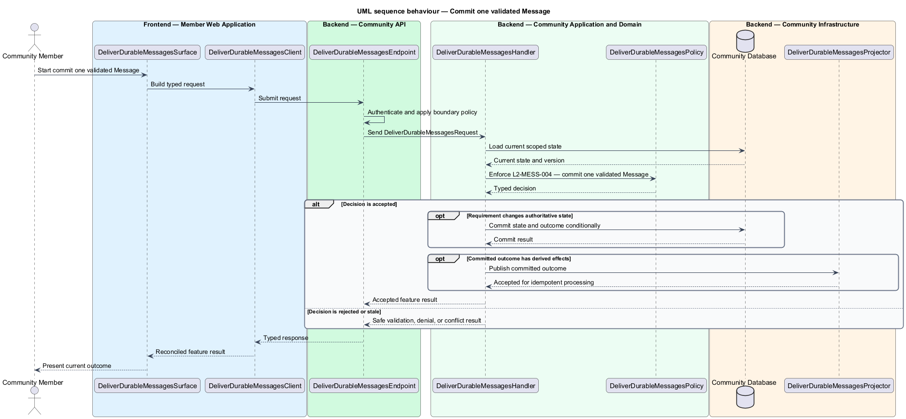
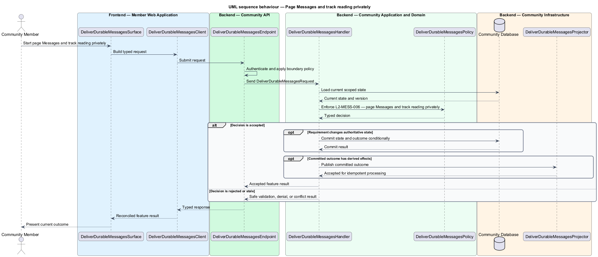
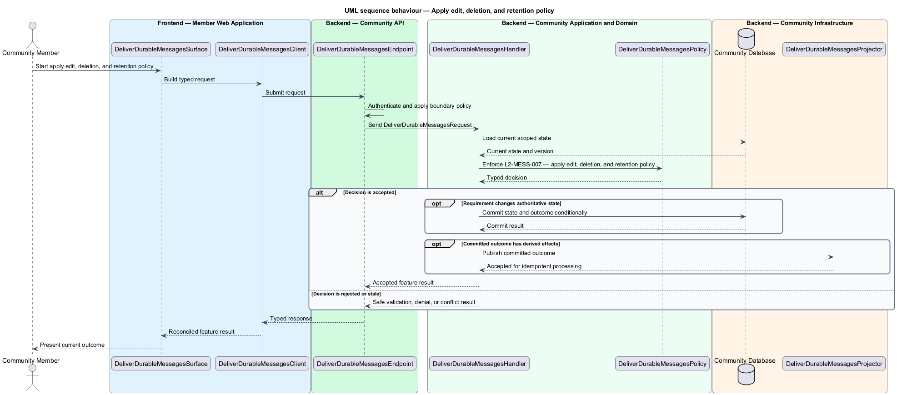
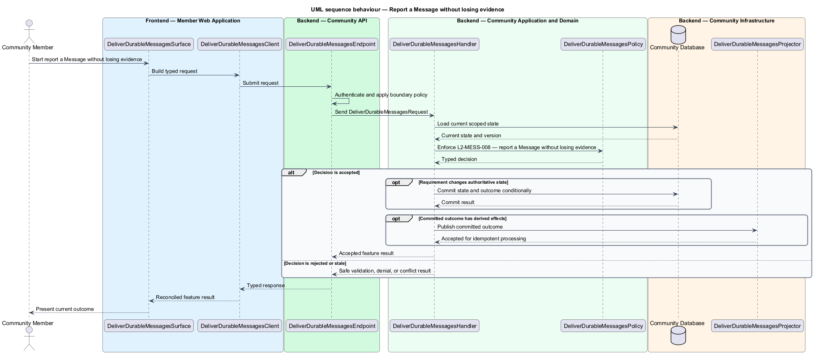

# Durable and safe Messages

## Overview

Community Starter is a community platform divided into product and platform subsystems. The
Messaging and realtime subsystem owns this feature.

*durable and safe Messages* — subsystem capability that covers commit one validated Message, page Messages and track reading privately, apply edit, deletion, and retention policy, and report a Message without losing evidence

Members need private conversation without allowing guessed identifiers, stale Memberships, Blocks, or realtime connections to bypass current Community and recipient policy. Messages are durable API state; realtime delivery is a post-commit hint and may be disabled without weakening other paths. The platform shall persist, retrieve, change, retain, and report Messages without duplicate effects, unauthorized disclosure, or loss of required safety evidence.

The feature groups 4 traced behaviors behind one policy and evidence
boundary: `L2-MESS-004`, `L2-MESS-006`, `L2-MESS-007`, and `L2-MESS-008`. Authoritative state commits before projections, delivery, or external work reports
success.

## Description

The repository contains specifications but no application implementation. This greenfield slice
defines the following building blocks across `Member Web Application`, `Community API`, the
application and domain layer, and infrastructure.

- **`DeliverDurableMessagesSurface`** — page component in `Member Web Application`. It presents current
  state, submits user intent, and reconciles the typed result.
- **`DeliverDurableMessagesClient`** — typed Angular client. It creates `DeliverDurableMessagesRequest` values and maps stable
  transport failures into feature results.
- **`DeliverDurableMessagesEndpoint`** — HTTP endpoint in `Community API`. It authenticates the
  caller, applies boundary policy, and dispatches the request.
- **`DeliverDurableMessagesRequest`** — immutable request carrying `SubjectId`, `Action`, `ExpectedVersion`, and the
  scoped input needed by one traced behavior.
- **`DeliverDurableMessagesHandler`** — application service that loads authorized state through
  `IDeliverDurableMessagesRepository`, invokes `DeliverDurableMessagesPolicy`, and commits an accepted transition.
- **`DeliverDurableMessagesPolicy`** — domain policy that evaluates current state and returns a typed
  `DeliverDurableMessagesDecision` without performing external work.
- **`DeliverDurableMessagesRecord`** — authoritative record containing the feature state, scope, and concurrency
  version.
- **`IDeliverDurableMessagesRepository`** — persistence port that loads scoped state and commits one conditional
  unit of work.
- **`DeliverDurableMessagesProjector`** — idempotent post-commit component in `Community Job Worker`. It updates
  eligible projections and invokes configured external providers.

`DeliverDurableMessagesPolicy` exposes one named operation for each traced behavior:

- **`DeliverDurableMessagesPolicy.CommitOneValidatedMessage(record, request)`** — evaluates `L2-MESS-004` (commit one validated Message) and returns a typed decision before any state change.
- **`DeliverDurableMessagesPolicy.PageMessagesAndTrackReadingPrivately(record, request)`** — evaluates `L2-MESS-006` (page Messages and track reading privately) and returns a typed decision before any state change.
- **`DeliverDurableMessagesPolicy.ApplyEditDeletionAndRetentionPolicy(record, request)`** — evaluates `L2-MESS-007` (apply edit, deletion, and retention policy) and returns a typed decision before any state change.
- **`DeliverDurableMessagesPolicy.ReportAMessageWithoutLosingEvidence(record, request)`** — evaluates `L2-MESS-008` (report a Message without losing evidence) and returns a typed decision before any state change.

## Requirements

The feature realizes the following level-2 (L2) requirements. Each row preserves the specification
identifier, its level-1 (L1) parent, and the requirement statement verbatim.

| L2 ID | Refines (L1) | Requirement |
|-------|--------------|-------------|
| `L2-MESS-004` | `L1-MESS-002` | A send use case reauthorizes the sender, validates bounded content, persists one Message atomically, and schedules downstream work only after the commit succeeds. |
| `L2-MESS-006` | `L1-MESS-002` | Authorized participants retrieve a stable cursor-paginated Message history, while read state follows the configured privacy contract and never leaks activity to an ineligible viewer. |
| `L2-MESS-007` | `L1-MESS-002` | Message edits, author removal, participant deletion requests, and retention are distinct, server-authorized transitions with disclosed effects on history and evidence. |
| `L2-MESS-008` | `L1-MESS-002` | An eligible participant can Report a Message with a restricted evidence snapshot that survives later edits, author removal, participant departure, and ordinary retention processing. |

## Diagrams

### System context

The `Community Member` uses `Community Platform` for the feature. The system invokes
`Realtime Delivery Infrastructure` only for configured external work after authoritative decisions.

### Containers

`Member Web Application` collects intent, `Community API` applies the synchronous boundary,
and `Community Database` holds authoritative state. `Community Job Worker` handles eligible
post-commit work against `Realtime Delivery Infrastructure`.

### Components

Inside `Community API`, `DeliverDurableMessagesEndpoint` dispatches `DeliverDurableMessagesHandler`. The handler evaluates
`DeliverDurableMessagesPolicy`, persists through `IDeliverDurableMessagesRepository`, and hands committed outcomes to
`DeliverDurableMessagesProjector`.

### Class structure

`DeliverDurableMessagesHandler` depends on the immutable request, domain policy, and repository port.
`DeliverDurableMessagesRecord` owns versioned state, while `DeliverDurableMessagesProjector` consumes committed results.

### Behaviour — commit one validated Message

The interaction loads current scoped state before `DeliverDurableMessagesPolicy` enforces
`L2-MESS-004`. Rejected decisions return without changing authoritative state; accepted
state changes commit before optional derived work starts.

### Behaviour — page Messages and track reading privately

The interaction loads current scoped state before `DeliverDurableMessagesPolicy` enforces
`L2-MESS-006`. Rejected decisions return without changing authoritative state; accepted
state changes commit before optional derived work starts.

### Behaviour — apply edit, deletion, and retention policy

The interaction loads current scoped state before `DeliverDurableMessagesPolicy` enforces
`L2-MESS-007`. Rejected decisions return without changing authoritative state; accepted
state changes commit before optional derived work starts.

### Behaviour — report a Message without losing evidence

The interaction loads current scoped state before `DeliverDurableMessagesPolicy` enforces
`L2-MESS-008`. Rejected decisions return without changing authoritative state; accepted
state changes commit before optional derived work starts.

