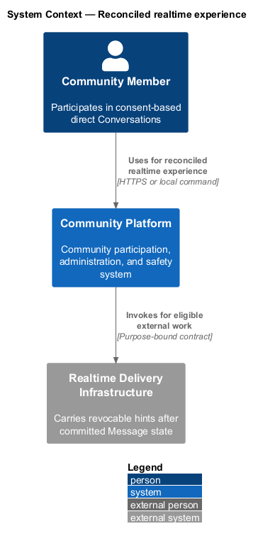
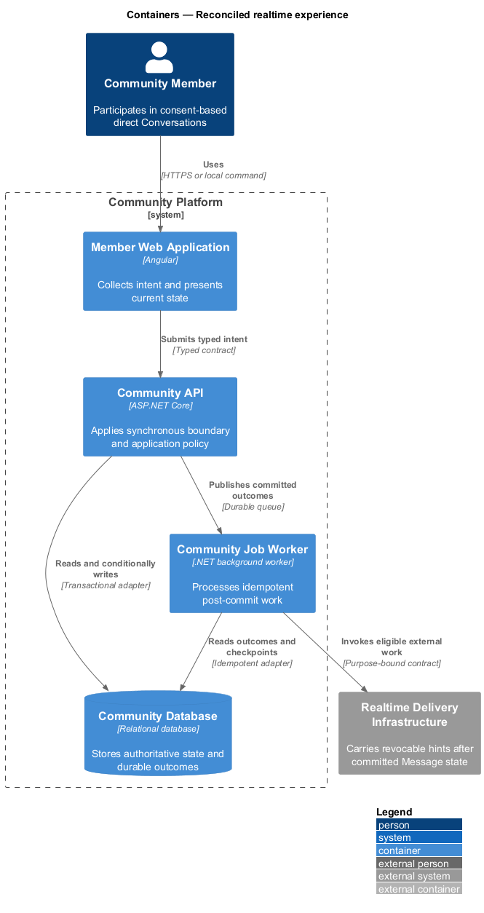
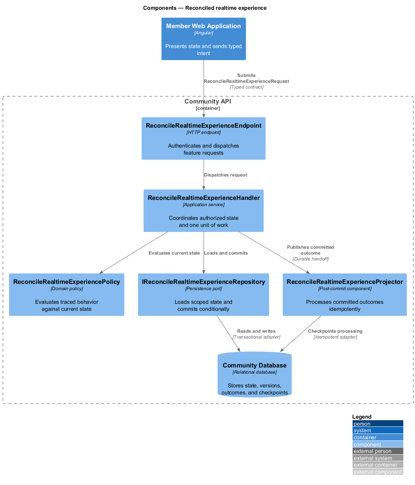
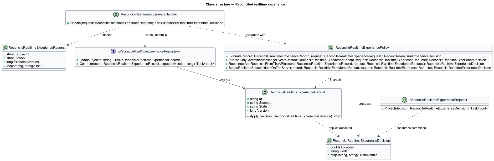
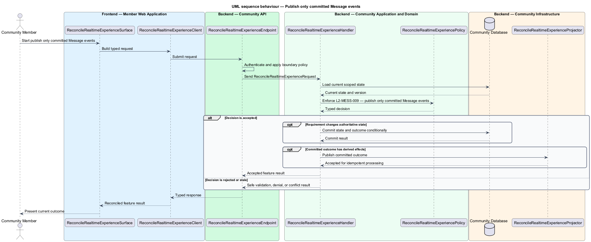
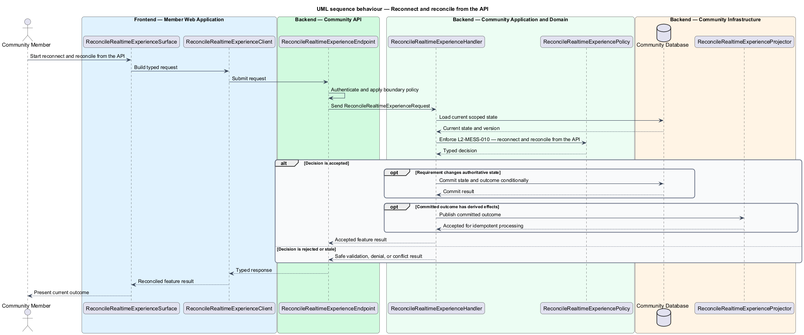
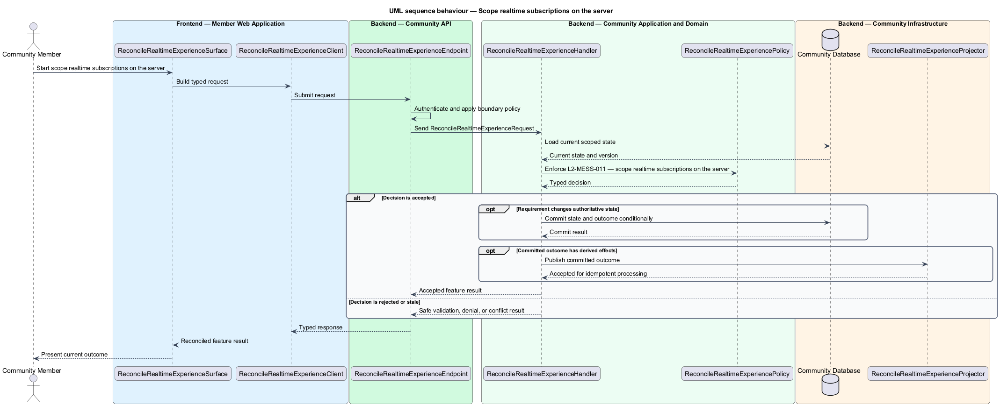

# Reconciled realtime experience

## Overview

Community Starter is a community platform divided into product and platform subsystems. The
Messaging and realtime subsystem owns this feature.

*reconciled realtime experience* — subsystem capability that covers publish only committed Message events, reconnect and reconcile from the API, and scope realtime subscriptions on the server

Members need private conversation without allowing guessed identifiers, stale Memberships, Blocks, or realtime connections to bypass current Community and recipient policy. Messages are durable API state; realtime delivery is a post-commit hint and may be disabled without weakening other paths. The platform shall provide authorized post-commit realtime hints while remaining correct through disconnects, duplicates, out-of-order delivery, revoked access, and scale-topology changes.

The feature groups 3 traced behaviors behind one policy and evidence
boundary: `L2-MESS-009`, `L2-MESS-010`, and `L2-MESS-011`. Authoritative state commits before projections, delivery, or external work reports
success.

## Description

The repository contains specifications but no application implementation. This greenfield slice
defines the following building blocks across `Member Web Application`, `Community API`, the
application and domain layer, and infrastructure.

- **`ReconcileRealtimeExperienceSurface`** — page component in `Member Web Application`. It presents current
  state, submits user intent, and reconciles the typed result.
- **`ReconcileRealtimeExperienceClient`** — typed Angular client. It creates `ReconcileRealtimeExperienceRequest` values and maps stable
  transport failures into feature results.
- **`ReconcileRealtimeExperienceEndpoint`** — HTTP endpoint in `Community API`. It authenticates the
  caller, applies boundary policy, and dispatches the request.
- **`ReconcileRealtimeExperienceRequest`** — immutable request carrying `SubjectId`, `Action`, `ExpectedVersion`, and the
  scoped input needed by one traced behavior.
- **`ReconcileRealtimeExperienceHandler`** — application service that loads authorized state through
  `IReconcileRealtimeExperienceRepository`, invokes `ReconcileRealtimeExperiencePolicy`, and commits an accepted transition.
- **`ReconcileRealtimeExperiencePolicy`** — domain policy that evaluates current state and returns a typed
  `ReconcileRealtimeExperienceDecision` without performing external work.
- **`ReconcileRealtimeExperienceRecord`** — authoritative record containing the feature state, scope, and concurrency
  version.
- **`IReconcileRealtimeExperienceRepository`** — persistence port that loads scoped state and commits one conditional
  unit of work.
- **`ReconcileRealtimeExperienceProjector`** — idempotent post-commit component in `Community Job Worker`. It updates
  eligible projections and invokes configured external providers.

`ReconcileRealtimeExperiencePolicy` exposes one named operation for each traced behavior:

- **`ReconcileRealtimeExperiencePolicy.PublishOnlyCommittedMessageEvents(record, request)`** — evaluates `L2-MESS-009` (publish only committed Message events) and returns a typed decision before any state change.
- **`ReconcileRealtimeExperiencePolicy.ReconnectAndReconcileFromTheAPI(record, request)`** — evaluates `L2-MESS-010` (reconnect and reconcile from the API) and returns a typed decision before any state change.
- **`ReconcileRealtimeExperiencePolicy.ScopeRealtimeSubscriptionsOnTheServer(record, request)`** — evaluates `L2-MESS-011` (scope realtime subscriptions on the server) and returns a typed decision before any state change.

## Requirements

The feature realizes the following level-2 (L2) requirements. Each row preserves the specification
identifier, its level-1 (L1) parent, and the requirement statement verbatim.

| L2 ID | Refines (L1) | Requirement |
|-------|--------------|-------------|
| `L2-MESS-009` | `L1-MESS-003` | Realtime Message events are stable, privacy-minimized hints emitted from committed state and never serve as the durable source of truth. |
| `L2-MESS-010` | `L1-MESS-003` | Clients treat disconnects, missed events, duplicates, and out-of-order events as normal and reconcile Conversation state from authorized API contracts. |
| `L2-MESS-011` | `L1-MESS-003` | Every realtime connection and Conversation subscription is authenticated, server-scoped, bounded, revocable, and observable without trusting a client-supplied channel identifier. |

## Diagrams

### System context

The `Community Member` uses `Community Platform` for the feature. The system invokes
`Realtime Delivery Infrastructure` only for configured external work after authoritative decisions.

### Containers

`Member Web Application` collects intent, `Community API` applies the synchronous boundary,
and `Community Database` holds authoritative state. `Community Job Worker` handles eligible
post-commit work against `Realtime Delivery Infrastructure`.

### Components

Inside `Community API`, `ReconcileRealtimeExperienceEndpoint` dispatches `ReconcileRealtimeExperienceHandler`. The handler evaluates
`ReconcileRealtimeExperiencePolicy`, persists through `IReconcileRealtimeExperienceRepository`, and hands committed outcomes to
`ReconcileRealtimeExperienceProjector`.

### Class structure

`ReconcileRealtimeExperienceHandler` depends on the immutable request, domain policy, and repository port.
`ReconcileRealtimeExperienceRecord` owns versioned state, while `ReconcileRealtimeExperienceProjector` consumes committed results.

### Behaviour — publish only committed Message events

The interaction loads current scoped state before `ReconcileRealtimeExperiencePolicy` enforces
`L2-MESS-009`. Rejected decisions return without changing authoritative state; accepted
state changes commit before optional derived work starts.

### Behaviour — reconnect and reconcile from the API

The interaction loads current scoped state before `ReconcileRealtimeExperiencePolicy` enforces
`L2-MESS-010`. Rejected decisions return without changing authoritative state; accepted
state changes commit before optional derived work starts.

### Behaviour — scope realtime subscriptions on the server

The interaction loads current scoped state before `ReconcileRealtimeExperiencePolicy` enforces
`L2-MESS-011`. Rejected decisions return without changing authoritative state; accepted
state changes commit before optional derived work starts.

