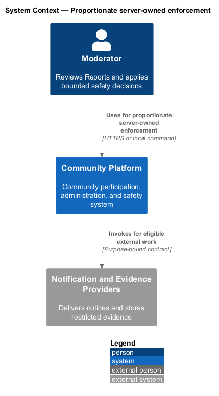
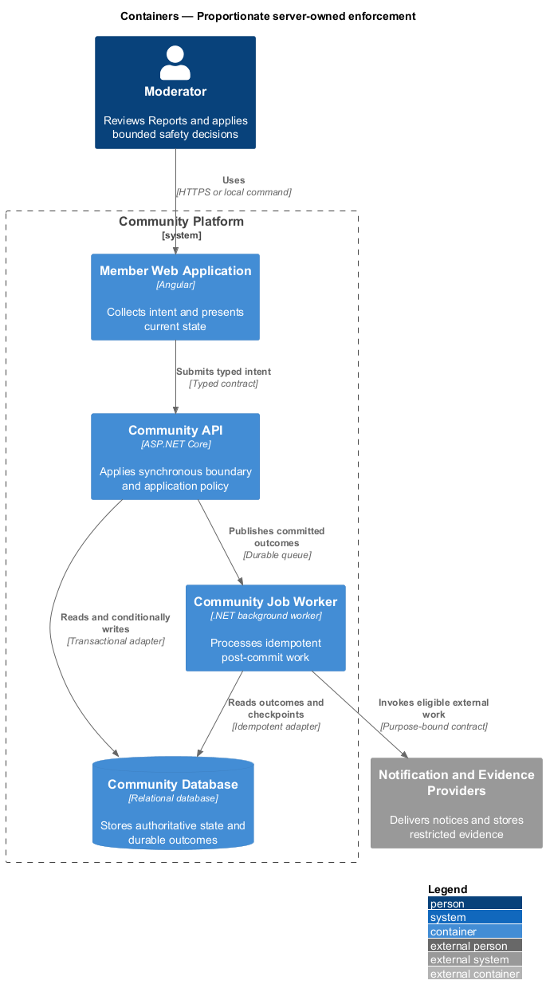
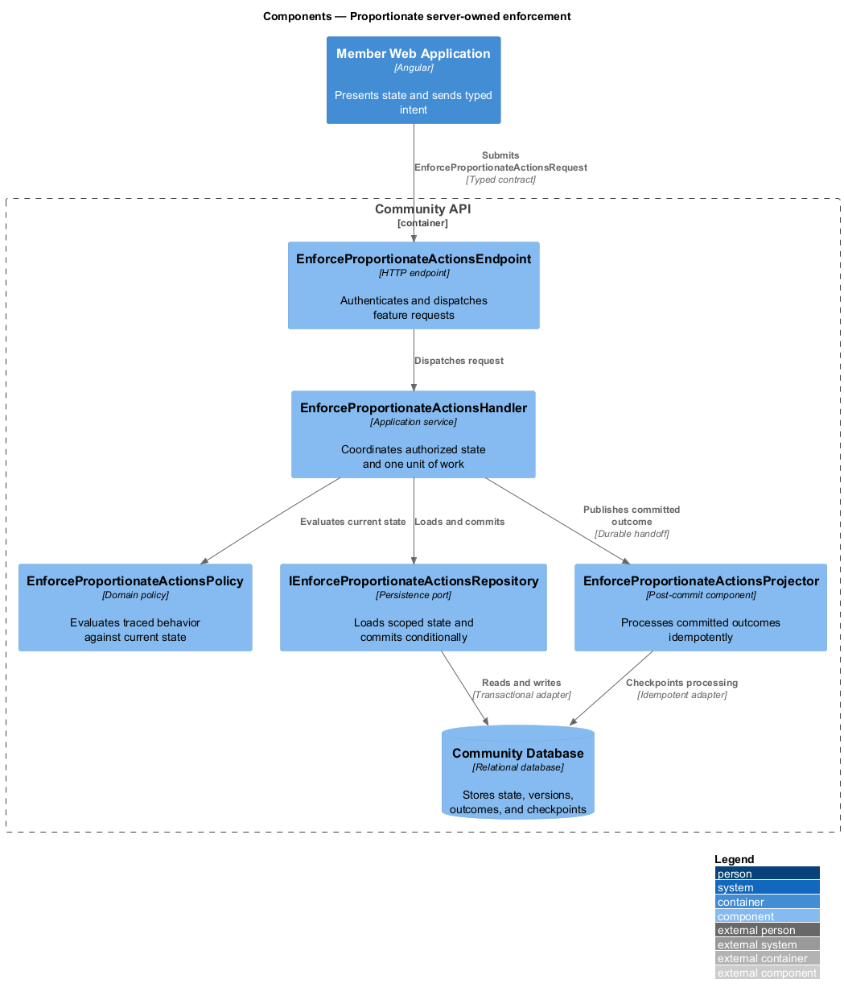
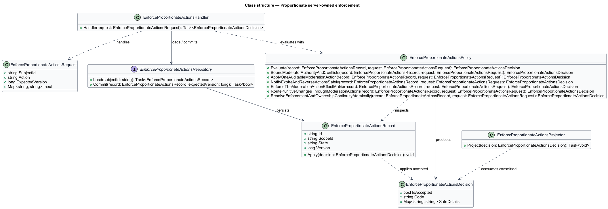
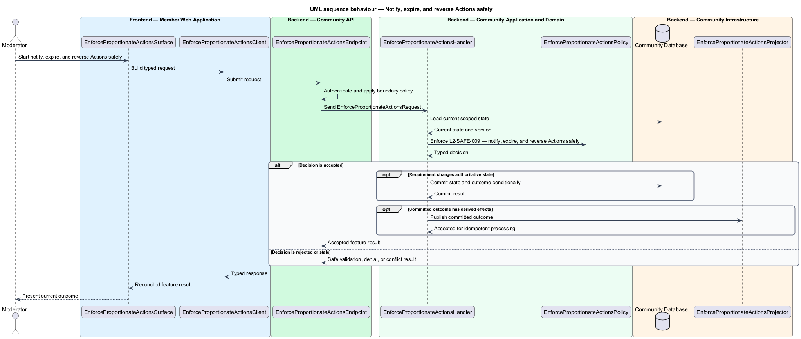
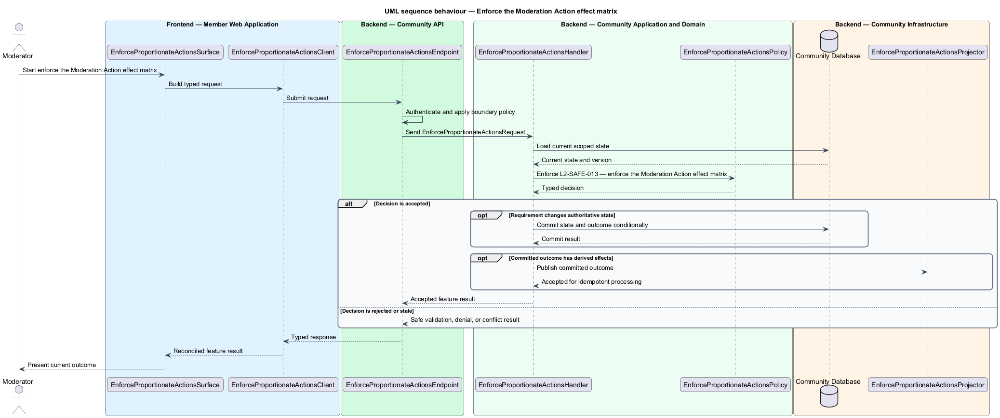
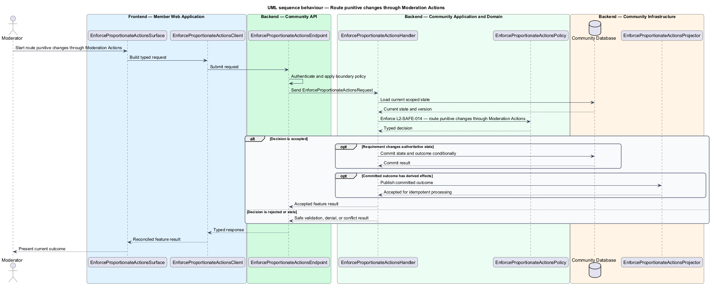
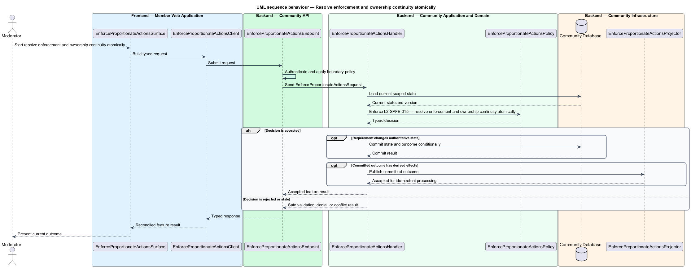

# Proportionate server-owned enforcement

## Overview

Community Starter is a community platform divided into product and platform subsystems. The
Moderation, trust, and safety subsystem owns this feature.

*proportionate server-owned enforcement* — subsystem capability that covers bound moderator authority and conflicts, apply one auditable Moderation Action, notify, expire, and reverse Actions safely, enforce the Moderation Action effect matrix, route punitive changes through Moderation Actions, and resolve enforcement and ownership continuity atomically

Members need a safe way to report suspected harm, while Moderators need bounded authority, preserved evidence, consistent policy, and accountable decisions. Safety behavior spans content, Profiles, Memberships, Messages, Events, discovery, Delivery, appeals, data retention, and emergency response. The platform shall authorize, apply, expire, reverse, and communicate Moderation Actions atomically across every affected access, projection, Delivery, and integration path.

The feature groups 6 traced behaviors behind one policy and evidence
boundary: `L2-SAFE-007`, `L2-SAFE-008`, `L2-SAFE-009`, `L2-SAFE-013`, `L2-SAFE-014`, and `L2-SAFE-015`. Authoritative state commits before projections, delivery, or external work reports
success.

## Description

The repository contains specifications but no application implementation. This greenfield slice
defines the following building blocks across `Member Web Application`, `Community API`, the
application and domain layer, and infrastructure.

- **`EnforceProportionateActionsSurface`** — page component in `Member Web Application`. It presents current
  state, submits user intent, and reconciles the typed result.
- **`EnforceProportionateActionsClient`** — typed Angular client. It creates `EnforceProportionateActionsRequest` values and maps stable
  transport failures into feature results.
- **`EnforceProportionateActionsEndpoint`** — HTTP endpoint in `Community API`. It authenticates the
  caller, applies boundary policy, and dispatches the request.
- **`EnforceProportionateActionsRequest`** — immutable request carrying `SubjectId`, `Action`, `ExpectedVersion`, and the
  scoped input needed by one traced behavior.
- **`EnforceProportionateActionsHandler`** — application service that loads authorized state through
  `IEnforceProportionateActionsRepository`, invokes `EnforceProportionateActionsPolicy`, and commits an accepted transition.
- **`EnforceProportionateActionsPolicy`** — domain policy that evaluates current state and returns a typed
  `EnforceProportionateActionsDecision` without performing external work.
- **`EnforceProportionateActionsRecord`** — authoritative record containing the feature state, scope, and concurrency
  version.
- **`IEnforceProportionateActionsRepository`** — persistence port that loads scoped state and commits one conditional
  unit of work.
- **`EnforceProportionateActionsProjector`** — idempotent post-commit component in `Community Job Worker`. It updates
  eligible projections and invokes configured external providers.

`EnforceProportionateActionsPolicy` exposes one named operation for each traced behavior:

- **`EnforceProportionateActionsPolicy.BoundModeratorAuthorityAndConflicts(record, request)`** — evaluates `L2-SAFE-007` (bound moderator authority and conflicts) and returns a typed decision before any state change.
- **`EnforceProportionateActionsPolicy.ApplyOneAuditableModerationAction(record, request)`** — evaluates `L2-SAFE-008` (apply one auditable Moderation Action) and returns a typed decision before any state change.
- **`EnforceProportionateActionsPolicy.NotifyExpireAndReverseActionsSafely(record, request)`** — evaluates `L2-SAFE-009` (notify, expire, and reverse Actions safely) and returns a typed decision before any state change.
- **`EnforceProportionateActionsPolicy.EnforceTheModerationActionEffectMatrix(record, request)`** — evaluates `L2-SAFE-013` (enforce the Moderation Action effect matrix) and returns a typed decision before any state change.
- **`EnforceProportionateActionsPolicy.RoutePunitiveChangesThroughModerationActions(record, request)`** — evaluates `L2-SAFE-014` (route punitive changes through Moderation Actions) and returns a typed decision before any state change.
- **`EnforceProportionateActionsPolicy.ResolveEnforcementAndOwnershipContinuityAtomically(record, request)`** — evaluates `L2-SAFE-015` (resolve enforcement and ownership continuity atomically) and returns a typed decision before any state change.

## Requirements

The feature realizes the following level-2 (L2) requirements. Each row preserves the specification
identifier, its level-1 (L1) parent, and the requirement statement verbatim.

| L2 ID | Refines (L1) | Requirement |
|-------|--------------|-------------|
| `L2-SAFE-007` | `L1-SAFE-003` | Community Moderators, platform safety operators, and administrators receive separate action scopes; current role, target, policy, conflict, and severity determine authority for every decision. |
| `L2-SAFE-008` | `L1-SAFE-003` | Warnings, labels, limits, locks, hides/removals, suspensions, Community bans, and platform bans are typed, reasoned, scoped, time-bounded where applicable, and committed atomically with an Audit Event. |
| `L2-SAFE-009` | `L1-SAFE-003` | Affected people receive the permitted policy basis, impact, duration, and review path; expiry or reversal restores only state justified by the Action and current independent restrictions. |
| `L2-SAFE-013` | `L1-SAFE-003` | A versioned server-owned matrix defines the exact effect of every warning, label, limit, lock, hide/removal, suspension, Community ban, and platform ban by target, scope, lifecycle, and action. Every Action binds a matrix version and every request/background effect evaluates that binding plus current independent state; no feature invents independent ban semantics. A platform-banned Account may receive only a strongly verified restricted-remediation Session for listed non-participatory actions. |
| `L2-SAFE-014` | `L1-SAFE-003` | Voluntary departure, ordinary ownership cleanup, author deletion, archival, and neutral administrative correction remain distinct from punitive enforcement. Any Membership suspension or removal, content removal, restriction, or bulk change whose purpose is policy enforcement must invoke the Moderation Case decision path and create one typed Moderation Action with notice and Appeal rules. |
| `L2-SAFE-015` | `L1-SAFE-003` | Safety authority cannot be blocked by last-owner or last-manager invariants, and enforcement cannot leave a Community ownerless. Before an Action disables the last eligible owner, organizer, manager, or other required MVP controller, one reviewed transaction transfers control to an eligible accepted successor or establishes time-bounded platform stewardship before the target loses access. |

## Diagrams

### System context

The `Moderator` uses `Community Platform` for the feature. The system invokes
`Notification and Evidence Providers` only for configured external work after authoritative decisions.

### Containers

`Member Web Application` collects intent, `Community API` applies the synchronous boundary,
and `Community Database` holds authoritative state. `Community Job Worker` handles eligible
post-commit work against `Notification and Evidence Providers`.

### Components

Inside `Community API`, `EnforceProportionateActionsEndpoint` dispatches `EnforceProportionateActionsHandler`. The handler evaluates
`EnforceProportionateActionsPolicy`, persists through `IEnforceProportionateActionsRepository`, and hands committed outcomes to
`EnforceProportionateActionsProjector`.

### Class structure

`EnforceProportionateActionsHandler` depends on the immutable request, domain policy, and repository port.
`EnforceProportionateActionsRecord` owns versioned state, while `EnforceProportionateActionsProjector` consumes committed results.

### Behaviour — bound moderator authority and conflicts

The interaction loads current scoped state before `EnforceProportionateActionsPolicy` enforces
`L2-SAFE-007`. Rejected decisions return without changing authoritative state; accepted
state changes commit before optional derived work starts.

### Behaviour — apply one auditable Moderation Action

The interaction loads current scoped state before `EnforceProportionateActionsPolicy` enforces
`L2-SAFE-008`. Rejected decisions return without changing authoritative state; accepted
state changes commit before optional derived work starts.

### Behaviour — notify, expire, and reverse Actions safely

The interaction loads current scoped state before `EnforceProportionateActionsPolicy` enforces
`L2-SAFE-009`. Rejected decisions return without changing authoritative state; accepted
state changes commit before optional derived work starts.

### Behaviour — enforce the Moderation Action effect matrix

The interaction loads current scoped state before `EnforceProportionateActionsPolicy` enforces
`L2-SAFE-013`. Rejected decisions return without changing authoritative state; accepted
state changes commit before optional derived work starts.

### Behaviour — route punitive changes through Moderation Actions

The interaction loads current scoped state before `EnforceProportionateActionsPolicy` enforces
`L2-SAFE-014`. Rejected decisions return without changing authoritative state; accepted
state changes commit before optional derived work starts.

### Behaviour — resolve enforcement and ownership continuity atomically

The interaction loads current scoped state before `EnforceProportionateActionsPolicy` enforces
`L2-SAFE-015`. Rejected decisions return without changing authoritative state; accepted
state changes commit before optional derived work starts.

