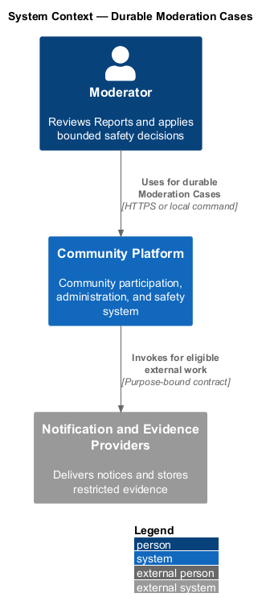
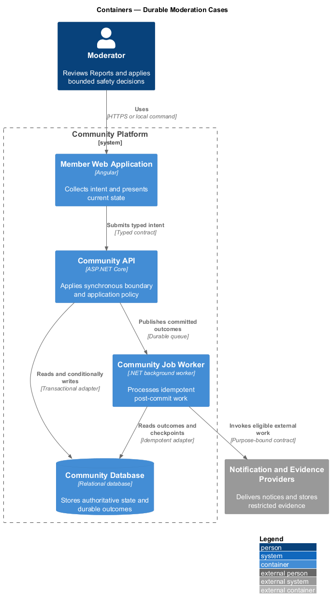
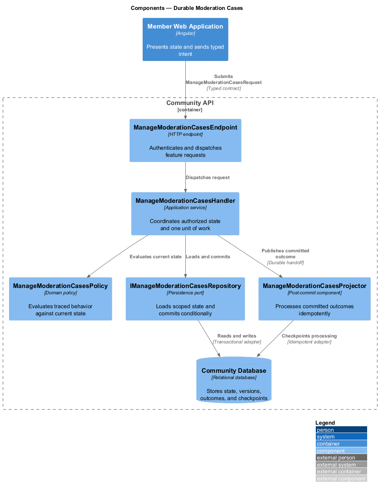
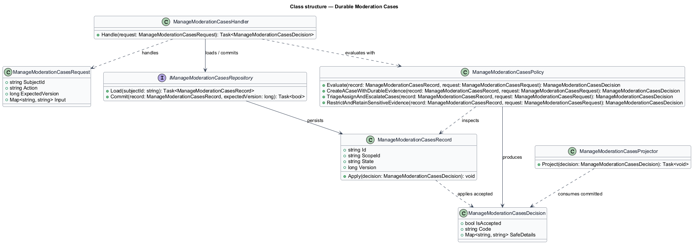
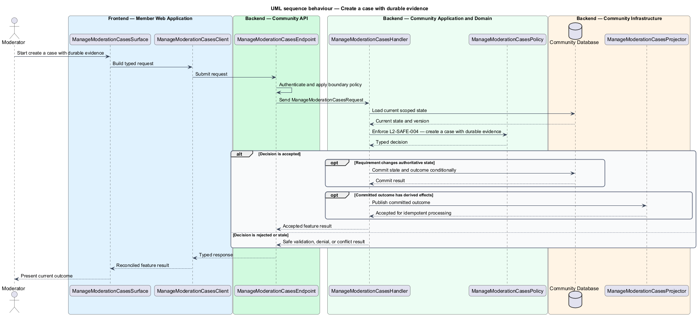

# Durable Moderation Cases

## Overview

Community Starter is a community platform divided into product and platform subsystems. The
Moderation, trust, and safety subsystem owns this feature.

*durable Moderation Cases* — subsystem capability that covers create a case with durable evidence, triage, assign, and escalate cases, and restrict and retain sensitive evidence

Members need a safe way to report suspected harm, while Moderators need bounded authority, preserved evidence, consistent policy, and accountable decisions. Safety behavior spans content, Profiles, Memberships, Messages, Events, discovery, Delivery, appeals, data retention, and emergency response. The platform shall preserve authorized evidence, prioritize and assign cases, control reviewer access, and retain only what the declared safety and data policies require.

The feature groups 3 traced behaviors behind one policy and evidence
boundary: `L2-SAFE-004`, `L2-SAFE-005`, and `L2-SAFE-006`. Authoritative state commits before projections, delivery, or external work reports
success.

## Description

The repository contains specifications but no application implementation. This greenfield slice
defines the following building blocks across `Member Web Application`, `Community API`, the
application and domain layer, and infrastructure.

- **`ManageModerationCasesSurface`** — page component in `Member Web Application`. It presents current
  state, submits user intent, and reconciles the typed result.
- **`ManageModerationCasesClient`** — typed Angular client. It creates `ManageModerationCasesRequest` values and maps stable
  transport failures into feature results.
- **`ManageModerationCasesEndpoint`** — HTTP endpoint in `Community API`. It authenticates the
  caller, applies boundary policy, and dispatches the request.
- **`ManageModerationCasesRequest`** — immutable request carrying `SubjectId`, `Action`, `ExpectedVersion`, and the
  scoped input needed by one traced behavior.
- **`ManageModerationCasesHandler`** — application service that loads authorized state through
  `IManageModerationCasesRepository`, invokes `ManageModerationCasesPolicy`, and commits an accepted transition.
- **`ManageModerationCasesPolicy`** — domain policy that evaluates current state and returns a typed
  `ManageModerationCasesDecision` without performing external work.
- **`ManageModerationCasesRecord`** — authoritative record containing the feature state, scope, and concurrency
  version.
- **`IManageModerationCasesRepository`** — persistence port that loads scoped state and commits one conditional
  unit of work.
- **`ManageModerationCasesProjector`** — idempotent post-commit component in `Community Job Worker`. It updates
  eligible projections and invokes configured external providers.

`ManageModerationCasesPolicy` exposes one named operation for each traced behavior:

- **`ManageModerationCasesPolicy.CreateACaseWithDurableEvidence(record, request)`** — evaluates `L2-SAFE-004` (create a case with durable evidence) and returns a typed decision before any state change.
- **`ManageModerationCasesPolicy.TriageAssignAndEscalateCases(record, request)`** — evaluates `L2-SAFE-005` (triage, assign, and escalate cases) and returns a typed decision before any state change.
- **`ManageModerationCasesPolicy.RestrictAndRetainSensitiveEvidence(record, request)`** — evaluates `L2-SAFE-006` (restrict and retain sensitive evidence) and returns a typed decision before any state change.

## Requirements

The feature realizes the following level-2 (L2) requirements. Each row preserves the specification
identifier, its level-1 (L1) parent, and the requirement statement verbatim.

| L2 ID | Refines (L1) | Requirement |
|-------|--------------|-------------|
| `L2-SAFE-004` | `L1-SAFE-002` | Accepted Reports create or join a Moderation Case by linking the immutable target/version evidence, provenance, access classification, and policy basis committed with the Report; case processing never recaptures a later target version as if it were the reported evidence. |
| `L2-SAFE-005` | `L1-SAFE-002` | Moderation Cases and Appeals use explicit priority, status, ownership, service target, and escalation transitions without allowing queue races or silent abandonment. |
| `L2-SAFE-006` | `L1-SAFE-002` | Evidence access is least privilege, purpose-bound, audited, redacted where possible, and reconciled with retention, deletion, legal-hold, and reviewer-safety policies. |

## Diagrams

### System context

The `Moderator` uses `Community Platform` for the feature. The system invokes
`Notification and Evidence Providers` only for configured external work after authoritative decisions.

### Containers

`Member Web Application` collects intent, `Community API` applies the synchronous boundary,
and `Community Database` holds authoritative state. `Community Job Worker` handles eligible
post-commit work against `Notification and Evidence Providers`.

### Components

Inside `Community API`, `ManageModerationCasesEndpoint` dispatches `ManageModerationCasesHandler`. The handler evaluates
`ManageModerationCasesPolicy`, persists through `IManageModerationCasesRepository`, and hands committed outcomes to
`ManageModerationCasesProjector`.

### Class structure

`ManageModerationCasesHandler` depends on the immutable request, domain policy, and repository port.
`ManageModerationCasesRecord` owns versioned state, while `ManageModerationCasesProjector` consumes committed results.

### Behaviour — create a case with durable evidence

The interaction loads current scoped state before `ManageModerationCasesPolicy` enforces
`L2-SAFE-004`. Rejected decisions return without changing authoritative state; accepted
state changes commit before optional derived work starts.

### Behaviour — triage, assign, and escalate cases

The interaction loads current scoped state before `ManageModerationCasesPolicy` enforces
`L2-SAFE-005`. Rejected decisions return without changing authoritative state; accepted
state changes commit before optional derived work starts.

### Behaviour — restrict and retain sensitive evidence

The interaction loads current scoped state before `ManageModerationCasesPolicy` enforces
`L2-SAFE-006`. Rejected decisions return without changing authoritative state; accepted
state changes commit before optional derived work starts.

