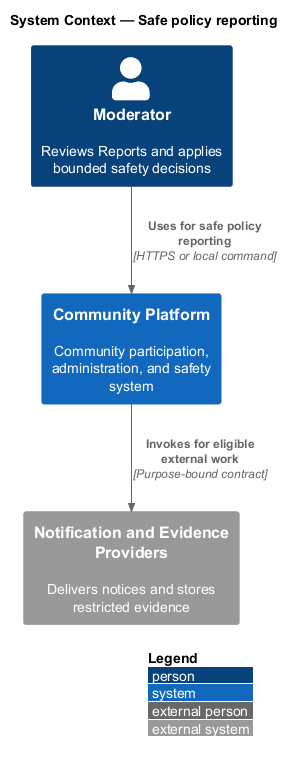
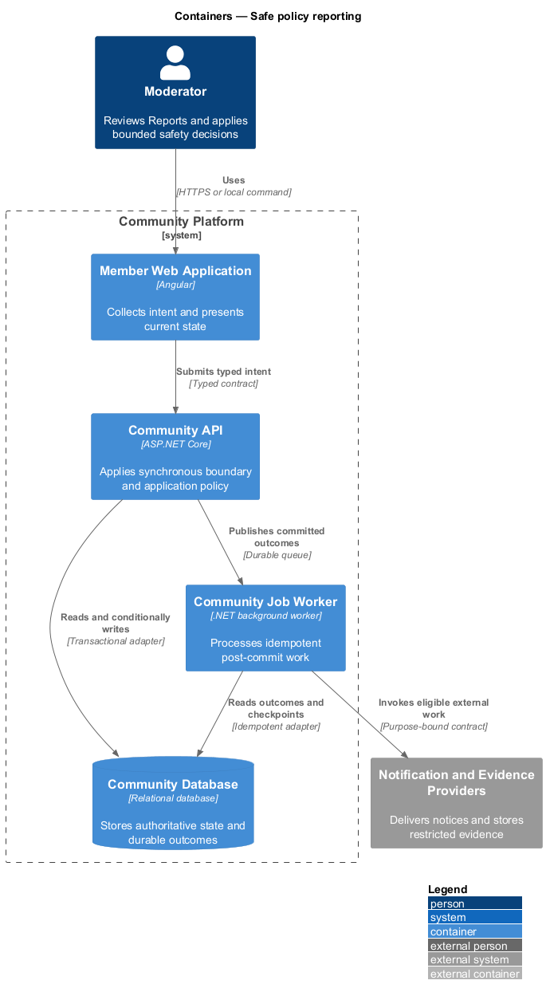
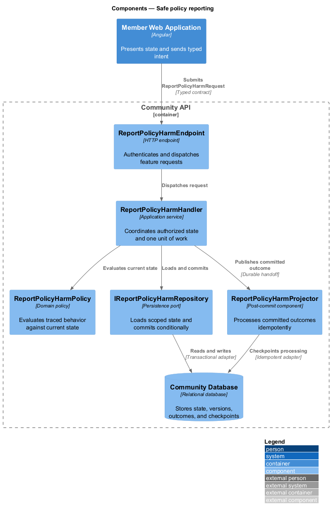
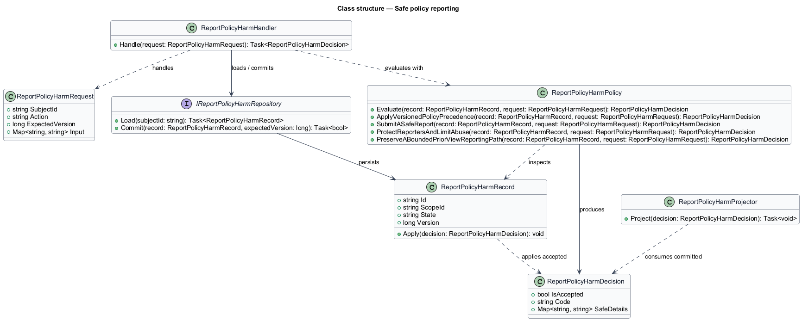
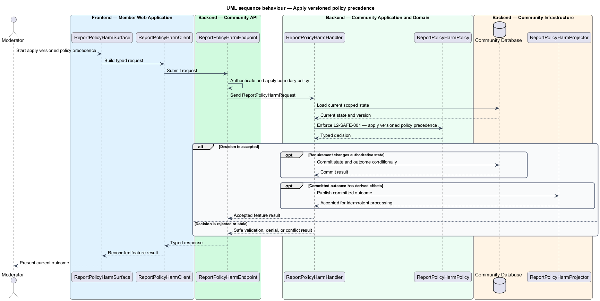
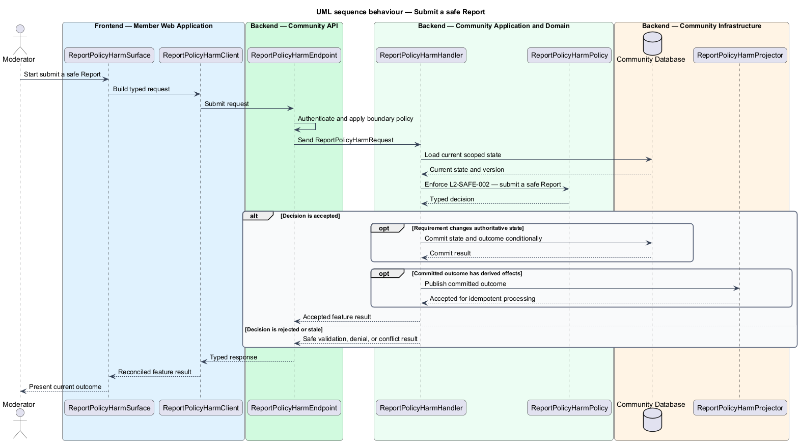
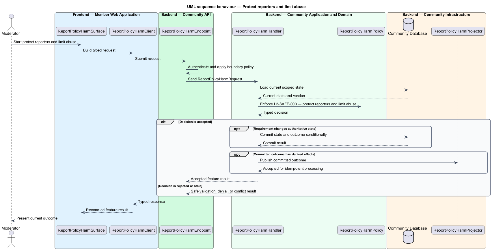
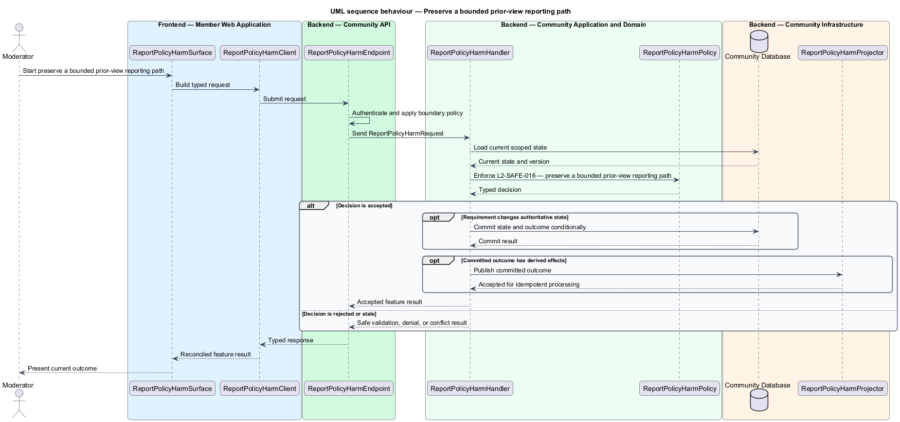

# Safe policy reporting

## Overview

Community Starter is a community platform divided into product and platform subsystems. The
Moderation, trust, and safety subsystem owns this feature.

*safe policy reporting* — subsystem capability that covers apply versioned policy precedence, submit a safe Report, protect reporters and limit abuse, and preserve a bounded prior-view reporting path

Members need a safe way to report suspected harm, while Moderators need bounded authority, preserved evidence, consistent policy, and accountable decisions. Safety behavior spans content, Profiles, Memberships, Messages, Events, discovery, Delivery, appeals, data retention, and emergency response. The platform shall publish applicable policy and accept privacy-safe Reports across supported targets without enabling retaliation, resource discovery, duplicate effects, or reporting abuse.

The feature groups 4 traced behaviors behind one policy and evidence
boundary: `L2-SAFE-001`, `L2-SAFE-002`, `L2-SAFE-003`, and `L2-SAFE-016`. Authoritative state commits before projections, delivery, or external work reports
success.

## Description

The repository contains specifications but no application implementation. This greenfield slice
defines the following building blocks across `Member Web Application`, `Community API`, the
application and domain layer, and infrastructure.

- **`ReportPolicyHarmSurface`** — page component in `Member Web Application`. It presents current
  state, submits user intent, and reconciles the typed result.
- **`ReportPolicyHarmClient`** — typed Angular client. It creates `ReportPolicyHarmRequest` values and maps stable
  transport failures into feature results.
- **`ReportPolicyHarmEndpoint`** — HTTP endpoint in `Community API`. It authenticates the
  caller, applies boundary policy, and dispatches the request.
- **`ReportPolicyHarmRequest`** — immutable request carrying `SubjectId`, `Action`, `ExpectedVersion`, and the
  scoped input needed by one traced behavior.
- **`ReportPolicyHarmHandler`** — application service that loads authorized state through
  `IReportPolicyHarmRepository`, invokes `ReportPolicyHarmPolicy`, and commits an accepted transition.
- **`ReportPolicyHarmPolicy`** — domain policy that evaluates current state and returns a typed
  `ReportPolicyHarmDecision` without performing external work.
- **`ReportPolicyHarmRecord`** — authoritative record containing the feature state, scope, and concurrency
  version.
- **`IReportPolicyHarmRepository`** — persistence port that loads scoped state and commits one conditional
  unit of work.
- **`ReportPolicyHarmProjector`** — idempotent post-commit component in `Community Job Worker`. It updates
  eligible projections and invokes configured external providers.

`ReportPolicyHarmPolicy` exposes one named operation for each traced behavior:

- **`ReportPolicyHarmPolicy.ApplyVersionedPolicyPrecedence(record, request)`** — evaluates `L2-SAFE-001` (apply versioned policy precedence) and returns a typed decision before any state change.
- **`ReportPolicyHarmPolicy.SubmitASafeReport(record, request)`** — evaluates `L2-SAFE-002` (submit a safe Report) and returns a typed decision before any state change.
- **`ReportPolicyHarmPolicy.ProtectReportersAndLimitAbuse(record, request)`** — evaluates `L2-SAFE-003` (protect reporters and limit abuse) and returns a typed decision before any state change.
- **`ReportPolicyHarmPolicy.PreserveABoundedPriorViewReportingPath(record, request)`** — evaluates `L2-SAFE-016` (preserve a bounded prior-view reporting path) and returns a typed decision before any state change.

## Requirements

The feature realizes the following level-2 (L2) requirements. Each row preserves the specification
identifier, its level-1 (L1) parent, and the requirement statement verbatim.

| L2 ID | Refines (L1) | Requirement |
|-------|--------------|-------------|
| `L2-SAFE-001` | `L1-SAFE-001` | Every reportable or enforceable decision identifies the applicable version of platform policy and, where permitted, Community policy, with explicit precedence and effective dates. |
| `L2-SAFE-002` | `L1-SAFE-001` | An eligible person can Report supported content, Profile, Membership, Community, Message, Event, or conduct with a reason, bounded context, safe acknowledgement, and an immutable evidence snapshot committed in the same transaction. A server-issued report receipt can preserve the reporting path for a bounded period after a previously viewed target is hidden, deleted, access-restricted, or Blocked. |
| `L2-SAFE-003` | `L1-SAFE-001` | Reporter identity and contact are disclosed only for an authorized purpose, while rate, duplicate, and malicious-report controls preserve access to urgent safety reporting. |
| `L2-SAFE-016` | `L1-SAFE-001` | Supported authenticated views may issue an opaque Report Receipt that proves the viewer, target, exact version, and authorized-view time while retaining only the minimum protected evidence needed to keep reporting possible through the disclosed receipt window. |

## Diagrams

### System context

The `Moderator` uses `Community Platform` for the feature. The system invokes
`Notification and Evidence Providers` only for configured external work after authoritative decisions.

### Containers

`Member Web Application` collects intent, `Community API` applies the synchronous boundary,
and `Community Database` holds authoritative state. `Community Job Worker` handles eligible
post-commit work against `Notification and Evidence Providers`.

### Components

Inside `Community API`, `ReportPolicyHarmEndpoint` dispatches `ReportPolicyHarmHandler`. The handler evaluates
`ReportPolicyHarmPolicy`, persists through `IReportPolicyHarmRepository`, and hands committed outcomes to
`ReportPolicyHarmProjector`.

### Class structure

`ReportPolicyHarmHandler` depends on the immutable request, domain policy, and repository port.
`ReportPolicyHarmRecord` owns versioned state, while `ReportPolicyHarmProjector` consumes committed results.

### Behaviour — apply versioned policy precedence

The interaction loads current scoped state before `ReportPolicyHarmPolicy` enforces
`L2-SAFE-001`. Rejected decisions return without changing authoritative state; accepted
state changes commit before optional derived work starts.

### Behaviour — submit a safe Report

The interaction loads current scoped state before `ReportPolicyHarmPolicy` enforces
`L2-SAFE-002`. Rejected decisions return without changing authoritative state; accepted
state changes commit before optional derived work starts.

### Behaviour — protect reporters and limit abuse

The interaction loads current scoped state before `ReportPolicyHarmPolicy` enforces
`L2-SAFE-003`. Rejected decisions return without changing authoritative state; accepted
state changes commit before optional derived work starts.

### Behaviour — preserve a bounded prior-view reporting path

The interaction loads current scoped state before `ReportPolicyHarmPolicy` enforces
`L2-SAFE-016`. Rejected decisions return without changing authoritative state; accepted
state changes commit before optional derived work starts.

