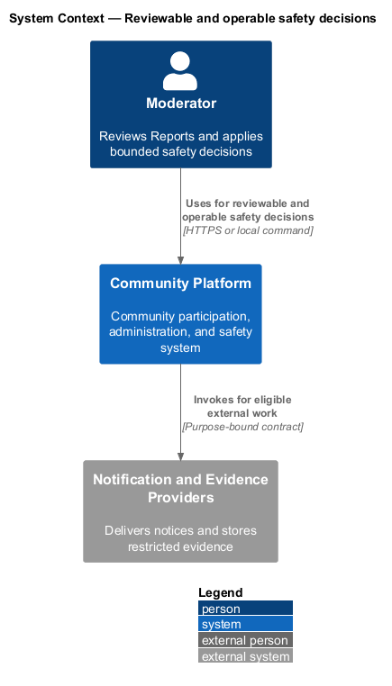
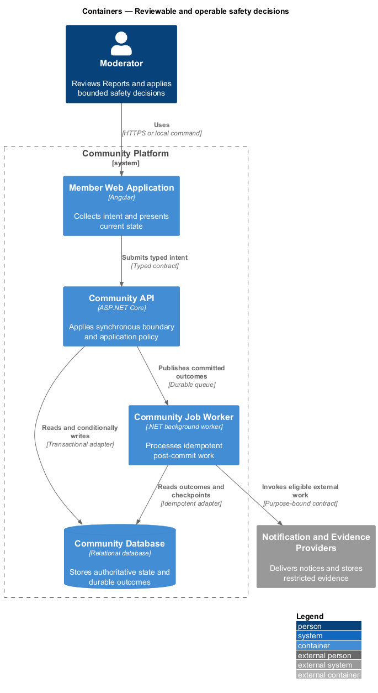
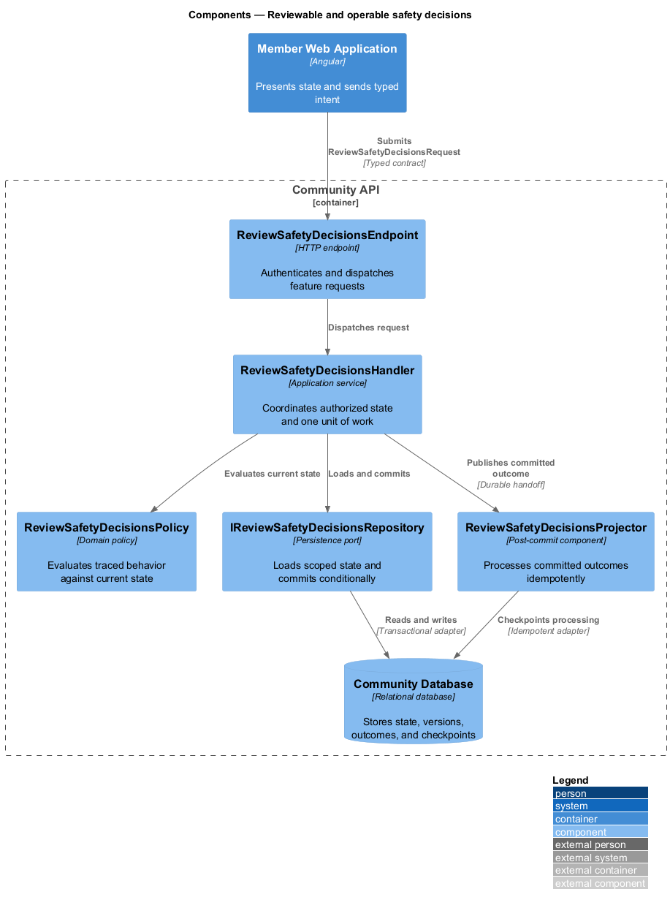
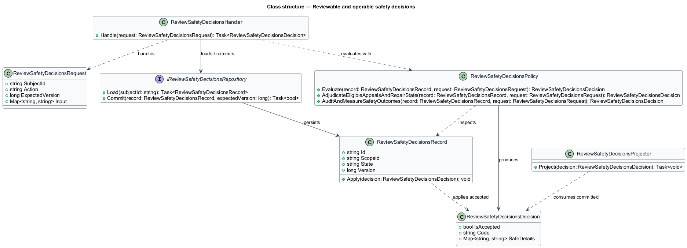
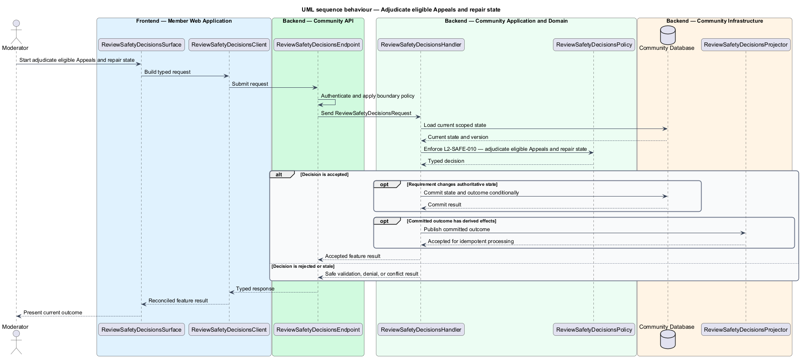
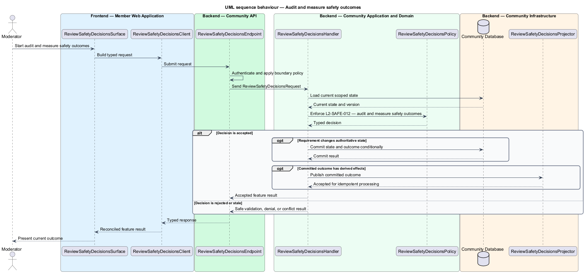

# Reviewable and operable safety decisions

## Overview

Community Starter is a community platform divided into product and platform subsystems. The
Moderation, trust, and safety subsystem owns this feature.

*reviewable and operable safety decisions* — subsystem capability that covers adjudicate eligible Appeals and repair state and audit and measure safety outcomes

Members need a safe way to report suspected harm, while Moderators need bounded authority, preserved evidence, consistent policy, and accountable decisions. Safety behavior spans content, Profiles, Memberships, Messages, Events, discovery, Delivery, appeals, data retention, and emergency response. The platform shall support eligible Appeals, human accountability for automated assistance, emergency escalation, and privacy-safe transparency and operational evidence.

The feature groups 2 traced behaviors behind one policy and evidence
boundary: `L2-SAFE-010` and `L2-SAFE-012`. Authoritative state commits before projections, delivery, or external work reports
success.

## Description

The repository contains specifications but no application implementation. This greenfield slice
defines the following building blocks across `Member Web Application`, `Community API`, the
application and domain layer, and infrastructure.

- **`ReviewSafetyDecisionsSurface`** — page component in `Member Web Application`. It presents current
  state, submits user intent, and reconciles the typed result.
- **`ReviewSafetyDecisionsClient`** — typed Angular client. It creates `ReviewSafetyDecisionsRequest` values and maps stable
  transport failures into feature results.
- **`ReviewSafetyDecisionsEndpoint`** — HTTP endpoint in `Community API`. It authenticates the
  caller, applies boundary policy, and dispatches the request.
- **`ReviewSafetyDecisionsRequest`** — immutable request carrying `SubjectId`, `Action`, `ExpectedVersion`, and the
  scoped input needed by one traced behavior.
- **`ReviewSafetyDecisionsHandler`** — application service that loads authorized state through
  `IReviewSafetyDecisionsRepository`, invokes `ReviewSafetyDecisionsPolicy`, and commits an accepted transition.
- **`ReviewSafetyDecisionsPolicy`** — domain policy that evaluates current state and returns a typed
  `ReviewSafetyDecisionsDecision` without performing external work.
- **`ReviewSafetyDecisionsRecord`** — authoritative record containing the feature state, scope, and concurrency
  version.
- **`IReviewSafetyDecisionsRepository`** — persistence port that loads scoped state and commits one conditional
  unit of work.
- **`ReviewSafetyDecisionsProjector`** — idempotent post-commit component in `Community Job Worker`. It updates
  eligible projections and invokes configured external providers.

`ReviewSafetyDecisionsPolicy` exposes one named operation for each traced behavior:

- **`ReviewSafetyDecisionsPolicy.AdjudicateEligibleAppealsAndRepairState(record, request)`** — evaluates `L2-SAFE-010` (adjudicate eligible Appeals and repair state) and returns a typed decision before any state change.
- **`ReviewSafetyDecisionsPolicy.AuditAndMeasureSafetyOutcomes(record, request)`** — evaluates `L2-SAFE-012` (audit and measure safety outcomes) and returns a typed decision before any state change.

## Requirements

The feature realizes the following level-2 (L2) requirements. Each row preserves the specification
identifier, its level-1 (L1) parent, and the requirement statement verbatim.

| L2 ID | Refines (L1) | Requirement |
|-------|--------------|-------------|
| `L2-SAFE-010` | `L1-SAFE-004` | An eligible subject can submit one bounded Appeal for each materially distinct Action through a strongly verified ordinary or restricted-remediation Session. The deadline begins only when the notice is durably available through an allowed channel, and an appropriately independent reviewer can uphold, reduce, replace, or overturn the Action with complete history and repair work. |
| `L2-SAFE-012` | `L1-SAFE-004` | Safety decisions and access produce tamper-evident Audit Events, while privacy-safe metrics expose queue health, timeliness, consistency, reversals, and repair without identifying reporters or cases. |

## Diagrams

### System context

The `Moderator` uses `Community Platform` for the feature. The system invokes
`Notification and Evidence Providers` only for configured external work after authoritative decisions.

### Containers

`Member Web Application` collects intent, `Community API` applies the synchronous boundary,
and `Community Database` holds authoritative state. `Community Job Worker` handles eligible
post-commit work against `Notification and Evidence Providers`.

### Components

Inside `Community API`, `ReviewSafetyDecisionsEndpoint` dispatches `ReviewSafetyDecisionsHandler`. The handler evaluates
`ReviewSafetyDecisionsPolicy`, persists through `IReviewSafetyDecisionsRepository`, and hands committed outcomes to
`ReviewSafetyDecisionsProjector`.

### Class structure

`ReviewSafetyDecisionsHandler` depends on the immutable request, domain policy, and repository port.
`ReviewSafetyDecisionsRecord` owns versioned state, while `ReviewSafetyDecisionsProjector` consumes committed results.

### Behaviour — adjudicate eligible Appeals and repair state

The interaction loads current scoped state before `ReviewSafetyDecisionsPolicy` enforces
`L2-SAFE-010`. Rejected decisions return without changing authoritative state; accepted
state changes commit before optional derived work starts.

### Behaviour — audit and measure safety outcomes

The interaction loads current scoped state before `ReviewSafetyDecisionsPolicy` enforces
`L2-SAFE-012`. Rejected decisions return without changing authoritative state; accepted
state changes commit before optional derived work starts.

