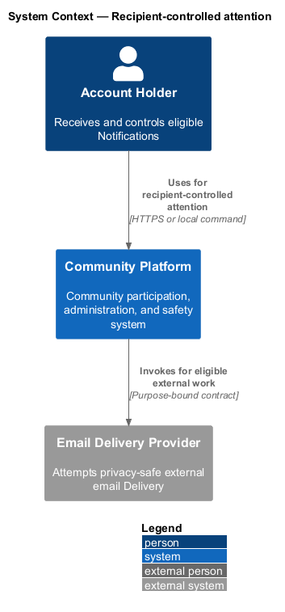
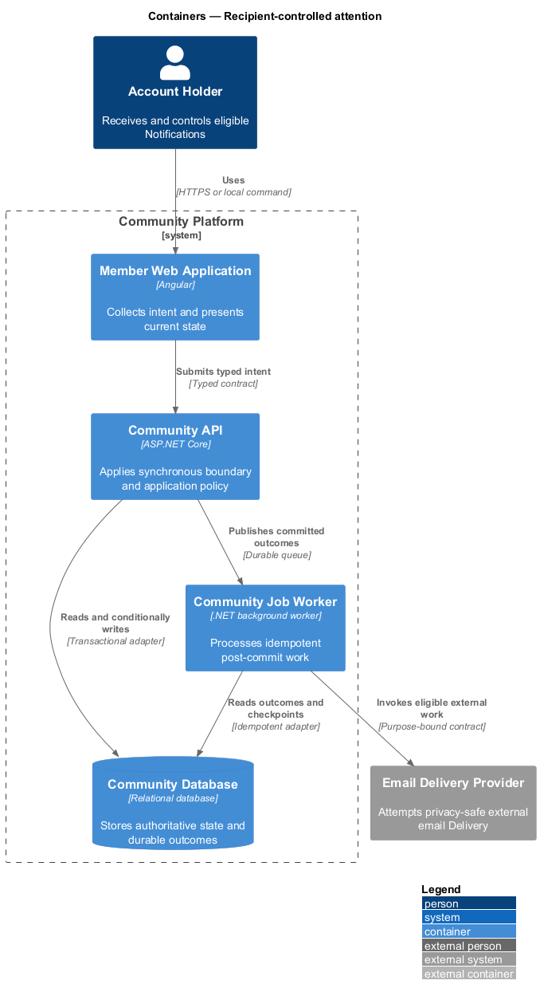
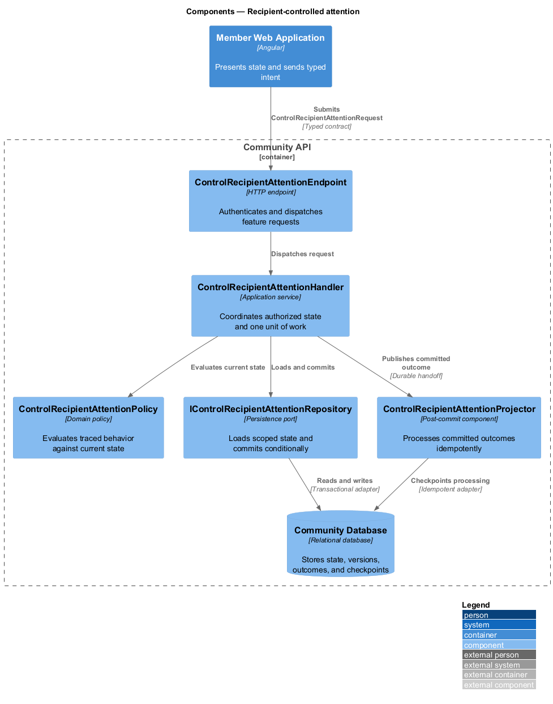
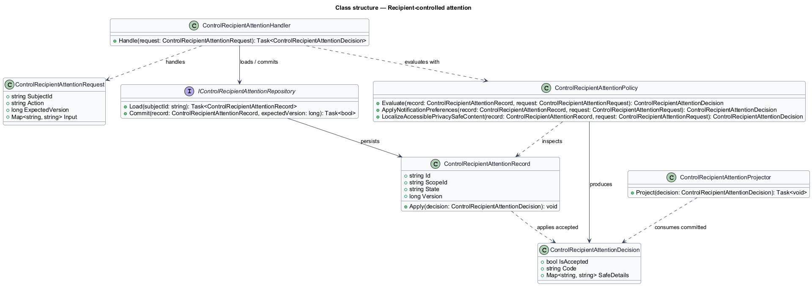
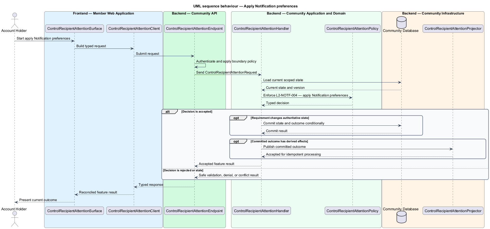
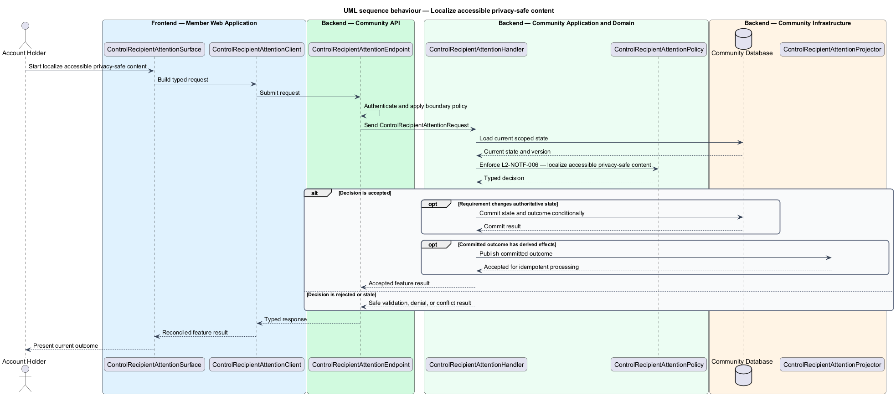

# Recipient-controlled attention

## Overview

Community Starter is a community platform divided into product and platform subsystems. The
Notifications and delivery subsystem owns this feature.

*recipient-controlled attention* — subsystem capability that covers apply Notification preferences and localize accessible privacy-safe content

Accounts need timely, understandable notice of committed activity without receiving content they can no longer access or channels they declined. A Notification is durable Account-facing state; a Notification Delivery is an idempotent attempt through a configured external channel and may fail independently. The platform shall apply explicit email, event, and Community preferences while preserving narrowly defined mandatory transactional and safety notices.

The feature groups 2 traced behaviors behind one policy and evidence
boundary: `L2-NOTF-004` and `L2-NOTF-006`. Authoritative state commits before projections, delivery, or external work reports
success.

## Description

The repository contains specifications but no application implementation. This greenfield slice
defines the following building blocks across `Member Web Application`, `Community API`, the
application and domain layer, and infrastructure.

- **`ControlRecipientAttentionSurface`** — page component in `Member Web Application`. It presents current
  state, submits user intent, and reconciles the typed result.
- **`ControlRecipientAttentionClient`** — typed Angular client. It creates `ControlRecipientAttentionRequest` values and maps stable
  transport failures into feature results.
- **`ControlRecipientAttentionEndpoint`** — HTTP endpoint in `Community API`. It authenticates the
  caller, applies boundary policy, and dispatches the request.
- **`ControlRecipientAttentionRequest`** — immutable request carrying `SubjectId`, `Action`, `ExpectedVersion`, and the
  scoped input needed by one traced behavior.
- **`ControlRecipientAttentionHandler`** — application service that loads authorized state through
  `IControlRecipientAttentionRepository`, invokes `ControlRecipientAttentionPolicy`, and commits an accepted transition.
- **`ControlRecipientAttentionPolicy`** — domain policy that evaluates current state and returns a typed
  `ControlRecipientAttentionDecision` without performing external work.
- **`ControlRecipientAttentionRecord`** — authoritative record containing the feature state, scope, and concurrency
  version.
- **`IControlRecipientAttentionRepository`** — persistence port that loads scoped state and commits one conditional
  unit of work.
- **`ControlRecipientAttentionProjector`** — idempotent post-commit component in `Community Job Worker`. It updates
  eligible projections and invokes configured external providers.

`ControlRecipientAttentionPolicy` exposes one named operation for each traced behavior:

- **`ControlRecipientAttentionPolicy.ApplyNotificationPreferences(record, request)`** — evaluates `L2-NOTF-004` (apply Notification preferences) and returns a typed decision before any state change.
- **`ControlRecipientAttentionPolicy.LocalizeAccessiblePrivacySafeContent(record, request)`** — evaluates `L2-NOTF-006` (localize accessible privacy-safe content) and returns a typed decision before any state change.

## Requirements

The feature realizes the following level-2 (L2) requirements. Each row preserves the specification
identifier, its level-1 (L1) parent, and the requirement statement verbatim.

| L2 ID | Refines (L1) | Requirement |
|-------|--------------|-------------|
| `L2-NOTF-004` | `L1-NOTF-002` | An Account can control optional Notifications by event type, Community, and configured channel, while mandatory security, safety, privacy, or service notices remain narrowly classified. |
| `L2-NOTF-006` | `L1-NOTF-002` | Notification content is rendered for the recipient's current locale, time zone, accessibility, and privacy policy using stable event data rather than unsafe user-authored markup. |

## Diagrams

### System context

The `Account Holder` uses `Community Platform` for the feature. The system invokes
`Email Delivery Provider` only for configured external work after authoritative decisions.

### Containers

`Member Web Application` collects intent, `Community API` applies the synchronous boundary,
and `Community Database` holds authoritative state. `Community Job Worker` handles eligible
post-commit work against `Email Delivery Provider`.

### Components

Inside `Community API`, `ControlRecipientAttentionEndpoint` dispatches `ControlRecipientAttentionHandler`. The handler evaluates
`ControlRecipientAttentionPolicy`, persists through `IControlRecipientAttentionRepository`, and hands committed outcomes to
`ControlRecipientAttentionProjector`.

### Class structure

`ControlRecipientAttentionHandler` depends on the immutable request, domain policy, and repository port.
`ControlRecipientAttentionRecord` owns versioned state, while `ControlRecipientAttentionProjector` consumes committed results.

### Behaviour — apply Notification preferences

The interaction loads current scoped state before `ControlRecipientAttentionPolicy` enforces
`L2-NOTF-004`. Rejected decisions return without changing authoritative state; accepted
state changes commit before optional derived work starts.

### Behaviour — localize accessible privacy-safe content

The interaction loads current scoped state before `ControlRecipientAttentionPolicy` enforces
`L2-NOTF-006`. Rejected decisions return without changing authoritative state; accepted
state changes commit before optional derived work starts.

