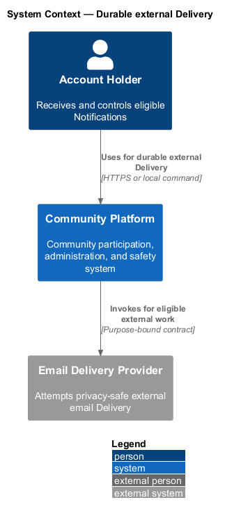
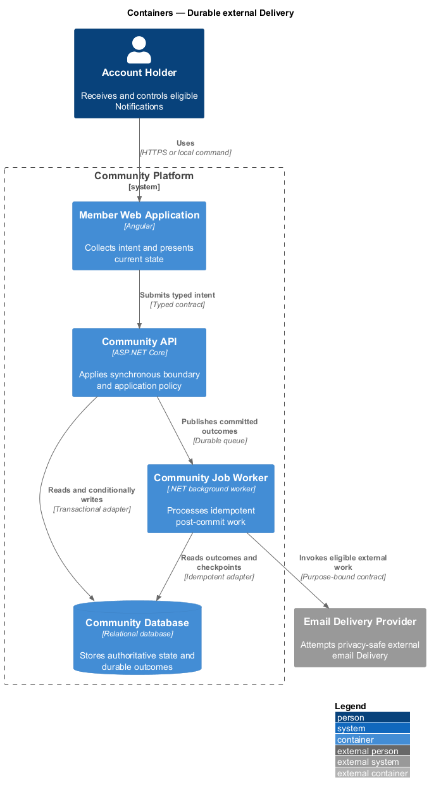
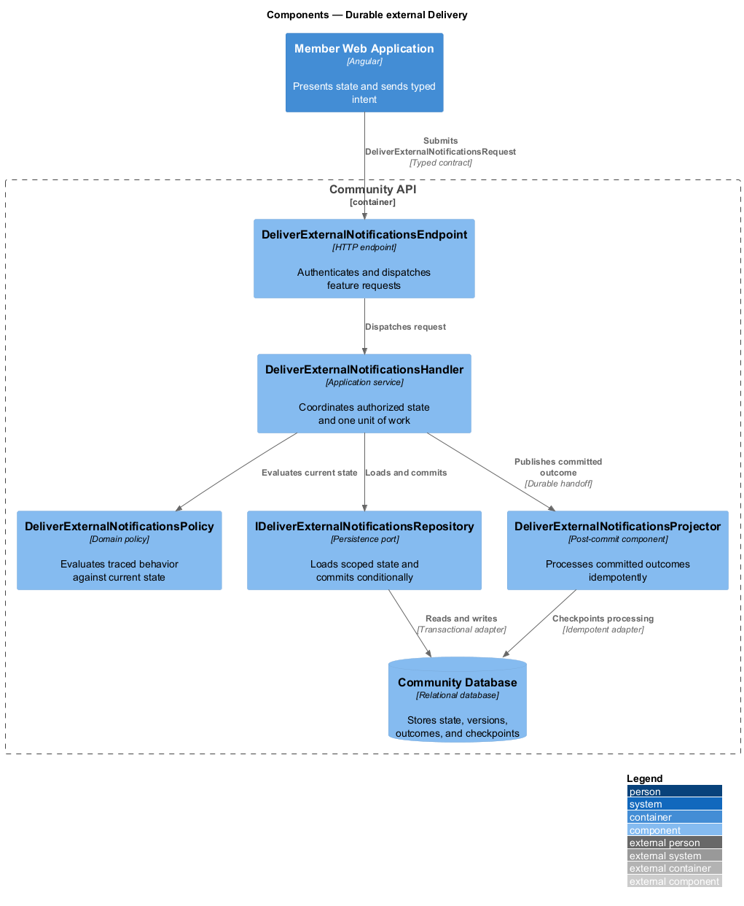
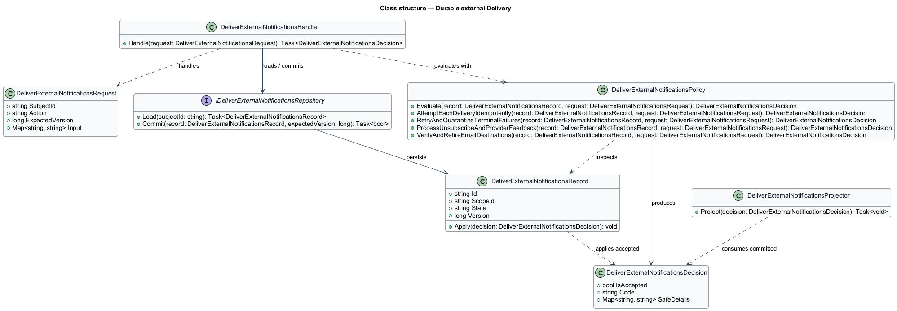
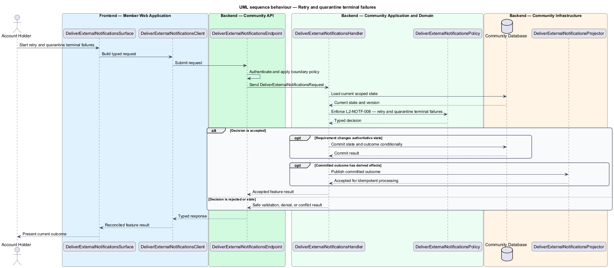
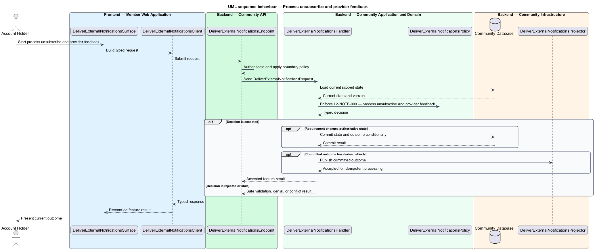

# Durable external Delivery

## Overview

Community Starter is a community platform divided into product and platform subsystems. The
Notifications and delivery subsystem owns this feature.

*durable external Delivery* — subsystem capability that covers attempt each Delivery idempotently, retry and quarantine terminal failures, process unsubscribe and provider feedback, and verify and retire email destinations

Accounts need timely, understandable notice of committed activity without receiving content they can no longer access or channels they declined. A Notification is durable Account-facing state; a Notification Delivery is an idempotent attempt through a configured external channel and may fail independently. The platform shall deliver through configured email with idempotency, bounded retry, verified provider feedback, suppression, and operator-controlled recovery.

The feature groups 4 traced behaviors behind one policy and evidence
boundary: `L2-NOTF-007`, `L2-NOTF-008`, `L2-NOTF-009`, and `L2-NOTF-013`. Authoritative state commits before projections, delivery, or external work reports
success.

## Description

The repository contains specifications but no application implementation. This greenfield slice
defines the following building blocks across `Member Web Application`, `Community API`, the
application and domain layer, and infrastructure.

- **`DeliverExternalNotificationsSurface`** — page component in `Member Web Application`. It presents current
  state, submits user intent, and reconciles the typed result.
- **`DeliverExternalNotificationsClient`** — typed Angular client. It creates `DeliverExternalNotificationsRequest` values and maps stable
  transport failures into feature results.
- **`DeliverExternalNotificationsEndpoint`** — HTTP endpoint in `Community API`. It authenticates the
  caller, applies boundary policy, and dispatches the request.
- **`DeliverExternalNotificationsRequest`** — immutable request carrying `SubjectId`, `Action`, `ExpectedVersion`, and the
  scoped input needed by one traced behavior.
- **`DeliverExternalNotificationsHandler`** — application service that loads authorized state through
  `IDeliverExternalNotificationsRepository`, invokes `DeliverExternalNotificationsPolicy`, and commits an accepted transition.
- **`DeliverExternalNotificationsPolicy`** — domain policy that evaluates current state and returns a typed
  `DeliverExternalNotificationsDecision` without performing external work.
- **`DeliverExternalNotificationsRecord`** — authoritative record containing the feature state, scope, and concurrency
  version.
- **`IDeliverExternalNotificationsRepository`** — persistence port that loads scoped state and commits one conditional
  unit of work.
- **`DeliverExternalNotificationsProjector`** — idempotent post-commit component in `Community Job Worker`. It updates
  eligible projections and invokes configured external providers.

`DeliverExternalNotificationsPolicy` exposes one named operation for each traced behavior:

- **`DeliverExternalNotificationsPolicy.AttemptEachDeliveryIdempotently(record, request)`** — evaluates `L2-NOTF-007` (attempt each Delivery idempotently) and returns a typed decision before any state change.
- **`DeliverExternalNotificationsPolicy.RetryAndQuarantineTerminalFailures(record, request)`** — evaluates `L2-NOTF-008` (retry and quarantine terminal failures) and returns a typed decision before any state change.
- **`DeliverExternalNotificationsPolicy.ProcessUnsubscribeAndProviderFeedback(record, request)`** — evaluates `L2-NOTF-009` (process unsubscribe and provider feedback) and returns a typed decision before any state change.
- **`DeliverExternalNotificationsPolicy.VerifyAndRetireEmailDestinations(record, request)`** — evaluates `L2-NOTF-013` (verify and retire email destinations) and returns a typed decision before any state change.

## Requirements

The feature realizes the following level-2 (L2) requirements. Each row preserves the specification
identifier, its level-1 (L1) parent, and the requirement statement verbatim.

| L2 ID | Refines (L1) | Requirement |
|-------|--------------|-------------|
| `L2-NOTF-007` | `L1-NOTF-003` | Each Notification/channel destination has one durable Delivery lifecycle, a stable attempt identity, and a certified provider duplicate-prevention or reconciliation mechanism, with recipient eligibility checked at the attempt boundary. |
| `L2-NOTF-008` | `L1-NOTF-003` | Transient Delivery failures use bounded backoff and terminal failures enter a visible dead-letter state with safe operator retry or dismissal controls. |
| `L2-NOTF-009` | `L1-NOTF-003` | Verified unsubscribe actions and provider bounce, complaint, or delivery callbacks update channel eligibility idempotently without allowing forged suppression or Account enumeration. |
| `L2-NOTF-013` | `L1-NOTF-003` | Email addresses become Delivery destinations only through proof of control and retain an explicit replace, revoke, suppress, and expiry lifecycle. |

## Diagrams

### System context

The `Account Holder` uses `Community Platform` for the feature. The system invokes
`Email Delivery Provider` only for configured external work after authoritative decisions.

### Containers

`Member Web Application` collects intent, `Community API` applies the synchronous boundary,
and `Community Database` holds authoritative state. `Community Job Worker` handles eligible
post-commit work against `Email Delivery Provider`.

### Components

Inside `Community API`, `DeliverExternalNotificationsEndpoint` dispatches `DeliverExternalNotificationsHandler`. The handler evaluates
`DeliverExternalNotificationsPolicy`, persists through `IDeliverExternalNotificationsRepository`, and hands committed outcomes to
`DeliverExternalNotificationsProjector`.

### Class structure

`DeliverExternalNotificationsHandler` depends on the immutable request, domain policy, and repository port.
`DeliverExternalNotificationsRecord` owns versioned state, while `DeliverExternalNotificationsProjector` consumes committed results.

### Behaviour — attempt each Delivery idempotently

The interaction loads current scoped state before `DeliverExternalNotificationsPolicy` enforces
`L2-NOTF-007`. Rejected decisions return without changing authoritative state; accepted
state changes commit before optional derived work starts.

### Behaviour — retry and quarantine terminal failures

The interaction loads current scoped state before `DeliverExternalNotificationsPolicy` enforces
`L2-NOTF-008`. Rejected decisions return without changing authoritative state; accepted
state changes commit before optional derived work starts.

### Behaviour — process unsubscribe and provider feedback

The interaction loads current scoped state before `DeliverExternalNotificationsPolicy` enforces
`L2-NOTF-009`. Rejected decisions return without changing authoritative state; accepted
state changes commit before optional derived work starts.

### Behaviour — verify and retire email destinations

The interaction loads current scoped state before `DeliverExternalNotificationsPolicy` enforces
`L2-NOTF-013`. Rejected decisions return without changing authoritative state; accepted
state changes commit before optional derived work starts.

