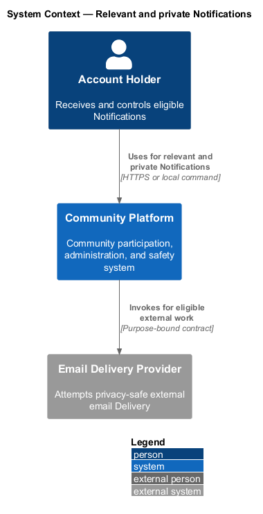
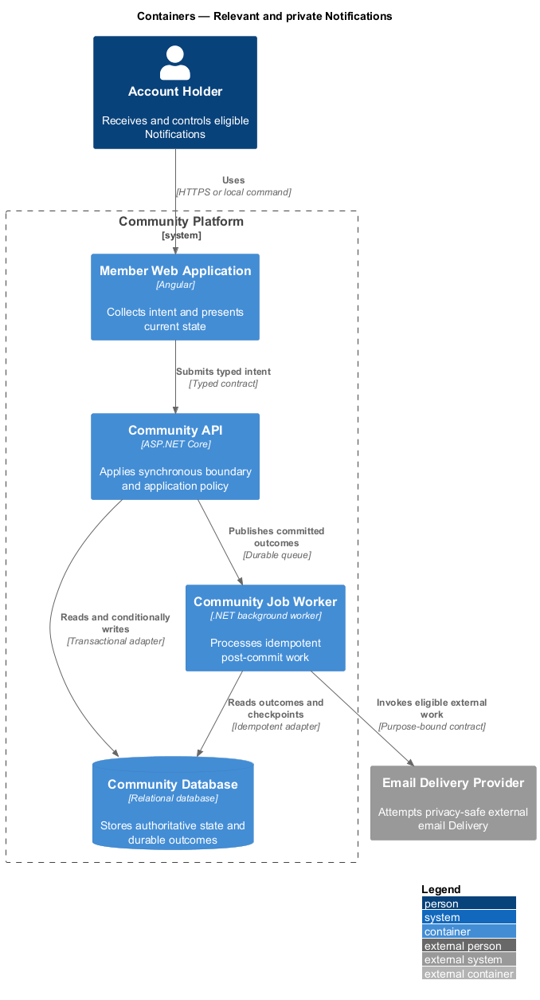
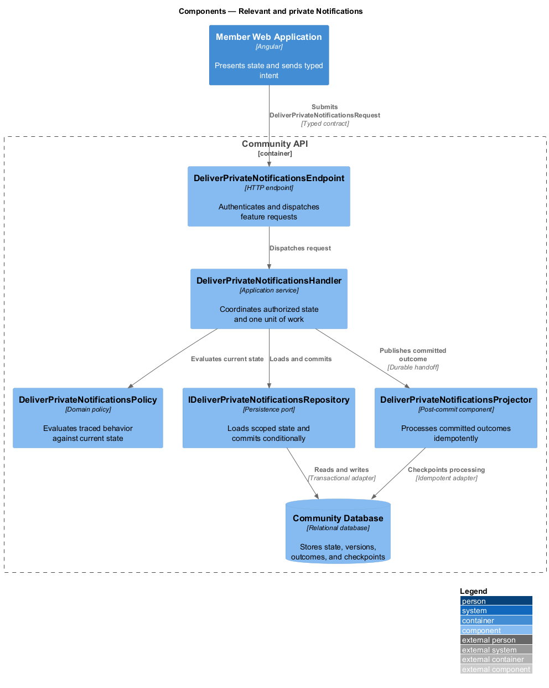
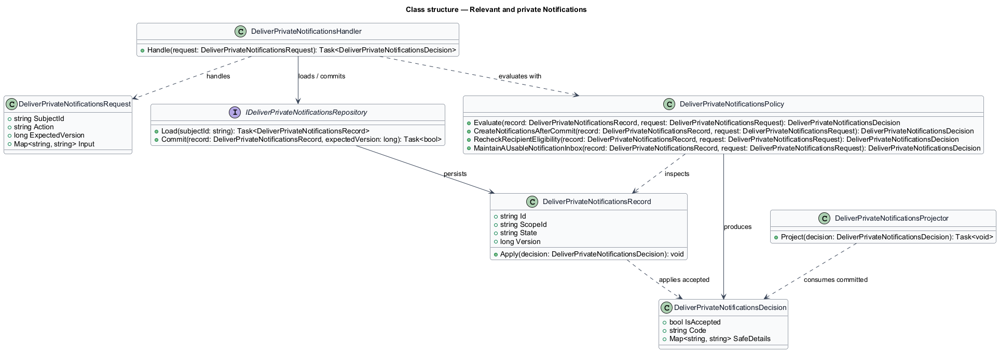
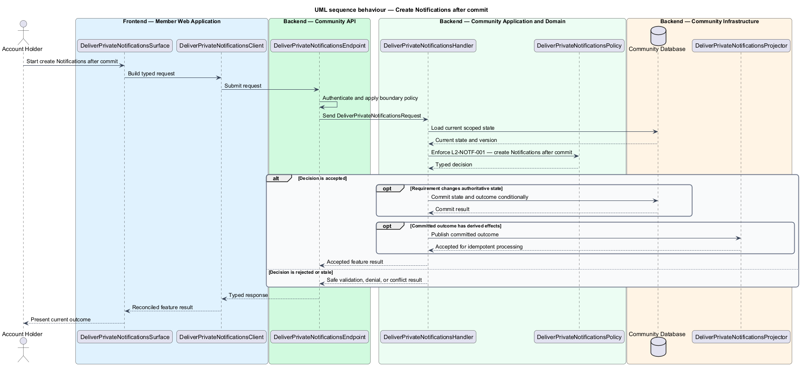
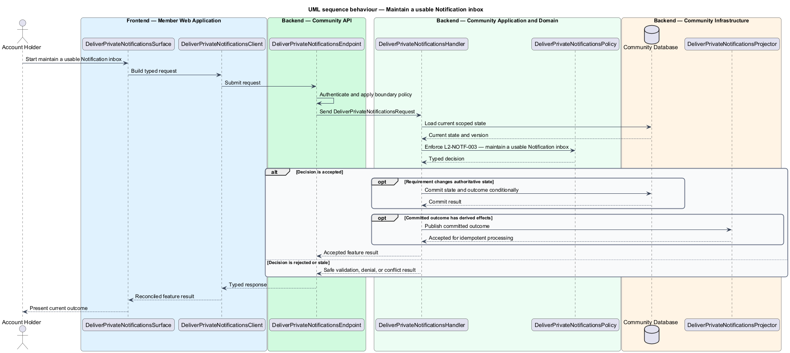

# Relevant and private Notifications

## Overview

Community Starter is a community platform divided into product and platform subsystems. The
Notifications and delivery subsystem owns this feature.

*relevant and private Notifications* — subsystem capability that covers create Notifications after commit, recheck recipient eligibility, and maintain a usable Notification inbox

Accounts need timely, understandable notice of committed activity without receiving content they can no longer access or channels they declined. A Notification is durable Account-facing state; a Notification Delivery is an idempotent attempt through a configured external channel and may fail independently. The platform shall create and present Notifications only from committed events and only to recipients who remain eligible under current access, safety, privacy, and lifecycle state.

The feature groups 3 traced behaviors behind one policy and evidence
boundary: `L2-NOTF-001`, `L2-NOTF-002`, and `L2-NOTF-003`. Authoritative state commits before projections, delivery, or external work reports
success.

## Description

The repository contains specifications but no application implementation. This greenfield slice
defines the following building blocks across `Member Web Application`, `Community API`, the
application and domain layer, and infrastructure.

- **`DeliverPrivateNotificationsSurface`** — page component in `Member Web Application`. It presents current
  state, submits user intent, and reconciles the typed result.
- **`DeliverPrivateNotificationsClient`** — typed Angular client. It creates `DeliverPrivateNotificationsRequest` values and maps stable
  transport failures into feature results.
- **`DeliverPrivateNotificationsEndpoint`** — HTTP endpoint in `Community API`. It authenticates the
  caller, applies boundary policy, and dispatches the request.
- **`DeliverPrivateNotificationsRequest`** — immutable request carrying `SubjectId`, `Action`, `ExpectedVersion`, and the
  scoped input needed by one traced behavior.
- **`DeliverPrivateNotificationsHandler`** — application service that loads authorized state through
  `IDeliverPrivateNotificationsRepository`, invokes `DeliverPrivateNotificationsPolicy`, and commits an accepted transition.
- **`DeliverPrivateNotificationsPolicy`** — domain policy that evaluates current state and returns a typed
  `DeliverPrivateNotificationsDecision` without performing external work.
- **`DeliverPrivateNotificationsRecord`** — authoritative record containing the feature state, scope, and concurrency
  version.
- **`IDeliverPrivateNotificationsRepository`** — persistence port that loads scoped state and commits one conditional
  unit of work.
- **`DeliverPrivateNotificationsProjector`** — idempotent post-commit component in `Community Job Worker`. It updates
  eligible projections and invokes configured external providers.

`DeliverPrivateNotificationsPolicy` exposes one named operation for each traced behavior:

- **`DeliverPrivateNotificationsPolicy.CreateNotificationsAfterCommit(record, request)`** — evaluates `L2-NOTF-001` (create Notifications after commit) and returns a typed decision before any state change.
- **`DeliverPrivateNotificationsPolicy.RecheckRecipientEligibility(record, request)`** — evaluates `L2-NOTF-002` (recheck recipient eligibility) and returns a typed decision before any state change.
- **`DeliverPrivateNotificationsPolicy.MaintainAUsableNotificationInbox(record, request)`** — evaluates `L2-NOTF-003` (maintain a usable Notification inbox) and returns a typed decision before any state change.

## Requirements

The feature realizes the following level-2 (L2) requirements. Each row preserves the specification
identifier, its level-1 (L1) parent, and the requirement statement verbatim.

| L2 ID | Refines (L1) | Requirement |
|-------|--------------|-------------|
| `L2-NOTF-001` | `L1-NOTF-001` | Notification creation consumes stable committed events and records at most one recipient/event/type combination before any external Delivery is attempted. |
| `L2-NOTF-002` | `L1-NOTF-001` | Current Membership, visibility, Block, Moderation Action, Account, and target lifecycle state are evaluated before inbox disclosure, external Delivery, and deep-link resolution. |
| `L2-NOTF-003` | `L1-NOTF-001` | The inbox provides stable cursor pagination, authoritative unread state, bounded aggregation, and safe deep links without using a realtime badge as the source of truth. |

## Diagrams

### System context

The `Account Holder` uses `Community Platform` for the feature. The system invokes
`Email Delivery Provider` only for configured external work after authoritative decisions.

### Containers

`Member Web Application` collects intent, `Community API` applies the synchronous boundary,
and `Community Database` holds authoritative state. `Community Job Worker` handles eligible
post-commit work against `Email Delivery Provider`.

### Components

Inside `Community API`, `DeliverPrivateNotificationsEndpoint` dispatches `DeliverPrivateNotificationsHandler`. The handler evaluates
`DeliverPrivateNotificationsPolicy`, persists through `IDeliverPrivateNotificationsRepository`, and hands committed outcomes to
`DeliverPrivateNotificationsProjector`.

### Class structure

`DeliverPrivateNotificationsHandler` depends on the immutable request, domain policy, and repository port.
`DeliverPrivateNotificationsRecord` owns versioned state, while `DeliverPrivateNotificationsProjector` consumes committed results.

### Behaviour — create Notifications after commit

The interaction loads current scoped state before `DeliverPrivateNotificationsPolicy` enforces
`L2-NOTF-001`. Rejected decisions return without changing authoritative state; accepted
state changes commit before optional derived work starts.

### Behaviour — recheck recipient eligibility

The interaction loads current scoped state before `DeliverPrivateNotificationsPolicy` enforces
`L2-NOTF-002`. Rejected decisions return without changing authoritative state; accepted
state changes commit before optional derived work starts.

### Behaviour — maintain a usable Notification inbox

The interaction loads current scoped state before `DeliverPrivateNotificationsPolicy` enforces
`L2-NOTF-003`. Rejected decisions return without changing authoritative state; accepted
state changes commit before optional derived work starts.

