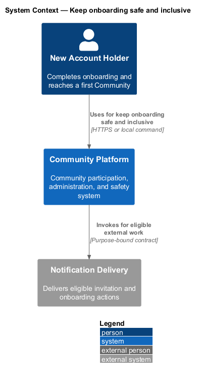
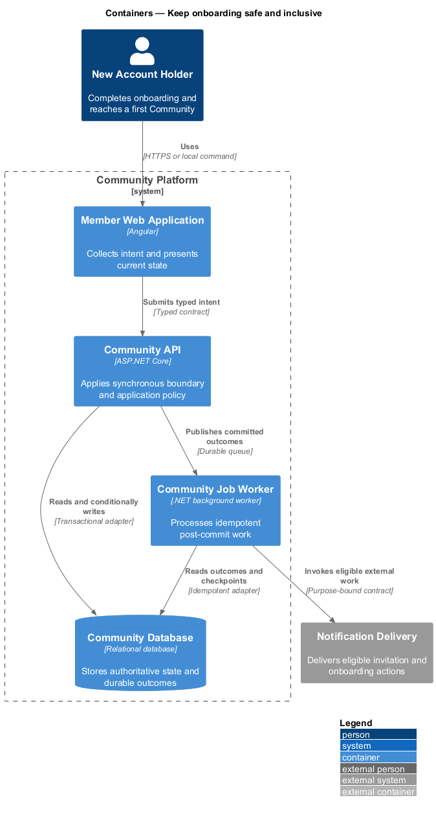
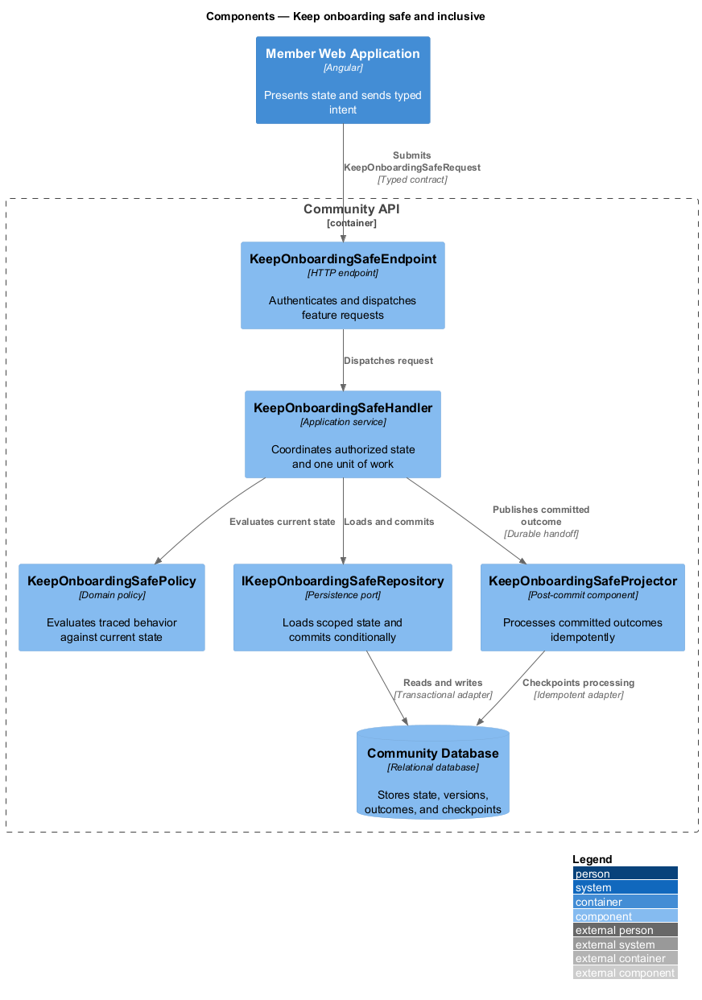
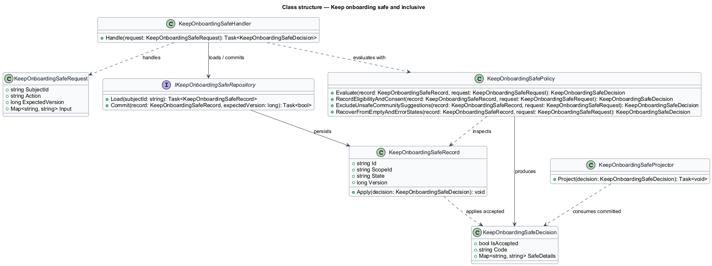
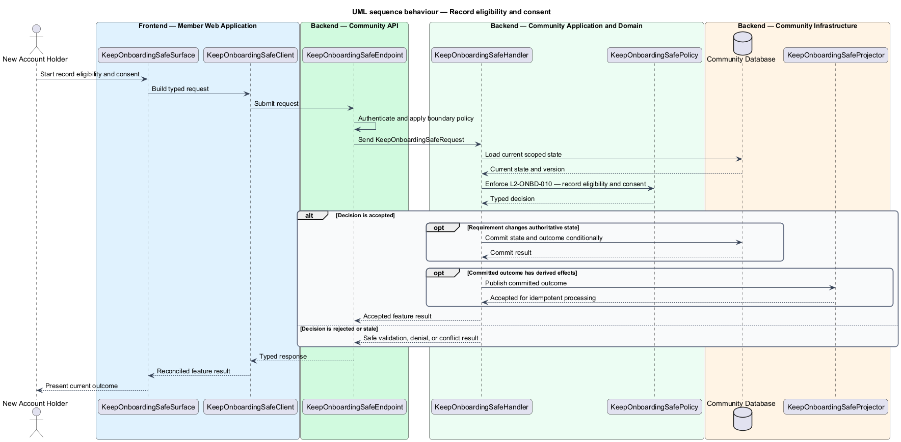
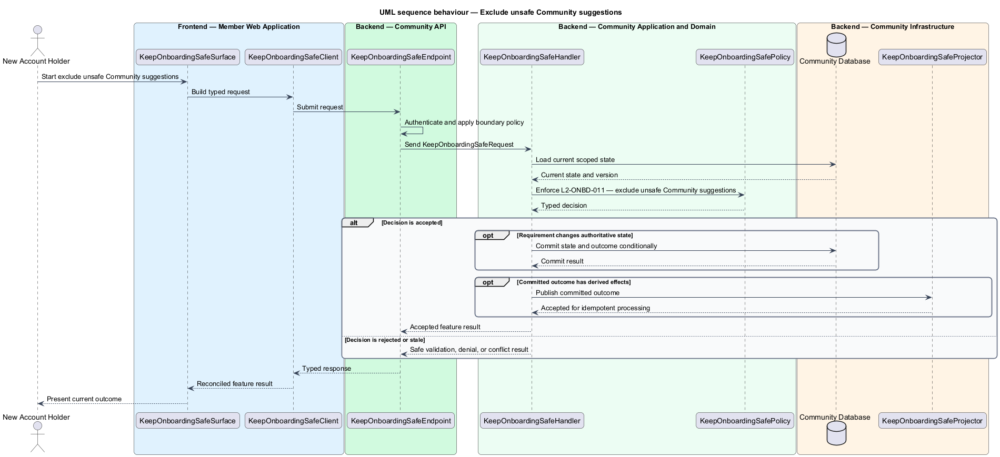
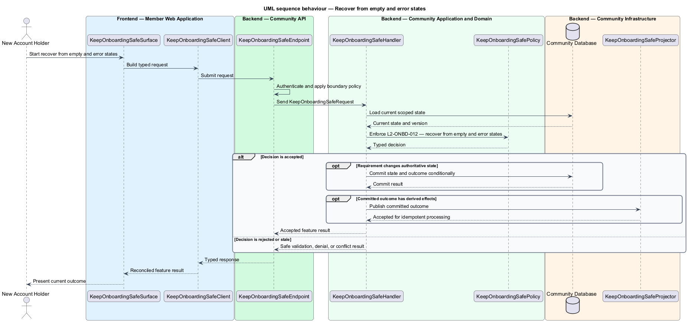

# Keep onboarding safe and inclusive

## Overview

Community Starter is a community platform divided into product and platform subsystems. The
Onboarding and discovery subsystem owns this feature.

*keep onboarding safe and inclusive* — subsystem capability that covers record eligibility and consent, exclude unsafe Community suggestions, and recover from empty and error states

Onboarding moves an eligible Account from first access to a meaningful, understandable Community experience. Discovery helps the Account choose an eligible Community without exposing private Communities, blocked relationships, sensitive inference, or fabricated popularity. The platform shall honor eligibility, consent, privacy, relationship safety, accessibility, and failure recovery throughout onboarding and discovery.

The feature groups 3 traced behaviors behind one policy and evidence
boundary: `L2-ONBD-010`, `L2-ONBD-011`, and `L2-ONBD-012`. Authoritative state commits before projections, delivery, or external work reports
success.

## Description

The repository contains specifications but no application implementation. This greenfield slice
defines the following building blocks across `Member Web Application`, `Community API`, the
application and domain layer, and infrastructure.

- **`KeepOnboardingSafeSurface`** — page component in `Member Web Application`. It presents current
  state, submits user intent, and reconciles the typed result.
- **`KeepOnboardingSafeClient`** — typed Angular client. It creates `KeepOnboardingSafeRequest` values and maps stable
  transport failures into feature results.
- **`KeepOnboardingSafeEndpoint`** — HTTP endpoint in `Community API`. It authenticates the
  caller, applies boundary policy, and dispatches the request.
- **`KeepOnboardingSafeRequest`** — immutable request carrying `SubjectId`, `Action`, `ExpectedVersion`, and the
  scoped input needed by one traced behavior.
- **`KeepOnboardingSafeHandler`** — application service that loads authorized state through
  `IKeepOnboardingSafeRepository`, invokes `KeepOnboardingSafePolicy`, and commits an accepted transition.
- **`KeepOnboardingSafePolicy`** — domain policy that evaluates current state and returns a typed
  `KeepOnboardingSafeDecision` without performing external work.
- **`KeepOnboardingSafeRecord`** — authoritative record containing the feature state, scope, and concurrency
  version.
- **`IKeepOnboardingSafeRepository`** — persistence port that loads scoped state and commits one conditional
  unit of work.
- **`KeepOnboardingSafeProjector`** — idempotent post-commit component in `Community Job Worker`. It updates
  eligible projections and invokes configured external providers.

`KeepOnboardingSafePolicy` exposes one named operation for each traced behavior:

- **`KeepOnboardingSafePolicy.RecordEligibilityAndConsent(record, request)`** — evaluates `L2-ONBD-010` (record eligibility and consent) and returns a typed decision before any state change.
- **`KeepOnboardingSafePolicy.ExcludeUnsafeCommunitySuggestions(record, request)`** — evaluates `L2-ONBD-011` (exclude unsafe Community suggestions) and returns a typed decision before any state change.
- **`KeepOnboardingSafePolicy.RecoverFromEmptyAndErrorStates(record, request)`** — evaluates `L2-ONBD-012` (recover from empty and error states) and returns a typed decision before any state change.

## Requirements

The feature realizes the following level-2 (L2) requirements. Each row preserves the specification
identifier, its level-1 (L1) parent, and the requirement statement verbatim.

| L2 ID | Refines (L1) | Requirement |
|-------|--------------|-------------|
| `L2-ONBD-010` | `L1-ONBD-004` | Required eligibility, terms, privacy, and optional marketing or analytics consent acknowledgements are versioned, server-validated, separable, and revisitable without coercion. |
| `L2-ONBD-011` | `L1-ONBD-004` | Every Community suggestion and preview is filtered at response time by Account eligibility, Community visibility, Membership state, Block and Moderation policy, and privacy rules. |
| `L2-ONBD-012` | `L1-ONBD-004` | Onboarding and discovery distinguish honest emptiness, restricted availability, transient failure, and offline state, preserving committed progress and providing a safe next action. |

## Diagrams

### System context

The `New Account Holder` uses `Community Platform` for the feature. The system invokes
`Notification Delivery` only for configured external work after authoritative decisions.

### Containers

`Member Web Application` collects intent, `Community API` applies the synchronous boundary,
and `Community Database` holds authoritative state. `Community Job Worker` handles eligible
post-commit work against `Notification Delivery`.

### Components

Inside `Community API`, `KeepOnboardingSafeEndpoint` dispatches `KeepOnboardingSafeHandler`. The handler evaluates
`KeepOnboardingSafePolicy`, persists through `IKeepOnboardingSafeRepository`, and hands committed outcomes to
`KeepOnboardingSafeProjector`.

### Class structure

`KeepOnboardingSafeHandler` depends on the immutable request, domain policy, and repository port.
`KeepOnboardingSafeRecord` owns versioned state, while `KeepOnboardingSafeProjector` consumes committed results.

### Behaviour — record eligibility and consent

The interaction loads current scoped state before `KeepOnboardingSafePolicy` enforces
`L2-ONBD-010`. Rejected decisions return without changing authoritative state; accepted
state changes commit before optional derived work starts.

### Behaviour — exclude unsafe Community suggestions

The interaction loads current scoped state before `KeepOnboardingSafePolicy` enforces
`L2-ONBD-011`. Rejected decisions return without changing authoritative state; accepted
state changes commit before optional derived work starts.

### Behaviour — recover from empty and error states

The interaction loads current scoped state before `KeepOnboardingSafePolicy` enforces
`L2-ONBD-012`. Rejected decisions return without changing authoritative state; accepted
state changes commit before optional derived work starts.

