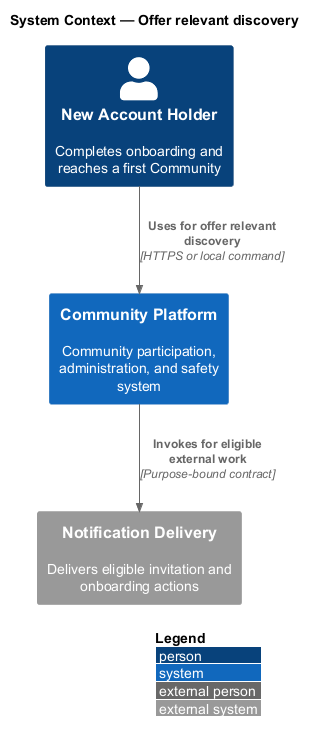
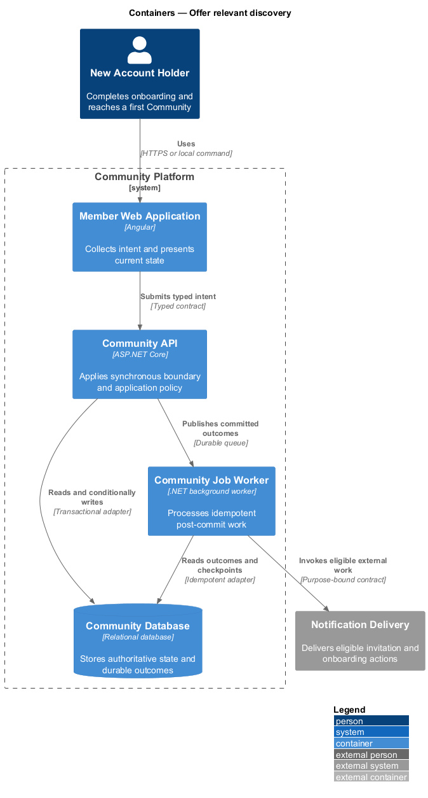
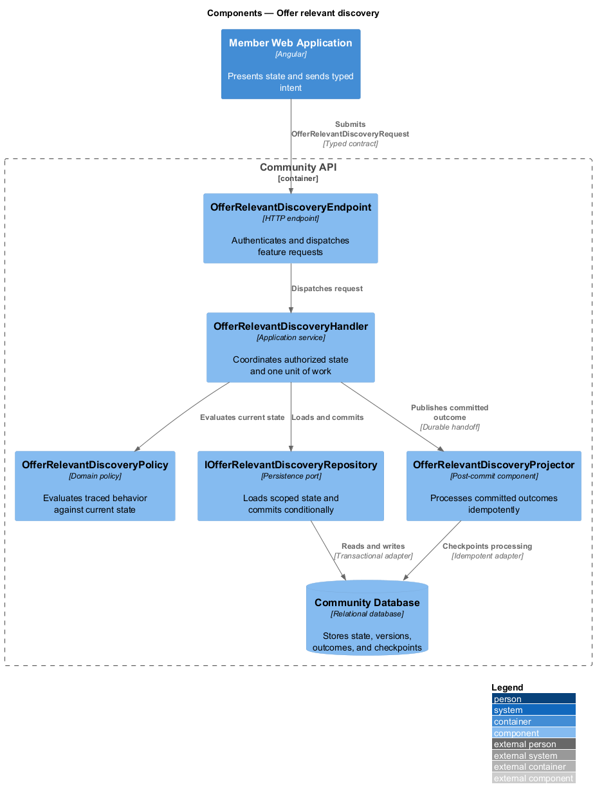
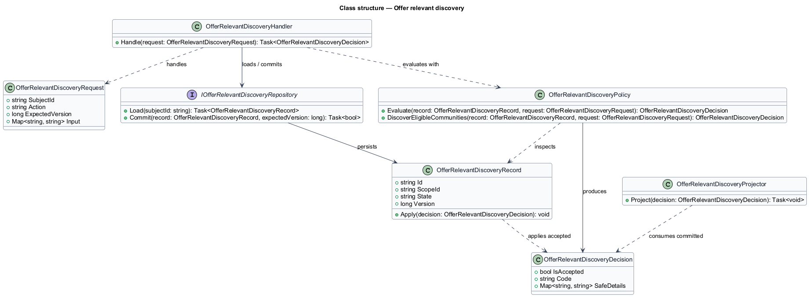
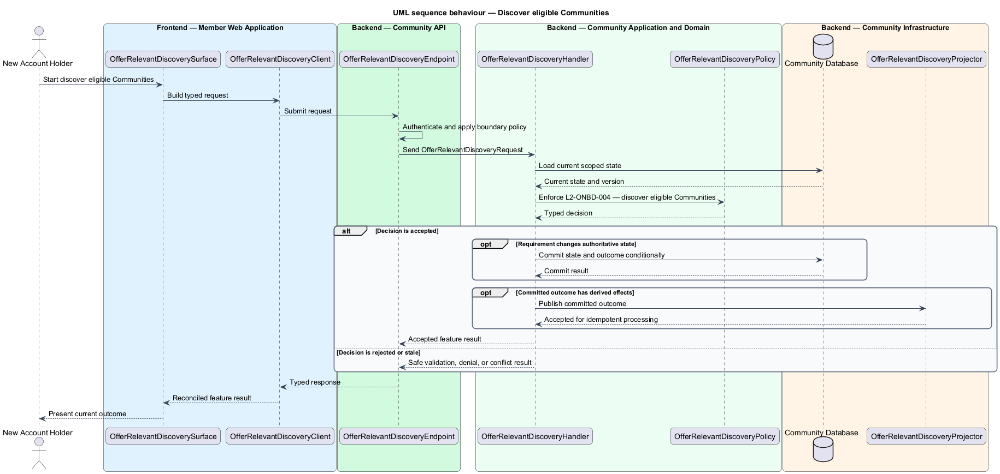

# Offer relevant discovery

## Overview

Community Starter is a community platform divided into product and platform subsystems. The
Onboarding and discovery subsystem owns this feature.

*offer relevant discovery* — subsystem capability that covers discover eligible Communities

Onboarding moves an eligible Account from first access to a meaningful, understandable Community experience. Discovery helps the Account choose an eligible Community without exposing private Communities, blocked relationships, sensitive inference, or fabricated popularity. The platform shall help an Account discover eligible Communities using privacy-safe eligibility, clear status, and understandable next actions.

The feature groups 1 traced behaviors behind one policy and evidence
boundary: `L2-ONBD-004`. Authoritative state commits before projections, delivery, or external work reports
success.

## Description

The repository contains specifications but no application implementation. This greenfield slice
defines the following building blocks across `Member Web Application`, `Community API`, the
application and domain layer, and infrastructure.

- **`OfferRelevantDiscoverySurface`** — page component in `Member Web Application`. It presents current
  state, submits user intent, and reconciles the typed result.
- **`OfferRelevantDiscoveryClient`** — typed Angular client. It creates `OfferRelevantDiscoveryRequest` values and maps stable
  transport failures into feature results.
- **`OfferRelevantDiscoveryEndpoint`** — HTTP endpoint in `Community API`. It authenticates the
  caller, applies boundary policy, and dispatches the request.
- **`OfferRelevantDiscoveryRequest`** — immutable request carrying `SubjectId`, `Action`, `ExpectedVersion`, and the
  scoped input needed by one traced behavior.
- **`OfferRelevantDiscoveryHandler`** — application service that loads authorized state through
  `IOfferRelevantDiscoveryRepository`, invokes `OfferRelevantDiscoveryPolicy`, and commits an accepted transition.
- **`OfferRelevantDiscoveryPolicy`** — domain policy that evaluates current state and returns a typed
  `OfferRelevantDiscoveryDecision` without performing external work.
- **`OfferRelevantDiscoveryRecord`** — authoritative record containing the feature state, scope, and concurrency
  version.
- **`IOfferRelevantDiscoveryRepository`** — persistence port that loads scoped state and commits one conditional
  unit of work.
- **`OfferRelevantDiscoveryProjector`** — idempotent post-commit component in `Community Job Worker`. It updates
  eligible projections and invokes configured external providers.

`OfferRelevantDiscoveryPolicy` exposes one named operation for each traced behavior:

- **`OfferRelevantDiscoveryPolicy.DiscoverEligibleCommunities(record, request)`** — evaluates `L2-ONBD-004` (discover eligible Communities) and returns a typed decision before any state change.

## Requirements

The feature realizes the following level-2 (L2) requirements. Each row preserves the specification
identifier, its level-1 (L1) parent, and the requirement statement verbatim.

| L2 ID | Refines (L1) | Requirement |
|-------|--------------|-------------|
| `L2-ONBD-004` | `L1-ONBD-002` | Community discovery returns a bounded, paged set of active, discoverable Communities the current Account may know about, with honest context for each suggestion. |

## Diagrams

### System context

The `New Account Holder` uses `Community Platform` for the feature. The system invokes
`Notification Delivery` only for configured external work after authoritative decisions.

### Containers

`Member Web Application` collects intent, `Community API` applies the synchronous boundary,
and `Community Database` holds authoritative state. `Community Job Worker` handles eligible
post-commit work against `Notification Delivery`.

### Components

Inside `Community API`, `OfferRelevantDiscoveryEndpoint` dispatches `OfferRelevantDiscoveryHandler`. The handler evaluates
`OfferRelevantDiscoveryPolicy`, persists through `IOfferRelevantDiscoveryRepository`, and hands committed outcomes to
`OfferRelevantDiscoveryProjector`.

### Class structure

`OfferRelevantDiscoveryHandler` depends on the immutable request, domain policy, and repository port.
`OfferRelevantDiscoveryRecord` owns versioned state, while `OfferRelevantDiscoveryProjector` consumes committed results.

### Behaviour — discover eligible Communities

The interaction loads current scoped state before `OfferRelevantDiscoveryPolicy` enforces
`L2-ONBD-004`. Rejected decisions return without changing authoritative state; accepted
state changes commit before optional derived work starts.

