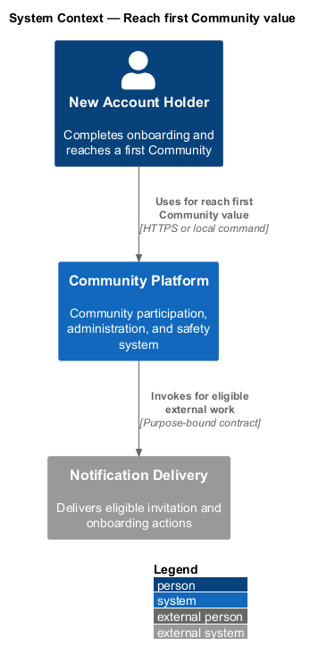
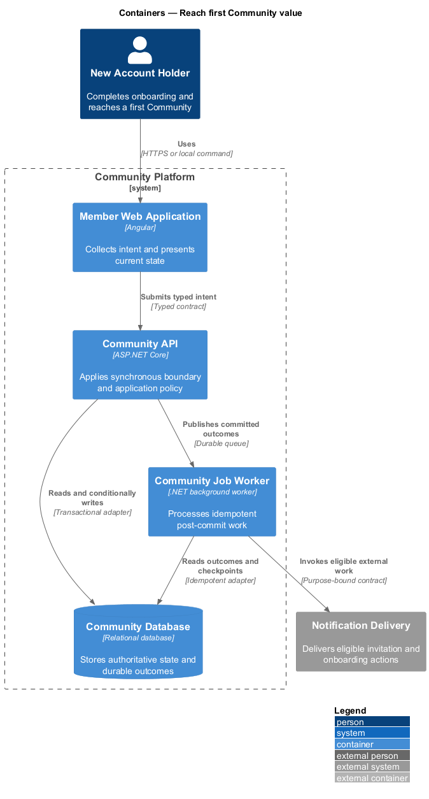
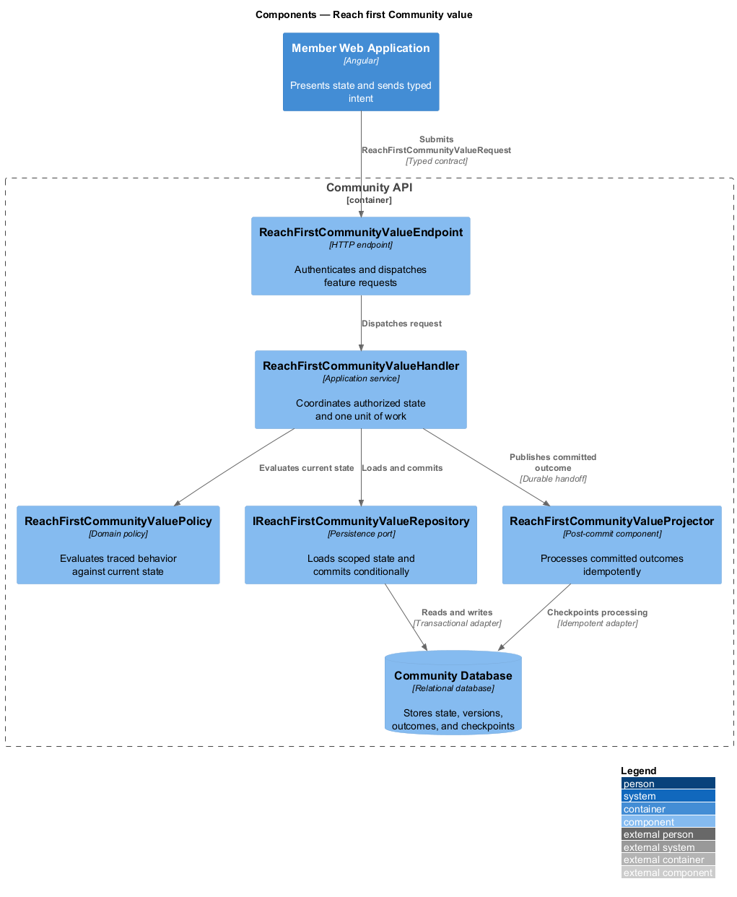
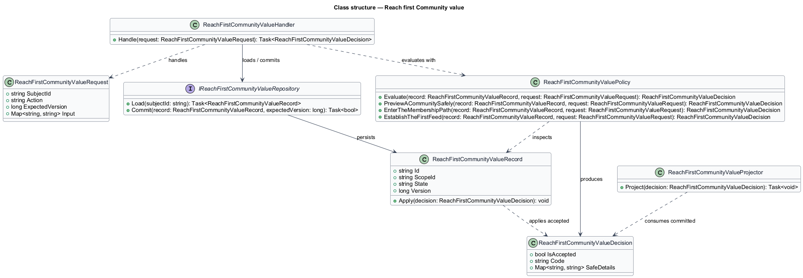
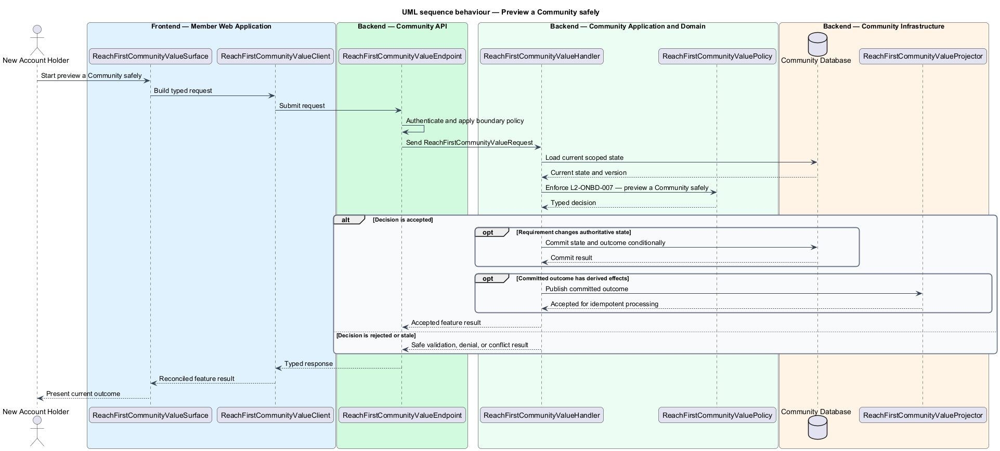

# Reach first Community value

## Overview

Community Starter is a community platform divided into product and platform subsystems. The
Onboarding and discovery subsystem owns this feature.

*reach first Community value* — subsystem capability that covers preview a Community safely, enter the Membership path, and establish the first Feed

Onboarding moves an eligible Account from first access to a meaningful, understandable Community experience. Discovery helps the Account choose an eligible Community without exposing private Communities, blocked relationships, sensitive inference, or fabricated popularity. The platform shall let an Account understand a Community, enter the correct Membership path, and arrive at a useful Feed or next action without bypassing access policy.

The feature groups 3 traced behaviors behind one policy and evidence
boundary: `L2-ONBD-007`, `L2-ONBD-008`, and `L2-ONBD-009`. Authoritative state commits before projections, delivery, or external work reports
success.

## Description

The repository contains specifications but no application implementation. This greenfield slice
defines the following building blocks across `Member Web Application`, `Community API`, the
application and domain layer, and infrastructure.

- **`ReachFirstCommunityValueSurface`** — page component in `Member Web Application`. It presents current
  state, submits user intent, and reconciles the typed result.
- **`ReachFirstCommunityValueClient`** — typed Angular client. It creates `ReachFirstCommunityValueRequest` values and maps stable
  transport failures into feature results.
- **`ReachFirstCommunityValueEndpoint`** — HTTP endpoint in `Community API`. It authenticates the
  caller, applies boundary policy, and dispatches the request.
- **`ReachFirstCommunityValueRequest`** — immutable request carrying `SubjectId`, `Action`, `ExpectedVersion`, and the
  scoped input needed by one traced behavior.
- **`ReachFirstCommunityValueHandler`** — application service that loads authorized state through
  `IReachFirstCommunityValueRepository`, invokes `ReachFirstCommunityValuePolicy`, and commits an accepted transition.
- **`ReachFirstCommunityValuePolicy`** — domain policy that evaluates current state and returns a typed
  `ReachFirstCommunityValueDecision` without performing external work.
- **`ReachFirstCommunityValueRecord`** — authoritative record containing the feature state, scope, and concurrency
  version.
- **`IReachFirstCommunityValueRepository`** — persistence port that loads scoped state and commits one conditional
  unit of work.
- **`ReachFirstCommunityValueProjector`** — idempotent post-commit component in `Community Job Worker`. It updates
  eligible projections and invokes configured external providers.

`ReachFirstCommunityValuePolicy` exposes one named operation for each traced behavior:

- **`ReachFirstCommunityValuePolicy.PreviewACommunitySafely(record, request)`** — evaluates `L2-ONBD-007` (preview a Community safely) and returns a typed decision before any state change.
- **`ReachFirstCommunityValuePolicy.EnterTheMembershipPath(record, request)`** — evaluates `L2-ONBD-008` (enter the Membership path) and returns a typed decision before any state change.
- **`ReachFirstCommunityValuePolicy.EstablishTheFirstFeed(record, request)`** — evaluates `L2-ONBD-009` (establish the first Feed) and returns a typed decision before any state change.

## Requirements

The feature realizes the following level-2 (L2) requirements. Each row preserves the specification
identifier, its level-1 (L1) parent, and the requirement statement verbatim.

| L2 ID | Refines (L1) | Requirement |
|-------|--------------|-------------|
| `L2-ONBD-007` | `L1-ONBD-003` | A Community preview shows only the identity, rules, activity summary, and sample content allowed for the current Account before Membership, with no client-only concealment of member data. |
| `L2-ONBD-008` | `L1-ONBD-003` | Onboarding routes an Account to direct join, gated request, invitation acceptance, or safe unavailability from the Community's current server-owned Membership policy. |
| `L2-ONBD-009` | `L1-ONBD-003` | After onboarding, an Account receives an honest first Feed or explicit next-step state composed only from current Membership, Block, Mute, and content-visibility rules. |

## Diagrams

### System context

The `New Account Holder` uses `Community Platform` for the feature. The system invokes
`Notification Delivery` only for configured external work after authoritative decisions.

### Containers

`Member Web Application` collects intent, `Community API` applies the synchronous boundary,
and `Community Database` holds authoritative state. `Community Job Worker` handles eligible
post-commit work against `Notification Delivery`.

### Components

Inside `Community API`, `ReachFirstCommunityValueEndpoint` dispatches `ReachFirstCommunityValueHandler`. The handler evaluates
`ReachFirstCommunityValuePolicy`, persists through `IReachFirstCommunityValueRepository`, and hands committed outcomes to
`ReachFirstCommunityValueProjector`.

### Class structure

`ReachFirstCommunityValueHandler` depends on the immutable request, domain policy, and repository port.
`ReachFirstCommunityValueRecord` owns versioned state, while `ReachFirstCommunityValueProjector` consumes committed results.

### Behaviour — preview a Community safely

The interaction loads current scoped state before `ReachFirstCommunityValuePolicy` enforces
`L2-ONBD-007`. Rejected decisions return without changing authoritative state; accepted
state changes commit before optional derived work starts.

### Behaviour — enter the Membership path

The interaction loads current scoped state before `ReachFirstCommunityValuePolicy` enforces
`L2-ONBD-008`. Rejected decisions return without changing authoritative state; accepted
state changes commit before optional derived work starts.

### Behaviour — establish the first Feed

The interaction loads current scoped state before `ReachFirstCommunityValuePolicy` enforces
`L2-ONBD-009`. Rejected decisions return without changing authoritative state; accepted
state changes commit before optional derived work starts.

