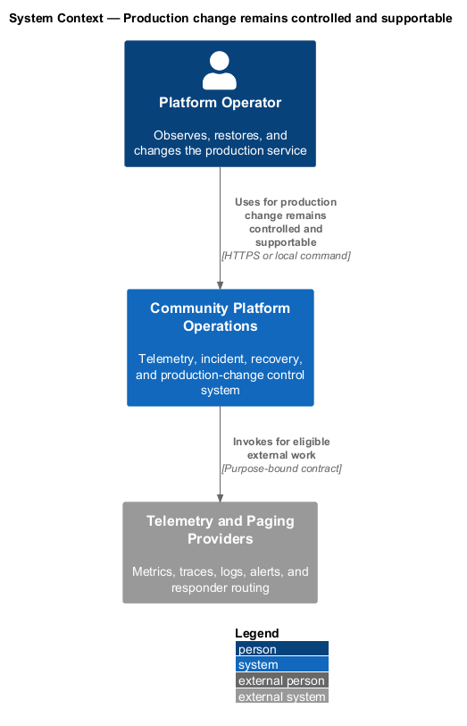
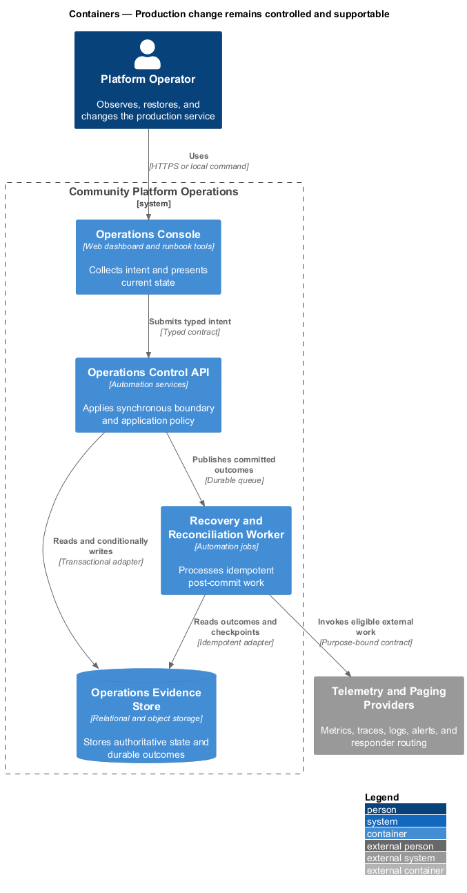
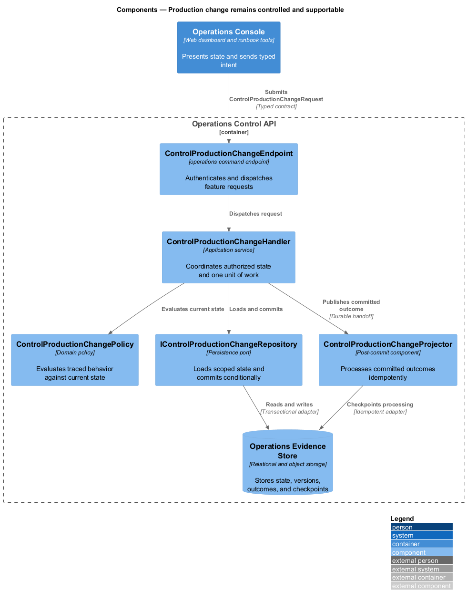
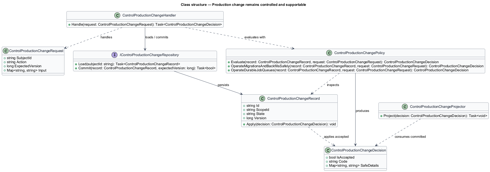
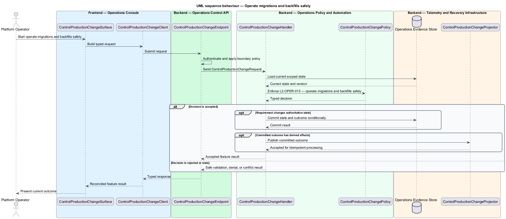
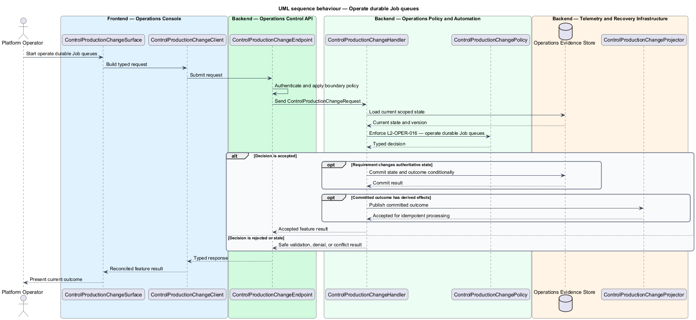

# Production change remains controlled and supportable

## Overview

Community Starter is a community platform divided into product and platform subsystems. The
Operations and reliability subsystem owns this feature.

*production change remains controlled and supportable* — subsystem capability that covers operate migrations and backfills safely and operate durable Job queues

Members and Community teams need predictable service while Platform Operators need privacy-safe evidence, owned alerts, repeatable recovery, and bounded failure modes. Production-scale means the starter defines measurable objectives and proves recovery and capacity; it does not merely contain a health endpoint or pass a build. Database changes, Job backlogs, external-provider outages, and data retention have observable controls and named response paths.

The feature groups 2 traced behaviors behind one policy and evidence
boundary: `L2-OPER-015` and `L2-OPER-016`. Authoritative state commits before projections, delivery, or external work reports
success.

## Description

The repository contains specifications but no application implementation. This greenfield slice
defines the following building blocks across `Operations Console`, `Operations Control API`, the
application and domain layer, and infrastructure.

- **`ControlProductionChangeSurface`** — operations console surface in `Operations Console`. It presents current
  state, submits user intent, and reconciles the typed result.
- **`ControlProductionChangeClient`** — typed operations adapter. It creates `ControlProductionChangeRequest` values and maps stable
  transport failures into feature results.
- **`ControlProductionChangeEndpoint`** — operations command endpoint in `Operations Control API`. It authenticates the
  caller, applies boundary policy, and dispatches the request.
- **`ControlProductionChangeRequest`** — immutable request carrying `SubjectId`, `Action`, `ExpectedVersion`, and the
  scoped input needed by one traced behavior.
- **`ControlProductionChangeHandler`** — application service that loads authorized state through
  `IControlProductionChangeRepository`, invokes `ControlProductionChangePolicy`, and commits an accepted transition.
- **`ControlProductionChangePolicy`** — domain policy that evaluates current state and returns a typed
  `ControlProductionChangeDecision` without performing external work.
- **`ControlProductionChangeRecord`** — authoritative record containing the feature state, scope, and concurrency
  version.
- **`IControlProductionChangeRepository`** — persistence port that loads scoped state and commits one conditional
  unit of work.
- **`ControlProductionChangeProjector`** — idempotent post-commit component in `Recovery and Reconciliation Worker`. It updates
  eligible projections and invokes configured external providers.

`ControlProductionChangePolicy` exposes one named operation for each traced behavior:

- **`ControlProductionChangePolicy.OperateMigrationsAndBackfillsSafely(record, request)`** — evaluates `L2-OPER-015` (operate migrations and backfills safely) and returns a typed decision before any state change.
- **`ControlProductionChangePolicy.OperateDurableJobQueues(record, request)`** — evaluates `L2-OPER-016` (operate durable Job queues) and returns a typed decision before any state change.

## Requirements

The feature realizes the following level-2 (L2) requirements. Each row preserves the specification
identifier, its level-1 (L1) parent, and the requirement statement verbatim.

| L2 ID | Refines (L1) | Requirement |
|-------|--------------|-------------|
| `L2-OPER-015` | `L1-OPER-005` | Database changes use checked-in forward migrations, compatibility-aware expand/backfill/contract steps when needed, reviewed query and lock impact, backup/recovery prerequisites, observable progress, and an explicit rollback or forward-fix path. Applied shared-environment migrations are immutable. |
| `L2-OPER-016` | `L1-OPER-005` | Jobs persist intent and lifecycle, use multi-instance-safe leases, bounded attempts and exponential backoff with jitter, idempotent handlers, cancellation and shutdown, per-kind concurrency, terminal failure storage, operator visibility, and safe replay. Workers reauthorize time-sensitive user effects. |

## Diagrams

### System context

The `Platform Operator` uses `Community Platform Operations` for the feature. The system invokes
`Telemetry and Paging Providers` only for configured external work after authoritative decisions.

### Containers

`Operations Console` collects intent, `Operations Control API` applies the synchronous boundary,
and `Operations Evidence Store` holds authoritative state. `Recovery and Reconciliation Worker` handles eligible
post-commit work against `Telemetry and Paging Providers`.

### Components

Inside `Operations Control API`, `ControlProductionChangeEndpoint` dispatches `ControlProductionChangeHandler`. The handler evaluates
`ControlProductionChangePolicy`, persists through `IControlProductionChangeRepository`, and hands committed outcomes to
`ControlProductionChangeProjector`.

### Class structure

`ControlProductionChangeHandler` depends on the immutable request, domain policy, and repository port.
`ControlProductionChangeRecord` owns versioned state, while `ControlProductionChangeProjector` consumes committed results.

### Behaviour — operate migrations and backfills safely

The interaction loads current scoped state before `ControlProductionChangePolicy` enforces
`L2-OPER-015`. Rejected decisions return without changing authoritative state; accepted
state changes commit before optional derived work starts.

### Behaviour — operate durable Job queues

The interaction loads current scoped state before `ControlProductionChangePolicy` enforces
`L2-OPER-016`. Rejected decisions return without changing authoritative state; accepted
state changes commit before optional derived work starts.

